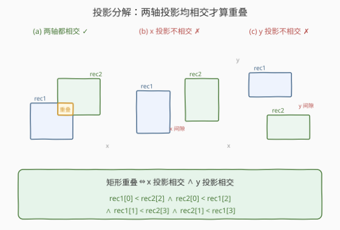
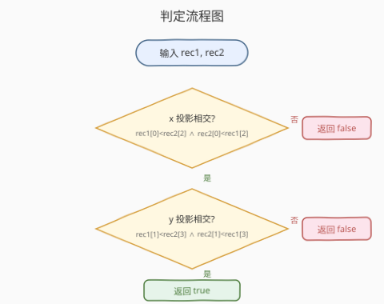
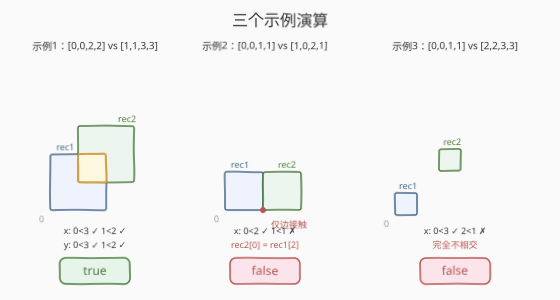

# LeetCode 矩形重叠 题解

## 1. 题目概述

- **标题 / 题号**：矩形重叠（#836，easy）
- **链接**：https://leetcode.cn/problems/rectangle-overlap/
- **难度**：简单
- **标签**：几何、数学

**题意**：矩形以列表 `[x1, y1, x2, y2]` 的形式表示，其中 `(x1, y1)` 为左下角坐标，`(x2, y2)` 为右上角坐标。矩形的上下边平行于 x 轴，左右边平行于 y 轴。

如果两矩形**相交的面积为正**，则称它们重叠。只在角或边接触的两个矩形**不构成**重叠。给定两个轴对齐矩形 `rec1` 和 `rec2`，判断它们是否重叠。

**示例 1**：

```text
输入：rec1 = [0,0,2,2], rec2 = [1,1,3,3]
输出：true
```

**示例 2**：

```text
输入：rec1 = [0,0,1,1], rec2 = [1,0,2,1]
输出：false
解释：两矩形仅在边上接触，不构成重叠。
```

**示例 3**：

```text
输入：rec1 = [0,0,1,1], rec2 = [2,2,3,3]
输出：false
```

**约束**：

- `rec1.length == 4`，`rec2.length == 4`
- $-10^9 \le \text{rec1}[i], \text{rec2}[i] \le 10^9$
- `rec1` 和 `rec2` 均表示面积不为零的有效矩形（即 $x_1 < x_2$ 且 $y_1 < y_2$）

## 2. 解题思路

> ⚠️ 本题核心在于**将二维重叠判定降维成两个一维区间相交判定**。两个轴对齐矩形重叠，当且仅当它们在 x 轴和 y 轴上的投影**都**相交（严格相交，相交长度大于 0）。

### 2.1 暴力思路：枚举不重叠的相对位置

两个矩形**不重叠**时，必满足以下四种相对位置之一：

| 相对位置 | 条件 |
|----------|------|
| rec1 在 rec2 左侧 | `rec1.x2 <= rec2.x1` |
| rec1 在 rec2 右侧 | `rec2.x2 <= rec1.x1` |
| rec1 在 rec2 下方 | `rec1.y2 <= rec2.y1` |
| rec1 在 rec2 上方 | `rec2.y2 <= rec1.y1` |

于是「重叠」=「不满足上述任何一种」，即对四种情况取反再求逻辑与。思路直观，但 4 个条件加上边界 `<=` vs `<` 的选择容易写错，且需要逐一列举，扩展性差。

### 2.2 核心观察：投影分解法



换一个视角：**轴对齐矩形在 x 轴上的投影是一个区间，在 y 轴上的投影也是一个区间**。两个矩形重叠，等价于它们在**两个轴上的投影区间都相交**。

一维区间 $[a_1, a_2]$ 与 $[b_1, b_2]$ 严格相交（交集长度 $>0$）的充要条件为：

$$a_1 < b_2 \quad \wedge \quad b_1 < a_2$$

> 💡 **直觉**：左端点要严格小于对方的右端点，右端点要严格大于对方的左端点。用严格不等号 `<` 而非 `<=`，正是因为「仅端点接触」不算相交——对应到二维就是「仅边/角接触不算重叠」。

把两个维度合起来，矩形重叠的充要条件为：

$$\text{rec1.}x_1 < \text{rec2.}x_2 \;\wedge\; \text{rec2.}x_1 < \text{rec1.}x_2 \;\wedge\; \text{rec1.}y_1 < \text{rec2.}y_2 \;\wedge\; \text{rec2.}y_1 < \text{rec1.}y_2$$

对应到数组下标（`rec = [x1, y1, x2, y2]`）：

```text
rec1[0] < rec2[2]  &&  rec2[0] < rec1[2]  &&  rec1[1] < rec2[3]  &&  rec2[1] < rec1[3]
```

> ⚠️ **与暴力法的等价性**：对 2.1 的四种不重叠情况整体取反（德摩根律），正好得到上式。投影法本质上是对暴力枚举的**代数化简**，但表达更对称、更不易出错，且无需枚举所有方位。

### 2.3 算法流程图



算法只有两步判定，先查 x 投影、再查 y 投影，任一不满足即返回 `false`，都满足才返回 `true`：

1. 检查 x 轴投影是否相交：`rec1[0] < rec2[2]` 且 `rec2[0] < rec1[2]`，否则返回 `false`。
2. 检查 y 轴投影是否相交：`rec1[1] < rec2[3]` 且 `rec2[1] < rec1[3]`，否则返回 `false`。
3. 两轴都相交，返回 `true`。

### 2.4 示例演算



以三个示例逐一验证：

| 示例 | rec1 | rec2 | x 检查 | y 检查 | 结果 |
|------|------|------|--------|--------|------|
| 1 | `[0,0,2,2]` | `[1,1,3,3]` | $0<3$ ✓, $1<2$ ✓ | $0<3$ ✓, $1<2$ ✓ | `true` |
| 2 | `[0,0,1,1]` | `[1,0,2,1]` | $0<2$ ✓, $1<1$ ✗ | — | `false`（仅边接触） |
| 3 | `[0,0,1,1]` | `[2,2,3,3]` | $0<3$ ✓, $2<1$ ✗ | — | `false`（完全分离） |

- **示例 2** 是关键边界：`rec2.x1 = 1` 等于 `rec1.x2 = 1`，条件 `rec2[0] < rec1[2]` 即 $1 < 1$ 为 `false`，x 投影不相交。两矩形共享一条边但无正面积交集，正确返回 `false`。
- **示例 3** 两矩形在 x、y 两轴都完全分离，x 检查即短路返回 `false`。

## 3. 参考代码

### C++

```cpp
class Solution {
  public:
    bool isRectangleOverlap(vector<int>& rec1, vector<int>& rec2) {
        return rec1[0] < rec2[2] && rec2[0] < rec1[2] &&
               rec1[1] < rec2[3] && rec2[1] < rec1[3];
    }
};
```

### Python

```python
class Solution:
    def isRectangleOverlap(self, rec1: List[int], rec2: List[int]) -> bool:
        return (rec1[0] < rec2[2] and rec2[0] < rec1[2] and
                rec1[1] < rec2[3] and rec2[1] < rec1[3])
```

> 💡 整个解法就是一行四个比较的逻辑与。注意全部用严格 `<`，保证「仅边/角接触」返回 `false`。利用 `&&` / `and` 的短路特性，x 投影不相交时直接跳过 y 检查。

## 4. 复杂度分析

| 维度 | 复杂度 | 说明 |
|------|--------|------|
| 时间复杂度 | $O(1)$ | 仅 4 次整数比较 + 逻辑与，常数时间 |
| 空间复杂度 | $O(1)$ | 无额外数据结构 |

## 5. 扩展：求重叠面积与交集矩形

本题只问「是否」重叠，但面试中常被追问「重叠面积是多少」。投影法自然延伸为**求交集矩形**：

- 交集的左边界取两者左边界的较大值：$ix_1 = \max(\text{rec1.}x_1, \text{rec2.}x_1)$
- 交集的右边界取两者右边界的较小值：$ix_2 = \min(\text{rec1.}x_2, \text{rec2.}x_2)$
- 同理 $iy_1 = \max(\text{rec1.}y_1, \text{rec2.}y_1)$，$iy_2 = \min(\text{rec1.}y_2, \text{rec2.}y_2)$

若 $ix_1 < ix_2$ 且 $iy_1 < iy_2$，重叠面积为 $(ix_2 - ix_1) \times (iy_2 - iy_1)$；否则面积为 0。

```cpp
int overlapArea(vector<int>& rec1, vector<int>& rec2) {
    int ix1 = max(rec1[0], rec2[0]);
    int iy1 = max(rec1[1], rec2[1]);
    int ix2 = min(rec1[2], rec2[2]);
    int iy2 = min(rec1[3], rec2[3]);
    if (ix1 < ix2 && iy1 < iy2)
        return (ix2 - ix1) * (iy2 - iy1);
    return 0;
}
```

> 💡 注意 `max(左) < min(右)` 与投影法的 `rec1.x1 < rec2.x2 && rec2.x1 < rec1.x2` **完全等价**：前者先合并再比较，后者分别比较——两者都是判定两个区间是否严格相交。这就是 [223. 矩形面积](https://leetcode.cn/problems/rectangle-area/) 的核心子问题。

## 6. 面试要点

1. **为什么用严格小于 `<` 而不是 `<=`？**
   - 题目要求「相交面积为正」才算重叠。若两矩形仅在边上接触（如 `rec1.x2 == rec2.x1`），交集在 x 方向长度为 0，面积为 0。用 `<` 恰好把这种边界情况排除，`<=` 则会误判为重叠。

2. **投影法的本质是什么？**
   - 轴对齐矩形的二维重叠可分解为两个一维区间相交的合取（AND）。这是因为轴对齐矩形的 x、y 维度相互独立：一个点同时在两矩形的 x 范围内**且**在 y 范围内，才落在交集里。投影法把 2D 问题降成两个 1D 问题。

3. **投影法和暴力枚举四种方位是什么关系？**
   - 完全等价。暴力法列出 4 种「不重叠」方位（左/右/上/下），取反得重叠条件；投影法的 4 个比较正是德摩根律化简后的结果。投影法表达更对称，不易漏写方位或写错边界符号。

4. **如何延伸到求重叠面积？**
   - 交集矩形 = $[\max(x_1, x_1'), \min(x_2, x_2')] \times [\max(y_1, y_1'), \min(y_2, y_2')]$。当 $\max(x_1, x_1') < \min(x_2, x_2')$ 且 $\max(y_1, y_1') < \min(y_2, y_2')$ 时，面积 $= \Delta x \times \Delta y$，否则为 0。这是 223 题矩形面积的关键子步骤。

5. **如果矩形可以旋转（非轴对齐）怎么办？**
   - 投影法失效（旋转矩形的 x、y 投影不再独立）。需用**分离轴定理（SAT）**：对每条边的法线方向做投影，若存在某个轴上两矩形投影不相交，则不重叠。轴对齐矩形是 SAT 的特例——只需检查 x、y 两个轴。

## 同类练习题

| # | 题目 | 与本题的关联 |
|---|------|-------------|
| 223 | [矩形面积](https://leetcode.cn/problems/rectangle-area/)（[题解](../0201-0300/223_矩形面积.md)） | 求两矩形覆盖总面积，需用交集矩形公式算重叠面积——第 5 节扩展的直接应用 |
| 1401 | [圆和矩形是否有重叠](https://leetcode.cn/problems/circle-and-rectangle-overlapping/) | 圆与轴对齐矩形重叠判定，投影思想升级版（圆心到矩形最近点距离与半径比较） |
| 835 | [图像重叠](https://leetcode.cn/problems/image-overlap/) | 两个方阵平移使重叠 1 最大化，重叠定义的计数变体 |
| 939 | [最小面积矩形](https://leetcode.cn/problems/minimum-area-rectangle/) | 给定点集找能构成最小面积轴对齐矩形的四点，用对角点 + 哈希判定矩形存在性 |
