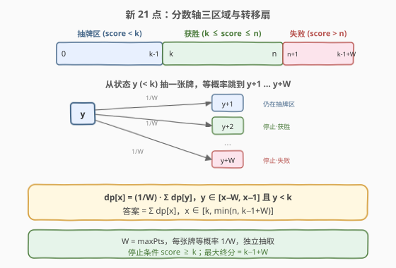
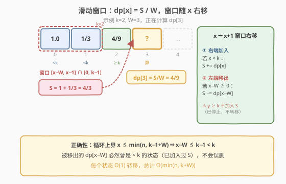
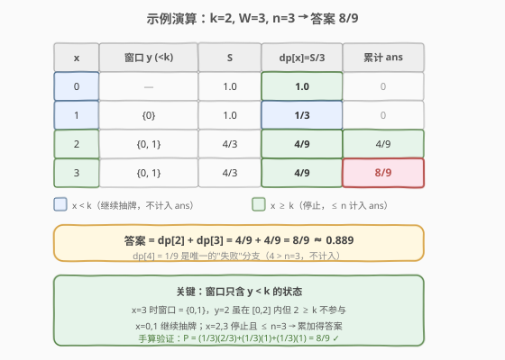

# LeetCode 新 21 点 题解

## 1. 题目概述

- **标题 / 题号**：新 21 点（#837，medium）
- **链接**：https://leetcode.cn/problems/new-21-game/
- **难度**：中等
- **标签**：动态规划、概率 DP、滑动窗口

**题意**：爱丽丝以 `0` 分开始。当她的得分**少于 `k` 分**时，她从 `[1, maxPts]` 中等概率抽取一个整数累加到得分上（每次抽取独立，每个数概率 `1/maxPts`）。当得分 **`≥ k`** 时停止抽取。求最终得分 **`≤ n`** 的概率。误差不超过 $10^{-5}$ 视为正确。

**示例 1**：

```text
输入：n = 10, k = 1, maxPts = 10
输出：1.00000
解释：k=1，抽一张牌即停。牌面 1..10 均 ≤ 10，概率为 1。
```

**示例 2**：

```text
输入：n = 6, k = 1, maxPts = 10
输出：0.60000
解释：抽一张牌即停，10 种可能中 6 种 ≤ 6，概率 6/10 = 0.6。
```

**示例 3**：

```text
输入：n = 21, k = 17, maxPts = 10
输出：0.73278
```

**约束**：

- `0 <= k <= n <= 10^4`
- `1 <= maxPts <= 10^4`

## 2. 解题思路

### 2.1 暴力思路

枚举所有可能的抽牌序列：每张牌有 `maxPts` 种取值，序列长度最多到 `k`（每次至少 +1）。最坏情况下分支数 $\maxPts^{k}$，`k` 可达 $10^4$，完全不可行。但注意到**到达同一分数 `x` 的概率**可由更小分数汇总而来，存在大量重叠子问题，天然适合 DP。

### 2.2 核心观察：概率 DP + 滑动窗口



定义 `dp[x]` = **到达分数 `x` 的概率**（在某一步恰好处于分数 `x`）。

- **边界**：`dp[0] = 1`（初始确定在 0 分）。
- **转移**：要到达 `x`，必然从某个 `y < x` 且 `y < k` 出发（只有 `y < k` 时才会继续抽牌），抽到 `x − y`。因此：

$$
\text{dp}[x] = \frac{1}{W} \sum_{\substack{y = \max(0,\, x-W)} \\ y \le \min(x-1,\, k-1)}} \text{dp}[y], \quad x \ge 1
$$

  其中 $W = \text{maxPts}$。求和窗口为 $[x-W,\, x-1]$ 中所有 $< k$ 的 $y$。

- **答案**：停止时的分数落在 $[k,\, k-1+W]$（最后一次抽牌从 $< k$ 跨过 $k$）。所求即：

$$
\text{answer} = \sum_{x=k}^{\min(n,\, k-1+W)} \text{dp}[x]
$$

> 💡 **关键洞察**：只有 `y < k` 的状态会继续抽牌、产生转移；`y ≥ k` 的状态已停止，不会向外转移。因此窗口求和中**必须排除 `y ≥ k` 的项**——这是本题最易错的点。

> ⚠️ **两种边界特判**（可省去无意义计算）：
> - `k == 0`：起点 0 已 `≥ k`，立即停止，$0 \le n$，返回 `1.0`。
> - `k - 1 + W ≤ n`：所有可能的停止分数（最大 `k-1+W`）均 `≤ n`，返回 `1.0`。

### 2.3 算法流程图



朴素求和每个 `dp[x]` 需 $O(W)$，总计 $O(n \cdot W)$ 可达 $10^8$，偏慢。用**滑动窗口**维护窗口和 $S$，每个状态 $O(1)$ 转移：

- 计算 `dp[x] = S / W`。
- **右端加入**：若 `x < k`，则 `S += dp[x]`（`x` 成为未来窗口的一员）。
- **左端移出**：若 `x - W ≥ 0`，则 `S -= dp[x - W]`（滑出窗口）。

> 💡 **正确性**：循环上界 $x \le \min(n,\, k-1+W)$，故 $x - W \le k-1 < k$，被移出的 `dp[x-W]` 必然曾是 $< k$ 的状态（已加入过 $S$），不会误删。

### 2.4 示例演算



以 `k=2, maxPts=3, n=3` 为例（$W=3$，停止分数范围 $[2, 4]$，`limit = min(3, 4) = 3`）：

| x | 窗口 y（< k=2） | S | dp[x] = S/3 | 累计 ans |
|---|----------------|-------|-------------|----------|
| 0 | — | 1.0 | 1.0 | 0 |
| 1 | {0} | 1.0 | 1/3 ≈ 0.333 | 0（1 < k，继续抽） |
| 2 | {0, 1} | 4/3 | 4/9 ≈ 0.444 | 4/9 |
| 3 | {0, 1} | 4/3 | 4/9 ≈ 0.444 | 8/9 |

- `x=2`：窗口 $[\max(0,-1),\, \min(1,1)] = \{0,1\}$，$S = 1 + 1/3 = 4/3$，`dp[2] = 4/9`。$2 \ge k$，计入答案。
- `x=3`：窗口 $[0, 1] = \{0,1\}$（$y=2 \ge k$ 不算），$S$ 仍 $4/3$，`dp[3] = 4/9`。计入答案。
- `x=4`（$> n=3$，不计算）：`dp[4] = 1/9`，是唯一的"失败"分支。

**答案** = $4/9 + 4/9 = 8/9 \approx 0.889$。

**手算验证**：从 0 抽牌，第一张 $w \in \{1,2,3\}$ 各 $1/3$：
- $w=1$ → 分数 1（$< k=2$，再抽），第二张 $w' \in \{1,2,3\}$：$1{+}1{=}2$✓、$1{+}2{=}3$✓、$1{+}3{=}4$✗ → 贡献 $2/3$。
- $w=2$ → 分数 2（停止，$\le 3$ ✓）→ 贡献 $1$。
- $w=3$ → 分数 3（停止，$\le 3$ ✓）→ 贡献 $1$。

$P = \frac{1}{3} \cdot \frac{2}{3} + \frac{1}{3} \cdot 1 + \frac{1}{3} \cdot 1 = \frac{2}{9} + \frac{3}{9} + \frac{3}{9} = \frac{8}{9}$ ✓

## 3. 参考代码

### C++

```cpp
class Solution {
  public:
    double new21Game(int n, int k, int maxPts) {
        if (k == 0) return 1.0;
        if (k - 1 + maxPts <= n) return 1.0;
        int limit = min(n, k - 1 + maxPts);
        vector<double> dp(limit + 1, 0.0);
        dp[0] = 1.0;
        double S = 1.0;
        double ans = 0.0;
        for (int x = 1; x <= limit; x++) {
            dp[x] = S / maxPts;
            if (x < k) S += dp[x];
            else      ans += dp[x];
            if (x - maxPts >= 0) S -= dp[x - maxPts];
        }
        return ans;
    }
};
```

### Python

```python
class Solution:
    def new21Game(self, n: int, k: int, maxPts: int) -> float:
        if k == 0:
            return 1.0
        if k - 1 + maxPts <= n:
            return 1.0
        limit = min(n, k - 1 + maxPts)
        dp = [0.0] * (limit + 1)
        dp[0] = 1.0
        S = 1.0
        ans = 0.0
        for x in range(1, limit + 1):
            dp[x] = S / maxPts
            if x < k:
                S += dp[x]
            else:
                ans += dp[x]
            if x - maxPts >= 0:
                S -= dp[x - maxPts]
        return ans
```

> ⚠️ **易错点**：
> 1. **窗口只含 `y < k`**：`S += dp[x]` 仅在 `x < k` 时执行；`x ≥ k` 的状态已停止，不向外转移，不计入窗口。
> 2. **移出条件**：`x - maxPts >= 0` 即可，无需再判 `< k`——因为循环上界保证了 $x - \text{maxPts} \le k-1$（见 2.3 正确性说明）。
> 3. **提前剪枝**：两种特判可避免 `n` 很大时的无意义计算（此时答案必为 1.0）。

## 4. 复杂度分析

| 维度 | 复杂度 | 说明 |
|------|--------|------|
| 时间复杂度 | $O(\min(n,\, k+W))$ | 单层循环到 `limit`，每个状态 $O(1)$ 滑动窗口转移 |
| 空间复杂度 | $O(\min(n,\, k+W))$ | dp 数组长度 `limit+1`；可优化至 $O(W)$（见扩展） |

## 5. 扩展：空间优化至 O(W)

`dp[x]` 的移出操作只需 `dp[x - W]`，即窗口内最旧的值。用**循环数组**（大小 $W$）替代整个 dp 数组，空间降至 $O(W)$：

```cpp
class Solution {
  public:
    double new21Game(int n, int k, int maxPts) {
        if (k == 0) return 1.0;
        if (k - 1 + maxPts <= n) return 1.0;
        int limit = min(n, k - 1 + maxPts);
        vector<double> dp(maxPts, 0.0); // 循环数组，只保留最近 W 个值
        dp[0] = 1.0;
        double S = 1.0, ans = 0.0;
        for (int x = 1; x <= limit; x++) {
            int idx = x % maxPts;
            dp[idx] = S / maxPts;
            if (x < k) S += dp[idx];
            else      ans += dp[idx];
            if (x - maxPts >= 0) S -= dp[(x - maxPts) % maxPts];
        }
        return ans;
    }
};
```

> 💡 当 $W = \text{maxPts}$ 远小于 $n$ 时（如 `maxPts=10, n=10^4`），此优化将空间从 $10^4$ 降到 $10$，优势明显。

## 6. 面试要点

1. **为什么窗口求和要排除 `y ≥ k`？**

   - `y ≥ k` 表示爱丽丝已停止抽牌，不会产生任何后续转移。若误将这些 `dp[y]` 纳入窗口，会虚增到达 `x` 的概率。

2. **滑动窗口的 `S` 如何维护？**

   - $S$ 始终等于 $[x-W,\, x-1]$ 中所有 $< k$ 的 `dp[y]` 之和。$x$ 右移一格时：右端加入 `dp[x-1]`（仅当 $< k$），左端移出 `dp[x-W]`（仅当 $\ge 0$）。

3. **`k == 0` 为什么要特判？**

   - `k=0` 时起点 0 已满足停止条件，爱丽丝不抽任何牌，终分 $0 \le n$（题给 $n \ge k = 0$），概率为 1。若不特判，窗口逻辑中无任何 $< k$ 的状态，$S$ 退化，答案出错。

4. **最大终止分数为什么是 `k-1+W`？**

   - 最后一次抽牌前分数 $\le k-1$（否则已停），抽到的牌 $\le W$，故终分 $\le k-1+W$。这也是 dp 只需算到 `k-1+W` 的原因。

5. **为什么不用记忆化递归？**

   - 状态数 $O(n)$ 且依赖连续区间，递归 + 区间求和会退化到 $O(n \cdot W)$；滑动窗口的迭代写法天然 $O(1)$ 转移，且无递归栈开销，更适合 $n$ 达 $10^4$ 的规模。

## 同类练习题

| # | 题目 | 与本题的关联 |
|---|------|-------------|
| 808 | [分汤](https://leetcode.cn/problems/soup-servings/)（[题解](../0801-0900/808_分汤.md)） | 概率 DP + 规模缩小特判，同为"概率转移 + 边界剪枝"范式，当 $n$ 很大时利用概率趋近 1 提前返回 |
| 688 | [骑士在棋盘上的概率](https://leetcode.cn/problems/knight-probability-in-chessboard/) | 二维概率 DP，每步 8 方向等概率转移，对比本题一维等概率转移 + 滑动窗口 |
| 264 | [丑数 II](https://leetcode.cn/problems/ugly-number-ii/)（[题解](../0201-0300/264_丑数II.md)） | 三指针多路归并生成序列，与本题"滑动窗口维护前驱和"异曲同工，都是 $O(1)$ 由前驱推出当前 |
| 657 | [机器人能否返回原点](https://leetcode.cn/problems/robot-return-to-origin/) | 最简概率/计数入门，可作为本题"等概率独立事件"直觉的热身 |
