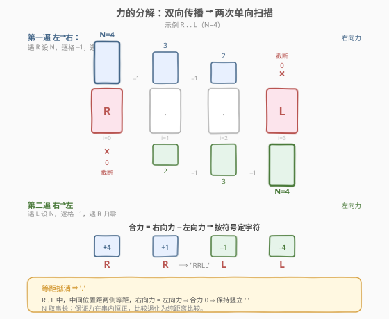
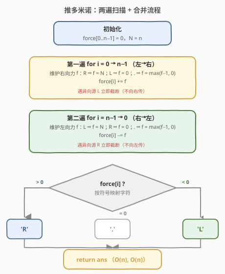
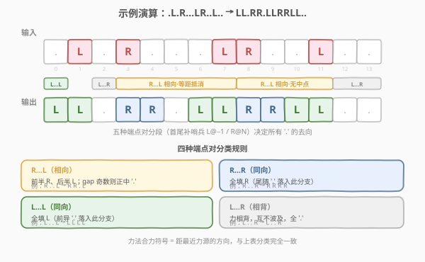

# LeetCode 推多米诺 题解

## 1. 题目概述

- **标题 / 题号**：推多米诺（#838，medium）
- **链接**：https://leetcode.cn/problems/push-dominoes/
- **难度**：中等
- **标签**：数组、双指针、模拟

**题意**：`n` 张多米诺骨牌排成一行，初始时每张为 `'L'`（向左推）、`'R'`（向右推）或 `'.'`（未推）。每秒：向左倒的牌推动其左侧相邻竖立牌，向右倒的牌推动其右侧相邻竖立牌。若一张竖立牌**两侧同时被推**（受力平衡），则保持竖立。已倒下或正在倒下的牌不再对其他牌施加额外力。返回最终状态字符串。

**示例 1**：

```text
输入：dominoes = "RR.L"
输出："RR.L"
解释：第二张 'R' 与第三张 'L' 之间无空牌；第一张 'R' 不会对已倒下的第二张施加额外力。
```

**示例 2**：

```text
输入：dominoes = ".L.R...LR..L.."
输出："LL.RR.LLRRLL.."
```

**约束**：

- `1 <= n <= 10^5`
- `dominoes[i]` 为 `'L'`、`'R'` 或 `'.'`

## 2. 解题思路

### 2.1 暴力思路

逐秒模拟：每轮扫描整个串，对每个 `'.'` 检查左右是否被推以决定下一秒状态，直到一轮无变化为止。最坏情况（如 `"R.....L"`）需要 $n/2$ 轮，每轮 $O(n)$，总计 $O(n^2)$。$n$ 可达 $10^5$，不可行。

> 💡 **重叠子结构**：同一位置的最终状态由"最近的左方 'R' 与右方 'L'"决定，与模拟顺序无关。这提示我们绕开逐秒过程，直接计算每个位置的受力。

### 2.2 核心观察：力的分解（两次单向扫描）



关键洞察：**把双向传播拆成两个独立的单向问题**，各自用一个衰减计数器即可描述。

- **向右的力**只由 `'R'` 产生，向右逐格衰减 1，遇到 `'L'` 立即归零；
- **向左的力**只由 `'L'` 产生，向左逐格衰减 1，遇到 `'R'` 立即归零。

定义 `force[i]` 为位置 $i$ 的**合力**（正=向右，负=向左）：

- **第一遍（左→右）**，维护右向力 $f$：遇 `'R'` → $f = N$；遇 `'L'` → $f = 0$；遇 `'.'` → $f = \max(f-1,\,0)$。`force[i] += f`。
- **第二遍（右→左）**，维护左向力 $f$：遇 `'L'` → $f = N$；遇 `'R'` → $f = 0$；遇 `'.'` → $f = \max(f-1,\,0)$。`force[i] -= f`。

合并：`force[i] > 0` → `'R'`；`< 0` → `'L'`；`== 0` → `'.'`。

> 💡 **为何取 $N$ 作初始力幅？** $N$ 是字符串长度，也是力能传播的最大距离。任意相遇点处，右向力 $= N - d_R$、左向力 $= N - d_L$（$d$ 为到各自源的距离）。两者等大当且仅当 $d_R = d_L$（等距），此时合力为 $0$ → `'.'`。$N$ 保证力在整个串内恒正，比较退化为**纯距离比较**。

> ⚠️ **衰减即"传播剩余步数"**：`'R'` 在 $i$ 处设力 $N$，表示推力还能向右传 $N$ 格；每传一格消耗 1，遇 `'L'` 立即截断（`'L'` 自己向左倒，不向右传力）。漏掉"遇异向源归零"会把力错误地穿透到另一侧。

### 2.3 算法流程图



三阶段流水：① 初始化 `force` 数组为 0；② 左→右累加右向力；③ 右→左减去左向力；④ 按符号映射为字符。每遍单层循环 $O(n)$，无嵌套。

### 2.4 示例演算



以示例 2 `.L.R...LR..L..` 为例，按**相邻力源**分段（首尾补虚拟哨兵 `L@-1`、`R@N`），每段中间的 `'.'` 由两端力源类型决定：

| 力源对 | 中间 '.' | 规则 | '.' 填充 |
|---|---|---|---|
| L…L（前导） | idx 0 | 同向，全被左推 | `L` |
| L…R | idx 2 | 力相背，互不波及 | `.` |
| R…L | idx 4,5,6 | 相向，等距抵消 | `R.L` |
| R…L | idx 9,10 | 相向，无中点 | `RL` |
| L…R（尾随） | idx 12,13 | 力相背，互不波及 | `..` |

各段 `'.'` 填充为 `L`·`.`·`R.L`·`RL`·`..`，力源 `L·R·L·R·L`（idx 1,3,7,8,11）原位不变，合写即 `LL.RR.LLRRLL..` ✓

> 💡 **力法与分段法等价**：力法合力的符号正是"距离最近力源的方向"，与分段法按端点对分类完全一致。四种端点组合：`R…L` 相向（等距处 `'.'`）、`R…R` 全右、`L…L` 全左、`L…R` 相背（全 `'.'`）。

## 3. 参考代码

### C++

```cpp
class Solution {
  public:
    string pushDominoes(string dominoes) {
        int n = dominoes.size();
        vector<int> force(n, 0);
        // 第一遍：左→右，累加右向力
        int f = 0;
        for (int i = 0; i < n; i++) {
            if (dominoes[i] == 'R') f = n;
            else if (dominoes[i] == 'L') f = 0;
            else f = max(f - 1, 0);
            force[i] += f;
        }
        // 第二遍：右→左，减去左向力
        f = 0;
        for (int i = n - 1; i >= 0; i--) {
            if (dominoes[i] == 'L') f = n;
            else if (dominoes[i] == 'R') f = 0;
            else f = max(f - 1, 0);
            force[i] -= f;
        }
        string ans;
        for (int i = 0; i < n; i++)
            ans += (force[i] > 0) ? 'R' : (force[i] < 0) ? 'L' : '.';
        return ans;
    }
};
```

### Python

```python
class Solution:
    def pushDominoes(self, dominoes: str) -> str:
        n = len(dominoes)
        force = [0] * n
        # 第一遍：左→右，累加右向力
        f = 0
        for i in range(n):
            if dominoes[i] == 'R':
                f = n
            elif dominoes[i] == 'L':
                f = 0
            else:
                f = max(f - 1, 0)
            force[i] += f
        # 第二遍：右→左，减去左向力
        f = 0
        for i in range(n - 1, -1, -1):
            if dominoes[i] == 'L':
                f = n
            elif dominoes[i] == 'R':
                f = 0
            else:
                f = max(f - 1, 0)
            force[i] -= f
        return ''.join('R' if x > 0 else 'L' if x < 0 else '.' for x in force)
```

> ⚠️ **易错点**：
> 1. **力遇异向源立即归零**：右向力遇 `'L'` 设 0（`'L'` 不向右传），左向力遇 `'R'` 设 0。漏掉会把力"穿透"到另一侧。
> 2. **初始力幅取 $N$**：$N$ 恰为最大传播距离，保证等距精确抵消；过小会误判（力提前归零），更大无害但无必要。
> 3. **`'.'` 的衰减用 `max(f-1, 0)`**：避免力源尚未出现时出现负值。

## 4. 复杂度分析

| 维度 | 复杂度 | 说明 |
|------|--------|------|
| 时间复杂度 | $O(n)$ | 两遍线性扫描 + 一遍合并，常数因子小 |
| 空间复杂度 | $O(n)$ | `force` 数组；可用分段法优化至 $O(1)$（见扩展） |

## 5. 扩展：双指针分段法（O(1) 额外空间）

不存力数组，直接按相邻力源对分段填充。首尾加哨兵 `'L'`…`'R'`，使前导 `'.'` 落入 `L…L`（全 `L`）、尾随 `'.'` 落入 `R…R`（全 `R`），免去边界特判：

```cpp
class Solution {
  public:
    string pushDominoes(string d) {
        d = "L" + d + "R"; // 首尾哨兵
        int n = d.size();
        string ans;
        for (int i = 0, j = 1; j < n; j++) {
            if (d[j] == '.') continue;
            int gap = j - i - 1;
            if (i > 0) ans += d[i]; // 写左源字符
            if (d[i] == 'R' && d[j] == 'L') {
                for (int k = 0; k < gap; k++)
                    ans += (k * 2 < gap - 1) ? 'R' : (k * 2 > gap - 1) ? 'L' : '.';
            } else if (d[i] == 'L' && d[j] == 'R') {
                ans += string(gap, '.');       // 相背，全不动
            } else {
                ans += string(gap, d[i]);      // 同源，全填该方向
            }
            i = j;
        }
        return ans;
    }
};
```

> 💡 **R…L 分段填充**：`gap = j-i-1` 个 `'.'`。点 $k$（$0 \le k < gap$）距 R 为 $k+1$、距 L 为 $gap-k$。前半（$2k < gap-1$）填 `'R'`，后半（$2k > gap-1$）填 `'L'`，正中（$gap$ 为奇数时 $2k = gap-1$）保持 `'.'`——与力法的等距抵消完全对应。

## 6. 面试要点

1. **为什么要拆成两次单向扫描？**

   - 双向同时传播会产生"相遇抵消"，直接模拟需逐秒判断两侧是否同时受力。拆成两个独立单向问题后，每个方向只需一个衰减计数器，相遇抵消自然由**合力为零**体现，无需显式判等距。

2. **力幅为什么取 $N$？取更大行吗？**

   - 取 $N$（串长）即可：最大传播距离 $< N$，力恒正。取更大无害但不必要；取小于 $N$ 会误判（力提前归零）。等距抵消只依赖"两力等大"，与具体幅值无关，只要幅值足够覆盖最大传播距离。

3. **`R…L` 相遇时中间的 `'.'` 如何确定？**

   - 设 `R` 在 $i$、`L` 在 $j$，中间位置 $k$：右向力 $= N-(k-i)$，左向力 $= N-(j-k)$。合力为正 → `'R'`，为负 → `'L'`，为零（$k-i = j-k$，即 $j-i$ 为偶数且 $k$ 居中）→ `'.'`。

4. **首尾的 `'.'` 怎么处理？**

   - 力法天然处理：前导 `'.'` 在左→右扫描时右向力为 0（左侧无 `R`），在右→左扫描时若右侧有 `'L'` 则被左向力覆盖 → `'L'`，否则保持 `'.'`。分段法则用哨兵 `L@-1`、`R@N` 统一归入 `L…L`/`R…R` 分支。

5. **力法与分段法孰优？**

   - 力法代码更短、思维更"数学化"；分段法空间 $O(1)$、更贴近物理直觉。面试建议先讲分段法说清原理，再给力法作为优雅替代，体现多解能力。

## 同类练习题

| # | 题目 | 与本题的关联 |
|---|------|-------------|
| 821 | [字符的最短距离](https://leetcode.cn/problems/shortest-distance-to-a-character/)（[题解](../0801-0900/821_字符的最短距离.md)） | 两次单向扫描求各位置到最近目标字符的距离，与本题"两次单向衰减"结构同构 |
| 238 | [除自身以外数组的乘积](https://leetcode.cn/problems/product-of-array-except-self/)（[题解](../0201-0300/238_除自身以外数组的乘积.md)） | 左右两次前缀乘积合并，同为"双向扫描合并结果"范式 |
| 42 | [接雨水](https://leetcode.cn/problems/trapping-rain-water/)（[题解](../0001-0100/42_接雨水.md)） | 左右两次扫描求两侧最高柱再取 min，与力法"双向衰减再合并"异曲同工 |
| 135 | [分发糖果](https://leetcode.cn/problems/candy/)（[题解](../0101-0200/135_分发糖果.md)） | 两次单向扫描分别满足左/右约束，本题力法的近亲——都是"双向传播取叠加" |
