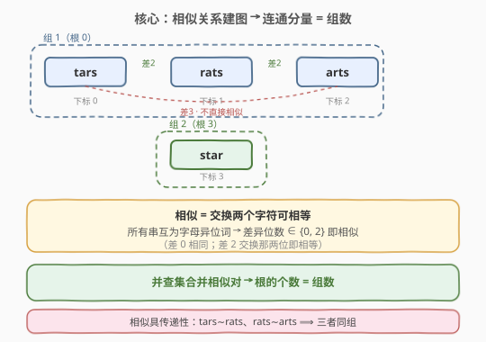
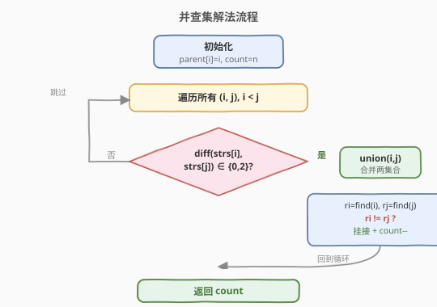
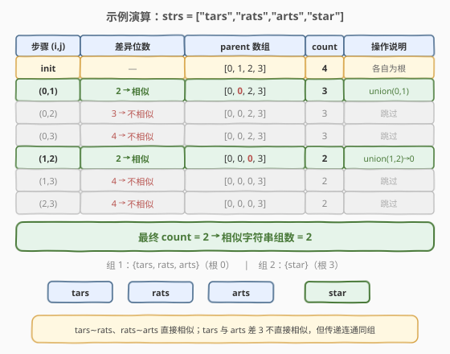

# LeetCode 相似字符串组 题解

## 1. 题目概述

- **标题 / 题号**：相似字符串组（#839，hard）
- **链接**：https://leetcode.cn/problems/similar-string-groups/
- **难度**：困难
- **标签**：并查集、图、字符串

**题意**：如果交换字符串 `X` 中**两个不同位置**的字符，可以让它和字符串 `Y` 相等，则称 `X` 和 `Y` **相似**。同时，一个字符串和它自身总是相似的（差 0 位）。

给定一个字符串数组 `strs`，里面**所有字符串长度相同且互为字母异位词**（即彼此字符多重集相同）。把相似关系看作边，「相似」具有传递性，相连的字符串归为同一组。返回**组的数量**。

**示例 1**：

```text
输入：strs = ["tars","rats","arts","star"]
输出：2
解释：
  tars ∼ rats（差 2 位：交换第 0、2 位）
  rats ∼ arts（差 2 位：交换第 0、1 位）
  ⇒ tars、rats、arts 传递连通，同属一组；star 与谁都差 4 位，单独一组。
```

**示例 2**：

```text
输入：strs = ["omv","ovm"]
输出：1
解释：omv 与 ovm 差 2 位（交换第 1、2 位即相等），二者相似，共 1 组。
```

**约束**：

- `1 <= strs.length <= 300`
- `1 <= strs[i].length <= 300`
- `strs[i]` 仅由小写英文字母组成
- 所有字符串长度相同，且互为字母异位词

## 2. 解题思路

### 2.1 暴力思路

对每个字符串建图节点，两两判断是否相似就连一条边，再对整张图做 DFS/BFS 数连通分量个数。思路直观，但本质上和并查集等价，且没有沉淀「动态连通性」模板。下面统一用并查集处理。

### 2.2 核心观察：相似关系建图 + 并查集数连通分量



把每个字符串看成一个节点，相似的两点之间连边。由于「相似」满足传递性，**一组 = 一个连通分量**，组数 = 连通分量数。

关键观察在**如何判定相似**：题目保证所有字符串互为字母异位词（字符多重集相同），那么：

> 两个字符串相似 ⟺ 它们的**差异位数**为 `0` 或 `2`。

- **差 0 位**：两串相同，天然相似；
- **差 2 位**：那两个不同位置上的字符恰好互换（因为整体是异位词），交换这两个位置即相等 → 相似；
- **差 ≥ 3 位**：一次交换最多纠正 2 个位置，无法一次交换变成相等 → 不相似。

于是只需逐位比较、统计不同位置个数即可，无需真正去枚举交换。

> ⚠️ 注意：相似是**传递**的。例 1 中 `tars` 与 `arts` 差 3 位、并不直接相似，但它们都和 `rats` 相似，所以三者同组。并查集的传递合并正好处理这种「间接同组」。

### 2.3 算法流程图



### 2.4 示例演算



以 `strs = ["tars","rats","arts","star"]`（下标 0/1/2/3）为例：

- 初始 `parent = [0, 1, 2, 3]`，`count = 4`。
- `(0,1)` `tars` vs `rats`：第 0、2 位不同 → 差 2 → 相似 → `union(0,1)`，`parent[1]=0`，`count=3`。
- `(0,2)` `tars` vs `arts`：第 0、1、2 位不同 → 差 3 → 不相似 → 跳过。
- `(0,3)` `tars` vs `star`：4 位全不同 → 差 4 → 不相似 → 跳过。
- `(1,2)` `rats` vs `arts`：第 0、1 位不同 → 差 2 → 相似 → `find(1)=0`、`find(2)=2`，不同根 → `parent[2]=0`，`count=2`。
- `(1,3)`、`(2,3)`：均差 4 → 跳过。
- 最终 `count = 2`。

## 3. 参考代码

### C++（并查集 + 路径压缩 + 按秩合并）

```cpp
class UnionFind {
  public:
    vector<int> parent, rank_;
    int count;

    UnionFind(int n) : count(n), parent(n), rank_(n, 0) {
        iota(parent.begin(), parent.end(), 0);
    }

    int find(int x) {
        if (parent[x] != x) parent[x] = find(parent[x]);   // 路径压缩
        return parent[x];
    }

    void unite(int x, int y) {
        int rx = find(x), ry = find(y);
        if (rx == ry) return;
        if (rank_[rx] < rank_[ry]) parent[rx] = ry;        // 按秩合并
        else if (rank_[rx] > rank_[ry]) parent[ry] = rx;
        else { parent[ry] = rx; rank_[rx]++; }
        count--;
    }
};

class Solution {
  public:
    int numSimilarGroups(vector<string>& strs) {
        int n = strs.size();
        UnionFind uf(n);
        for (int i = 0; i < n; i++)
            for (int j = i + 1; j < n; j++)
                if (isSimilar(strs[i], strs[j])) uf.unite(i, j);
        return uf.count;
    }

  private:
    bool isSimilar(const string& a, const string& b) {
        int diff = 0;
        for (int k = 0; k < (int)a.size() && diff <= 2; k++)   // 超 2 即可早停
            if (a[k] != b[k]) diff++;
        return diff == 0 || diff == 2;
    }
};
```

### Python（并查集 + 路径压缩 + 按秩合并）

```python
class Solution:
    def numSimilarGroups(self, strs: List[str]) -> int:
        n = len(strs)
        parent = list(range(n))
        rank_ = [0] * n
        count = n

        def find(x):
            while parent[x] != x:
                parent[x] = parent[parent[x]]           # 隔代压缩
                x = parent[x]
            return x

        def similar(a: str, b: str) -> bool:
            diff = 0
            for ca, cb in zip(a, b):
                if ca != cb:
                    diff += 1
                    if diff > 2:                        # 早停
                        return False
            return diff == 0 or diff == 2

        for i in range(n):
            for j in range(i + 1, n):
                if similar(strs[i], strs[j]):
                    ri, rj = find(i), find(j)
                    if ri == rj:
                        continue
                    if rank_[ri] < rank_[rj]:
                        parent[ri] = rj
                    elif rank_[ri] > rank_[rj]:
                        parent[rj] = ri
                    else:
                        parent[rj] = ri
                        rank_[ri] += 1
                    count -= 1
        return count
```

## 4. 复杂度分析

| 维度 | 复杂度 | 说明 |
|------|--------|------|
| 时间复杂度 | $O(n^2 \cdot L)$ | 共 $\frac{n(n-1)}{2}$ 对字符串，每对比较至多 $L$ 个字符（差异超 2 早停，实际常数更小）；并查集部分均摊 $O(n^2 \alpha(n))$ 被 $L$ 项吸收 |
| 空间复杂度 | $O(n)$ | `parent` 与 `rank` 数组各 $O(n)$ |

> 💡 本题 $n, L \le 300$，$n^2 L \approx 2.7 \times 10^7$，单次比较又有「超 2 即停」的剪枝，实际远低于上界，轻松通过。

## 5. 扩展：相似判定的正确性证明与优化

1. **为什么「异位词 + 差 2 位 ⟹ 相似」严格成立？**

   设 `a`、`b` 是异位词，仅在位置 $p$、$q$ 不同：$a_p \ne b_p$、$a_q \ne b_q$，其余相同。因为是异位词，两串字符多重集相等，所以 $a_p$ 必须等于 $b_q$、$a_q$ 必须等于 $b_p$（否则这两位的字符在 `a` 与 `b` 中无法配平）。于是交换 `a` 的第 $p$、$q$ 位后 $a$ 变成 $b$，即相似。这一步**依赖异位词前提**——若不保证异位词，差 2 位未必能靠一次交换相等。

2. **早停剪枝**：比较时一旦差异位数 `diff > 2` 立即返回不相似，避免扫完整串。对大量「明显不相似」的对（如差 4 位）可大幅减少比较次数。

3. **若不保证异位词怎么办？** 题目保证全部互为异位词；若去掉该条件，则需真正枚举所有 $\binom{L}{2}$ 种交换判断是否相等，单对判定从 $O(L)$ 退化到 $O(L^2)$。

## 6. 面试要点

1. **为什么相似判据可以简化成「差 0 或 2 位」？**

   - 前提是所有串互为字母异位词。差 2 位时，两个不同位置的字符在两串中恰好互换，交换即相等；差 0 即相同；差 ≥3 时一次交换最多纠正 2 位，不可能相等。所以差异位数 $\in \{0, 2\}$ 即相似。

2. **相似具有传递性，代码里如何体现？**

   - 并查集的 `union` 本身就把传递连通性吸收进同一棵树：`a∼b`、`b∼c` 分别 `union(a,b)`、`union(b,c)` 后，`a`、`c` 自然同根，无需它们直接相似。

3. **为什么只遍历 $i < j$ 的对？**

   - 相似关系无向对称（`a∼b ⟺ b∼a`），上三角已覆盖所有无序对，避免重复 `union`。

4. **时间复杂度瓶颈在哪？能否优化？**

   - 瓶颈在两两比较的 $O(n^2 L)$。可加「超 2 早停」剪枝；进一步可对每个串按某种哈希把「交换两位得到的串」存入哈希表，把建图降到接近 $O(nL^2)$，但常数与实现复杂度上升，本题数据规模下朴素并查集已足够。

5. **和 547 省份数量的并查集用法有何异同？**

   - 模板完全一致（`find` + `union` + 路径压缩 + 按秩合并 + `count` 计数）。区别在**边的来源**：547 直接读邻接矩阵；本题需要先做一次 $O(L)$ 的相似判定才决定是否连边，本质是「先建图再数连通分量」。

## 同类练习题

| # | 题目 | 与本题的关联 |
|---|------|-------------|
| 547 | [省份数量](https://leetcode.cn/problems/number-of-provinces/)（[题解](../0501-0600/547_省份数量.md)） | 同一并查集模板数连通分量，边的来源是邻接矩阵，与本题对照 |
| 684 | [冗余连接](https://leetcode.cn/problems/redundant-connection/)（[题解](../0601-0700/684_冗余连接.md)） | 并查集动态加边判环，模板的另一用法 |
| 721 | [账户合并](https://leetcode.cn/problems/accounts-merge/) | 并查集合并「同一个人」的邮箱，从字符串键建图的思想进阶 |
| 990 | [等式方程的可满足性](https://leetcode.cn/problems/satisfiability-of-equality-equations/) | 先 union 等式、再查不等式是否冲突，传递性建模的变体 |
| 1319 | [连通网络的操作次数](https://leetcode.cn/problems/number-of-operations-to-make-network-connected/) | 并查集数连通分量，求最少接线数 |
