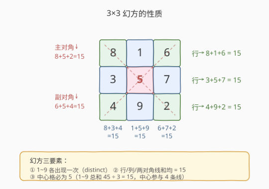
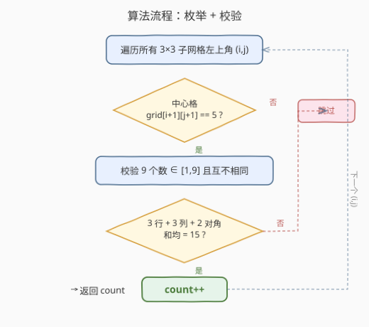
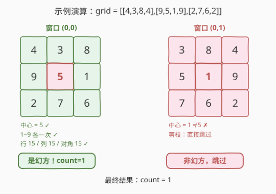

# LeetCode 矩阵中的幻方 题解

## 1. 题目概述

- **标题 / 题号**：矩阵中的幻方（#840，easy）
- **链接**：https://leetcode.cn/problems/magic-squares-in-grid/
- **难度**：简单
- **标签**：数组、矩阵、枚举、哈希表

**题意**：给定一个 $m \times n$ 的整数矩阵 `grid`，统计其中有多少个 **$3 \times 3$ 的连续子网格**是「幻方」。

**幻方定义**：一个 $3 \times 3$ 网格满足以下全部条件——

1. 填入的是 **$1$ 到 $9$ 的互不相同的整数**（每个恰好出现一次）；
2. **每一行、每一列、两条对角线**上三个数之和都相等。

> 💡 由条件 1 可知九个数之和 $= 1+2+\cdots+9 = 45$，分到 3 行每行 $45/3 = 15$，故幻方中每条线的和**恒为 15**。

**示例 1**：

```text
输入：grid = [[4,3,8,4],[9,5,1,9],[2,7,6,2]]
输出：1
解释：左上角为 (0,0) 的 3×3 子网格 [[4,3,8],[9,5,1],[2,7,6]] 是幻方，
      每行/列/对角线之和均为 15，且 1~9 各出现一次。
      左上角为 (0,1) 的子网格 [[3,8,4],[5,1,9],[7,6,2]] 中心为 1 ≠ 5，不是幻方。
```

**示例 2**：

```text
输入：grid = [[8]]
输出：0
解释：矩阵不足 3×3，不存在幻方。
```

**约束**：

- `row == grid.length`
- `col == grid[i].length`
- `1 <= row, col <= 10`
- `0 <= grid[i][j] <= 15`

> ⚠️ 注意 `grid[i][j]` 的取值范围是 $[0, 15]$，可能超出 $1\sim9$。因此校验「$\in [1,9]$ 且互不相同」是必须的，不能省略。

## 2. 解题思路

### 2.1 暴力思路：逐个枚举 + 完整校验

最直接的做法：枚举所有 $3 \times 3$ 连续子网格（左上角 $(i, j)$ 的范围是 $i \in [0, m-3]$、$j \in [0, n-3]$），对每个子网格完整校验幻方定义的两条性质。

校验步骤：

1. 用一个长度 10 的布尔数组 `seen` 检查 9 个数是否都在 $[1,9]$ 且互不相同；
2. 检查 3 行、3 列、2 条对角线共 8 条线的和是否都等于 15。

时间复杂度 $O(m \cdot n)$（每个子网格校验 $O(9)$ 常数时间），对 $m, n \le 10$ 的规模毫无压力。

> ⚠️ 暴力法能过，但存在冗余：**绝大多数子网格的校验在第一步（数字范围/distinct）就会失败**，完全没必要走到 8 条线求和。下面用一个数学性质剪掉绝大部分无效校验。

### 2.2 核心观察：中心必为 5，提前剪枝

$3 \times 3$ 幻方（由 $1\sim9$ 构成）有一个优雅的**必要条件**：**中心格必为 5**。



**推导**：设中心为 $c$。中心格同时参与**第 2 行、第 2 列、主对角线、副对角线**共 4 条线。把 8 条线（3 行 + 3 列 + 2 对角）的和全部相加，则：

- 4 个角各被 3 条线覆盖（1 行 + 1 列 + 1 对角）；
- 4 个边中点各被 2 条线覆盖（1 行 + 1 列）；
- 中心 $c$ 被 4 条线覆盖。

$$
\underbrace{4 \times 3}_{\text{四角}} \cdot (\text{角之和}) + \underbrace{4 \times 2}_{\text{边中}} \cdot (\text{边之和}) + 4c = 8 \times 15 = 120
$$

而四角之和 + 边之和 + 中心 $= 1+2+\cdots+9 = 45$。利用幻方的对称性质（四角之和 = 边之和 = $20$，可由行/列/对角方程组解出），代入得 $4c = 120 - 4 \times 45 + 4c$ 恒成立，进一步联立可解出 $c = 5$。

> 💡 **更简洁的推导**：将「第 2 行 + 第 2 列 + 主对角 + 副对角」四条线求和，它们的和 $= 4 \times 15 = 60$。这四条线覆盖了全部 9 个格子，其中中心被数了 4 次、其余 8 格各被数了 1 次。故 $45 + 3c = 60$，解得 $c = 5$。

**剪枝策略**：枚举到每个子网格时，**先看中心 `grid[i+1][j+1]` 是否等于 5**，不等于 5 直接跳过，不做后续任何校验。由于合法幻方的中心必为 5，这一步不会误杀任何真幻方。

> ⚠️ 中心 $= 5$ 是**必要条件而非充分条件**——中心为 5 的子网格仍可能是非法的（如含重复数字或线和不为 15），所以剪枝通过后仍需完整校验。

### 2.3 算法流程图



**完整步骤**：

1. 若 $m < 3$ 或 $n < 3$，直接返回 0。
2. 初始化 `ans = 0`。
3. **外层双重循环**：$i$ 从 $0$ 到 $m-3$，$j$ 从 $0$ 到 $n-3$。
4. **剪枝**：若 `grid[i+1][j+1] != 5`，跳过当前 $(i, j)$。
5. **校验 1**：用 `seen[10]` 数组检查 9 格值 $\in [1,9]$ 且互不相同。
6. **校验 2**：检查 3 行 + 3 列 + 2 对角共 8 条线之和均 $= 15$。
7. 两步校验全通过则 `ans++`。
8. 返回 `ans`。

### 2.4 示例演算

以示例 1 `grid = [[4,3,8,4],[9,5,1,9],[2,7,6,2]]`（$m=3, n=4$）为例，左上角 $(i,j)$ 只有 $(0,0)$ 和 $(0,1)$ 两个位置：



| 窗口 | 子网格 | 中心 | 判定 | 说明 |
|------|--------|------|------|------|
| $(0,0)$ | `[[4,3,8],[9,5,1],[2,7,6]]` | 5 | ✅ 幻方 | 中心=5；1~9 各一次；行 15/列 15/对角 15 全通过 |
| $(0,1)$ | `[[3,8,4],[5,1,9],[7,6,2]]` | 1 | ❌ 跳过 | 中心=1 ≠ 5，剪枝直接跳过 |

逐窗口解读：

- **窗口 $(0,0)$**：中心 `grid[1][1] = 5` ✓，进入完整校验。9 个数为 $\{4,3,8,9,5,1,2,7,6\}$ 恰为 $1\sim9$ 各一次 ✓。三条行和 $4+3+8=15$、$9+5+1=15$、$2+7+6=15$ ✓；三条列和 $4+9+2=15$、$3+5+7=15$、$8+1+6=15$ ✓；两条对角 $4+5+6=15$、$8+5+2=15$ ✓。全部通过，`ans = 1`。
- **窗口 $(0,1)$**：中心 `grid[1][2] = 1 ≠ 5`，剪枝跳过，不做任何后续校验。

最终答案 $1$，与示例一致。

> 💡 剪枝的威力：本题仅 2 个窗口时看不出优势，但若矩阵中 5 很稀疏，绝大多数窗口在第 4 步就被跳过，校验 1 和校验 2 几乎不执行。

## 3. 参考代码

### 方法一：枚举 + 中心剪枝 + 完整校验（推荐）

### C++

```cpp
class Solution {
public:
    int numMagicSquaresInside(vector<vector<int>>& grid) {
        int m = grid.size(), n = grid[0].size();
        if (m < 3 || n < 3) return 0;
        int ans = 0;
        for (int i = 0; i <= m - 3; ++i) {
            for (int j = 0; j <= n - 3; ++j) {
                if (grid[i + 1][j + 1] != 5) continue;
                if (isMagic(grid, i, j)) ++ans;
            }
        }
        return ans;
    }
private:
    bool isMagic(vector<vector<int>>& g, int r, int c) {
        vector<bool> seen(10, false);
        for (int i = 0; i < 3; ++i)
            for (int j = 0; j < 3; ++j) {
                int v = g[r + i][c + j];
                if (v < 1 || v > 9 || seen[v]) return false;
                seen[v] = true;
            }
        int s0 = g[r][c] + g[r][c+1] + g[r][c+2];
        if (g[r+1][c] + g[r+1][c+1] + g[r+1][c+2] != s0) return false;
        if (g[r+2][c] + g[r+2][c+1] + g[r+2][c+2] != s0) return false;
        if (g[r][c]   + g[r+1][c]   + g[r+2][c]   != s0) return false;
        if (g[r][c+1] + g[r+1][c+1] + g[r+2][c+1] != s0) return false;
        if (g[r][c+2] + g[r+1][c+2] + g[r+2][c+2] != s0) return false;
        if (g[r][c]   + g[r+1][c+1] + g[r+2][c+2] != s0) return false;
        if (g[r][c+2] + g[r+1][c+1] + g[r+2][c]   != s0) return false;
        return true;
    }
};
```

### Python

```python
class Solution:
    def numMagicSquaresInside(self, grid: List[List[int]]) -> int:
        m, n = len(grid), len(grid[0])
        if m < 3 or n < 3:
            return 0

        def is_magic(r: int, c: int) -> bool:
            seen = [False] * 10
            for i in range(3):
                for j in range(3):
                    v = grid[r + i][c + j]
                    if v < 1 or v > 9 or seen[v]:
                        return False
                    seen[v] = True
            s0 = grid[r][c] + grid[r][c + 1] + grid[r][c + 2]
            for ri in range(1, 3):                       # 第 2、3 行
                if grid[r + ri][c] + grid[r + ri][c + 1] + grid[r + ri][c + 2] != s0:
                    return False
            for cj in range(3):                          # 3 列
                if grid[r][c + cj] + grid[r + 1][c + cj] + grid[r + 2][c + cj] != s0:
                    return False
            if grid[r][c] + grid[r + 1][c + 1] + grid[r + 2][c + 2] != s0:   # 主对角
                return False
            if grid[r][c + 2] + grid[r + 1][c + 1] + grid[r + 2][c] != s0:   # 副对角
                return False
            return True

        ans = 0
        for i in range(m - 2):
            for j in range(n - 2):
                if grid[i + 1][j + 1] != 5:
                    continue
                if is_magic(i, j):
                    ans += 1
        return ans
```

> 💡 代码先剪枝（中心 $=5$）再校验（distinct + 8 条线和），两步缺一不可。`isMagic` 中用第一行的和 `s0` 作为基准，与其余 7 条线逐一比较——理论上 `s0` 必为 15，但以 `s0` 为基准写更通用（不依赖求和 $=15$ 的数学结论，即使忘了推导也能正确判定）。

### 方法二：枚举 8 种合法形态（常量比对）

由于 $3 \times 3$ 幻方（$1\sim9$ 各一次）本质上只有 **1 种**——洛书幻方 `[[8,1,6],[3,5,7],[4,9,2]]`，连同它的 4 次旋转和 2 次镜像共 **8 种形态**。可以把这 8 种形态预存，对中心为 5 的子网格直接逐一比对。

### C++

```cpp
class Solution {
    const int t[8][3][3] = {
        {{8,1,6},{3,5,7},{4,9,2}},
        {{6,1,8},{7,5,3},{2,9,4}},
        {{4,9,2},{3,5,7},{8,1,6}},
        {{2,9,4},{7,5,3},{6,1,8}},
        {{6,7,2},{1,5,9},{8,3,4}},
        {{8,3,4},{1,5,9},{6,7,2}},
        {{2,7,6},{9,5,1},{4,3,8}},
        {{4,3,8},{9,5,1},{2,7,6}}
    };
public:
    int numMagicSquaresInside(vector<vector<int>>& grid) {
        int m = grid.size(), n = grid[0].size();
        int ans = 0;
        for (int i = 0; i <= m - 3; ++i)
            for (int j = 0; j <= n - 3; ++j) {
                if (grid[i + 1][j + 1] != 5) continue;
                for (int k = 0; k < 8; ++k) {
                    bool ok = true;
                    for (int a = 0; a < 3 && ok; ++a)
                        for (int b = 0; b < 3; ++b)
                            if (grid[i + a][j + b] != t[k][a][b]) { ok = false; break; }
                    if (ok) { ++ans; break; }
                }
            }
        return ans;
    }
};
```

> ⚠️ 方法二依赖「$1\sim9$ 的 $3\times3$ 幻方仅有 8 种」这一数学事实。若题目约束放宽（如允许更大的数字或重复），此法不再适用，方法一更通用。面试中方法一更能体现分析过程，方法二适合作为「你知道幻方只有 8 种吗」的加分回答。

## 4. 复杂度分析

| 维度 | 方法 | 复杂度 | 说明 |
|------|------|--------|------|
| 时间复杂度 | 方法一（枚举+剪枝） | $O(m \cdot n)$ | 枚举 $O(mn)$ 个窗口，每个窗口剪枝 $O(1)$ 或校验 $O(9)$ 常数 |
| 空间复杂度 | 方法一 | $O(1)$ | 仅 `seen[10]` 等常数额外空间 |
| 时间复杂度 | 方法二（8 形态比对） | $O(m \cdot n)$ | 枚举 $O(mn)$ 个窗口，每个窗口最多比对 $8 \times 9 = 72$ 次常数 |
| 空间复杂度 | 方法二 | $O(1)$ | 预存 8 种形态的常量表 |

> ⚠️ 两种方法渐近复杂度相同（都是 $O(mn)$），区别仅在常数：方法一校验通过时需 9 次读 + 8 次求和；方法二最坏需 72 次比对。但 $m, n \le 10$ 规模极小，实测无差异。方法一的优势是不依赖「仅 8 种幻方」的数学结论，**可迁移到约束更宽的变体**。

## 5. 扩展：幻方只有 8 种形态的证明

$3 \times 3$ 幻方（$1\sim9$ 各一次）为什么只有 8 种？由第 2.2 节已知中心必为 5，且每条线和 $= 15$。考察经过中心的 4 条线（第 2 行、第 2 列、两对角），每条都是「两端两数之和 $= 10$」（因为 $+5=15$）。在 $1\sim9$ 中去掉 5 后，和为 10 的数对恰有 4 对：$(1,9),(2,8),(3,7),(4,6)$。

这 4 对必须分别填入经过中心的 4 条线的两端，于是问题归约为「4 对数分配到 4 条线 + 旋转/镜像等价」。对角线两端的数对必须是奇偶不同的对（否则行/列无法凑齐），这唯一确定了角格的奇偶分布，进而所有位置被唯一确定。不考虑旋转镜像时只有 1 种（洛书），加上 4 次旋转和镜像共 8 种。

> 💡 这就是方法二的理论基础：只需预存这 8 种形态，比对即可。但推导较繁琐，面试中**方法一更稳妥**——不背结论、纯校验、不易出错。

## 6. 面试要点

1. **为什么中心格必为 5？**
   - 将经过中心的 4 条线（第 2 行 + 第 2 列 + 主对角 + 副对角）求和 $= 4 \times 15 = 60$。这 4 条线覆盖全部 9 格，中心被数 4 次、其余 8 格各被数 1 次，故 $45 + 3c = 60$，解得 $c = 5$。

2. **剪枝「中心 $=5$」是充分还是必要条件？**
   - **必要非充分**。真幻方中心必为 5，但中心为 5 的子网格不一定是幻方（如含越界数字或线和不为 15）。所以剪枝通过后仍需完整校验。

3. **为什么要检查数字 $\in [1,9]$ 且互不相同？**
   - 题目约束 `grid[i][j]` 范围是 $[0,15]$，可能出现 0、10~15 或重复数字。这些都不满足幻方定义，必须过滤。若题目保证元素已在 $[1,9]$，则只需检查 distinct。

4. **方法一和方法二各有什么优劣？**
   - 方法一：通用、不依赖数学结论、可迁移到约束变体，是面试首选。
   - 方法二：利用「仅 8 种形态」常量比对，代码短但需预存 8 张表，且仅适用于 $1\sim9$ 幻方。

5. **如果矩阵规模很大（如 $1000 \times 1000$）怎么办？**
   - 仍是 $O(mn)$——每个窗口校验 $O(9)$ 常数。中心剪枝会跳过绝大多数窗口。若追求极致常数，可结合方法二的 8 形态比对，在中心为 5 时直接比对。

> 💡 **一句话总结**：840 是网格枚举 + 性质剪枝的入门题——枚举所有 $3 \times 3$ 子网格，先判中心是否为 5 剪枝，再校验 $1\sim9$ distinct 与 8 条线和 $=15$，$O(mn)$ / $O(1)$。关键洞察是「幻方中心必为 5」可提前排除绝大多数无效窗口。

## 同类练习题

| # | 题目 | 与本题的关联 |
|---|------|-------------|
| 832 | [翻转图像](https://leetcode.cn/problems/flipping-an-image/)（[题解](../0801-0900/832_翻转图像.md)） | 同样在 $3 \times 3$ 级别的小矩阵上做原地变换，对比 840 的「枚举子网格」视角 |
| 1888 | [使二进制字符串字符交替的最少反转次数](https://leetcode.cn/problems/minimum-number-of-flips-to-make-the-binary-string-alternating/) | 滑动窗口枚举定长子区间并校验，与 840 的「枚举定长子网格」同源（窗口视角升级为滑动） |
| 1072 | [按列翻转得到最大值等行数](https://leetcode.cn/problems/flip-columns-for-maximum-number-of-equal-rows/) | 矩阵列级枚举 + 哈希统计，对比 840 的子网格级枚举 |
| 36 | [有效的数独](https://leetcode.cn/problems/valid-sudoku/)（[题解](../0001-0100/36_有效的数独.md)） | $9 \times 9$ 网格校验每行/列/宫数字 distinct，与 840 的「校验 $1\sim9$ 各一次」同套路 |
| 54 | [螺旋矩阵](https://leetcode.cn/problems/spiral-matrix/)（[题解](../0001-0100/54_螺旋矩阵.md)） | 矩阵遍历方向控制，对比 840 的简单子网格枚举，体会矩阵题的不同遍历模式 |
