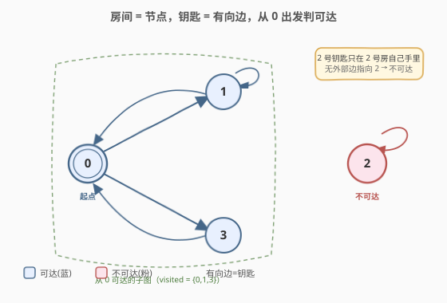
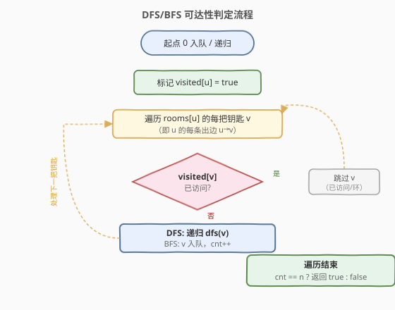
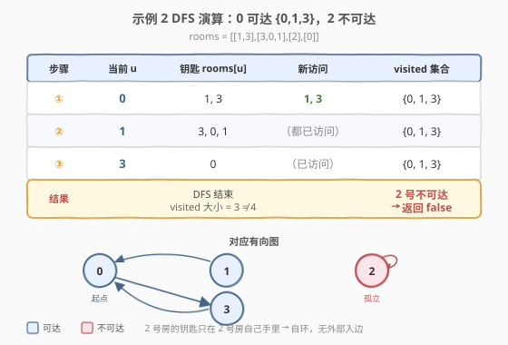

# LeetCode 钥匙和房间 题解

## 1. 题目概述

- **标题 / 题号**：钥匙和房间（#841，medium）
- **链接**：https://leetcode.cn/problems/keys-and-rooms/
- **难度**：中等
- **标签**：深度优先搜索、广度优先搜索、图、连通性

**题意**：有 `n` 个房间，编号 `0` 到 `n-1`。除 **0 号房间**外，每个房间都**锁着**。你从 0 号房间开始，每个房间 `i` 里有一串钥匙 `rooms[i]`，每把钥匙上标着一个房间号，可以打开对应的房间。**返回你是否能进入所有房间**。

**示例 1**：

```text
输入：rooms = [[1],[2],[3],[]]
输出：true
解释：
  从 0 号房出发 → 拿到 1 号钥匙 → 进 1 号房 → 拿到 2 号钥匙 → 进 2 号房
  → 拿到 3 号钥匙 → 进 3 号房。4 个房间全部访问。
```

**示例 2**：

```text
输入：rooms = [[1,3],[3,0,1],[2],[0]]
输出：false
解释：
  从 0 号房出发 → 拿到 1、3 号钥匙 → 进 1 号房（拿到 3、0、1，都重复或已有）
  → 进 3 号房（拿到 0，重复）。2 号房的钥匙只有 2 号房自己拿着，
  而 2 号房被锁住进不去 → 无法访问 2 号房。
```

**约束**：

- `n == rooms.length`
- `2 <= n <= 1000`
- `0 <= rooms[i].length <= 1000`
- `1 <= sum(rooms[i].length) <= 3000`
- `0 <= rooms[i][j] < n`
- `rooms[i]` 中的值互不相同（同一房间内没有重复钥匙）

## 2. 解题思路

### 2.1 暴力思路

尝试枚举「拿钥匙、开房间的所有顺序」——这是一棵排列搜索树，分支数随钥匙数阶乘增长，`n=1000` 时完全不可行。

瓶颈在于：**钥匙的「使用顺序」根本不影响能否到达某个房间**。只要某把钥匙在某个可达房间里，对应房间就一定进得去——不管你先去哪间房拿。把"开锁"抽象成"有向边"后，问题立刻塌缩成图上的**可达性判定**。

### 2.2 核心观察：房间 = 节点，钥匙 = 有向边



把每个房间看作有向图的一个**节点**，`rooms[i]` 中的每把钥匙 `k` 看作一条**有向边** `i → k`（"在房间 i 里拿到能进房间 k 的钥匙"）。于是：

- **能否访问所有房间** ⟺ **从节点 0 出发能否到达所有节点**（图的可达性 / 连通性判定）。
- 起点固定为 0，只需一次 DFS/BFS 遍历，统计**已访问节点数**，若等于 `n` 则全部可达。

> 💡 **为什么不用关心环？** 示例 2 中 `0→1`、`1→0` 互指成环，但带 `visited` 标记的 DFS 遇到已访问节点直接跳过，不会死循环。环只是"多了一条多余的边"，对可达性判定毫无影响——关键是**有没有边**，不是**边走几次**。

> ⚠️ **关键陷阱：2 号房的钥匙只在 2 号房自己手里**。即存在自环 `2→2`，但**没有任何外部的边指向 2**。从 0 出发的 DFS 永远碰不到这条边，所以 2 号不可达。这正是"可达性 ≠ 图里有没有这个点"，而是"从起点能不能走到"。

### 2.3 算法流程图



DFS 版（递归，最简洁）：

1. 维护 `visited` 数组（或集合），`visited[0] = true`。
2. `dfs(u)`：遍历 `rooms[u]` 中每把钥匙 `v`，若 `!visited[v]`，则标记并递归 `dfs(v)`。
3. 从 `dfs(0)` 启动，结束后统计 `visited` 中 `true` 的个数，等于 `n` 返回 `true`。

BFS 版（迭代，无栈溢出风险）：

1. 队列初始化为 `[0]`，`visited[0] = true`。
2. 循环取出队首 `u`，遍历 `rooms[u]` 的钥匙 `v`，未访问则标记并入队。
3. 队列空时，统计 `visited` 个数判 `== n`。

### 2.4 示例演算



以示例 2 `rooms = [[1,3],[3,0,1],[2],[0]]` 为例，对应的图：

```text
0 → 1, 3      （0 号房有 1、3 号钥匙）
1 → 3, 0, 1   （1 号房有 3、0、1 号钥匙，含自环 1→1）
2 → 2         （2 号房只有自己的钥匙，自环）
3 → 0         （3 号房有 0 号钥匙）
```

DFS 从 0 出发：

| 步骤 | 当前房间 u | 钥匙 rooms[u] | 新访问的房间 | visited 集合 |
|------|-----------|---------------|-------------|--------------|
| 1 | 0 | 1, 3 | 1, 3 | {0,1,3} |
| 2 | 1 | 3,0,1 | （都已访问） | {0,1,3} |
| 3 | 3 | 0 | （已访问） | {0,1,3} |

DFS 结束，`visited = {0,1,3}`，大小 3 ≠ 4。**2 号房不可达**（没有从 {0,1,3} 指向 2 的边），返回 `false`。

## 3. 参考代码

### 方法一：DFS（递归）

### C++

```cpp
class Solution {
    void dfs(int u, vector<vector<int>>& rooms, vector<bool>& visited) {
        visited[u] = true;
        for (int v : rooms[u])
            if (!visited[v]) dfs(v, rooms, visited);
    }
  public:
    bool canVisitAllRooms(vector<vector<int>>& rooms) {
        int n = rooms.size();
        vector<bool> visited(n, false);
        dfs(0, rooms, visited);
        for (bool v : visited)
            if (!v) return false;
        return true;
    }
};
```

### Python

```python
class Solution:
    def canVisitAllRooms(self, rooms: List[List[int]]) -> bool:
        n = len(rooms)
        visited = [False] * n

        def dfs(u: int):
            visited[u] = True
            for v in rooms[u]:
                if not visited[v]:
                    dfs(v)

        dfs(0)
        return all(visited)
```

### 方法二：BFS（迭代，无栈溢出风险）

### C++

```cpp
class Solution {
  public:
    bool canVisitAllRooms(vector<vector<int>>& rooms) {
        int n = rooms.size();
        vector<bool> visited(n, false);
        queue<int> q;
        q.push(0);
        visited[0] = true;
        int cnt = 1;
        while (!q.empty()) {
            int u = q.front(); q.pop();
            for (int v : rooms[u])
                if (!visited[v]) {
                    visited[v] = true;
                    cnt++;
                    q.push(v);
                }
        }
        return cnt == n;
    }
};
```

### Python

```python
from collections import deque

class Solution:
    def canVisitAllRooms(self, rooms: List[List[int]]) -> bool:
        n = len(rooms)
        visited = [False] * n
        q = deque([0])
        visited[0] = True
        cnt = 1
        while q:
            u = q.popleft()
            for v in rooms[u]:
                if not visited[v]:
                    visited[v] = True
                    cnt += 1
                    q.append(v)
        return cnt == n
```

> ⚠️ **Python 递归深度**：`n ≤ 1000`，链状图（`0→1→2→…→n-1`）递归深度达 `1000`，刚好触及默认上限可能 `RecursionError`。建议 `sys.setrecursionlimit(2000)`，或直接用 BFS 规避。BFS 用 `cnt` 计数，省去最后再扫一遍 `visited`。

## 4. 复杂度分析

| 维度 | 复杂度 | 说明 |
|------|--------|------|
| 时间复杂度 | $O(V + E)$ | 每个房间（节点）最多入队/递归一次；每把钥匙（边）最多查看一次。$V=n$，$E=\sum\text{rooms[i].length}\le 3000$ |
| 空间复杂度 | $O(V)$ | `visited` 数组 $O(n)$；DFS 递归栈最深 $O(n)$（链状图），BFS 队列最大 $O(n)$ |

## 5. 扩展：可达性问题的统一视角

「钥匙和房间」本质是**单源可达性**（single-source reachability）：给定起点 `s`，问哪些节点可达。这是图上最基础的问题之一，模板就是"DFS/BFS + visited 标记"，本题只是把"钥匙"包装成"边"来考察抽象能力。

同类变形：

- **多源可达性**：多个起点同时 BFS（如 [994. 腐烂的橘子](https://leetcode.cn/problems/rotting-oranges/)，多源 BFS 求最远距离）。
- **反向可达性**："哪些点能到达终点"——建反图后从终点 BFS（如 [417. 太平洋大西洋水流问题](https://leetcode.cn/problems/pacific-atlantic-water-flow/)，从海洋逆流而上）。
- **全连通性**：所有节点两两可达——强连通分量（Kosaraju/Tarjan），本题只需单源，不必上 SCC。

> 💡 **面试变体提示**：若改为"求访问所有房间的**最少开门次数**"，仍是单源可达——只要可达就一定能访问全部，开门次数恒等于可达房间数，无需额外算法。若改为"求**最少切换房间次数**"（每进一个新房间算一次），则是 BFS 求最短路（层序遍历的层数）。

## 6. 面试要点

1. **如何把题意抽象成图？**

   - 房间 = 节点，`rooms[i]` 里的钥匙 `k` = 有向边 `i→k`。能否访问所有房间 ⟺ 从节点 0 出发的可达节点数是否等于 `n`。这一步抽象是本题唯一的难点，剩下就是套 DFS/BFS 模板。

2. **DFS 和 BFS 哪个更好？**

   - 复杂度相同。DFS 写起来更短（递归 3 行）；BFS 无栈溢出风险，对大规模数据（`n` 接近 1000）更稳。Python 递归默认上限 1000，链状图可能踩雷，BFS 更安全。

3. **为什么不用关心环和钥匙顺序？**

   - `visited` 标记让 DFS/BFS 遇到已访问节点直接跳过，环不会造成死循环。钥匙的"使用顺序"不影响可达集合——只要某房间有指向它的边且起点可达，它就一定可达。这是把"操作序列问题"降维成"图遍历问题"的关键。

4. **只统计 visited 数量对吗？要不要校验起点？**

   - 起点 0 一定可达（自己就在 0 号房），`visited[0]` 初始即 `true`。统计 `true` 的个数等于 `n` 即说明全部可达，无需额外校验。若 `n=1`（虽约束 `n≥2`），直接返回 `true`。

5. **如果题目改成"每个房间可重复进入"呢？**

   - 不影响。带 `visited` 的 DFS/BFS 本来就保证每点只处理一次，"重复进入"不会带来新钥匙（已访问房间的钥匙早就拿过了）。可达集合不变，答案不变。

## 同类练习题

| # | 题目 | 与本题的关联 |
|---|------|-------------|
| 200 | [岛屿数量](https://leetcode.cn/problems/number-of-islands/) | DFS/BFS + visited 标记连通分量，本题的单源可达是其简化版（只关心从 0 出发一片） |
| 207 | [课程表](https://leetcode.cn/problems/course-schedule/) | 图遍历判环/拓扑，与本题同为"图可达性"家族，但关心能否全修（拓扑序）而非单源可达 |
| 994 | [腐烂的橘子](https://leetcode.cn/problems/rotting-oranges/) | 多源 BFS 可达性 + 层序求最远距离，本题 BFS 模板的进阶（多源 + 计层数） |
| 417 | [太平洋大西洋水流问题](https://leetcode.cn/problems/pacific-atlantic-water-flow/) | 反向 BFS 求可达集交集，从"正向可达"延伸到"反向可达" |
