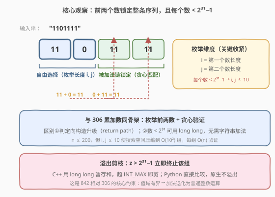
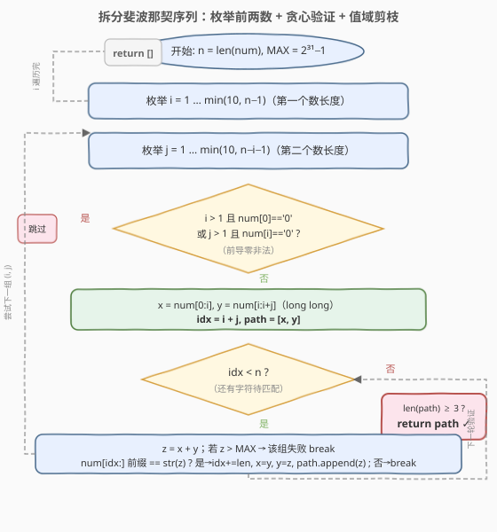
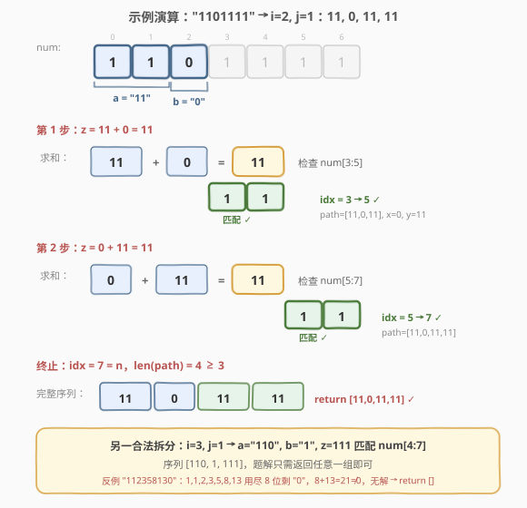

# 将数组拆分成斐波那契序列

- **题目名称**：将数组拆分成斐波那契序列
- **链接**：[842. 将数组拆分成斐波那契序列](https://leetcode.cn/problems/split-array-into-fibonacci-sequence/)
- **难度**：中等
- **标签**：字符串、回溯、枚举

## 1. 题目概述

给定一个**只含数字**的字符串 `num`，把它拆成「**斐波那契式**」的整数序列 `f`，返回**任意一组**合法拆分；若无法拆分则返回 `[]`。

**斐波那契式**序列的规则：

1. $0 \le f[i] < 2^{31}$（每个数都是 32 位有符号整数范围）；
2. $f.length \ge 3$（至少三个数）；
3. 对所有 $0 \le i < f.length - 2$，都有 $f[i] + f[i+1] = f[i+2]$；
4. 每个数**不含前导零**（单独一个 `0` 允许，但 `01`、`00` 非法）。

**示例 1**：

```text
输入：num = "1101111"
输出：[11,0,11,11]
解释：11 + 0 = 11，0 + 11 = 11。另一种合法拆分 [110,1,111] 亦可。
```

**示例 2**：

```text
输入：num = "112358130"
输出：[]
解释：无法拆分。1,1,2,3,5,8,13 用尽前 8 位后剩 "0"，但 8+13=21≠0。
```

**示例 3**：

```text
输入：num = "0123"
输出：[]
解释：每个块的数字不能以零开头，"01","2","3" 非法。
```

**约束条件**：

- $1 \le \text{num.length} \le 200$
- `num` 中只含有数字

> 💡 本题是 [306. 累加数](../0301-0400/306_累加数.md) 的**构造版**：306 只判 true/false，842 要返回一组具体序列。骨架完全一致——「枚举前两个数长度 + 贪心验证」，区别仅在于 ① 验证函数从返回 `bool` 升级为返回**路径列表**；② 每个数有上界 $2^{31}-1$，可借此把加法退化回普通整数运算。

---

## 2. 解题思路

### 2.1 暴力思路：枚举所有切分点

最朴素的想法是枚举字符串的所有切分方式，逐段验证是否满足斐波那契关系。但切分方式是指数级的，且一旦前两个数确定，后续每个数都是前两数之和——长度和值都被唯一锁定，盲目枚举全部切分会做大量无用功。

### 2.2 核心观察：前两个数确定整条序列



关键洞察与 306 完全相同：**斐波那契式序列由前两个数完全决定**。给定第一个数 $a$ 和第二个数 $b$，第三个数必定是 $a+b$，第四个必定是 $b+(a+b)$，依此类推——后续每一项都被加法链唯一锁定，没有任何自由度。

因此问题坍缩为：

1. **枚举前两个数的长度** $(i, j)$：第一个数占 `num[0:i]`，第二个数占 `num[i:i+j]`。
2. **贪心验证**：从 `idx = i + j` 起，反复计算 $z = x + y$，检查 `num` 在 `idx` 处是否以 `z` 开头。匹配则 `idx` 前移、滚动 $x, y$ 并把 $z$ 追加进 `path`；不匹配则该组失败。
3. 若最终 `idx == n`（整串恰好耗尽）且 `len(path) >= 3`，则返回 `path`。
4. 所有组合遍历完毕无命中，返回 `[]`。

> 💡 **为什么是贪心而非回溯？** 前两个数固定后，后续每个数 $z = x + y$ 是唯一的。在 `idx` 位置，要么子串前缀恰好等于 $z$（匹配，继续），要么不等（失败）。没有分支可选，自然不需要回溯。这与 [93. 复原 IP 地址](../0001-0100/93_复原IP地址.md)「每段都有多种合法切法、需回溯」形成对比。

**两个关键剪枝**：

| 剪枝 | 说明 |
|------|------|
| **前导零** | 长度 $> 1$ 的数首位不能是 `'0'`（`"0"` 合法，`"02"` 非法）。提取 $a$、$b$ 后立即检查 |
| **值域上界** | 每个数 $< 2^{31}-1$（$\approx 2.1 \times 10^9$，最多 10 位）。$x$、$y$ 或 $z$ 超界即该组失败 |

> ⚠️ **值域上界是 842 相对 306 的核心约束**。306 中 $n \le 35$，单数可达十几位、溢出 64 位整数，C++ 必须**字符串加法**；842 中每个数 $< 2^{31}-1$（10 位），$x+y < 2^{32}$，用 `long long` 暂存绰绰有余，**加法退化为普通整数运算**。这是两题实现上最大的差异。

**枚举范围收紧**：由于每个数 $< 2^{31}-1$（最多 10 位），第一个数长度 $i \le 10$、第二个数长度 $j \le 10$。即便 $n = 200$，搜索组合也只有 $O(10^2)$ 组，每组验证 $O(n)$，总计 $\sim 2 \times 10^4$ 量级，轻松通过。

### 2.3 算法流程图



**完整步骤**：

1. **双重循环枚举** $(i, j)$：$i$ 从 $1$ 到 $\min(10, n-1)$，$j$ 从 $1$ 到 $\min(10, n-i-1)$，保证 $i + j < n$（至少留一位给第三个数）。
2. **前导零检查**：$i > 1$ 且 `num[0] == '0'` → 跳过；$j > 1$ 且 `num[i] == '0'` → 跳过。
3. **初始化**：$x = \text{num}[0:i]$，$y = \text{num}[i:i+j]$，转成 `long long`；若 $x$ 或 $y$ 超过 $2^{31}-1$ → 跳过。`idx = i + j`，`path = [x, y]`。
4. **贪心验证循环**（`idx < n` 时）：
   - 计算 $z = x + y$（`long long`）。
   - 若 $z > 2^{31}-1$ → 该组失败，`break`。
   - 将 $z$ 转为字符串 `zs`，检查 `num` 从 `idx` 起是否以 `zs` 为前缀：是 → `idx += len(zs)`，`path.append(z)`，滚动 $x=y,\ y=z$；否 → `break`。
5. **终止判定**：循环退出后若 `idx == n` 且 `len(path) >= 3` → 返回 `path`；否则继续下一组 $(i, j)$。
6. 所有组合遍历完毕无命中，返回 `[]`。

> ⚠️ **两个终止条件缺一不可**：`idx == n` 保证整串恰好耗尽无剩余；`len(path) >= 3` 保证序列至少三项（如 `num = "12"` 凑不出三个数，应返回 `[]`）。后者在 $i + j < n$ 的循环条件下天然满足，但显式写出更稳妥。

### 2.4 示例演算

以 `num = "1101111"`（$n = 7$）为例，演示 $i=2, j=1$（$a=11,\ b=0$）的完整验证过程。



**逐步追踪**：

| 步骤 | x | y | z = x + y | 检查区间 | num 子串 | 结果 | idx 变化 | path |
|------|------|------|-----------|----------|----------|------|----------|------|
| 初始 | 11 | 0 | — | — | — | — | 3 | [11, 0] |
| 1 | 11 | 0 | 11 | `[3:5]` | "11" | ✓ | 3 → 5 | [11, 0, 11] |
| 2 | 0 | 11 | 11 | `[5:7]` | "11" | ✓ | 5 → 7 | [11, 0, 11, 11] |
| 终止 | 11 | 11 | — | — | — | idx=7=n, len=4≥3 | — | return ✓ |

**另一合法拆分**（$i=3, j=1$）：$a=110,\ b=1$，$z=111$ 匹配 `num[4:7]="111"`，序列 `[110, 1, 111]`。题解只需返回任意一组。

**反例**（`num = "112358130"`）：尝试 $i=1, j=1$ → $1, 1, 2, 3, 5, 8, 13$ 用尽前 8 位剩 `"0"`，但 $8+13=21 \ne 0$，匹配失败。其余 $(i, j)$ 组合同样无解，最终返回 `[]`。

---

## 3. 参考代码

### C++

```cpp
class Solution {
public:
    vector<int> splitIntoFibonacci(string num) {
        int n = num.size();
        long long MAX = (1LL << 31) - 1;          // 2^31 - 1
        for (int i = 1; i <= 10 && i < n; ++i) {
            for (int j = 1; j <= 10 && i + j < n; ++j) {
                vector<int> path = check(num, i, j, MAX);
                if (!path.empty()) return path;
            }
        }
        return {};
    }

private:
    vector<int> check(const string& num, int i, int j, long long MAX) {
        if (i > 1 && num[0] == '0') return {};     // 前导零
        if (j > 1 && num[i] == '0') return {};
        long long x = stoll(num.substr(0, i));
        long long y = stoll(num.substr(i, j));
        if (x > MAX || y > MAX) return {};          // 值域上界
        vector<int> path{(int)x, (int)y};
        int idx = i + j, n = num.size();
        while (idx < n) {
            long long z = x + y;
            if (z > MAX) return {};                  // 溢出剪枝
            string zs = to_string(z);
            if (num.compare(idx, zs.size(), zs) != 0) return {};  // 不匹配
            idx += zs.size();
            path.push_back((int)z);
            x = y;
            y = z;
        }
        if (idx == n && path.size() >= 3) return path;
        return {};
    }
};
```

### Python

```python
class Solution:
    def splitIntoFibonacci(self, num: str) -> List[int]:
        n = len(num)
        MAX = 2 ** 31 - 1
        for i in range(1, min(10, n) + 1):
            for j in range(1, min(10, n - i) + 1):
                path = self._check(num, i, j, MAX)
                if path:
                    return path
        return []

    def _check(self, num: str, i: int, j: int, upper: int) -> Optional[List[int]]:
        if i > 1 and num[0] == '0':              # 前导零
            return None
        if j > 1 and num[i] == '0':
            return None
        x = int(num[:i])
        y = int(num[i:i + j])
        if x > upper or y > upper:               # 值域上界
            return None
        path = [x, y]
        idx = i + j
        while idx < len(num):
            z = x + y
            if z > upper:                        # 溢出剪枝
                return None
            zs = str(z)
            if not num.startswith(zs, idx):      # 不匹配
                return None
            idx += len(zs)
            path.append(z)
            x, y = y, z
        return path if (idx == len(num) and len(path) >= 3) else None
```

> 💡 **与 306 的代码差异**：① 验证函数从返回 `bool` 改为返回**路径列表**（命中返回 `path`，失败返回空/`None`）；② 加法从「字符串大数相加」简化为「`long long` / `int` 直接相加 + 溢出检查」——因为 $2^{31}-1$ 的上界保证了和不超过 `long long` 范围。`num.compare(idx, zs.size(), zs)` 一步完成「取子串并比较」，若 `idx + zs.size()` 越界则子串更短、自然不匹配。

---

## 4. 复杂度分析

| 维度 | 复杂度 | 说明 |
|------|--------|------|
| **时间复杂度** | $O(n^2)$ | 枚举 $O(10^2)$ 组 $(i, j)$（值域上界把 $i, j$ 限制在 $\le 10$），每组验证 $O(n)$ 次、每次加法 $O(1)$；$n \le 200$ 时约 $2 \times 10^4$ 量级 |
| **空间复杂度** | $O(n)$ | 存放当前序列 `path`（长度 $\le n$）与 `zs` 字符串 |

> 💡 对比 306 的 $O(n^3)$（$n \le 35$，枚举 $O(n^2)$ 组每组 $O(n)$ 加法）：842 虽 $n$ 更大（$\le 200$），但值域上界 $2^{31}-1$ 把前两数长度压到 $\le 10$，枚举量从 $O(n^2)$ 降到 $O(10^2)$ 常数级，加法从 $O(n)$ 降到 $O(1)$，整体反而更快。这是「值域约束收紧搜索空间」的典型体现。

---

## 5. 扩展：为什么枚举上界能取到 10？

$2^{31}-1 = 2147483647$，恰好是 **10 位十进制数**的最大值。因此任何合法的序列项最多 10 位，第一个数长度 $i$ 和第二个数长度 $j$ 都不必超过 10。进一步地，第一个数不可能超过半串（否则第二、三项无法容纳），所以 $i \le \min(10, n/2)$ 是更紧的上界，但 $\le 10$ 已足够把复杂度降到常数枚举级。

更严格地，第三个数 $z = x + y$ 的位数 $\ge \max(i, j)$，所以 $i + j + \max(i, j) \le n$ 也是隐式约束。不过 $n \le 200$ 时不收紧也能通过，写 `i <= 10` 既清晰又安全。

> ⚠️ 若题目去掉值域上界（退化为 306），则 $i, j$ 上界回到 $n$，且加法需用字符串大数运算——这正是 306 的情形。两题共享骨架，差异全由「值域是否有界」驱动。

---

## 6. 面试要点

1. **842 和 306 的关系是什么？**

   > 842 是 306 的「构造版」。306 判定字符串是否为累加数（返回 `bool`），842 返回任意一组合法拆分（返回 `list`）。骨架同为「枚举前两个数长度 + 贪心验证」，升级点只有两处：① 验证函数命中时记录并返回 `path`；② 每个数 $< 2^{31}-1$ 的值域上界带来溢出剪枝。判定向构造的迁移，是把 `return True` 换成 `return path`。

2. **为什么前两个数确定后用贪心而非回溯？**

   > 斐波那契递推 $F_k = F_{k-1} + F_{k-2}$ 决定了：给定 $F_1, F_2$，每个后续数 $z = x + y$ 是唯一确定的值。在 `num` 的 `idx` 处，要么子串前缀恰好等于 $z$（匹配，继续），要么不等（失败）。没有别的长度可选，自然不需要回溯。对比 [93. 复原 IP 地址](../0001-0100/93_复原IP地址.md) 每段长度 1~3 都可能合法、需回溯枚举。

3. **值域上界 $2^{31}-1$ 对实现有什么影响？**

   > 两点：① **加法退化**——和最大约 $4.3 \times 10^9$，`long long`（64 位）绰绰有余，无需像 306 那样手写字符串加法；② **枚举收紧**——每个数最多 10 位，前两数长度 $i, j \le 10$，即便 $n=200$ 也只枚举 $O(10^2)$ 组。C++ 用 `stoll` 转换并检查是否超 `INT_MAX`，Python 直接 `int()` 比较。

4. **前导零规则是什么？为什么 `"0"` 合法而 `"02"` 非法？**

   > 题目要求数字不含前导零（除非本身就是 `0`）。`"0"` 是合法单 digit 数；`"02"` 以 `0` 开头但长度 $> 1$，会被解读为 `2`，与字符串原意不符，非法。实现：`i > 1 && num[0] == '0'` 或 `j > 1 && num[i] == '0'` 时直接跳过该组。示例 3 的 `"0123"` 正因首位 `0` 导致第一个数只能是 `"0"`，之后 `"123"` 无法凑出 `0 + x = y` 的三数序列而返回 `[]`。

5. **终止条件为什么是 `idx == n` 且 `len(path) >= 3`？**

   > `idx == n` 保证整串恰好耗尽无剩余字符（4 段切完整串的对应条件）；`len(path) >= 3` 保证序列至少三项，满足斐波那契式的最小长度要求。在 $i + j < n$ 的循环条件下，至少能切出三个数，`len(path) >= 3` 天然满足，但显式校验可防御边界（如极短输入）。

> 💡 **一句话总结**：842 是 306 累加数的构造版，共享「枚举前两数 + 贪心验证」骨架。值域上界 $2^{31}-1$ 是关键差异——它让加法退化为普通整数运算，并把枚举量压到 $O(10^2)$ 常数级。判定向构造的升级只需把 `return True` 换成 `return path`。

---

## 7. 同类练习题

- [306. 累加数](https://leetcode.cn/problems/additive-number/)（[题解](../0301-0400/306_累加数.md)）：本题的判定版，无值域上界、数可能溢出 64 位需字符串加法，骨架完全一致
- [93. 复原 IP 地址](https://leetcode.cn/problems/restore-ip-addresses/)（[题解](../0001-0100/93_复原IP地址.md)）：字符串切分 + 回溯，对比理解「每段有选择→回溯」vs「前两数锁定→贪心」的差异
- [415. 字符串相加](https://leetcode.cn/problems/add-strings/)：大数字符串加法母题，306 的 C++ 实现复用其逻辑；842 因值域有界无需此技巧
- [131. 分割回文串](https://leetcode.cn/problems/palindrome-partitioning/)（[题解](../0101-0200/131_分割回文串.md)）：回溯切分字符串的另一形态，段约束为回文判定
