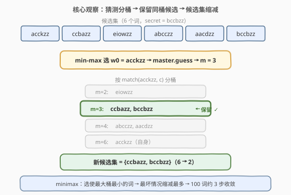
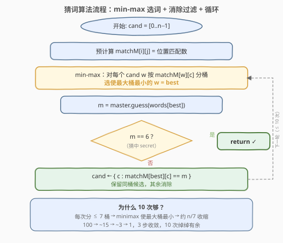
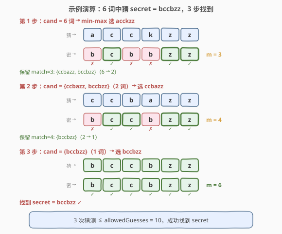

# LeetCode 猜猜这个单词 题解

## 1. 题目概述

- **标题 / 题号**：猜猜这个单词（#843，hard）
- **链接**：https://leetcode.cn/problems/guess-the-word/
- **难度**：困难
- **标签**：交互题、minimax、消除法、字符串

**题意**：给定一个由**不同**字符串组成的单词列表 `words`，每个单词长度均为 6，其中一个被选作**秘密单词** `secret`。你拥有一个辅助对象 `Master`，可以调用 `Master.guess(word)` 来猜单词：

- 若 `word` 不是 `words` 中的字符串，返回 `-1`；
- 否则返回一个整数，表示 `word` 与 `secret` 的**准确匹配数**（值和位置同时匹配的位置个数）。

你最多可以调用 `Master.guess` 共 `allowedGuesses` 次（$10 \le \text{allowedGuesses} \le 30$）。在不超过允许次数的前提下猜出 `secret` 即为成功。

**匹配数定义**：对于两个长度为 6 的字符串 $w_1, w_2$，匹配数为

$$\text{match}(w_1, w_2) = \sum_{i=0}^{5} \mathbb{1}[w_1[i] = w_2[i]]$$

取值范围 $0 \sim 6$。`match == 6` 意味着两串完全相同。

**示例 1**：

```text
输入：secret = "acckzz", words = ["acckzz","ccbazz","eiowzz","abcczz"], allowedGuesses = 10
输出：You guessed the secret word correctly.
解释：master.guess("acckzz") 返回 6（完全匹配），1 次猜中。
```

**示例 2**：

```text
输入：secret = "hamada", words = ["hamada","khaled"], allowedGuesses = 10
输出：You guessed the secret word correctly.
解释：2 个单词中必有一个是 secret，最多 2 次猜中。
```

**约束**：

- $1 \le \text{words.length} \le 100$
- $\text{words}[i].\text{length} == 6$
- `words[i]` 仅由小写英文字母组成
- `words` 中所有字符串互不相同
- `secret` 存在于 `words` 中
- $10 \le \text{allowedGuesses} \le 30$

> 💡 本题是一道**交互式**问题，核心不是"猜"而是**消除**——每次猜测的返回值将候选集分成若干"桶"，只有与返回值同桶的候选才可能是 secret。用 minimax 策略选词，使最坏情况下桶尽可能小，就能在有限次数内收敛。

## 2. 解题思路

### 2.1 暴力思路：逐个枚举

最朴素的想法是按顺序逐个猜：猜 `words[0]`、`words[1]`、…，直到猜中。但 `words.length` 可达 100，而 `allowedGuesses` 最低只有 10，逐个枚举在最坏情况下需要 100 次猜测，远超限制。

关键在于：**每次猜测返回的匹配数蕴含了大量信息**，暴力枚举完全浪费了这些信息。

### 2.2 核心观察：消除法 + Minimax 选词



**核心洞察**：猜测词 $w$ 并得到匹配数 $m$ 后，`secret` 必定满足 $\text{match}(w, \text{secret}) = m$。因此，所有不满足此条件的候选词都可以**消除**——它们不可能是 `secret`。

形式化地，设当前候选集为 $C$，猜测 $w$ 后得到 $m$：

$$C_{\text{new}} = \{c \in C : \text{match}(w, c) = m\}$$

候选集从 $|C|$ 缩减到 $|C_{\text{new}}|$，缩减幅度取决于 $w$ 的选择。

**Minimax 选词策略**：对所有候选 $w$，按 $\text{match}(w, c)$ 将 $C$ 分桶。最坏情况下，`secret` 落在最大的桶里，因此选择使最大桶最小的 $w$：

$$w^* = \arg\min_{w \in C} \max_{m=0}^{6} \left| \{c \in C : \text{match}(w, c) = m\} \right|$$

> 💡 **为什么 minimax 有效？** 匹配数有 $0 \sim 6$ 共 7 种可能，因此每次猜测将候选集最多分成 7 桶。Minimax 保证最大桶尽可能小，即最坏情况下候选集缩减最多。对于 $n = 100$，最优分桶后最大桶约 $100/7 \approx 15$，再一轮约 $15/7 \approx 2$，3 轮即可收敛到 1。`allowedGuesses ≥ 10` 提供了充足的安全裕度。

**算法步骤**：

1. **预计算匹配矩阵**：`matchM[i][j] = match(words[i], words[j])`，避免重复计算。
2. **初始化候选集**：`cand = [0, 1, ..., n-1]`（所有词的下标）。
3. **循环（最多 10 次）**：
   - 用 minimax 从 `cand` 中选出 `best`。
   - 调用 `m = master.guess(words[best])`。
   - 若 `m == 6`，找到 secret，返回。
   - 否则，过滤：`cand = {c : matchM[best][c] == m}`。
4. 若循环结束仍未找到（题目保证不会发生），函数返回。

> ⚠️ **为什么从候选集中选词而非全部 `words`？** 从候选集选词有两个优势：① 若选中的词恰好是 secret，直接猜中（`m=6`），省一轮；② 候选集中的词与当前约束一致，分桶更有针对性。候选集外已被排除的词不可能是 secret，猜它只是浪费一次机会。

### 2.3 算法流程图



**完整步骤**：

1. **预计算** `matchM`：$O(n^2)$ 时间，$O(n^2)$ 空间。
2. **minimax 选词**：遍历每个候选 $w$，对每个候选 $c$ 查 `matchM[w][c]` 统计 7 个桶的大小，取最大桶；选最大桶最小的 $w$。$O(|C|^2)$ 每轮。
3. **猜测并过滤**：调用 `master.guess`，按返回值过滤候选集。$O(|C|)$。
4. **循环**：最多 10 轮，每轮候选集显著缩减。

### 2.4 示例演算

以 6 个词为例（自定义示例，展示多步消除过程）：

```text
words = ["acckzz", "ccbazz", "eiowzz", "abcczz", "aacdzz", "bccbzz"]
secret = "bccbzz", allowedGuesses = 10
```



**第 1 步**：`cand = {w0..w5}`（6 词）

Minimax 分析——对每个候选 $w$，计算按 $\text{match}(w, c)$ 分桶后的最大桶：

| 猜测词 | 分桶（match → 词数） | 最大桶 |
|--------|----------------------|--------|
| w0 acckzz | {2:1, 3:2, 4:2, 6:1} | **2** |
| w1 ccbazz | {2:3, 3:1, 4:1, 6:1} | 3 |
| w2 eiowzz | {2:5, 6:1} | 5 |
| w3 abcczz | {2:2, 3:2, 4:2, 6:1} | 2 |
| w4 aacdzz | {2:2, 3:1, 4:2, 6:1} | 2 |
| w5 bccbzz | {2:1, 3:3, 4:1, 6:1} | 3 |

w0、w3、w4 并列最优（最大桶 = 2），选 w0 = "acckzz"。

`master.guess("acckzz")` → $m = \text{match}(\text{"acckzz"}, \text{"bccbzz"}) = 3$（位置 1、4、5 匹配：c=c、z=z、z=z）。

过滤：保留 $\text{match}(w0, c) == 3$ 的候选 → `{ccbazz, bccbzz}`（$6 \to 2$）。

**第 2 步**：`cand = {w1, w5}`（2 词）

候选数 $\le 2$ 时直接选第一个。猜 w1 = "ccbazz"。

`master.guess("ccbazz")` → $m = \text{match}(\text{"ccbazz"}, \text{"bccbzz"}) = 4$（位置 1、2、4、5 匹配：c=c、b=b、z=z、z=z）。

过滤：保留 $\text{match}(w1, c) == 4$ → `{bccbzz}`（$2 \to 1$）。

**第 3 步**：`cand = {w5}`（1 词）

猜 w5 = "bccbzz" → $m = 6$ → **找到 secret！**

3 次猜测 $\le 10$，成功。

> 💡 **候选数 ≤ 2 时为何直接选第一个？** 两个候选中必有一个是 secret（若上一轮过滤正确）。选任意一个：若猜中则结束（$m=6$），若猜错则 $m$ 恰好区分两者，下一轮只剩 1 个候选。两种情况都至多再需 1 次猜测，无需 minimax。

## 3. 参考代码

### C++

```cpp
/**
 * // This is the Master's API interface.
 * // You should not implement it, or speculate about its implementation
 * class Master {
 *   public:
 *     int guess(string word);
 * };
 */
class Solution {
public:
    void findSecretWord(vector<string>& words, Master& master) {
        int n = words.size();
        vector<vector<int>> matchM(n, vector<int>(n, 0));
        for (int i = 0; i < n; ++i)
            for (int j = 0; j < n; ++j)
                matchM[i][j] = match(words[i], words[j]);

        vector<int> cand(n);
        for (int i = 0; i < n; ++i) cand[i] = i;

        for (int g = 0; g < 10 && !cand.empty(); ++g) {
            int best = pickBest(cand, matchM);
            int m = master.guess(words[best]);
            if (m == 6) return;
            vector<int> next;
            for (int c : cand)
                if (matchM[best][c] == m) next.push_back(c);
            cand = move(next);
        }
    }

private:
    static int match(const string& a, const string& b) {
        int cnt = 0;
        for (int i = 0; i < 6; ++i)
            cnt += (a[i] == b[i]);
        return cnt;
    }

    int pickBest(const vector<int>& cand, const vector<vector<int>>& matchM) {
        if (cand.size() <= 2) return cand[0];
        int best = cand[0], minMax = cand.size();
        for (int w : cand) {
            int groups[7] = {};
            for (int c : cand) groups[matchM[w][c]]++;
            int mx = 0;
            for (int k = 0; k < 7; ++k)
                if (groups[k] > mx) mx = groups[k];
            if (mx < minMax) { minMax = mx; best = w; }
        }
        return best;
    }
};
```

### Python

```python
# """
# This is Master's API interface.
# You should not implement it, or speculate about its implementation
# """
# class Master:
#     def guess(self, word: str) -> int:

class Solution:
    def findSecretWord(self, words: List[str], master: 'Master') -> None:
        n = len(words)
        matchM = [[0] * n for _ in range(n)]
        for i in range(n):
            for j in range(n):
                matchM[i][j] = sum(a == b for a, b in zip(words[i], words[j]))

        cand = list(range(n))
        for _ in range(10):
            if not cand:
                break
            best = self._pickBest(cand, matchM)
            m = master.guess(words[best])
            if m == 6:
                return
            cand = [c for c in cand if matchM[best][c] == m]

    def _pickBest(self, cand: List[int], matchM: List[List[int]]) -> int:
        if len(cand) <= 2:
            return cand[0]
        best, min_max = cand[0], len(cand)
        for w in cand:
            groups = [0] * 7
            for c in cand:
                groups[matchM[w][c]] += 1
            mx = max(groups)
            if mx < min_max:
                min_max = mx
                best = w
        return best
```

> 💡 **实现要点**：① 预计算 `matchM` 避免每轮重复调用 `match`，$O(n^2)$ 空间换时间；② `pickBest` 中候选数 $\le 2$ 时直接返回第一个，因为两个候选中必有一个是 secret，选哪个都至多再需 1 次；③ 过滤条件 `matchM[best][c] == m` 中，`best` 自身的 `match` 值为 6，因此当 $m \ne 6$ 时 `best` 自动被排除，候选集必定缩减。

## 4. 复杂度分析

| 维度 | 复杂度 | 说明 |
|------|--------|------|
| **时间复杂度** | $O(g \cdot n^2)$ | 预计算匹配矩阵 $O(n^2)$；每轮 minimax 选词 $O(\lvert C\rvert^2)$、过滤 $O(\lvert C\rvert)$；共 $g \le 10$ 轮，$n \le 100$ 时约 $10^5$ 量级 |
| **空间复杂度** | $O(n^2)$ | 匹配矩阵 `matchM` 为 $n \times n$；候选集 $O(n)$ |

> 💡 由于 $g \le 10$ 和 $n \le 100$ 均为常数级，实际运算量约 $10^5$，远低于时间限制。若不预计算矩阵而在每轮即时计算 `match`（$O(1)$ 每次因 $L=6$），复杂度量级不变，但预计算避免了重复计算更高效。

## 5. 扩展：信息论下界与策略对比

### 5.1 信息论下界

每次猜测返回 $0 \sim 6$ 之一，共 7 种结果，提供 $\log_2 7 \approx 2.81$ 比特信息。要从 $n$ 个候选中区分出 secret，需要至少 $\lceil \log_7 n \rceil$ 次猜测：

$$\text{下界} = \left\lceil \log_7 n \right\rceil$$

| $n$ | 下界（次） | allowedGuesses | 裕度 |
|-----|-----------|----------------|------|
| 10 | 2 | 10 | 5× |
| 50 | 3 | 10 | 3.3× |
| 100 | 3 | 10 | 3.3× |

$n = 100$ 时下界仅 3 次，`allowedGuesses ≥ 10` 提供了 3 倍以上的安全裕度。这是题目保证"合理策略必能猜中"的理论基础。

### 5.2 更简单的策略：随机/顺序选词

不使用 minimax，直接从候选集中任选一个（如第一个）也能通过大部分测试用例。原因在于：

- 每次过滤必定缩减候选集（`best` 自身被排除）；
- 6 字符随机词的匹配数分布较分散，顺序选词通常也能有效缩减。

但 minimax 的优势在于**最坏情况保证**：它确保每轮的最大桶尽可能小，避免极端情况下候选集缩减过慢导致超限。面试中推荐 minimax 策略，体现对决策树优化的理解。

> ⚠️ **minimax 与 [375. 猜数字大小 II](../0301-0400/375_猜数字大小II.md) 的联系**：375 是在连续整数区间上用 minimax DP 求"最坏代价最小"的猜测策略，本质上与本题相同——都是"二十问"博弈的变体。区别在于 375 的代价是猜测值本身（猜 $k$ 付 $k$ 元），用区间 DP 求解；本题的代价是猜测次数，用贪心 + 消除求解。

## 6. 面试要点

1. **为什么不能暴力枚举？**

   > `words.length` 可达 100，而 `allowedGuesses` 最低 10。逐个枚举最坏需 100 次，远超限制。关键在于利用每次猜测返回的匹配数消除候选，而非盲目枚举。

2. **消除法的核心原理是什么？**

   > 猜测 $w$ 得到 $m$ 后，secret 必满足 $\text{match}(w, \text{secret}) = m$。所有 $\text{match}(w, c) \ne m$ 的候选 $c$ 都不可能是 secret，直接消除。候选集缩减为同桶候选，每轮显著减小。

3. **minimax 选词为什么比随机选词好？**

   > Minimax 选使最大桶最小的词，保证最坏情况下候选集缩减最多。随机选词可能在极端情况下命中大桶（如很多词 match=0），导致缩减缓慢。Minimax 提供了确定性的最坏情况保证，而随机策略依赖平均情况。

4. **为什么 10 次猜测一定够？**

   > 信息论下界：每次 7 种结果 → $\lceil \log_7 100 \rceil = 3$ 次即可区分 100 个候选。Minimax 进一步保证每轮最大桶约 $n/7$，3 轮收敛。`allowedGuesses ≥ 10` 提供了 3 倍裕度。

5. **预计算匹配矩阵的意义是什么？**

   > `matchM[i][j]` 预计算所有两两匹配数，避免每轮 minimax 选词时重复计算。空间 $O(n^2)$，但将每轮选词从 $O(|C|^2 \cdot L)$ 降到 $O(|C|^2)$（$L=6$ 为字符串长度）。$n \le 100$ 时矩阵仅 $10^4$ 个整数，开销可忽略。

> 💡 **一句话总结**：843 是"二十问"博弈的字符串变体——每次猜测将候选集按匹配数分桶，保留同桶候选即消除。Minimax 选词使最大桶最小，保证 3 步收敛，10 次绰绰有余。预计算匹配矩阵将每轮选词降到 $O(|C|^2)$。

## 同类练习题

| # | 题目 | 与本题的关联 |
|---|------|-------------|
| 375 | [猜数字大小 II](https://leetcode.cn/problems/guess-number-higher-or-lower-ii/)（[题解](../0301-0400/375_猜数字大小II.md)） | minimax DP 的经典题，在连续整数区间上求最坏代价最小的猜测策略，与本题共享"二十问"博弈框架 |
| 374 | [猜数字大小](https://leetcode.cn/problems/guess-number-higher-or-lower/)（[题解](../0301-0400/374_猜数字大小.md)） | 交互式猜数的简单版，二分查找即可，对比理解"连续值域二分"vs"离散词表消除"的差异 |
| 277 | [搜寻名人](https://leetcode.cn/problems/find-the-celebrity/)（[题解](../0201-0300/277_搜寻名人.md)） | 同样通过 API 调用逐个排除候选，两遍扫描消除法，O(n)/O(1)，与本题"每次调用消除一批候选"的范式一致 |
