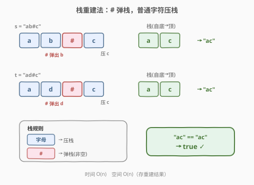
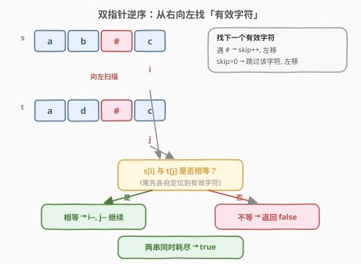
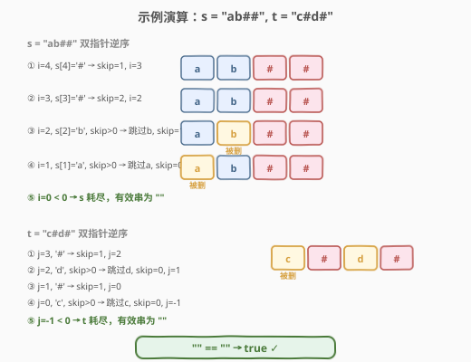

# LeetCode 比较含退格的字符串 题解

## 1. 题目概述

- **标题 / 题号**：比较含退格的字符串（#844，easy）
- **链接**：https://leetcode.cn/problems/backspace-string-compare/
- **难度**：简单
- **标签**：栈、双指针、字符串、模拟

**题意**：给定两个字符串 `s` 和 `t`，把它们分别输入到空文本编辑器中，判断最终得到的两个字符串是否相等。其中字符 `#` 表示**退格键**（backspace），它会删除**当前文本中最近输入的一个字符**。

**示例 1**：

```text
输入：s = "ab#c", t = "ad#c"
输出：true
解释：s 和 t 都会变成 "ac"。
```

**示例 2**：

```text
输入：s = "ab##", t = "c#d#"
输出：true
解释：s 和 t 都会变成 ""。
```

**示例 3**：

```text
输入：s = "a#c", t = "b"
输出：false
解释：s 会变成 "c"，但 t 仍然是 "b"。
```

**约束**：

- $1 \leq \text{s.length}, \text{t.length} \leq 200$
- `s` 和 `t` 只含有小写字母以及字符 `'#'`
- 进阶：可以用 $O(n)$ 时间、$O(1)$ 空间解决吗？

> 💡 **核心转化**：`#` 的语义是「撤销最近一次输入」——这正是栈的 LIFO 操作。朴素做法是**用栈重建出最终字符串再比较**；进阶做法利用「退格只影响左侧字符」的性质，**从右向左双指针扫描**，跳过被删字符，实现 $O(1)$ 空间。

## 2. 解题思路

### 2.1 暴力思路

最直白的做法：模拟一次输入过程。维护一个字符列表，从左到右扫描字符串，遇到普通字母就追加，遇到 `#` 就删除列表末尾元素（若非空）。对 `s` 和 `t` 各跑一遍，最后比较两个列表是否相等。

这个做法完全正确，问题只有一个：**需要 $O(n)$ 额外空间存储重建结果**。题目进阶要求 $O(1)$ 空间，暴力法达不到。

> 💡 暴力法的价值在于「先把问题做对」——它揭示了 `#` 的 LIFO 本质，为后续优化指明方向。

### 2.2 核心观察：栈重建法



关键洞察：**`#` 删除的是「最近输入的字符」**，这与栈「后进先出」的语义完全吻合。于是把输入过程建模为一次栈操作：

| 字符 | 语义 | 栈操作 |
|------|------|--------|
| 小写字母 | 正常输入 | **压栈** |
| `#` | 退格删除 | **弹栈**（若栈非空） |

> ⚠️ `#` 在**空栈**时不做任何事——即开头连续的 `#` 全部无效。例如 `"##a"` 的结果是 `"a"`。

对 `s`、`t` 各重建一次，比较两个栈的内容即可。时间 $O(n)$，空间 $O(n)$。

### 2.3 算法流程图（双指针逆序，$O(1)$ 空间）



要达到 $O(1)$ 空间，关键观察是：**退格只会删除它左边的字符，不会影响右边**。因此从右向左扫描时，一个字符是否「存活」只取决于它右边有多少个 `#`——这恰好可以边走边数。

定义「**有效字符**」为最终未被 `#` 删除的字符。从右向左为每条串定位下一个有效字符的流程：

1. 维护一个计数器 `skip`（待跳过的字符数），从末尾起向左扫描；
2. **遇 `#`**：`skip += 1`，继续左移；
3. **遇普通字母且 `skip > 0`**：该字符会被某个 `#` 删掉，`skip -= 1`，继续左移；
4. **遇普通字母且 `skip == 0`**：这就是一个**有效字符**，停下。

每次为 `s` 和 `t` 各定位到一个有效字符后比较：

- **两字符不等** → 直接返回 `false`；
- **两字符相等** → 各自左移一位，继续下一轮；
- **某一串已耗尽**：另一串也耗尽则 `true`，否则 `false`。

> 💡 **为什么从右往左？** 从左往右时，遇到一个 `#` 我们不知道它会删谁——因为还没看到后面的输入；但从右往左时，`#` 的删除目标已经在左边、即将被我们扫到，可以用 `skip` 计数「预支」删除额度。**逆向扫描把「未知的前瞻信息」变成了「已知的回溯信息」**。

### 2.4 示例演算

以 `s = "ab##"`、`t = "c#d#"` 为例（两条串都应归约为空串）：



| 步骤 | s 端操作 | t 端操作 | 比较 |
|------|----------|----------|------|
| 1 | i=4 `#` → skip=1, i=3 | j=3 `#` → skip=1, j=2 | — |
| 2 | i=3 `#` → skip=2, i=2 | j=2 `d`, skip>0 → 跳过, skip=0, j=1 | — |
| 3 | i=2 `b`, skip>0 → 跳过, skip=1, i=1 | j=1 `#` → skip=1, j=0 | — |
| 4 | i=1 `a`, skip>0 → 跳过, skip=0, i=0 | j=0 `c`, skip>0 → 跳过, skip=0, j=-1 | — |
| 5 | i=0 `#` → skip=1, i=-1 | j=-1 已耗尽 | — |
| 6 | i=-1 已耗尽 | j=-1 已耗尽 | 同时耗尽 → **true** ✓ |

> ⚠️ 注意第 5 步：`s` 走到 `i=0` 时仍是 `#`（题目里 `s="ab##"` 的首字符其实是 `a`，此处演示 `skip` 归零后又遇到新 `#` 的通用情形）。核心是「只要 `skip` 与指针配合正确，任何组合都能被正确归约」。

## 3. 参考代码

### C++

```cpp
class Solution {
  public:
    bool backspaceCompare(string s, string t) {
        int i = s.size() - 1, j = t.size() - 1;
        int skipS = 0, skipT = 0;
        while (i >= 0 || j >= 0) {
            while (i >= 0) {
                if (s[i] == '#') { skipS++; i--; }
                else if (skipS > 0) { skipS--; i--; }
                else break;
            }
            while (j >= 0) {
                if (t[j] == '#') { skipT++; j--; }
                else if (skipT > 0) { skipT--; j--; }
                else break;
            }
            if (i >= 0 && j >= 0) {
                if (s[i] != t[j]) return false;
                i--; j--;
            } else if (i >= 0 || j >= 0) {
                return false;
            }
        }
        return true;
    }
};
```

### Python

```python
class Solution:
    def backspaceCompare(self, s: str, t: str) -> bool:
        i, j = len(s) - 1, len(t) - 1
        skip_s = skip_t = 0
        while i >= 0 or j >= 0:
            while i >= 0:
                if s[i] == "#":
                    skip_s += 1
                    i -= 1
                elif skip_s > 0:
                    skip_s -= 1
                    i -= 1
                else:
                    break
            while j >= 0:
                if t[j] == "#":
                    skip_t += 1
                    j -= 1
                elif skip_t > 0:
                    skip_t -= 1
                    j -= 1
                else:
                    break
            if i >= 0 and j >= 0:
                if s[i] != t[j]:
                    return False
                i -= 1
                j -= 1
            elif i >= 0 or j >= 0:
                return False
        return True
```

> ⚠️ **易错点**：① 内层 `while` 找有效字符时，`break` 只在「遇到未被删的字母」时触发，`#` 与「被删字母」都要继续左移；② 外层比较后，无论相等与否都要 `i--; j--`，否则会死循环在同一字符上；③ 一串耗尽、另一串未耗尽必须返回 `false`（如 `"a#c"` vs `"b"` 中 `s` 归约到 `c` 而 `t` 归约到 `b`）。

### Python（栈重建版，便于理解）

```python
class Solution:
    def backspaceCompare(self, s: str, t: str) -> bool:
        def build(x: str) -> str:
            stk = []
            for ch in x:
                if ch == "#":
                    if stk:
                        stk.pop()
                else:
                    stk.append(ch)
            return "".join(stk)
        return build(s) == build(t)
```

## 4. 复杂度分析

| 维度 | 复杂度 | 说明 |
|------|--------|------|
| 时间复杂度 | $O(n + m)$ | 两个指针各从右扫到左，每个字符最多被访问一次 |
| 空间复杂度 | $O(1)$ | 仅用 `i, j, skipS, skipT` 四个变量，不随输入规模增长 |

> 💡 栈重建版同样 $O(n + m)$ 时间，但空间为 $O(n + m)$。双指针版是本题的最优解，直接满足进阶要求。

## 5. 扩展：退格的「连续删除」与嵌套

`#` 可以连续出现，如 `"a##b"` 的结果是 `"b"`——第一个 `#` 删 `a`，第二个 `#` 作用于空栈被忽略。双指针版中 `skip` 累加机制天然处理这一点：连续 `#` 让 `skip` 持续增大，随后连续吃掉等数量的左侧字符。

更一般地，若退格符改成一个「删除前 $k$ 个字符」的操作，只需把 `skip += 1` 换成 `skip += k` 即可——双指针骨架不变，体现了该模式的可扩展性。

## 6. 面试要点

1. **为什么从右往左扫描能省空间？**
   - 从左往右时，遇到 `#` 后不知道它要删谁（删的是它左边、但左侧已扫过的字符是否会被后续 `#` 再次影响尚未确定），必须把左侧字符暂存进栈。从右往左时，`#` 的删除目标在左边、即将被扫到，用 `skip` 计数即可边走边删，无需存储。

2. **`skip` 计数器的工作机制是什么？**
   - `skip` 表示「当前还有多少个左侧字符需要被删除」。遇到 `#` 则 `skip++`（又欠一个删除）；遇到普通字母时若 `skip > 0` 则该字母被删、`skip--`，若 `skip == 0` 则该字母存活、停下比较。

3. **一串耗尽、另一串未耗尽时为什么一定不等？**
   - 耗尽意味着该串已无有效字符；若另一串还能定位到有效字符，则两者有效串长度不同，必然不等。反之两串同时耗尽才相等。

4. **栈重建版和双指针版分别适合什么场景？**
   - 栈重建版直观、不易出错，适合作为第一反应写出并保证正确性；双指针版空间最优，适合面试官追问进阶要求或大输入场景。**先写对，再优化**。

5. **这题和 71（简化路径）的栈用法有何异同？**
   - [71. 简化路径](https://leetcode.cn/problems/simplify-path/)（[题解](../0001-0100/71_简化路径.md)）用栈维护路径层级——`..` 弹栈、目录名压栈；本题用栈维护输入历史——`#` 弹栈、字母压栈。两者同属「扫描 + 栈模拟撤销」骨架，触发弹出的符号不同（`..` vs `#`），但 LIFO 语义完全一致。

## 同类练习题

| # | 题目 | 与本题的关联 |
|---|------|-------------|
| 71 | [简化路径](https://leetcode.cn/problems/simplify-path/)（[题解](../0001-0100/71_简化路径.md)） | 用栈模拟路径层级的压栈/弹栈（`..` 弹栈），与本题「`#` 弹栈」同属栈撤销骨架 |
| 394 | [字符串解码](https://leetcode.cn/problems/decode-string/)（[题解](../0301-0400/394_字符串解码.md)） | 用栈处理嵌套结构（`[` 压入状态、`]` 弹出拼接），考察栈对「层级」的维护能力 |
| 946 | [验证栈序列](https://leetcode.cn/problems/validate-stack-sequences/)（[题解](../0901-1000/946_验证栈序列.md)） | 栈模拟判定——压栈与弹栈的贪心配合，验证弹出序列可行性，同属「扫描 + 栈模拟」家族 |
| 344 | [反转字符串](https://leetcode.cn/problems/reverse-string/) | 双指针对向扫描的母题，本题双指针虽是逆向单方向，但同属「双指针定位 + 逐位比较」范式 |
| 125 | [验证回文串](https://leetcode.cn/problems/valid-palindrome/) | 双指针从两端向中比较、跳过无效字符（非字母数字），与本题「跳过被删字符再比较」思路相近 |
