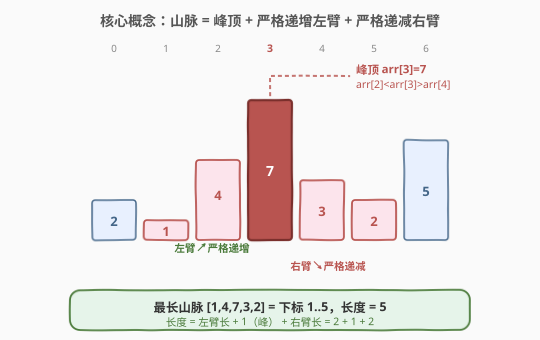
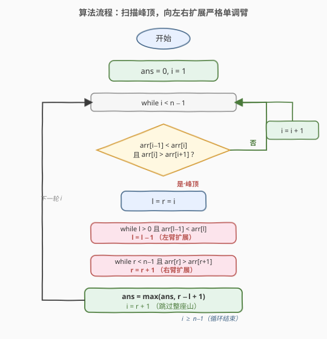

# LeetCode 数组中的最长山脉 题解

## 1. 题目概述

- **标题 / 题号**：数组中的最长山脉（#845，medium）
- **链接**：https://leetcode.cn/problems/longest-mountain-in-array/
- **难度**：中等
- **标签**：数组、双指针、一次遍历

**题意**：称数组 `arr` 的某个**连续子数组**为「山脉」，当且仅当：

- 子数组长度 $\ge 3$；
- 存在下标 $i$（子数组内部，$0 < i < \text{len}-1$）使得：
  - $i$ 左侧严格递增：$\text{arr}[\cdots] < \text{arr}[i-1] < \text{arr}[i]$
  - $i$ 右侧严格递减：$\text{arr}[i] > \text{arr}[i+1] > \cdots$

换言之，山脉形如 $\wedge$：先一路爬升到峰顶，再一路下降。要求返回 `arr` 中**最长山脉子数组的长度**；若不存在则返回 `0`。注意这里要找的是**子数组**（连续），且山脉的峰顶在子数组内部，不能落在端点。

**示例 1**：

```text
输入：arr = [2,1,4,7,3,2,5]
输出：5
解释：最长山脉为 [1,4,7,3,2]（下标 1..5），峰顶是 7。
```

**示例 2**：

```text
输入：arr = [2,2,2]
输出：0
解释：所有相邻元素相等，无法形成严格递增/递减，无山脉。
```

**约束**：

- `1 <= arr.length <= 10^4`
- `0 <= arr[i] <= 10^4`

> 💡 这是「一次遍历 + 双向扩展」的招牌题：每座山脉都有**唯一峰顶**——只要定位到峰顶（`arr[i-1] < arr[i] > arr[i+1]`），就能向左、向右各伸出一条严格单调臂，整座山的长度 $= (\text{左臂长}) + 1 + (\text{右臂长})$。一次扫描所有可能的峰顶即可，$O(n)$ 摊还时间、$O(1)$ 额外空间。

## 2. 解题思路

### 2.1 暴力思路：枚举所有子数组判定山脉

最直观的做法是枚举所有连续子数组 $[l, r]$（$r - l + 1 \ge 3$），对每个子数组检查它是否构成山脉：

```text
ans = 0
for l in range(n):
    for r in range(l + 2, n):
        if is_mountain(arr[l..r]):          # 需先找峰顶再判两侧严格单调
            ans = max(ans, r - l + 1)
return ans
```

`is_mountain` 本身要 $O(\text{len})$ 找峰顶并验证单调性。总复杂度 $O(n^3)$。对 $n = 10^4$ 约 $10^{12}$ 次操作，必然超时。更关键的是它**没有利用山脉的结构**——每座山只对应一个峰顶，枚举所有子数组会反复扫描同一段数据。

> ⚠️ 暴力法的问题在于：把「找山脉」当成「找满足某性质的任意子数组」来暴力枚举，忽视了山脉 $= \text{峰顶} + \text{左臂} + \text{右臂}$ 的固有结构。一旦锁定峰顶，山脉的范围就被两侧的严格单调性唯一确定了。

### 2.2 核心观察：定位峰顶 + 双向扩展

**关键定义**：山脉的**峰顶**是子数组内严格大于左右邻居的那个下标 $i$，即满足 $\text{arr}[i-1] < \text{arr}[i]$ 且 $\text{arr}[i] > \text{arr}[i+1]$。每座山脉有且仅有一个峰顶。

于是算法分两步：

1. **找峰顶**：扫描 $i = 1 \dots n-2$，判定 $\text{arr}[i-1] < \text{arr}[i] > \text{arr}[i+1]$。
2. **扩臂**：从峰顶 $i$ 出发，向左移动 `l` 只要 $\text{arr}[l-1] < \text{arr}[l]$（严格递增臂），向右移动 `r` 只要 $\text{arr}[r] > \text{arr}[r+1]$（严格递减臂）。山脉长度 $= r - l + 1$。



**为什么 $O(n)$？** 找到一座山并扩展后，令 `i = r + 1` 直接跳过整座山。每座山的左臂/右臂各被扫一次，之后 `i` 越过它们不再回访。每个下标至多被「主扫描」扫一次、被「臂扩展」扫一次，总工作量 $\le 2n$，即**摊还 $O(n)$**。

> 💡 **为什么峰顶条件要两侧同时严格？** 单侧 `arr[i-1] < arr[i]` 只能说明这里在爬升，可能是上坡中段而非峰；只有 `arr[i-1] < arr[i] > arr[i+1]` 同时成立，$i$ 才是真正的局部极大，才可能作为山脉的峰顶。两侧的「严格」要求也排除了平台（相等）——含平台的子数组不算山脉。

### 2.3 算法流程图



**完整步骤**：

1. **初始化**：`ans = 0`，`i = 1`（峰顶至少要有左右邻居，故从 1 开始）。
2. **扫描** `i` 从 $1$ 到 $n-2$（含）：
   - 若 $\text{arr}[i-1] < \text{arr}[i]$ 且 $\text{arr}[i] > \text{arr}[i+1]$（峰顶）：
     - 令 `l = r = i`。
     - 向左扩：`while l > 0 and arr[l-1] < arr[l]: l -= 1`。
     - 向右扩：`while r < n-1 and arr[r] > arr[r+1]: r += 1`。
     - `ans = max(ans, r - l + 1)`。
     - **跳过整座山**：`i = r + 1`（继续从右臂之外找下一座）。
   - 否则：`i += 1`（非峰，前进一格）。
3. **返回** `ans`。

> ⚠️ **两个易错点**：(1) 找到山脉后必须 `i = r + 1` 而非 `i += 1`——后者会反复进入同一座山的右臂内部重新判峰，虽不致错（内部点不满足峰顶条件会被跳过）但退化到 $O(n^2)$；(2) 扩臂条件是**严格**不等号 `arr[l-1] < arr[l]` / `arr[r] > arr[r+1]`，写成 `<=` 会把平台也算进山脉，违反题意。

### 2.4 示例演算

以示例 1 `arr = [2,1,4,7,3,2,5]`（$n = 7$）为例，主指针 `i` 从 1 出发，每次判定 `arr[i-1] < arr[i] > arr[i+1]`：

![示例演算：arr = [2,1,4,7,3,2,5]，i=3 命中峰顶，扩展得长度 5](../images/longest_mountain_example_walkthrough.svg)

逐轮解读：

| 轮次 | i | 判定 `arr[i−1]<arr[i]>arr[i+1]` | 动作 | ans |
|------|---|----------------------------------|------|-----|
| 1 | 1 | `2 < 1` ? 否 | 非峰，`i=2` | 0 |
| 2 | 2 | `1 < 4` ✓，但 `4 > 7` ? 否 | 非峰，`i=3` | 0 |
| 3 | 3 | `4 < 7` ✓ 且 `7 > 3` ✓ → **峰顶** | 左扩 `l:3→1`，右扩 `r:3→5`，`ans=5-1+1=5`，`i=r+1=6` | 5 |
| 4 | 6 | `i ≥ n-1 = 6` | 循环结束 | 5 |

最终 `ans = 5`，对应子数组 `[1,4,7,3,2]`。第 3 轮命中峰顶后 `i` 直接跳到 $6$，跳过了整座山，避免重复扫描。第 4 轮 $i = 6 = n-1$ 越界退出。

> 💡 **对比示例 2** `arr = [2,2,2]`：全程相邻元素相等，任何 $i$ 都不满足 `arr[i-1] < arr[i]`，每轮走 `i += 1` 分支，`ans` 始终为 `0`。可见山脉对「严格」的要求是关键——平台和相等都直接判负。

## 3. 参考代码

### C++

```cpp
class Solution {
public:
    int longestMountain(vector<int>& arr) {
        int n = arr.size();
        int ans = 0;
        for (int i = 1; i < n - 1; ) {
            if (arr[i - 1] < arr[i] && arr[i] > arr[i + 1]) {
                int l = i, r = i;
                while (l > 0 && arr[l - 1] < arr[l]) --l;   // 左臂严格递增
                while (r < n - 1 && arr[r] > arr[r + 1]) ++r; // 右臂严格递减
                ans = max(ans, r - l + 1);
                i = r + 1;                                   // 跳过整座山
            } else {
                ++i;                                         // 非峰，前进一格
            }
        }
        return ans;
    }
};
```

### Python

```python
class Solution:
    def longestMountain(self, arr: List[int]) -> int:
        n = len(arr)
        ans = 0
        i = 1
        while i < n - 1:
            if arr[i - 1] < arr[i] and arr[i] > arr[i + 1]:
                l = r = i
                while l > 0 and arr[l - 1] < arr[l]:
                    l -= 1                    # 左臂严格递增
                while r < n - 1 and arr[r] > arr[r + 1]:
                    r += 1                    # 右臂严格递减
                ans = max(ans, r - l + 1)
                i = r + 1                     # 跳过整座山
            else:
                i += 1                        # 非峰，前进一格
        return ans
```

> 💡 两版逻辑完全一致：先判峰顶三连不等，命中后双向扩臂取长度，并用 `i = r + 1` 跳过整座山保证摊还 $O(n)$。注意 C++ 版的 `for` 把 `i` 的自增留空（`for (int i = 1; i < n - 1; )`），因为自增逻辑在循环体内分两支处理——这是「跳过一段」型遍历的常见写法。

## 4. 复杂度分析

| 维度 | 复杂度 | 说明 |
|------|--------|------|
| **时间复杂度** | $O(n)$（摊还） | 每个下标至多被主扫描访问一次、被臂扩展访问一次；命中峰顶后 `i = r+1` 跳过整座山，臂内元素不再回访。总工作量 $\le 2n$ |
| **空间复杂度** | $O(1)$ | 仅 `i`、`l`、`r`、`ans` 等常数变量 |

> ⚠️ 若把 `i = r + 1` 误写成 `i += 1`，最坏情况（如多个相邻小山）仍正确但退化为 $O(n^2)$：每座山的右臂会被主扫描逐格重走。`i = r + 1` 是摊还 $O(n)$ 的关键。

## 5. 扩展：两趟 DP（前缀上升 + 后缀下降）

若不希望依赖摊还分析，可用 $O(n)$ 空间换一个**非摊还**的线性解：预处理每个位置的「左侧严格上升臂长」与「右侧严格下降臂长」，再在峰顶处合并。

定义：

- $\text{up}[i]$：以 $i$ 结尾的**严格递增**前缀长度（即 $i$ 作为峰顶时左臂能伸多长）。转移：$\text{up}[i] = \text{up}[i-1] + 1$ 若 $\text{arr}[i-1] < \text{arr}[i]$，否则 $\text{up}[i] = 0$。
- $\text{down}[i]$：以 $i$ 开头的**严格递减**后缀长度（$i$ 作为峰顶时右臂能伸多长）。转移：$\text{down}[i] = \text{down}[i+1] + 1$ 若 $\text{arr}[i] > \text{arr}[i+1]$，否则 $\text{down}[i] = 0$。

对每个 $i$，若 $\text{up}[i] > 0$ 且 $\text{down}[i] > 0$（即 $i$ 是真峰顶），山脉长度 $= \text{up}[i] + 1 + \text{down}[i]$。取最大值即可。

```python
class Solution:
    def longestMountain(self, arr: List[int]) -> int:
        n = len(arr)
        up = [0] * n
        for i in range(1, n):
            if arr[i - 1] < arr[i]:
                up[i] = up[i - 1] + 1
        down = [0] * n
        for i in range(n - 2, -1, -1):
            if arr[i] > arr[i + 1]:
                down[i] = down[i + 1] + 1
        ans = 0
        for i in range(n):
            if up[i] > 0 and down[i] > 0:
                ans = max(ans, up[i] + 1 + down[i])
        return ans
```

时间 $O(n)$、空间 $O(n)$。优势是「无摊还」、思路极度对称（正扫一次 + 反扫一次），与 [300. 最长递增子序列](https://leetcode.cn/problems/longest-increasing-subsequence/) 的 DP 思路同源。空间还可滚动优化为 $O(1)$，但可读性下降；面试中先给「峰顶扩展」版，再以本节 DP 作对照，覆盖面最佳。

> 💡 **两种解法的关系**：峰顶扩展法是「按需计算臂长」——只在命中峰顶时才向两侧探索；DP 法是「预计算臂长」——先把每个位置的左右臂长都算好，最后查表合并。前者省空间、后者无需摊还论证，各有取舍。

## 6. 面试要点

1. **为什么每座山脉有唯一峰顶？这如何决定算法？**

   - 山脉定义要求峰顶严格大于左右邻居，且左侧严格递增、右侧严格递减。严格的单调性保证峰顶唯一：若有两个局部极大，它们之间必先下降再上升，中间存在局部极小，那段区间无法同时满足两侧严格单调。因此「以峰顶为锚、向两侧扩展」能无遗漏、不重复地枚举所有山脉。

2. **为什么是摊还 $O(n)$ 而非 $O(n^2)$？**

   - 命中峰顶后执行 `i = r + 1`，主指针直接越过整座山的右臂。每个下标至多被「主扫描的 `arr[i-1]<arr[i]>arr[i+1]` 判定」访问一次，且至多被某座山的左臂或右臂扩展访问一次（扩展后即被 `i` 跳过）。两者合计 $\le 2n$，故摊还 $O(n)$。若误写 `i += 1` 则失去此保证。

3. **扩臂条件为什么必须用严格不等号？**

   - 山脉定义要求「严格」递增/递减。若用 `arr[l-1] <= arr[l]`，平台（相等段）会被纳入臂内，导致如 `[2,2,2]` 错误地得到非零长度。严格 `<` / `>` 在遇到相等时立即停止扩展，自然排除平台。

4. **边界 `i` 为什么从 1 扫到 `n-2`？**

   - 峰顶必须同时有左邻居和右邻居，下标 0 没有 `arr[i-1]`、下标 $n-1$ 没有 `arr[i+1]`，都不可能成为峰顶。循环范围 $[1, n-2]$ 覆盖所有合法峰顶候选。当 $n < 3$ 时区间为空，直接返回 `ans = 0`，符合题意。

5. **相邻两座山能否共享端点？本算法如何处理？**

   - 可以。如 `[1,2,1,2,1]` 有两座长度 3 的山，分别占下标 `0..2` 与 `2..4`，共享下标 2（前山的右臂末端 = 后山的左臂起点）。本算法处理第一座山时 `r` 停在 2，`i = r+1 = 3` 从下标 3 继续找峰——下标 3 正是第二座山的峰顶。共享点作为「前山末端」被右臂扩展访问、作为「后山起点」不会被重复计入前山长度，结果正确。

> 💡 **一句话总结**：845 是「局部极大 + 双向扩臂」的模板题——扫到 `arr[i-1] < arr[i] > arr[i+1]` 即锁定峰顶，向左/右各伸严格单调臂，`i = r+1` 跳过整座山。摊还 $O(n)$ / $O(1)$，关键在峰顶三连判与扩臂严格性。

## 同类练习题

| # | 题目 | 与本题的关联 |
|---|------|-------------|
| 845 | [数组中的最长山脉](https://leetcode.cn/problems/longest-mountain-in-array/)（本题） | 峰顶锚定 + 双向扩臂 |
| 162 | [寻找峰值](https://leetcode.cn/problems/find-peak-element/) | 同样找局部极大 `arr[i-1] < arr[i] > arr[i+1]`，但任意一峰即可，可二分加速到 $O(\log n)$ |
| 852 | [山脉数组的峰顶索引](https://leetcode.cn/problems/peak-index-in-a-mountain-array/) | 整个数组就是一座山，二分找唯一峰顶，是 845「单山」退化版 |
| 941 | [有效的山脉数组](https://leetcode.cn/problems/valid-mountain-array/) | 判定整个数组是否构成一座山（布尔判定 vs 845 的最长长度），同套峰顶扩展模板 |
| 485 | [最大连续 1 的个数](https://leetcode.cn/problems/max-consecutive-ones/) | 求最长满足谓词的连续段，与 845 求「最长山脉段」同属「最长连续子段」家族，对照单向扫描与双向扩臂 |
