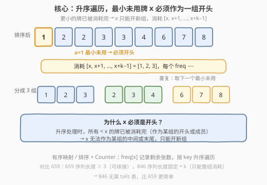
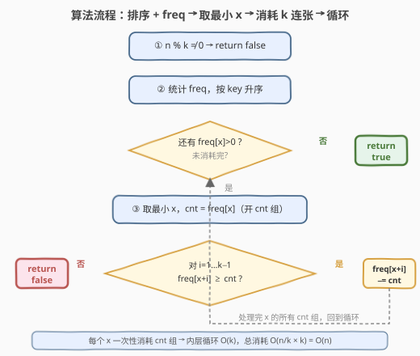
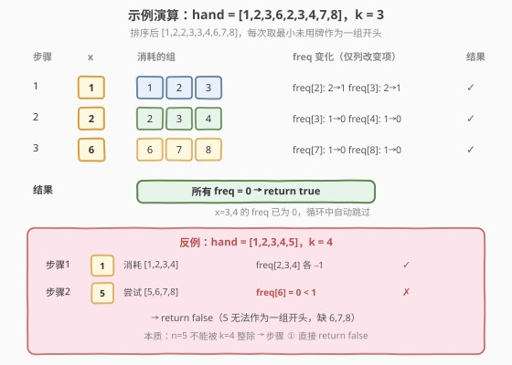

# LeetCode 一手顺子 题解

## 1. 题目概述

- **标题 / 题号**：一手顺子（#846，medium）
- **链接**：https://leetcode.cn/problems/hand-of-straights/
- **难度**：中等
- **标签**：贪心、数组、哈希表、排序

**题意**：Alice 手中有一把牌，给定整数数组 `hand`（`hand[i]` 是第 $i$ 张牌上的数值）和整数 `groupSize`。判断是否可以将这些牌重新排列成若干组，使得：

1. 每组恰好 `groupSize` 张牌；
2. 每组由 `groupSize` 张**连续**的牌组成（相邻差为 1）。

每张牌恰好归入一组，不可重复使用。可以则返回 `true`，否则 `false`。

**示例 1**：

```text
输入：hand = [1,2,3,6,2,3,4,7,8], groupSize = 3
输出：true
解释：可重排为 [1,2,3]、[2,3,4]、[6,7,8] 三组，每组 3 张连续牌。
```

**示例 2**：

```text
输入：hand = [1,2,3,4,5], groupSize = 4
输出：false
解释：5 张牌无法分成若干 4 张一组的顺子（5 不能被 4 整除）。
```

**约束**：

- $1 \le \text{hand.length} \le 10^4$
- $0 \le \text{hand[i]} \le 10^9$
- $1 \le \text{groupSize} \le \text{hand.length}$

> 💡 本题与 [1296. 划分数组为连续数字的集合](https://leetcode.cn/problems/divide-array-in-sets-of-k-consecutive-numbers/) **完全相同**。也与 [659. 分割数组为连续子序列](../0601-0700/659_分割数组为连续子序列.md) 高度相似——区别在于 659 的序列长度 $\ge 3$（可续接已有序列），而 846 的序列长度**固定** $= \text{groupSize}$（只能整组消耗，无续接概念），因此贪心策略更简单：无需 `tails` 表，只需一个 `freq` 计数。

## 2. 解题思路

### 2.1 暴力思路：回溯枚举每种分组

最直接的做法是：对每张牌尝试把它放入已有分组或新建分组，递归搜索所有方案。最坏情况每张牌有 $O(g)$ 种选择（$g$ 为当前分组数），总复杂度可达 $O(g^n)$，$n=10^4$ 时完全不可行。

> ⚠️ 暴力法的瓶颈在于「关心每条分组的具体身份」。但本题只问**能否**分组，不关心具体分法。破局思路：**只统计每个数值的剩余张数**，按升序处理，用贪心一次性消耗整组。

### 2.2 核心观察：排序 + 贪心（最小牌必须作为一组开头）



**关键转换**：用一张哈希表 `freq` 维护每个数值的剩余张数，按数值升序遍历。

**贪心策略**——对每个剩余张数 `cnt > 0` 的数值 `x`（升序）：

1. **x 必须作为一组开头**：因为升序处理时，所有 $< x$ 的牌已被消耗完（作为某组的开头或成员），$x$ 不可能是某组的中间或末尾。
2. **整组消耗**：以 $x$ 开头，需要 $[x, x+1, x+2, \ldots, x+k-1]$ 各 `cnt` 张。对 $i = 1, \ldots, k-1$，检查 $\text{freq}[x+i] \ge \text{cnt}$，不足则返回 `false`；满足则 $\text{freq}[x+i] -= \text{cnt}$。
3. 全部处理完返回 `true`。

> 💡 **为什么 x 必须是开头？** 升序遍历到 $x$ 时，所有 $< x$ 的数值已处理完毕。若 $x$ 是某组的第 $j$ 个成员（$j > 1$），则该组开头为 $x - j + 1 < x$，在处理 $x - j + 1$ 时就已消耗了 $x$ 的份额。因此 $x$ 剩余的 `cnt` 张**只能**作为新组的开头，没有其他选择。这正是本题比 659 更简单的原因——659 中序列长度可变（$\ge 3$），$x$ 可能续接到已有序列末尾；846 中序列长度固定 $= k$，$x$ 只能开头。

**提前剪枝**：若 $n \bmod k \ne 0$，直接返回 `false`——牌总数不能被组大小整除时，物理上不可能完成分组。

### 2.3 算法流程图



**完整步骤**：

1. **整除检查**：若 $\text{hand.length} \bmod k \ne 0$，返回 `false`。
2. **统计频率**：遍历 `hand`，建立 `freq` 哈希表（C++ 用 `map` 有序映射，Python 用 `Counter` + `sorted`）。
3. **升序遍历**：对每个数值 $x$（升序），令 $\text{cnt} = \text{freq}[x]$：
   - 若 $\text{cnt} == 0$：已被前面消耗，跳过。
   - 对 $i = 1, \ldots, k-1$：若 $\text{freq}[x+i] < \text{cnt}$，返回 `false`；否则 $\text{freq}[x+i] -= \text{cnt}$。
4. 全部处理完返回 `true`。

> ⚠️ **`cnt` 的含义**：处理 $x$ 时，`cnt` 是 $x$ 的剩余张数，表示需要开 `cnt` 个以 $x$ 为开头的组。每个组需要一张 $x+1$、一张 $x+2$、…、一张 $x+k-1$，所以共需 `cnt` 张每个后续值。这就是为什么内层检查是 $\text{freq}[x+i] \ge \text{cnt}$ 而非 $\ge 1$，减的也是 `cnt` 而非 `1`——一次性消耗 `cnt` 组。

### 2.4 示例演算

以 `hand = [1,2,3,6,2,3,4,7,8]`，`k = 3` 为例（对应示例 1）：



**初始 freq**：`{1:1, 2:2, 3:2, 4:1, 6:1, 7:1, 8:1}`

| 步骤 | x | cnt | 消耗的组 | freq 变化 | 结果 |
|------|---|-----|----------|-----------|------|
| 1 | 1 | 1 | [1, 2, 3] | freq[2]: 2→1, freq[3]: 2→1 | ✓ |
| 2 | 2 | 1 | [2, 3, 4] | freq[3]: 1→0, freq[4]: 1→0 | ✓ |
| 3 | 3 | 0 | —（跳过） | — | — |
| 4 | 4 | 0 | —（跳过） | — | — |
| 5 | 6 | 1 | [6, 7, 8] | freq[7]: 1→0, freq[8]: 1→0 | ✓ |

**最终**：所有 freq $= 0$，返回 `true`。三组 `[1,2,3]`、`[2,3,4]`、`[6,7,8]`。

> 💡 **步骤 2 的关键**：处理 $x=2$ 时，`cnt=1`（原始 2 张，被步骤 1 消耗了 1 张）。需要 `freq[3] >= 1`（刚好 1）和 `freq[4] >= 1`（刚好 1），恰好满足。若 $x=2$ 时 `freq[3]` 不足，说明 3 的数量不够支撑以 2 开头的组，直接 `false`。

**反例**（`hand = [1,2,3,4,5]`，`k = 4`）：$n=5$ 不能被 $k=4$ 整除，步骤 ① 直接返回 `false`。即使不提前剪枝，处理 $x=1$ 消耗 `[1,2,3,4]` 后，$x=5$ 需要开组 `[5,6,7,8]`，但 `freq[6]=0 < 1`，同样返回 `false`。

## 3. 参考代码

### C++

```cpp
class Solution {
public:
    bool isNStraightHand(vector<int>& hand, int groupSize) {
        int n = hand.size();
        if (n % groupSize != 0) return false;

        map<int, int> freq;                 // 有序映射，key 升序
        for (int card : hand) freq[card]++;

        for (auto& [x, cnt] : freq) {
            if (cnt == 0) continue;
            for (int i = 1; i < groupSize; ++i) {
                if (freq[x + i] < cnt) return false;
                freq[x + i] -= cnt;
            }
        }
        return true;
    }
};
```

### Python

```python
class Solution:
    def isNStraightHand(self, hand: List[int], groupSize: int) -> bool:
        if len(hand) % groupSize != 0:
            return False

        from collections import Counter
        freq = Counter(hand)

        for x in sorted(freq):
            cnt = freq[x]
            if cnt == 0:
                continue
            for i in range(1, groupSize):
                if freq[x + i] < cnt:
                    return False
                freq[x + i] -= cnt
        return True
```

> 💡 **实现要点**：① C++ 用 `map`（红黑树，key 自动升序），Python 用 `Counter` + `sorted(freq)` 保证升序遍历。② `freq[x+i]` 在 C++ `map` 中不存在时自动插入为 0，`0 < cnt` 自然触发 `false`；Python `Counter` 同理返回 0。③ `cnt` 是 $x$ 的当前剩余张数，一次消耗 `cnt` 组，内层循环固定 $O(k)$。

## 4. 复杂度分析

| 维度 | 复杂度 | 说明 |
|------|--------|------|
| **时间复杂度** | $O(n \log n)$ | 统计 freq $O(n)$ + 有序映射构建 $O(n \log n)$（或排序 $O(n \log n)$）+ 遍历消耗 $O(n)$（每个元素恰好被消耗一次，内层 $O(k)$ 但 $\sum \text{cnt} \times k = n$） |
| **空间复杂度** | $O(n)$ | `freq` 哈希表/有序映射，最坏存 $O(n)$ 个不同数值 |

> 💡 **为什么遍历消耗是 $O(n)$ 而非 $O(n \cdot k)$？** 虽然对每个 $x$ 的内层循环是 $O(k)$，但每次消耗 `cnt` 组意味着消耗了 `cnt` 张 $x$、`cnt` 张 $x+1$、…、`cnt` 张 $x+k-1$，共计 $\text{cnt} \times k$ 张牌。所有步骤的 $\sum \text{cnt} \times k = n$（每张牌恰好被消耗一次），因此内层循环总迭代数为 $n / k \times k = n$ 量级。$k$ 最大为 $n$（一组消耗所有牌，一次内层循环），最小时为 1（退化），总消耗始终 $\le n$。

## 5. 扩展：与 659 的对比

本题与 [659. 分割数组为连续子序列](../0601-0700/659_分割数组为连续子序列.md) 是同一套路的两道招牌题，核心差异在于**序列长度是否固定**：

| 维度 | 846 一手顺子 | 659 分割数组为连续子序列 |
|------|-------------|------------------------|
| **序列长度** | 固定 $= k$ | $\ge 3$（可变长） |
| **贪心决策** | $x$ 只能开新组，整组消耗 $[x, \ldots, x+k-1]$ | $x$ 优先续接到已有序列，否则新建 $[x, x+1, x+2]$ |
| **所需哈希表** | 仅 `freq`（1 张表） | `freq` + `tails`（2 张表） |
| **续接概念** | 无（长度固定，无法续接） | 有（`tails[x-1]` 记录等待 $x$ 的序列数） |
| **复杂度** | $O(n \log n)$ | $O(n)$（输入已排序时） |
| **难度** | 更简单 | 需交换论证证明续接优先 |

> 💡 **从 659 到 846 的简化路径**：659 需要 `tails` 表是因为序列长度可变——$x$ 可能续接到某条以 $x-1$ 结尾的序列使其更长。846 中每组长度固定 $= k$，$x$ 只能是某组的第 1 个元素（因为第 $j$ 个元素 $j > 1$ 的组已在处理 $x-j+1$ 时完成），所以不需要续接逻辑，`tails` 表自然消失。这是「固定长度约束简化贪心决策」的典型体现。

**另一种实现：排序数组遍历**

除有序映射外，也可直接排序 `hand` 数组后遍历，对每个 `freq[x] > 0` 的 $x$ 消耗一组：

```python
def isNStraightHand(self, hand, groupSize):
    if len(hand) % groupSize != 0:
        return False
    freq = Counter(hand)
    for x in sorted(hand):              # 遍历排序后的原数组
        if freq[x] == 0:
            continue
        for i in range(groupSize):
            if freq[x + i] == 0:
                return False
            freq[x + i] -= 1
    return True
```

这种写法每次只消耗 1 组（内层 `freq[x+i] -= 1`），遇到同一 $x$ 的多张牌时重复进入循环。与有序映射版本「一次消耗 `cnt` 组」等价，但写法更直观。两种实现复杂度相同，均为 $O(n \log n)$。

## 6. 面试要点

1. **为什么最小牌 x 必须作为一组开头？**

   > 升序处理到 $x$ 时，所有 $< x$ 的数值已被处理完毕。若 $x$ 是某组的第 $j$ 个成员（$j > 1$），该组开头 $x - j + 1 < x$ 在之前处理时已消耗了 $x$ 的份额。因此 $x$ 剩余的张数只能用于开新组，没有其他归属选择。

2. **与 659 的核心区别是什么？**

   > 659 的序列长度 $\ge 3$（可变长），$x$ 可以续接到已有序列末尾（`tails[x-1] > 0` 时续接），因此需要 `freq` + `tails` 两张表和「续接优先」的贪心策略。846 的序列长度固定 $= k$，$x$ 只能作为开头整组消耗，无需续接，因此只需 `freq` 一张表，逻辑更简单。

3. **`cnt` 的含义是什么？为什么内层减 `cnt` 而非 1？**

   > `cnt = freq[x]` 是 $x$ 的剩余张数，表示需要开 `cnt` 个以 $x$ 开头的组。每组各需 1 张 $x+1, \ldots, x+k-1$，所以共需 `cnt` 张每个后续值。内层检查 `freq[x+i] >= cnt` 并 `freq[x+i] -= cnt`，一次性消耗 `cnt` 组，避免对同一 $x$ 重复进入外层循环。

4. **提前剪枝 `n % k != 0` 有什么作用？**

   > 物理上，$n$ 张牌分成若干 $k$ 张一组，必须 $n \bmod k = 0$。这个 $O(1)$ 检查能在不可行实例上直接返回 `false`，避免无意义的排序和遍历。示例 2 的 `hand = [1,2,3,4,5], k = 4` 即被此剪枝拦截。

5. **如果输入无序怎么做？**

   > C++ 用 `map`（红黑树）天然保证 key 升序；Python 用 `Counter` + `sorted(freq)` 排序 key。也可直接 `sort(hand)` 后遍历原数组，遇到 `freq[x] == 0` 跳过。两种方式都需要 $O(n \log n)$ 排序开销。

> 💡 **一句话总结**：846 是「排序 + 贪心」的招牌题——升序遍历 freq，最小未用牌 $x$ 必须作为一组开头，一次性消耗 $[x, \ldots, x+k-1]$ 各 `cnt` 张。与 659 共享「连续序列分组」骨架，但因序列长度固定而更简单——无需 `tails` 表和续接逻辑，一个 `freq` 计数即可。

## 同类练习题

| # | 题目 | 与本题的关联 |
|---|------|-------------|
| 659 | [分割数组为连续子序列](https://leetcode.cn/problems/split-array-into-consecutive-subsequences/)（[题解](../0601-0700/659_分割数组为连续子序列.md)） | 变长版（序列 $\ge 3$，可续接），需 `freq` + `tails` 两表与续接优先贪心，846 是其定长简化版 |
| 1296 | [划分数组为连续数字的集合](https://leetcode.cn/problems/divide-array-in-sets-of-k-consecutive-numbers/) | 与 846 完全相同，划成长度 $k$ 的连续集合，贪心 + TreeMap 模板 |
| 621 | [任务调度器](https://leetcode.cn/problems/task-scheduler/) | 贪心 + 计数，先安排高频任务填充冷却期，与本题「优先满足最紧迫需求」的贪心直觉相通 |
| 358 | [K 距离间隔重排字符串](https://leetcode.cn/problems/rearrange-string-k-distance-apart/)（Premium） | 贪心 + 哈希 + 堆，按频率间隔放置字符，与本题贪心调度思想一脉相承 |
