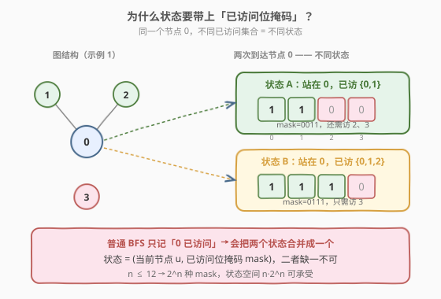
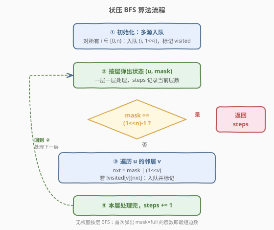
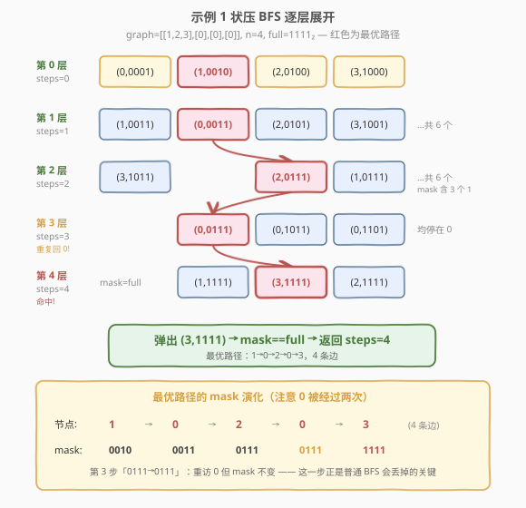

# 访问所有节点的最短路径

- **题目名称**：访问所有节点的最短路径
- **链接**：[847. 访问所有节点的最短路径](https://leetcode.cn/problems/shortest-path-visiting-all-nodes/)
- **难度**：困难
- **标签**：位运算、广度优先搜索、图、动态规划、状态压缩、哈希表

## 1. 题目概述

给定一个 **无向连通图**，有 `n` 个节点，编号 `0` 到 `n-1`。`graph[i]` 是与节点 `i` 相邻的所有节点列表（边无权，长度均为 1）。

求**访问所有节点的最短路径长度**（路径经过的**边数**）。允许：

- **从任意节点出发，在任意节点结束**；
- **重复访问节点**、**重复使用边**。

**示例 1**：

```text
输入：graph = [[1,2,3],[0],[0],[0]]
输出：4
解释：图结构 —— 0 号节点与 1、2、3 都相连，1/2/3 仅与 0 相连。
      一条最短路径：3 → 0 → 1 → 0 → 2，经过 4 条边，访问了 {0,1,2,3}。
```

**示例 2**：

```text
输入：graph = [[1],[0,2,4],[1,3,4],[2],[1,2]]
输出：4
解释：一条最短路径：0 → 1 → 4 → 2 → 3，经过 4 条边，访问了全部 5 个节点。
```

**约束条件**：

- `n == graph.length`
- `1 <= n <= 12`
- `graph[i]` 不包含 `i`（无自环）
- 图是**连通**的

> ⚠️ **两个关键信号**：
> 1. `n ≤ 12` → $2^{12} = 4096$，是**状压 DP / 状压 BFS** 的甜区；
> 2. 允许**重复访问**且求**最短** → 普通 BFS（只记节点是否访问过）失效，必须把「已访问节点集合」并入状态。

---

## 2. 解题思路

### 2.1 暴力思路：枚举所有节点排列

把「访问所有节点」理解成一条遍历顺序，枚举 `0..n-1` 的所有全排列 `p`，对每个排列计算从 `p[0]` 经 `p[1]` … 到 `p[n-1]` 的最短距离之和（每段用 BFS/邻接边求单源最短路），取最小值。

`n=12` 时 `12! ≈ 4.8×10^8`，且每段还要再求最短路，超时。问题在于排列枚举了**所有访问顺序**，但我们其实不关心具体顺序，只关心「**当前在哪个节点**」和「**哪些节点已经访问过**」。

### 2.2 核心观察：状态 = (当前节点, 已访问位掩码)

普通 BFS 求最短路时，状态只有一个维度——「当前节点」。但本题允许重复访问，同一个节点可以在不同时刻以**不同的已访问集合**到达，它们代表**不同**的搜索状态：



如图，到达节点 `0` 时：

- 已访问 `{0,1}`（mask=0011）：还需访问 `2、3`；
- 已访问 `{0,1,2}`（mask=0111）：还需访问 `3`。

两者虽停在同一个节点，但**剩余任务不同**，必须当作两个独立状态分别推进。因此状态的第二维用位掩码记录「已访问节点集合」：

- `mask` 的第 `j` 位为 `1`，表示节点 `j` 已被访问过；
- 状态 `(u, mask)` = 当前站在节点 `u`，已访问集合为 `mask`。

> 💡 **为什么用 BFS 而非 Dijkstra？** 每条边长度为 1（无权图），BFS 的层数即最短边数，无需优先队列，$O(V+E)$ 即可。这里 $V = n \cdot 2^n$、$E = n^2 \cdot 2^n$，规模由状压控制在可承受范围内。

### 2.3 算法流程图



**关键设计**：

1. **多源 BFS**：可以从任意节点出发，因此初始把 `(i, 1<<i)`（`i=0..n-1`）**全部入队**，作为第 0 层种子。这相当于把「选起点」这件事并入了 BFS——谁先到达全访问状态谁就是最优。
2. **visited 防重复**：用 `visited[u][mask]`（或哈希集合）记录已展开的状态。同一 `(u, mask)` 第一次被弹出时即为最短，后续重复出现直接跳过。
3. **终止条件**：某状态 `mask == (1<<n)-1`（所有位为 1）时，当前层数即为答案。

> 💡 **多源 BFS 的正确性**：所有源点 `(i, 1<<i)` 都处于「步数 0」的同一层。BFS 按层扩展，第一个到达 `mask=full` 的状态必然是全局最短——这与单源 BFS「第一个到达终点的路径最短」同理，只是把起点换成了一个起点集合。

### 2.4 示例演算（示例 1）

`graph = [[1,2,3],[0],[0],[0]]`，`n=4`，`full = 1111₂ = 15`。



多源入队第 0 层：`(0,0001), (1,0010), (2,0100), (3,1000)`。按层扩展（仅列每层新增的可达状态，`mask` 写成 4 位二进制）：

| 层 (steps) | 本层状态 `(u, mask)` | 说明 |
|------------|---------------------|------|
| 0 | (0,0001), (1,0010), (2,0100), (3,1000) | 多源种子，各访过自己 |
| 1 | (1,0011), (2,0101), (3,1001), (0,0011), (0,0101), (0,1001) | 两点已访，mask 含 2 个 1 |
| 2 | (2,0111), (3,1011), (1,0111), (3,1101), (1,1011), (2,1101) | 三点已访，停在叶子 1/2/3 |
| 3 | (0,0111), (0,1011), (0,1101) | **回到 0**，mask 仍含 3 个 1（重复访问！） |
| 4 | (3,1111), (2,1111), (1,1111) | mask = full，**弹出即返回 4** |

第 4 层首次弹出 `mask == 1111` 的状态 `(3,1111)`，返回 `steps = 4`。

> 💡 **第 3 层是关键**：状态 `(0,0111)` 表示「站在 0、已访 {0,1,2}」——0 号节点**再次**被到达，但已访集合从第 1 层的 `{0,1}` 变成了 `{0,1,2}`。正因为 `mask` 维度区分了这两次到达，BFS 才能正确继续向 `3` 扩展。若用普通 BFS 只记「0 已访问」，到第 1 层就会把 0 锁死，永远走不出 `{0,1}` → 漏掉 `1→0→2→0→3` 这条最优路径。

一条最优路径回溯：`(1,0010)` → `(0,0011)` → `(2,0111)` → `(0,0111)` → `(3,1111)`，即 **1 → 0 → 2 → 0 → 3**，4 条边访问全部 4 个节点。其中 `0` 被经过两次（`1→0→2→0`），正是「允许重复访问」的体现。

---

## 3. 参考代码

### C++

```cpp
class Solution {
  public:
    int shortestPathLength(vector<vector<int>>& graph) {
        int n = graph.size();
        int full = (1 << n) - 1;

        // 多源 BFS：每个节点出发，初始只访问过自己
        queue<pair<int,int>> q;                 // {当前节点, 已访问位掩码}
        vector<vector<bool>> visited(n, vector<bool>(1 << n, false));
        for (int i = 0; i < n; ++i) {
            q.push({i, 1 << i});
            visited[i][1 << i] = true;
        }

        int steps = 0;
        while (!q.empty()) {
            int sz = q.size();                  // 当前层节点数
            for (int k = 0; k < sz; ++k) {
                auto [u, mask] = q.front(); q.pop();
                if (mask == full) return steps; // 全部访问过
                for (int v : graph[u]) {
                    int nxt = mask | (1 << v);
                    if (!visited[v][nxt]) {
                        visited[v][nxt] = true;
                        q.push({v, nxt});
                    }
                }
            }
            ++steps;
        }
        return -1;                              // 图连通，理论不可达
    }
};
```

### Python

```python
from collections import deque

class Solution:
    def shortestPathLength(self, graph: List[List[int]]) -> int:
        n = len(graph)
        full = (1 << n) - 1

        q = deque()                             # (当前节点, 已访问位掩码)
        visited = [[False] * (1 << n) for _ in range(n)]
        for i in range(n):                      # 多源入队
            q.append((i, 1 << i))
            visited[i][1 << i] = True

        steps = 0
        while q:
            for _ in range(len(q)):             # 按层扩展
                u, mask = q.popleft()
                if mask == full:
                    return steps
                for v in graph[u]:
                    nxt = mask | (1 << v)
                    if not visited[v][nxt]:
                        visited[v][nxt] = True
                        q.append((v, nxt))
            steps += 1
        return -1
```

> 💡 **按层 BFS 的写法**：外层 `while` 每轮处理一整层，`steps` 在每层结束后自增。当某状态 `mask == full` 被弹出时，`steps` 恰好等于它所在的层数 = 经过的边数。若把判定放在入队时则可少扩展一层，但放在弹出处逻辑最清晰，常数差异可忽略（`n≤12`）。

---

## 4. 复杂度分析

| 维度 | 复杂度 | 说明 |
|------|--------|------|
| 时间复杂度 | $O(n^2 \cdot 2^n)$ | 状态数 $n \cdot 2^n$，每个状态最多向 $n$ 个邻居扩展。$n=12$ 时约 $12 \times 4096 \times 12 \approx 5.9 \times 10^5$，毫秒级 |
| 空间复杂度 | $O(n \cdot 2^n)$ | `visited` 二维布尔表 $n \times 2^n$；BFS 队列最多 $O(n \cdot 2^n)$ |

$n \le 12$ 时 $n \cdot 2^n = 49152$，是状压搜索的典型规模上限。`visited` 用二维数组比哈希集合更快（直接下标寻址，无哈希开销）。

---

## 5. 扩展：Floyd 预处理 + 状压 DP

BFS 把「重复走边」隐含在状态扩展中。另一种思路是**先算出任意两点的最短路**，再在「不重复访问」的状压 DP 上转移——重复访问通过最短路自动折叠进两点距离。

**步骤**：

1. **Floyd-Warshall** 求 `dist[i][j]` = 节点 `i` 到 `j` 的最短边数（$O(n^3)$）；
2. **状压 DP**：`dp[mask][i]` = 已访问集合为 `mask` 且**当前停在 `i`** 时的最短边数。转移时从 `i` 走到未访问的 `j`：

$$dp[\text{mask} \mid (1 \ll j)][j] = \min\bigl(dp[\text{mask} \mid (1 \ll j)][j],\ dp[\text{mask}][i] + dist[i][j]\bigr)$$

3. 答案 = $\min_{i} dp[full][i]$，初始化 `dp[1<<i][i] = 0`（从任意点出发）。

### C++

```cpp
class Solution {
  public:
    int shortestPathLength(vector<vector<int>>& graph) {
        int n = graph.size();
        const int INF = 1e9;
        vector<vector<int>> dist(n, vector<int>(n, INF));
        for (int i = 0; i < n; ++i) dist[i][i] = 0;
        for (int i = 0; i < n; ++i)
            for (int v : graph[i]) dist[i][v] = 1;

        for (int k = 0; k < n; ++k)            // Floyd
            for (int i = 0; i < n; ++i)
                for (int j = 0; j < n; ++j)
                    dist[i][j] = min(dist[i][j], dist[i][k] + dist[k][j]);

        int full = (1 << n) - 1;
        vector<vector<int>> dp(1 << n, vector<int>(n, INF));
        for (int i = 0; i < n; ++i) dp[1 << i][i] = 0;

        for (int mask = 0; mask <= full; ++mask)
            for (int i = 0; i < n; ++i)
                if (dp[mask][i] < INF)
                    for (int j = 0; j < n; ++j)
                        if (!(mask & (1 << j)))
                            dp[mask | (1 << j)][j] =
                                min(dp[mask | (1 << j)][j], dp[mask][i] + dist[i][j]);

        int ans = INF;
        for (int i = 0; i < n; ++i) ans = min(ans, dp[full][i]);
        return ans;
    }
};
```

> 💡 **两种方法对比**：
> - **BFS**：无需预处理，直接在状态图上搜最短路，逻辑直白，常数较大但 $n \le 12$ 足够；
> - **Floyd + DP**：把「可重复访问」转化为「两点间最短路」，DP 转移不再含回头，状态意义更清晰，时间同为 $O(n^2 \cdot 2^n)$。
>
> 两者复杂度同阶，面试中 **BFS 版更短更好写**，推荐主写 BFS、口述 DP 版作为备选。

---

## 6. 面试要点

1. **为什么普通 BFS（只记节点是否访问过）不行？**
   - 本题允许重复访问节点。到达同一节点时「已访问集合」可能不同，剩余任务也不同——`(0,{0,1})` 还要访 `2,3`，`(0,{0,1,2})` 只剩 `3`，是两个不同状态。只记节点会丢失这层信息，导致要么漏解（误判已访问而剪枝），要么无法保证最短。

2. **状态为什么是 `(节点, 位掩码)` 两维？**
   - 节点维记录「当前在哪」，掩码维记录「已访过谁」。两者合才能完整刻画搜索进程：知道在哪决定下一步能走哪，知道已访过谁决定还需访谁、何时终止。$n \le 12$ 让掩码维只有 $2^n$ 种取值，状态空间可控。

3. **为什么要多源 BFS（所有节点同时入队）？**
   - 题目允许从任意节点出发。把所有 `(i, 1<<i)` 作为第 0 层种子，等价于把「选最优起点」交给 BFS 自动决定——谁先到 `full` 谁就是全局最优，无需逐个枚举起点。

4. **BFS 的 `steps` 计数为什么正确？**
   - 按层扩展：第 0 层 = 步数 0（刚出发），每处理完一层 `steps+1`。当 `mask==full` 被弹出时，它所在层数 = 从某起点到当前所经过的边数。无权图 BFS 首次到达即最短，故该 `steps` 即答案。

5. **`visited` 用二维数组还是哈希集合？**
   - $n \le 12$ 时 $n \cdot 2^n \le 49152$，二维布尔数组 `visited[n][1<<n]` 仅约 49KB，下标寻址 $O(1)$ 且无哈希常数，明显优于 `set<pair>`。状态空间小是状压能用定长数组的根本原因。

---

## 7. 同类练习题

- [526. 优美的排列](https://leetcode.cn/problems/beautiful-arrangement/)（[站内题解](../0501-0600/526_优美的排列.md)）：状压 DP 母题，`mask` 记已放数字集合，$n \le 15$ 甜区，对比本题把 `mask` 用于「已访问节点」
- [847. 访问所有节点的最短路径](https://leetcode.cn/problems/shortest-path-visiting-all-nodes/)：本题，状压 BFS 求图上最短遍历路径
- [1655. 分配重复整数](https://leetcode.cn/problems/distribute-repeating-integers/)：状压 DP，`mask` 表示已分配的需求子集，与本题「`mask` 表示已访问集合」同构
- [691. 贴纸拼词](https://leetcode.cn/problems/stickers-to-spell-word/)：状压 BFS/DP，`mask` 表示已拼出的目标字符子集，求最少贴纸数——最值型状压搜索，承接本题的 BFS 写法
- [1293. 网格中的最短路径](https://leetcode.cn/problems/shortest-path-in-a-grid-with-obstacles-elimination/)：BFS + 状态扩展，状态为 `(x,y,剩余消除次数)`，与本题 `(节点,mask)` 同为「给 BFS 状态加一维」的范式
