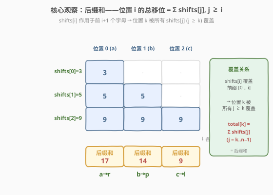
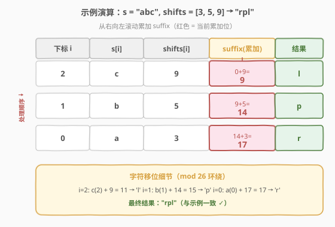

# LeetCode 字母移位 题解

## 1. 题目概述

- **标题 / 题号**：字母移位（#848，medium）
- **链接**：https://leetcode.cn/problems/shifting-letters/
- **难度**：中等
- **标签**：数组、字符串、前缀和（后缀和）

**题意**：有一个由小写字母组成的字符串 `s`，和一个长度相同的整数数组 `shifts`。将字母表中的下一个字母称为原字母的**移位** `shift()`（字母表是环绕的，`'z'` 会变成 `'a'`）。例如 `shift('a') = 'b'`，`shift('t') = 'u'`，`shift('z') = 'a'`。

对于每个 `shifts[i] = x`，我们会将 `s` 中的**前 `i + 1` 个字母**移位 `x` 次。返回将所有这些移位都应用到 `s` 后最终得到的字符串。

**示例 1**：

```text
输入：s = "abc", shifts = [3,5,9]
输出："rpl"
解释：
我们以 "abc" 开始。
将 s 中的第 1 个字母移位 3 次后，得到 "dbc"。
再将 s 中的前 2 个字母移位 5 次后，得到 "igc"。
最后将 s 中的这 3 个字母移位 9 次后，得到答案 "rpl"。
```

**示例 2**：

```text
输入：s = "aaa", shifts = [1,2,3]
输出："gfd"
```

**约束**：

- `1 <= s.length <= 10^5`
- `s` 由小写英文字母组成
- `shifts.length == s.length`
- `0 <= shifts[i] <= 10^9`

## 2. 解题思路

### 2.1 暴力思路

最直接的模拟：按题意，对每个 `shifts[i] = x`，遍历 `s` 的前 `i + 1` 个字符，每个字符移位 `x` 次（即 `(c - 'a' + x) % 26 + 'a'`）。

- 时间复杂度：$O(n^2)$——`i` 从 $0$ 到 $n-1$，每次扫描前 $i+1$ 个字符，总操作数 $\sum_{i=0}^{n-1}(i+1) = \frac{n(n+1)}{2}$。
- `n = 10^5` 时约 $5 \times 10^9$ 次操作，**远超时限**。

> ⚠️ 暴力法的问题在于：**它对每个 `shifts[i]` 独立地修改前缀**，没有发现「同一位置被多次移位可以合并」这一结构。事实上，每个位置的最终移位量只取决于**所有覆盖它的 `shifts[j]` 之和**。

### 2.2 核心观察：后缀和（Suffix Sum）



关键转换：**不要逐次模拟移位，而是先算出每个位置的「总移位量」，再一次性移位。**

观察覆盖关系：`shifts[i]` 作用于**前 `i + 1` 个字母**，即覆盖位置 $0, 1, \dots, i$。因此位置 $k$ 被**所有满足 $j \geq k$ 的 `shifts[j]`** 覆盖。于是位置 $k$ 的总移位量为：

$$
\text{total}[k] = \sum_{j=k}^{n-1} \text{shifts}[j] \pmod{26}
$$

这正是 `shifts` 数组的**后缀和**（从右向左累加），对 $26$ 取模后即可得到位置 $k$ 的实际移位次数。

> 💡 **为什么取模 26？** 字母表只有 26 个，移位 26 次等于没移位（环绕一圈回到原位）。`shifts[i]` 可达 $10^9$，直接累加会溢出且无意义，所以每步对 26 取模。

> ⚠️ **与暴力的本质区别**：暴力法 $O(n^2)$ 逐次修改前缀；后缀和法把「多次移位」合并为「一次移位」，只需从右向左一趟扫描，$O(n)$ 即可求出所有位置的总移位量。

### 2.3 算法流程图


流程简述：初始化 `suffix = 0`、`i = n - 1` → 从右向左遍历 → `suffix = (suffix + shifts[i]) % 26` 累加后缀和 → 用 `suffix` 移位 `s[i]` → `i--` → 直到处理完位置 0。

> 💡 **为什么从右向左？** 后缀和天然需要「右侧元素之和」。从右端起用一个滚动变量 `suffix` 边走边加，每个位置处理时 `suffix` 恰好就是 `shifts[i..n-1]` 之和，无需额外数组、无需重复求和。

### 2.4 示例演算



以 `s = "abc"`、`shifts = [3, 5, 9]` 为例，从右向左滚动累加 `suffix`：

| 下标 `i` | `s[i]` | `shifts[i]` | `suffix`（累加） | 字符移位 | 结果 |
|----------|--------|-------------|-------------------|----------|------|
| 2 | c | 9 | 0 + 9 = **9** | c(2) + 9 = 11 → l | l |
| 1 | b | 5 | 9 + 5 = **14** | b(1) + 14 = 15 → p | p |
| 0 | a | 3 | 14 + 3 = **17** | a(0) + 17 = 17 → r | r |

最终结果 `"rpl"`，与示例一致。

> 💡 注意 `suffix` 是滚动累加的：处理 `i=1` 时复用了 `i=2` 累加出的 9，处理 `i=0` 时复用了 `i=1` 累加出的 14——这正是「从右向左一趟」省去重复求和的关键。

## 3. 参考代码

### C++

```cpp
class Solution {
  public:
    string shiftingLetters(string s, vector<int>& shifts) {
        int suffix = 0;
        for (int i = (int)s.size() - 1; i >= 0; --i) {
            suffix = (suffix + shifts[i]) % 26;
            s[i] = (s[i] - 'a' + suffix) % 26 + 'a';
        }
        return s;
    }
};
```

### Python

```python
class Solution:
    def shiftingLetters(self, s: str, shifts: List[int]) -> str:
        suffix = 0
        res = list(s)
        for i in range(len(s) - 1, -1, -1):
            suffix = (suffix + shifts[i]) % 26
            res[i] = chr((ord(s[i]) - ord('a') + suffix) % 26 + ord('a'))
        return ''.join(res)
```

> 💡 **溢出说明**：`shifts[i] <= 10^9`，`suffix < 26`，故 `suffix + shifts[i] < 10^9 + 26`，在 32 位 `int` 范围内（C++ 中安全）；Python 天然大整数无溢出问题。每步取模 26 保证 `suffix` 始终小于 26。
>
> ⚠️ **原地修改**：C++ 中 `string` 可变，直接原地改写 `s[i]` 后返回即可；Python 中 `str` 不可变，需转成 `list` 操作再 `join`。

## 4. 复杂度分析

| 维度 | 复杂度 | 说明 |
|------|--------|------|
| 时间复杂度 | $O(n)$ | 从右向左一趟遍历，每个位置 $O(1)$ 累加 + 取模 + 移位 |
| 空间复杂度 | $O(1)$ | 仅用一个滚动变量 `suffix`（C++ 原地修改）；Python 需 $O(n)$ 存 `list`（输出本身） |

> 💡 对比暴力 $O(n^2)$，后缀和法将指数级优化到线性，是「合并多次操作」思路的典型应用。$n = 10^5$ 时约 $10^5$ 次操作，轻松通过。

## 5. 扩展：差分数组视角

本题可以与「区间加法」类问题互为镜像。`shifts[i] = x` 表示对前缀区间 $[0, i]$ 整体加 $x$，这等价于一个**差分数组**操作：在差分数组 `diff` 上 `diff[0] += x`、`diff[i + 1] -= x`，最后求前缀和即得每个位置的总移位量。

- 本题直接用**后缀和**更简洁（因为每个 `shifts[i]` 都覆盖从 0 开始的前缀，后缀和恰好等价于差分前缀和）。
- 若题目改为「`shifts[i]` 作用于任意区间 $[l_i, r_i]`」，则差分数组是更通用的解法，参见同类题 [1109. 航班预订统计](https://leetcode.cn/problems/corporate-flight-bookings/)。

两种视角本质都是「把多次区间修改合并为一次前缀/后缀和扫描」，$O(n + q)$ 完成 $q$ 次修改的统计。

## 6. 面试要点

1. **为什么位置 `k` 的总移位是后缀和？**

   `shifts[j]` 作用于前 `j+1` 个字母，即覆盖位置 $0..j$。位置 $k$ 被覆盖当且仅当 $k \leq j$，即 $j \geq k$。所以覆盖位置 $k$ 的所有 `shifts[j]` 正是下标从 $k$ 到 $n-1$ 的那段——后缀和。

2. **为什么要对 26 取模？什么时候取？**

   字母表大小 26，移位 26 次环绕回原位，等价于不移位。`shifts[i]` 可达 $10^9$，累加会溢出且徒劳，所以累加时立即 `% 26`。最终移位时再做一次 `% 26` 保证环绕（如 `z` 移位后回到 `a` 开头）。

3. **为什么从右向左遍历而不是从左向右？**

   后缀和需要「右侧元素之和」。从右端起用滚动变量 `suffix` 边走边加，处理位置 `i` 时 `suffix` 恰好等于 `shifts[i..n-1]` 之和，无需额外数组。从左向右则需要先预处理一个后缀和数组（$O(n)$ 额外空间），不如滚动变量省空间。

4. **暴力法为什么超时？优化点在哪？**

   暴力 $O(n^2)$ 对每个 `shifts[i]` 修改前缀，$n = 10^5$ 时约 $5 \times 10^9$ 次操作。优化在于发现「同一位置被多次移位可合并为和」，把多次修改压缩为一次移位，复杂度降到 $O(n)$。

5. **如果 `shifts[i]` 可以为负数（表示反向移位）怎么办？**

   取模需处理负数：C++ 中 `(a % 26 + 26) % 26` 保证结果非负；Python 的 `%` 对负数已返回非负结果，无需额外处理。其余逻辑不变。

## 同类练习题

| # | 题目 | 与本题的关联 |
|---|------|-------------|
| 238 | [除自身以外数组的乘积](https://leetcode.cn/problems/product-of-array-except-self/)（[题解](../0201-0300/238_除自身以外数组的乘积.md)） | 同样用「从右向左滚动累乘」维护后缀积，$O(n)$ 一趟、$O(1)$ 额外空间，与本题滚动 `suffix` 思路同构 |
| 1109 | [航班预订统计](https://leetcode.cn/problems/corporate-flight-bookings/)（[题解](../1101-1200/1109_航班预订统计.md)） | 多次区间加法合并为一次前缀和扫描，差分数组视角，与本题「合并多次区间修改」互为镜像 |
| 189 | [轮转数组](https://leetcode.cn/problems/rotate-array/)（[题解](../0101-0200/189_轮转数组.md)） | 同样是环绕操作，用 `k % n` 取模处理循环位移，与本题 `% 26` 环绕字母表思想一致 |
| 724 | [寻找数组的中心下标](https://leetcode.cn/problems/find-pivot-index/)（[题解](../0701-0800/724_寻找数组的中心下标.md)） | 前缀和基础题，对照本题的后缀和，体会前缀/后缀和两个方向的滚动维护 |
