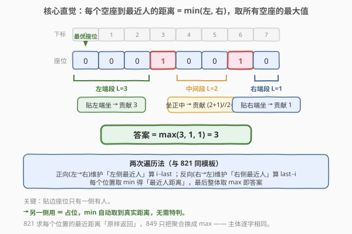
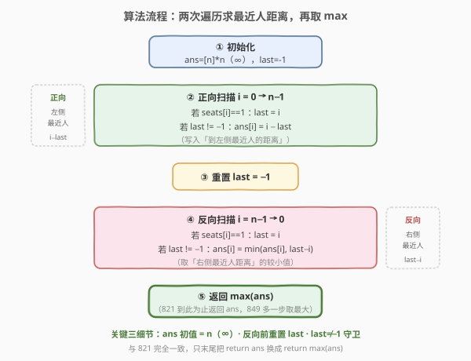
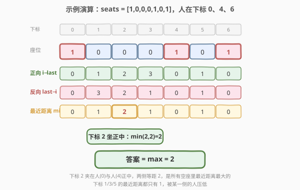

# 到最近的人的最大距离

- **题目名称**：到最近的人的最大距离
- **链接**：[849. 到最近的人的最大距离](https://leetcode.cn/problems/maximize-distance-to-closest-person/)
- **难度**：中等
- **标签**：数组、两次遍历

## 1. 题目概述

给定一个表示一排座位的数组 `seats`，其中 `seats[i] = 1` 表示第 `i` 个座位上有人，`seats[i] = 0` 表示空座。你需要**坐在一个空座**上，使得你与**离你最近的人**之间的距离**尽可能大**。距离定义为下标之差 `abs(i - j)`。返回这个**最大化的最近距离**。

**示例 1**：

```text
输入：seats = [1,0,0,0,1,0,1]
输出：2
解释：坐到下标 2，左侧最近的人在下标 0（距离 2），右侧最近的人在下标 4（距离 2），
     最近距离 = min(2,2) = 2，是所有空座中最大的。
     若坐到下标 1，最近距离 = min(1,3) = 1；若坐到下标 5，最近距离 = min(1,1) = 1。
```

**示例 2**：

```text
输入：seats = [1,0,0,0]
输出：3
解释：坐到下标 3（最右端），左侧最近的人在下标 0，距离 = 3。右端无人的限制，可贴边坐。
```

**示例 3**：

```text
输入：seats = [0,0,1]
输出：2
解释：坐到下标 0（最左端），右侧最近的人在下标 2，距离 = 2。左端无人的限制，可贴边坐。
```

**约束条件**：

- `2 <= seats.length <= 2 * 10^4`
- `seats[i]` 为 `0` 或 `1`
- 至少有一个空座，至少有一个座位有人

> 💡 本题是 [821. 字符的最短距离](../0801-0900/821_字符的最短距离.md) 的「镜像升级」：821 对每个位置求「到最近 `c` 的距离」并**全部返回**；849 则在求出每个空座的最近人距离后，**取其中的最大值**。核心的两次遍历模板完全相同——正向维护「左侧最近的人」、反向维护「右侧最近的人」，每个位置取两侧较小值即得「最近人距离」，最后 `max` 一遍即可。

---

## 2. 解题思路

### 2.1 暴力思路：对每个空座左右扫描找最近的人

最直观的做法是遍历每个空座 `i`（`seats[i] == 0`），向左、向右各扩展一步，直到碰到第一个 `1`，记录两侧最近人的距离，取较小值作为该座的「最近人距离」，最后对所有空座取最大。

```text
ans = 0
for i in range(n):
    if seats[i] == 1: continue
    l = i - 1
    while l >= 0 and seats[l] == 0: l -= 1
    r = i + 1
    while r < n  and seats[r] == 0: r += 1
    left_dist  = i - l if l >= 0 else inf
    right_dist = r - i if r < n  else inf
    ans = max(ans, min(left_dist, right_dist))
return ans
```

时间复杂度 `O(n^2)`：最坏情形（如 `[1,0,0,...,0]`，只有两端各一人），中间每个空座都要向左扫到数组起点，整体约 `n^2/2` 次操作。对 `n = 2×10^4` 约 `2×10^8`，偏慢。

> ⚠️ 暴力法的问题在于：每个空座都**独立地**重新向两侧搜索最近的人，存在大量重复——相邻空座的「左侧最近人」往往是同一个。实际上「人的位置」是有序的，每个位置的最近人一定是其**左侧最近的人**或**右侧最近的人**之一，可以像 821 那样用两次遍历一次性算出所有位置的最近人距离。

### 2.2 核心观察：两次遍历——左扫维护左侧最近人，右扫维护右侧最近人

**关键定义**：对每个下标 `i`，记：

- `left[i]`：`i` 及其**左侧**最近的人的下标（若左侧无人则记为「未见到」）
- `right[i]`：`i` 及其**右侧**最近的人的下标（若右侧无人则记为「未见到」）

**核心观察**：位置 `i` 的「最近人距离」`d[i] = min(i - left[i], right[i] - i)`，而题目答案 `= max(d[i])`。`left`、`right` 都能在**一次单向扫描**中得到——

- **正向扫描**（`i` 从 `0` 到 `n-1`）：用 `last` 记录「最近见到的人的下标」。遇 `seats[i] == 1` 更新 `last = i`；此时 `i - last` 即为「到左侧最近人的距离」（`last` 未见到时记为 `∞`）。
- **反向扫描**（`i` 从 `n-1` 到 `0`）：同样维护 `last`，但这次 `last` 是「右侧最近人的下标」，`last - i` 即为「到右侧最近人的距离」。

两次结果取较小值得到 `d[i]`，最后整体取 `max` 即为答案。**无需真的存 `left`、`right` 两个数组**——正向结果直接写进 `ans`，反向结果与 `ans[i]` 取 `min` 原地更新，遍历完再取 `max`。



**为什么边界的「贴边坐」天然被处理？** 示例 2 `[1,0,0,0]` 的下标 3、示例 3 `[0,0,1]` 的下标 0，这些贴边位置只有一侧有人，另一侧「未见到」`last = -1`。此时正向（或反向）扫描跳过不写，保留初始值 `∞`；`min(∞, 真实距离) = 真实距离`，于是贴边座位的最近人距离就是它到唯一那侧人的距离，**无需任何特判**。这正是 821 的「`∞` 充当占位」技巧在本题的直接复用。

> 💡 **821 → 849 的演化**：821 输出「每个位置的最近距离数组」（聚合是「原样返回」），849 输出「这些距离的最大值」（聚合是 `max`）。求距离的两次遍历主体**逐字相同**，只把最后的 `return ans` 换成 `return max(ans)`。理解这一层，就能把「最近邻下标 + 聚合」当成一个可复用的元模板。

### 2.3 算法流程图



**完整步骤**：

1. **初始化**：`ans` 长度 `n`，全部填 `n`（充当 `∞`，比任何真实距离都大）；`last = -1`（表示「尚未见到人」）。
2. **正向扫描** `i = 0 → n-1`：
   - 若 `seats[i] == 1`：`last = i`。
   - 若 `last != -1`：`ans[i] = i - last`（到左侧最近人的距离）。
3. **重置** `last = -1`。
4. **反向扫描** `i = n-1 → 0`：
   - 若 `seats[i] == 1`：`last = i`。
   - 若 `last != -1`：`ans[i] = min(ans[i], last - i)`（到右侧最近人的距离，取较小）。
5. **返回** `max(ans)`。

> ⚠️ **三个易错点**（与 821 一脉相承）：(1) 反向扫描前**必须重置** `last = -1`，否则沿用正向残留值算错右侧距离；(2) `last != -1` 守卫不能省——首个之前（正向）/ 末个之后（反向）的位置，`last` 还是 `-1`，不应写入；(3) `ans` 初始化为 `n` 而非 `0`，保证贴边位置未被写入的方向保留 `∞`，`min` 后取到真实距离。

### 2.4 示例演算

以示例 1 `seats = [1,0,0,0,1,0,1]` 为例，人在下标 `0、4、6`。下表分三行展示正向结果、反向结果与最终 `min`，最后取 `max`（`∞` 表示该方向尚未见到人，保留初始值 `n`）：



| 下标 | 0 | 1 | 2 | 3 | 4 | 5 | 6 |
|------|---|---|---|---|---|---|---|
| 座位 | **1** | 0 | 0 | 0 | **1** | 0 | **1** |
| 正向 `i-last` | 0 | 1 | 2 | 3 | 0 | 1 | 0 |
| 反向 `last-i` | 0 | 3 | 2 | 1 | 0 | 1 | 0 |
| **最近距离 min** | **0** | **1** | **2** | **1** | **0** | **1** | **0** |

逐位解读：

- **下标 2**（夹在人 `0` 与人 `4` 之间的中间位）：正向得 `2`（距左 `0`），反向得 `2`（距右 `4`），`min = 2`——两侧等距，正好坐在中间，是所有空座里最近距离最大的。
- **下标 1**：正向得 `1`（距左 `0`），反向得 `3`（距右 `4`），`min = 1`——离左太近，不是最优。
- **下标 3**：正向得 `3`（距左 `0`），反向得 `1`（距右 `4`），`min = 1`——离右太近。
- **下标 5**（夹在人 `4` 与人 `6` 之间）：正向 `1`、反向 `1`，`min = 1`。
- **人本身**（0/4/6）：两遍都为 `0`，`min = 0`，不影响 `max`。

最近距离数组 `[0,1,2,1,0,1,0]`，`max = 2`，与示例一致。

> 💡 **对比示例 2/3 的贴边情形**：`[1,0,0,0]` 正向得 `[0,1,2,3]`，反向时下标 `3/2/1` 的 `last` 都是 `-1`（右侧无人）被跳过，`min` 保持正向值，`max = 3`；`[0,0,1]` 正向时下标 `0/1` 的 `last` 为 `-1`（左侧无人）被跳过保留 `∞`，反向补上 `[2,1,0]`，`max = 2`。可见「贴边」完全由 `∞` 占位 + 另一侧扫描自然处理，无需分支。

---

## 3. 参考代码

### C++

```cpp
class Solution {
public:
    int maxDistToClosest(vector<int>& seats) {
        int n = seats.size();
        vector<int> ans(n, n);            // 初始化为 n，充当 ∞
        int last = -1;                    // 尚未见到人
        for (int i = 0; i < n; ++i) {     // 正向：维护左侧最近人
            if (seats[i] == 1) last = i;
            if (last != -1) ans[i] = i - last;
        }
        last = -1;                        // 重置
        for (int i = n - 1; i >= 0; --i) { // 反向：维护右侧最近人
            if (seats[i] == 1) last = i;
            if (last != -1) ans[i] = min(ans[i], last - i);
        }
        return *max_element(ans.begin(), ans.end());
    }
};
```

### Python

```python
class Solution:
    def maxDistToClosest(self, seats: List[int]) -> int:
        n = len(seats)
        ans = [n] * n                     # 初始化为 n，充当 ∞
        last = -1                         # 尚未见到人
        for i in range(n):                # 正向：维护左侧最近人
            if seats[i] == 1:
                last = i
            if last != -1:
                ans[i] = i - last
        last = -1                         # 重置
        for i in range(n - 1, -1, -1):    # 反向：维护右侧最近人
            if seats[i] == 1:
                last = i
            if last != -1:
                ans[i] = min(ans[i], last - i)
        return max(ans)
```

> 💡 两版逻辑完全一致，且与 821 的主体**逐字相同**——只把最后的返回从 `ans` 换成 `max(ans)`。`ans` 初始化为 `n`（比最大真实距离 `n-1` 大，充当 `∞`），`last = -1` 表示「尚未见到人」，`last != -1` 守卫保证首个之前 / 末个之后的位置不被错误写入。

---

## 4. 复杂度分析

| 维度 | 复杂度 | 说明 |
|------|--------|------|
| **时间复杂度** | `O(n)` | 正向、反向各扫一遍，每位置 `O(1)`；最后 `max` 再扫一遍，仍 `O(n)` |
| **空间复杂度** | `O(n)` | `ans` 数组占 `n`；可优化到 `O(1)`（见第 5 节），但需边扫边维护最大值 |

> ⚠️ 本题已是该模型的最优时间复杂度——必须至少看每个位置一遍才能确定其最近人。两次遍历相比暴力的 `O(n^2)`，把「每个空座独立左右搜索」优化为「一次扫描传递最近人位置」，关键在于利用了「人的位置」天然有序：相邻人之间的位置，其左侧最近人在正向扫描时已确定，无需重复查找。

---

## 5. 扩展：零段分组——一次遍历 O(1) 空间

两次遍历虽清晰，但需要 `O(n)` 的 `ans` 数组。其实利用「座位只有 0/1」的结构，可以**一次遍历 O(1) 空间**直接求答案——把连续的 `0` 看成一个个「零段」，按其所在位置分三类计算可坐出的最近人距离：

设某段连续空座长度为 `L`：

| 零段类型 | 位置 | 最佳座位 | 该段贡献的最近人距离 |
|----------|------|----------|----------------------|
| **左端段** | 数组开头到第一个人之前 | 贴左端坐（下标 `0`） | `L`（只有右侧有人） |
| **右端段** | 最后一个人之后到数组末尾 | 贴右端坐（下标 `n-1`） | `L`（只有左侧有人） |
| **中间段** | 两个人之间 | 坐正中 | `(L + 1) // 2`（两侧都有人，取中点） |

答案 = 所有零段贡献的最大值。

```python
class Solution:
    def maxDistToClosest(self, seats: List[int]) -> int:
        n = len(seats)
        ans = 0
        last = -1                          # 上一个人的下标
        for i in range(n):
            if seats[i] == 1:
                if last == -1:             # 左端段：开头到首个人
                    ans = i                # 贴左端坐，距离 = i
                else:                      # 中间段：上一个人到当前人之间
                    ans = max(ans, (i - last) // 2)
                last = i
        ans = max(ans, n - 1 - last)       # 右端段：最后一个人到末尾
        return ans
```

- **左端段**：`last == -1` 时遇到第一个人，其左侧的 `i` 个空座可贴左端坐，贡献 `i`。
- **中间段**：两个人间距 `i - last`，其中空座数 `L = i - last - 1`，坐正中距离 `(L+1)//2 = (i-last)//2`（等价于 `⌊(i-last)/2⌋`，向左取整正好是中点到较近一端的距离）。
- **右端段**：遍历结束后，最后一个人到数组末尾的 `n-1-last` 个空座可贴右端坐，贡献 `n-1-last`。

以示例 1 `[1,0,0,0,1,0,1]`：左端段无（首座即人）；中间段 `0→4` 贡献 `(4-0)//2=2`，`4→6` 贡献 `(6-4)//2=1`；右端段 `n-1-6=0`。`max=2`。

> 💡 **两种解法的关系**：两次遍历是「逐位置算最近人距离再取 `max`」，零段分组是「逐段算最佳座位距离再取 `max`」——前者通用（条件可推广到任意「标记点」），后者利用了「0/1 且只取 `max`」的结构把空间压到 `O(1)`。面试中先讲两次遍历（与 821 串联，展示模板复用），再引出零段分组作为空间优化，是完整的递进叙事。

---

## 6. 面试要点

1. **本题和 821 的关系是什么？**

   - 821 求每个位置到最近 `c` 的距离并**全部返回**；849 求每个空座到最近人的距离后**取最大值**。两者求距离的两次遍历主体逐字相同，只是聚合方式从「原样返回」换成 `max`。849 是 821 的「镜像升级」。

2. **为什么边界的贴边座位不需要特判？**

   - 贴边座位只有一侧有人，另一侧「未见到」`last = -1`。`ans` 初始化为 `n`（`∞`），未写入的方向保留 `∞`，`min(∞, 真实距离) = 真实距离`，于是贴边座位的最近人距离就是到唯一那侧人的距离，天然处理，无需分支。

3. **`ans` 为什么初始化为 `n` 而不是 `0`？**

   - `n` 比任何真实距离（最大 `n-1`）都大，充当 `∞`。这样反向扫描的 `min` 会自动用真实距离替换 `n`。若初始化为 `0`，`min` 会取到错误的 `0`，把所有位置的距离都压成 `0`。

4. **反向扫描前为什么要重置 `last = -1`？**

   - 正向扫描结束后 `last` 停在最后一个人的下标（非负数）。若不重置，反向扫描一开始 `last` 就是错误值，`last - i` 会算出错误的「右侧距离」。重置为 `-1` 表示「反向方向尚未见到人」，配合守卫保证只在真正见到人后才写入。

5. **零段分组法中，中间段为什么是 `(L+1)//2` 而左/右端段是 `L`？**

   - 中间段两侧都有人，坐正中时到较近一侧的距离为 `⌈L/2⌉ = (L+1)//2`（`L` 个空座，中点偏左取整）。左/右端段只有一侧有人，可以贴着无人的那一端坐，距离就是整段长度 `L`——这正是为什么贴边段往往比中间段更优（示例 2/3 的答案都来自贴边）。

> 💡 **一句话总结**：849 是 821 的「取 `max`」镜像——两次遍历求出每个位置的最近人距离，最后 `max` 一遍。`O(n)` / `O(n)`（零段分组可压到 `O(1)`），关键在 `∞` 初始化、重置 `last`、守卫 `last != -1` 三个与 821 共用的细节。

---

## 7. 同类练习题

- [821. 字符的最短距离](https://leetcode.cn/problems/shortest-distance-to-a-character/)（[题解](../0801-0900/821_字符的最短距离.md)）：本题的直接前置，两次遍历求「最近邻下标」的入门模板，849 只把聚合从「原样返回」换成 `max`
- [605. 种花问题](https://leetcode.cn/problems/can-place-flowers/)：同为「0/1 座位数组 + 连续零段」结构，按零段长度判定能否放置，零段分组思想的另一应用
- [739. 每日温度](https://leetcode.cn/problems/daily-temperatures/)（[题解](../0701-0800/739_每日温度.md)）：同为「每个位置找最近邻居」，但条件是大小比较需用单调栈，与 821/849 的「等值匹配用两次遍历」形成对照
- [2016. 增量元素之间的最大差值](https://leetcode.cn/problems/maximum-difference-between-increasing-elements/)：两次遍历维护前缀最小值再取 `max`，思想与 849 同源（「最近邻下标」换成「前缀极值」）
