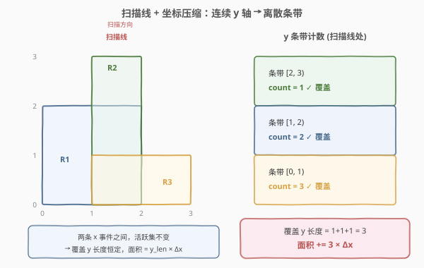
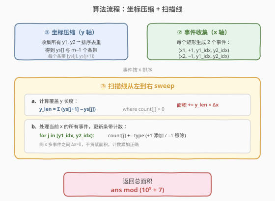
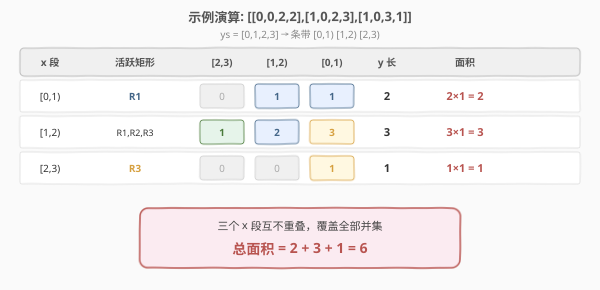

# 矩形面积 II

- **题目名称**：矩形面积 II
- **链接**：[850. 矩形面积 II](https://leetcode.cn/problems/rectangle-area-ii/)
- **难度**：困难
- **标签**：扫描线、坐标压缩、数组、线段树

## 1. 题目概述

给定一个轴对齐矩形的列表 `rectangles`，其中 `rectangles[i] = [xi1, yi1, xi2, yi2]` 表示第 `i` 个矩形的左下角和右上角坐标。计算平面内所有矩形**覆盖的总面积**（即并集面积），结果对 $10^9 + 7$ 取模。

**示例 1**：

```text
输入：rectangles = [[0,0,2,2],[1,0,2,3],[1,0,3,1]]
输出：6
解释：三个矩形并集面积如下图所示，总面积为 6。
      R1=[0,0,2,2] 面积 4，R2=[1,0,2,3] 面积 3，R3=[1,0,3,1] 面积 2，
      去除重叠部分后并集面积 = 6。
```

**示例 2**：

```text
输入：rectangles = [[0,0,1000000000,1000000000],[0,0,1000000000,1000000000],[0,0,1000000000,1000000000]]
输出：49
解释：三个完全相同的 10⁹ × 10⁹ 矩形，并集面积 = 10¹⁸。
      10¹⁸ mod (10⁹ + 7) = 49。
```

**约束条件**：

- $1 \le \text{rectangles.length} \le 200$
- $\text{rectangles}[i].\text{length} == 4$
- $0 \le \text{xi1}, \text{yi1}, \text{xi2}, \text{yi2} \le 10^9$
- $\text{xi1} < \text{xi2}$，$\text{yi1} < \text{yi2}$

> 💡 **核心难点**：坐标范围高达 $10^9$，无法用二维数组直接标记；矩形会重叠，简单求和会重复计算。需要一种高效方法在不显式枚举每个坐标点的情况下计算并集面积。

---

## 2. 解题思路

### 2.1 暴力思路

**容斥原理**：$n$ 个矩形的并集面积可以通过容斥公式计算——奇数个矩形交集面积之和减去偶数个矩形交集面积之和。但 $n$ 个矩形有 $2^n - 1$ 种非空子集组合，$n = 200$ 时完全不可行。

**二维数组标记**：如果坐标范围很小（如 $\le 100$），可以用二维布尔数组标记每个单位格子是否被覆盖，最后数 `true` 的个数。但本题坐标达 $10^9$，空间爆炸。

两种暴力都不可行，需要换思路。

### 2.2 核心观察：扫描线 + 坐标压缩



关键洞察分为两步：

**第一步：坐标压缩（y 轴）**

虽然 $y$ 坐标范围达 $10^9$，但 $n$ 个矩形最多产生 $2n = 400$ 个**不同的** $y$ 坐标值。将这些 $y$ 坐标排序去重后得到数组 `ys[]`，相邻两个 $y$ 值之间形成一个**条带**（band）`[ys[j], ys[j+1])`。一共最多 $2n - 1$ 个条带。

> 💡 **为什么压缩有效？** 在同一条带内，所有矩形的覆盖情况完全一致——一个矩形要么覆盖整个条带，要么完全不覆盖。因此可以用一个整数 `count[j]` 表示条带 $j$ 上有多少个活跃矩形覆盖，`count[j] > 0` 即该条带被覆盖，贡献长度 `ys[j+1] - ys[j]`。

**第二步：扫描线（x 轴）**

将每个矩形拆成两个 **x 事件**：

- **左边界** `x1`：类型 `+1`（该矩形开始覆盖，在 y 方向对应条带的 `count` 加 1）
- **右边界** `x2`：类型 `-1`（该矩形结束覆盖，对应条带的 `count` 减 1）

将所有事件按 $x$ 排序后，从左到右扫描。在**两个相邻 x 事件之间**，没有任何事件的 $x$ 坐标落在其中，因此**活跃矩形集合不变** → 覆盖的 $y$ 长度恒定。这段的面积贡献为：

$$\text{面积} += \text{y\_len} \times \Delta x$$

其中 $\text{y\_len} = \sum_{\text{count}[j] > 0} (\text{ys}[j+1] - \text{ys}[j])$，$\Delta x = \text{curr\_x} - \text{prev\_x}$。

> ⚠️ **处理同 x 多事件**：当多个事件发生在同一 $x$ 坐标时，它们之间的 $\Delta x = 0$，不贡献面积。**先算面积、再处理事件**的顺序保证正确性——面积用的是"上一批事件处理完"的 `count`，而新事件只会影响后续段。

### 2.3 算法流程图



**伪代码**：

```text
1. 收集所有 y1, y2 → 排序去重 → ys[]（m 个值，m−1 个条带）
2. 对每个矩形 [x1,y1,x2,y2]：
   - 用二分找到 y1, y2 在 ys[] 中的下标 y1_idx, y2_idx
   - 生成事件 (x1, +1, y1_idx, y2_idx) 和 (x2, −1, y1_idx, y2_idx)
3. 事件按 x 排序
4. count[m−1] 初始化为 0
5. sweep：
   for i in range(len(events)):
       if i > 0:
           Δx = events[i].x − events[i−1].x
           if Δx > 0:
               y_len = Σ (ys[j+1] − ys[j]) for j where count[j] > 0
               ans = (ans + y_len × Δx) % MOD
       处理 events[i]：for j in [y1_idx, y2_idx): count[j] += type
6. 返回 ans
```

### 2.4 示例演算

以示例 1 `rectangles = [[0,0,2,2],[1,0,2,3],[1,0,3,1]]` 为例：

**预处理**：
- $y$ 坐标集合：$\{0, 2, 3, 1\}$ → 排序去重：`ys = [0, 1, 2, 3]`，3 个条带：`[0,1)`、`[1,2)`、`[2,3)`
- 事件（按 $x$ 排序）：

| x | 类型 | 矩形 | y 条带范围 |
|---|------|------|-----------|
| 0 | +1 | R1 | [0, 2) |
| 1 | +1 | R2 | [0, 3) |
| 1 | +1 | R3 | [0, 1) |
| 2 | −1 | R1 | [0, 2) |
| 2 | −1 | R2 | [0, 3) |
| 3 | −1 | R3 | [0, 1) |

**扫描过程**：



| 步骤 | x 段 | 活跃矩形 | count[2,3) | count[1,2) | count[0,1) | y 长 | 面积 |
|------|------|---------|-----------|-----------|-----------|------|------|
| 处理 x=0 | — | — | — | — | — | — | count=[1,1,0] |
| x=0→1 | [0,1) | R1 | 0 | 1 | 1 | 2 | 2×1=**2** |
| 处理 x=1 | — | +R2,+R3 | — | — | — | — | count=[3,2,1] |
| x=1→2 | [1,2) | R1,R2,R3 | 1 | 2 | 3 | 3 | 3×1=**3** |
| 处理 x=2 | — | −R1,−R2 | — | — | — | — | count=[1,0,0] |
| x=2→3 | [2,3) | R3 | 0 | 0 | 1 | 1 | 1×1=**1** |

**总面积** $= 2 + 3 + 1 = 6$ ✓

> 💡 **关键观察**：$x=1$ 处有两个事件（加 R2、加 R3），它们之间的 $\Delta x = 0$ 不贡献面积，`count` 累加到 $[3,2,1]$ 后才进入下一段 $[1,2)$。同理 $x=2$ 处两个移除事件也不会产生中间面积。

---

## 3. 参考代码

### C++

```cpp
class Solution {
  public:
    int rectangleArea(vector<vector<int>>& rectangles) {
        const int MOD = 1e9 + 7;
        int n = rectangles.size();

        // ① 坐标压缩：收集所有 y 坐标，排序去重
        vector<int> ys;
        for (auto& r : rectangles) {
            ys.push_back(r[1]);
            ys.push_back(r[3]);
        }
        sort(ys.begin(), ys.end());
        ys.erase(unique(ys.begin(), ys.end()), ys.end());
        int m = ys.size(); // m-1 个条带

        // ② 收集 x 事件
        struct Event {
            int x, type, y1_idx, y2_idx;
        };
        vector<Event> events;
        for (auto& r : rectangles) {
            int y1_idx = lower_bound(ys.begin(), ys.end(), r[1]) - ys.begin();
            int y2_idx = lower_bound(ys.begin(), ys.end(), r[3]) - ys.begin();
            events.push_back({r[0],  1, y1_idx, y2_idx});
            events.push_back({r[2], -1, y1_idx, y2_idx});
        }
        sort(events.begin(), events.end(),
             [](const Event& a, const Event& b) { return a.x < b.x; });

        // ③ 扫描线 sweep
        vector<int> count(m - 1, 0);
        long long ans = 0;

        for (int i = 0; i < (int)events.size(); ++i) {
            if (i > 0) {
                long long dx = events[i].x - events[i - 1].x;
                if (dx > 0) {
                    long long y_len = 0;
                    for (int j = 0; j < m - 1; ++j) {
                        if (count[j] > 0) {
                            y_len += ys[j + 1] - ys[j];
                        }
                    }
                    ans = (ans + y_len * dx % MOD) % MOD;
                }
            }
            // 处理当前事件：更新条带计数
            int y1 = events[i].y1_idx, y2 = events[i].y2_idx;
            for (int j = y1; j < y2; ++j) {
                count[j] += events[i].type;
            }
        }
        return ans;
    }
};
```

### Python

```python
class Solution:
    def rectangleArea(self, rectangles: List[List[int]]) -> int:
        MOD = 10**9 + 7

        # ① 坐标压缩：收集所有 y 坐标，排序去重
        ys = set()
        for x1, y1, x2, y2 in rectangles:
            ys.add(y1)
            ys.add(y2)
        ys = sorted(ys)
        m = len(ys)
        y_to_idx = {y: i for i, y in enumerate(ys)}

        # ② 收集 x 事件
        events = []
        for x1, y1, x2, y2 in rectangles:
            events.append((x1,  1, y_to_idx[y1], y_to_idx[y2]))
            events.append((x2, -1, y_to_idx[y1], y_to_idx[y2]))
        events.sort(key=lambda e: e[0])

        # ③ 扫描线 sweep
        count = [0] * (m - 1)
        ans = 0

        for i in range(len(events)):
            if i > 0:
                dx = events[i][0] - events[i - 1][0]
                if dx > 0:
                    y_len = sum(
                        ys[j + 1] - ys[j]
                        for j in range(m - 1)
                        if count[j] > 0
                    )
                    ans = (ans + y_len * dx) % MOD
            # 处理当前事件：更新条带计数
            _, typ, y1_idx, y2_idx = events[i]
            for j in range(y1_idx, y2_idx):
                count[j] += typ

        return ans
```

> ⚠️ **两个易错点**：
> 1. **先算面积、再处理事件**：进入位置 $i$ 时，先用"之前累积的 `count`"算 $[\text{prev\_x}, \text{curr\_x}]$ 段的面积，然后才处理 $\text{events}[i]$ 更新 `count`。顺序颠倒会导致用错误的 `count` 算面积。
> 2. **溢出处理**：$y\_len \le 10^9$，$dx \le 10^9$，乘积可达 $10^{18}$。C++ 中 `y_len * dx` 必须用 `long long`（`long long` 最大约 $9.2 \times 10^{18}$，足够）。Python 整数无上限无需担心。

---

## 4. 复杂度分析

| 维度 | 复杂度 | 说明 |
|------|--------|------|
| 时间复杂度 | $O(n^2)$ | $2n$ 个事件；每轮算 $y$ 长度 $O(m) = O(n)$，处理事件更新 $O(n)$ 条带，总计 $O(n^2)$ |
| 空间复杂度 | $O(n)$ | `ys[]` 数组 $O(n)$、`count[]` 数组 $O(n)$、事件数组 $O(n)$ |

> 💡 $n = 200$ 时 $n^2 = 40000$，远在时限内。若 $n$ 增大到 $10^5$，需要线段树将"算 $y$ 长度"和"更新条带"都优化到 $O(\log n)$，见第 5 节。

---

## 5. 扩展：线段树优化至 $O(n \log n)$

当 $n$ 很大（如 $10^5$）时，$O(n^2)$ 不再可行。可以用**线段树**维护条带的覆盖长度，将每轮"算 $y$ 长度"和"区间更新"都降到 $O(\log n)$。

**特殊线段树设计**（无需 lazy 传播）：

每个节点维护两个值：

- `cover`：该节点代表的 $y$ 区间被**整体覆盖**的次数（区间加法，非赋值）
- `len`：该节点代表的 $y$ 区间中**被覆盖的总长度**

**更新规则**：

- 当 `cover > 0`：整个区间被覆盖，`len = 区间总长度`
- 当 `cover == 0`：
  - 叶节点：`len = 0`
  - 内部节点：`len = 左子.len + 右子.len`

**关键技巧**：不需要 `pushdown`（懒标记下传）。因为 `cover` 是叠加的（加减 1），而非覆盖式赋值。查询时只需读根节点的 `len`，它始终反映当前所有事件处理后的覆盖长度。

```cpp
// 线段树节点（离散化后的条带版本）
struct SegNode {
    int cover = 0;   // 整体覆盖次数
    long long len = 0; // 覆盖长度
};

vector<SegNode> tree(4 * MAXM);

void update(int node, int lo, int hi, int ql, int qr, int val) {
    if (qr <= lo || hi <= ql) return;       // 不相交
    if (ql <= lo && hi <= qr) {             // 完全覆盖
        tree[node].cover += val;
    } else {
        int mid = (lo + hi) / 2;
        update(node * 2, lo, mid, ql, qr, val);
        update(node * 2 + 1, mid, hi, ql, qr, val);
    }
    // 向上更新 len
    if (tree[node].cover > 0) {
        tree[node].len = ys[hi] - ys[lo];   // 整段覆盖
    } else if (hi - lo > 1) {
        tree[node].len = tree[node * 2].len + tree[node * 2 + 1].len;
    } else {
        tree[node].len = 0;                 // 叶节点且无覆盖
    }
}
```

> 💡 **为什么不用 lazy 传播？** 标准线段树的 lazy 传播用于"区间赋值"场景（如区间求和）。本题的 `cover` 是**可叠加的计数**（加 1 / 减 1），不需要下传——子节点的 `cover` 独立维护，父节点的 `cover > 0` 直接覆盖子节点信息。这种"计数式线段树"是矩形面积/周长问题的专用利器。

使用线段树后，每个事件的处理变为 $O(\log n)$，总复杂度 $O(n \log n)$。

---

## 6. 面试要点

1. **为什么需要坐标压缩？**

   - 坐标范围高达 $10^9$，无法用数组直接索引。但 $n \le 200$ 个矩形最多产生 $2n = 400$ 个不同的 $y$ 坐标。压缩后只需 $O(n)$ 个条带，每个条带内覆盖情况一致，用 `count[j]` 即可表示。

2. **为什么扫描线法正确？**

   - 在两个相邻 $x$ 事件之间，没有任何矩形开始或结束，因此**活跃矩形集合不变** → 覆盖的 $y$ 长度恒定。将每个 $x$ 段的面积 $= y\_len \times \Delta x$ 求和，恰好等于并集总面积（不重不漏）。

3. **同一 $x$ 有多个事件怎么办？**

   - 它们之间的 $\Delta x = 0$，不贡献面积。**先算面积、再处理事件**的顺序保证：面积用的是"上一批事件处理完"的 `count`，新事件只影响后续段。无论同 $x$ 事件的内部顺序如何，最终 `count` 的累加结果都正确（加减法可交换）。

4. **为什么不用容斥原理？**

   - $n$ 个矩形的容斥有 $2^n - 1$ 项。$n = 200$ 时 $2^{200}$ 天文数字，完全不可行。扫描线法 $O(n^2)$ 远优于容斥。

5. **如何处理取模溢出？**

   - $y\_len \le 10^9$（$y$ 坐标最大 $10^9$），$dx \le 10^9$，乘积 $\le 10^{18}$，在 `long long` 范围内（$\approx 9.2 \times 10^{18}$）。每步取 `y_len * dx % MOD` 后累加，再取模。C++ 必须用 `long long`；Python 无溢出问题。

6. **如果 $n$ 增大到 $10^5$ 怎么办？**

   - 用第 5 节的"计数式线段树"，将"算 $y$ 长度"和"区间更新条带"都从 $O(n)$ 优化到 $O(\log n)$，总体 $O(n \log n)$。该线段树无需 lazy 传播，`cover` 叠加计数，根节点直接读取覆盖长度。

---

## 7. 同类练习题

- [223. 矩形面积](https://leetcode.cn/problems/rectangle-area/)：两个矩形的并集面积，本题 $n=2$ 的退化版，直接容斥即可
- [391. 完美矩形](https://leetcode.cn/problems/perfect-rectangle/)：判断若干矩形是否恰好拼成一个大矩形（无重叠无缝隙），同样需要扫描线 + 坐标压缩
- [732. 我的日程安排表 III](https://leetcode.cn/problems/my-calendar-iii/)：扫描线 + 差分思想求最大重叠层数，与本题的事件收集同源
- [218. 天际线问题](https://leetcode.cn/problems/the-skyline-problem/)：扫描线求建筑物轮廓，同样是"事件排序 + 逐段处理"范式，结算内容从面积换成轮廓转折点
- [57. 插入区间](https://leetcode.cn/problems/insert-interval/)（[题解](../0001-0100/57_插入区间.md)）：一维区间合并的入门题，扫描线在一维上的退化版
