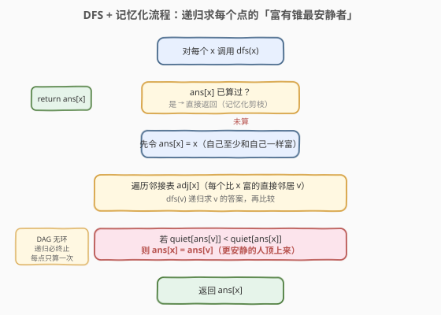
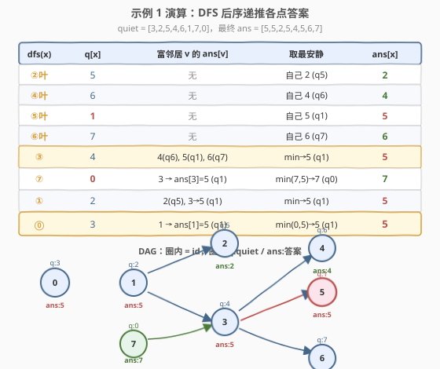

# 喧闹和富有

- **题目名称**：喧闹和富有
- **链接**：[851. 喧闹和富有](https://leetcode.cn/problems/loud-and-rich/)
- **难度**：中等
- **标签**：深度优先搜索、图、拓扑排序、有向无环图

## 1. 题目概述

有 $n$ 个人，编号 $0$ 到 $n-1$，每个人有不同数目的钱和不同的安静值。给定数组 `richer`，其中 `richer[i] = [ai, bi]` 表示 person $a_i$ **比** person $b_i$ **更有钱**；另给数组 `quiet`，`quiet[i]` 是 person $i$ 的安静值。题目保证 `richer` 的数据**逻辑自洽**（不会同时出现 $x$ 比 $y$ 富且 $y$ 比 $x$ 富，即无矛盾环）。

返回数组 `answer`，其中 `answer[x] = y` 表示：在所有**拥有的钱肯定不少于** person $x$ 的人中，person $y$ **最不安静**（即 `quiet[y]` 最小）。

**示例 1**：

```text
输入：richer = [[1,0],[2,1],[3,1],[3,7],[4,3],[5,3],[6,3]], quiet = [3,2,5,4,6,1,7,0]
输出：[5,5,2,5,4,5,6,7]
解释：
  answer[0] = 5：比 0 富的有 1,2,3,4,5,6，其中 5 最安静（quiet=1）。
  answer[7] = 7：比 7 富的有 3,4,5,6，加上 7 自己，7 最安静（quiet=0）。
```

**示例 2**：

```text
输入：richer = [], quiet = [0]
输出：[0]
```

**约束条件**：

- $n == \text{quiet.length}$
- $1 \le n \le 500$
- $0 \le \text{quiet}[i] < n$，且 `quiet` 所有值**互不相同**
- $0 \le \text{richer.length} \le \dfrac{n(n-1)}{2}$
- $0 \le a_i, b_i < n$，$a_i \ne b_i$，且 `richer` 中所有数对**互不相同**
- `richer` 的观察逻辑自洽（构成**有向无环图**）

> 💡 题眼在「不少于 person $x$ 的人」——这包括 $x$ 自己和**所有比 $x$ 富的人**（含间接更富的）。富有关系是传递的（$a$ 富于 $b$、$b$ 富于 $c$ ⇒ $a$ 富于 $c$），且无环，天然是一张**有向无环图（DAG）**。求每个点的「祖先闭包中最安静者」正是 DAG 上 DP 的招牌题。

---

## 2. 解题思路

> ⚠️ **建图方向**：`[ai, bi]` 表示「$a_i$ 比 $b_i$ 富」，本文统一建边 $b_i \to a_i$（**穷人指向富人**）。这样从 $x$ 出发能到达的所有点，恰好就是「比 $x$ 富的人」全集。这是本题最易写反的细节——若建成 $a_i \to b_i$，DFS 走到的是比 $x$ 穷的人，方向就错了。

### 2.1 暴力思路

对每个 person $x$，从 $x$ 出发做一次 BFS/DFS 遍历整张图，收集所有可达点（比 $x$ 富的人），再在其中找 `quiet` 最小者。共 $n$ 次遍历，每次 $O(V+E)$，总复杂度 $O(n \cdot (V+E))$。$n = 500$ 时约 $500 \times (500 + 124750) \approx 6 \times 10^7$，能过但浪费——**每个点的「富人集合」被重复计算**，富人关系是闭包结构，相邻点的答案可以复用。

优化方向：利用 DAG 的子结构——**$x$ 的答案可由「$x$ 自己」和「每个直接富邻居的答案」合并得出**，无需重新遍历整片富人区。这就是 DFS + 记忆化。

### 2.2 核心观察：富有锥上的最值 DP

![富有关系建 DAG：边 穷→富，answer[x] = x 富有锥里最安静的人](../images/loud_rich_dag_concept.svg)

关键洞察：定义 `ans[x]` 为「不少于 $x$ 的人中最安静者的编号」，则有递推：

$$\text{ans}[x] = \arg\min_{\text{quiet}} \Big(\{x\} \;\cup\; \{\text{ans}[v] : v \in \text{adj}[x]\}\Big)$$

即 $x$ 的候选集 = 自己 + 每个直接富邻居 $v$ 的答案。因为 $v$ 的答案 `ans[v]` 已经涵盖「不少于 $v$ 的人中最安静者」，而「不少于 $v$」⊇「不少于 $x$ 中比 $x$ 富的那部分」（$v$ 富于 $x$，比 $v$ 更富的也富于 $x$）。所以**只需比较自己与各富邻居的答案**，取 `quiet` 最小者即可，无需逐个枚举富人。

> 💡 **为什么这个递推成立？** 把富有关系看成 DAG（边 穷→富），$x$ 的「富有锥」= $x$ 自己 + 所有从 $x$ 可达的点。对 $x$ 的每个直接富邻居 $v$，$v$ 的富有锥是 $x$ 富有锥的一个子区域（去掉 $x$ 后按 $v$ 划分）。`ans[v]` 是该子区域的最安静者。把 $x$ 自己和所有子区域的最安静者放一起比一次，就得到整个锥的最安静者。这是**DAG 上的后序 DP**——先算「更富」的（更深节点），再回传合并给「更穷」的。

> ⚠️ **无环保证终止**：题目保证富有关系逻辑自洽，构成 DAG。DFS 沿「穷→富」方向递归，每走一步钱严格增加，不可能回到已访问点，因此递归必然终止，无需 `visited` 防环（但记忆化数组天然起到防重复的作用）。

### 2.3 算法流程图



**完整步骤**：

1. **建邻接表**：对每条 `[ai, bi]`，加入边 `bi → ai`（穷人指向富人）。
2. **初始化** `ans` 数组为 `-1`（表示未计算），用作记忆化标记。
3. **对每个 $x$ 调用 `dfs(x)`**：
   - 若 `ans[x] != -1`，直接返回（记忆化剪枝）。
   - 先令 `ans[x] = x`（自己至少和自己一样富，自己是候选）。
   - 遍历 `adj[x]` 中每个富邻居 $v$：递归 `dfs(v)` 求出 `ans[v]`，若 `quiet[ans[v]] < quiet[ans[x]]`，则 `ans[x] = ans[v]`。
   - 返回 `ans[x]`。
4. **返回** `ans` 数组。

> 💡 **记忆化的收益**：每个点只被完整计算一次，后续被富邻居再次访问时直接返回。总时间 $O(V + E)$，相比暴力的 $O(n(V+E))$ 快了一个因子 $n$。

### 2.4 示例演算



以示例 1 为例，`richer = [[1,0],[2,1],[3,1],[3,7],[4,3],[5,3],[6,3]]`，`quiet = [3,2,5,4,6,1,7,0]`。

建邻接表（穷→富）：

```text
0 → 1
1 → 2, 3
7 → 3
3 → 4, 5, 6
```

DFS 从 0 出发，按后序递归（先算最富的叶子，再回传）：

| dfs(x) | quiet[x] | 富邻居 v 的 ans[v] | 取最安静 | ans[x] |
|--------|----------|--------------------|----------|--------|
| dfs(2)（叶） | 5 | 无 | 自己 2 (q5) | 2 |
| dfs(4)（叶） | 6 | 无 | 自己 4 (q6) | 4 |
| dfs(5)（叶） | 1 | 无 | 自己 5 (q1) | 5 |
| dfs(6)（叶） | 7 | 无 | 自己 6 (q7) | 6 |
| dfs(3) | 4 | 4(q6), 5(q1), 6(q7) | min→5 (q1) | 5 |
| dfs(7) | 0 | 3→ans[3]=5 (q1) | min(7,5)→7 (q0) | 7 |
| dfs(1) | 2 | 2(q5), 3→5 (q1) | min→5 (q1) | 5 |
| dfs(0) | 3 | 1→ans[1]=5 (q1) | min(0,5)→5 (q1) | 5 |

最终 `ans = [5, 5, 2, 5, 4, 5, 6, 7]`，与示例一致。

> 💡 **观察**：person 5 的 `quiet=1`，在 0、1、3 的富有锥里都是最安静的，故 `ans[0]=ans[1]=ans[3]=5`；person 7 的 `quiet=0` 全局最静，但**它不在 0 的富有锥内**（7 比 3 穷，3 比 1 穷，1 比 0 富——7 富于 3 吗？不，是 3 富于 7，所以 7 比 0 穷，不在 0 的富人集合里），所以 `ans[0]` 不是 7。而 `ans[7]=7` 是因为 7 自己在其富人锥里最静。这正说明**富有锥的方向性**：只往「更富」的方向传播。

---

## 3. 参考代码

### 方法一：DFS + 记忆化（推荐）

### C++

```cpp
class Solution {
    vector<vector<int>> adj;
    vector<int> ans;
    vector<int> quiet;

    void dfs(int x) {
        if (ans[x] != -1) return;          // 记忆化：已算过直接返回
        ans[x] = x;                        // 自己是初始候选
        for (int v : adj[x]) {             // v 是比 x 富的直接邻居
            dfs(v);
            if (quiet[ans[v]] < quiet[ans[x]])
                ans[x] = ans[v];           // 更安静的人顶上来
        }
    }
public:
    vector<int> loudAndRich(vector<vector<int>>& richer, vector<int>& quiet) {
        int n = quiet.size();
        adj.assign(n, {});
        for (auto& r : richer)             // [ai,bi]: ai 比 bi 富 → 建边 bi→ai
            adj[r[1]].push_back(r[0]);
        this->quiet = quiet;
        ans.assign(n, -1);
        for (int i = 0; i < n; ++i) dfs(i);
        return ans;
    }
};
```

### Python

```python
class Solution:
    def loudAndRich(self, richer: List[List[int]], quiet: List[int]) -> List[int]:
        n = len(quiet)
        adj = [[] for _ in range(n)]
        for a, b in richer:                # a 比 b 富 → 建边 b→a
            adj[b].append(a)
        ans = [-1] * n

        def dfs(x: int) -> None:
            if ans[x] != -1:               # 记忆化：已算过直接返回
                return
            ans[x] = x                     # 自己是初始候选
            for v in adj[x]:               # v 是比 x 富的直接邻居
                dfs(v)
                if quiet[ans[v]] < quiet[ans[x]]:
                    ans[x] = ans[v]        # 更安静的人顶上来

        for i in range(n):
            dfs(i)
        return ans
```

> ⚠️ **Python 递归深度**：$n \le 500$，最坏链状 DAG 深度 500，接近默认上限 1000 尚可。若本地报 `RecursionError`，加 `sys.setrecursionlimit(2000)` 或改用方法二拓扑排序（迭代，无栈风险）。

> 💡 **比较的是 `quiet[ans[v]]` 而非 `quiet[v]`**：富邻居 $v$ 的答案 `ans[v]` 可能是比 $v$ 更富且更安静的人，所以要用 `ans[v]` 代表「$v$ 那一侧富人区的最安静者」参与比较，而不是只看 $v$ 自己。这是递推正确性的关键。

---

## 4. 复杂度分析

| 维度 | 复杂度 | 说明 |
|------|--------|------|
| **时间复杂度** | $O(n + m)$ | 每个点只被完整计算一次（记忆化保证），每条边在递归遍历邻接表时访问一次。$n$ 为人数，$m$ 为 `richer` 条数 |
| **空间复杂度** | $O(n + m)$ | 邻接表 $O(n + m)$、`ans` 数组 $O(n)$、递归栈最坏 $O(n)$（链状 DAG） |

> ⚠️ 本题已是最优——必须至少访问每个点和每条边一次才能确定答案，$O(n+m)$ 是下界。记忆化把暴力的 $O(n(n+m))$ 降到 $O(n+m)$，本质是**DAG 上的拓扑序 DP**，每个子问题只解一次。

---

## 5. 扩展：拓扑排序（Kahn）解法

DFS+记忆化是「自顶向下」的 DAG DP。也可换成「自底向上」的 Kahn 拓扑排序：**按富人优先的拓扑序处理**，把答案从富人向穷人传播。

建图方向改为 **富→穷**（`ai → bi`），则入度 0 的点是最富有的人。Kahn 按入度 0 出队，恰好「富人先处理」。处理 $u$ 时其答案已确定（所有比 $u$ 富的都已处理并传播给 $u$），再松弛每条 $u \to v$（$v$ 比 $u$ 穷）：用 `ans[u]` 更新 `ans[v]`。

```cpp
class Solution {
public:
    vector<int> loudAndRich(vector<vector<int>>& richer, vector<int>& quiet) {
        int n = quiet.size();
        vector<vector<int>> adj(n);
        vector<int> indegree(n, 0);
        for (auto& r : richer) {           // [ai,bi]: ai 比 bi 富 → 建边 ai→bi（富→穷）
            adj[r[0]].push_back(r[1]);
            indegree[r[1]]++;
        }
        vector<int> ans(n);
        for (int i = 0; i < n; ++i) ans[i] = i;   // 初始：每人最不安静的是自己
        queue<int> q;
        for (int i = 0; i < n; ++i) if (indegree[i] == 0) q.push(i);
        while (!q.empty()) {
            int u = q.front(); q.pop();
            for (int v : adj[u]) {                 // u 富于 v → 把 ans[u] 传给 v
                if (quiet[ans[u]] < quiet[ans[v]])
                    ans[v] = ans[u];
                if (--indegree[v] == 0) q.push(v);
            }
        }
        return ans;
    }
};
```

> 💡 **两种解法对比**：DFS+记忆化写法更短、思路更直观（自顶向下，符合「求 $x$ 就递归求富人」的自然表达）；Kahn 拓扑排序是迭代实现，无栈溢出风险，且天然给出一个合法的富人序。两者复杂度相同 $O(n+m)$，面试中任选其一即可，可视数据规模（$n$ 大时 Kahn 更稳）和个人偏好决定。

> ⚠️ **Kahn 中 `ans` 初始化为自身**：与 DFS 的「先令 `ans[x]=x`」对应。因为每人「不少于自己」至少包含自己，初始候选就是自己；之后富人传播来的更安静者会逐步顶替。拓扑序保证当 $v$ 入度归零被处理时，所有比 $v$ 富的 $u$ 都已松弛过 $v$，`ans[v]` 已是最终值。

---

## 6. 面试要点

1. **如何把富有关系抽象成图？为什么是 DAG？**

   - `[ai, bi]` 表示 $a_i$ 富于 $b_i$，建边 $b_i \to a_i$（穷指富），则从 $x$ 可达的点 = 比 $x$ 富的人。题目保证逻辑自洽（无 $x$ 富于 $y$ 且 $y$ 富于 $x$ 的矛盾），故富有关系是严格偏序，构成的图无环，是 DAG。

2. **DFS 的递推式怎么推导？**

   - `ans[x]` = 不少于 $x$ 的人中最安静者 = $\arg\min$ over $\{x\} \cup \{\text{ans}[v] : v \in \text{adj}[x]\}$。因为每个直接富邻居 $v$ 的答案已涵盖「比 $v$ 富（即比 $x$ 更富）的最安静者」，把 $x$ 自己和所有富邻居的答案放一起取 `quiet` 最小即可，不必逐个枚举富人。

3. **为什么比较 `quiet[ans[v]]` 而不是 `quiet[v]`？**

   - 富邻居 $v$ 的最安静者可能不是 $v$ 本人，而是比 $v$ 更富的某个人（已存在 `ans[v]` 里）。所以要用 `ans[v]` 代表 $v$ 那一侧富人区的最安静者参与比较，递推才完整。

4. **记忆化为什么有效？每个点算几次？**

   - DAG 上每个子问题「$x$ 的富人锥最安静者」只解一次，结果存入 `ans[x]`。后续被其他穷人再次访问时直接返回。每个点完整计算一次，每条边访问一次，总时间 $O(n+m)$。

5. **DFS 和拓扑排序两种解法有何异同？**

   - 都是 DAG 上的 DP，复杂度相同 $O(n+m)$。DFS 自顶向下（求 $x$ 时递归求富人），写法简洁；Kahn 自底向上（富人先出队，向穷人传播答案），迭代无栈风险。$n$ 较大（接近递归上限）时 Kahn 更稳，否则 DFS 更短。

> 💡 **一句话总结**：851 的核心是**DAG 上的后序 DP**——建边「穷→富」，`ans[x] = 自己与各富邻居答案中 quiet 最小者`，DFS+记忆化或拓扑排序均可，$O(n+m)$ 时间、$O(n+m)$ 空间一次遍历求出所有人的答案。

---

## 7. 同类练习题

- [207. 课程表](https://leetcode.cn/problems/course-schedule/)：拓扑排序判环入门，与本题同为 DAG 家族，但关心能否拓扑序排完（判环）而非逐点 DP
- [210. 课程表 II](https://leetcode.cn/problems/course-schedule-ii/)：返回一个合法拓扑序，Kahn 直接产出顺序，是本题拓扑解法的母题
- [802. 找到最终的安全状态](https://leetcode.cn/problems/find-eventual-safe-states/)：DAG/反图拓扑，从「安全点」反向 BFS，与本题「从富人向穷人传播」同构
- [329. 矩阵中的最长递增路径](https://leetcode.cn/problems/longest-increasing-path-in-a-matrix/)：网格 DAG 上的记忆化 DFS，求每个点出发的最长路径，与本题「DAG 后序 DP + 记忆化」完全同构（本题求锥内最值，它求锥内最长）
