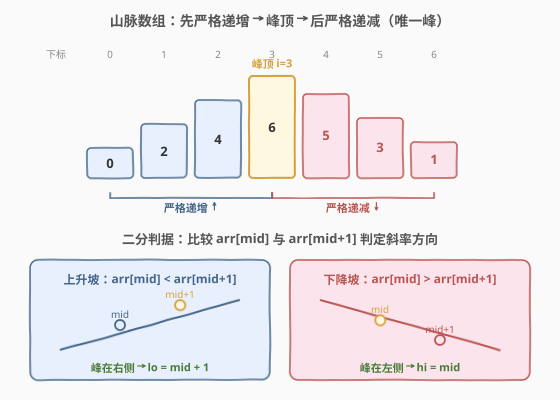

# LeetCode 山脉数组的峰顶索引 题解

## 1. 题目概述

- **标题 / 题号**：山脉数组的峰顶索引（#852，easy）
- **链接**：https://leetcode.cn/problems/peak-index-in-a-mountain-array/
- **难度**：简单
- **标签**：数组、二分查找

**题意**：给定一个长度为 $n \ge 3$ 的**山脉数组** `arr`，即存在某个下标 $i$（$0 < i < n - 1$）使得：

- $i$ 左侧严格递增：$\text{arr}[0] < \text{arr}[1] < \cdots < \text{arr}[i-1] < \text{arr}[i]$
- $i$ 右侧严格递减：$\text{arr}[i] > \text{arr}[i+1] > \cdots > \text{arr}[n-1]$

要求返回这个**峰顶下标** $i$。题目保证 `arr` 一定是山脉数组（有且仅有一个峰顶）。

**示例 1**：

```text
输入：arr = [0,1,0]
输出：1
解释：arr[0]=0 < arr[1]=1 > arr[2]=0，峰顶在下标 1。
```

**示例 2**：

```text
输入：arr = [0,2,1,0]
输出：1
```

**示例 3**：

```text
输入：arr = [0,10,5,2]
输出：1
```

**约束**：

- `3 <= arr.length <= 10^4`
- `0 <= arr[i] <= 10^9`
- `arr` 保证是山脉数组

> 💡 本题是 [162. 寻找峰值](../0101-0200/162_寻找峰值.md) 的**特化版**：162 在「相邻不等」的任意数组里找任意一个局部峰，而 852 保证整个数组就是**唯一的一座山**（先严格增后严格减）。约束更强 → 二段性更天然 → 同样的斜率二分即可 $O(\log n)$ 解决。

## 2. 解题思路

### 2.1 暴力思路：线性扫描

从左到右扫描，第一个满足 `arr[i] > arr[i+1]` 的下标 $i$ 即为峰顶——因为左侧一直严格递增，首次出现下降的位置必然是峰。时间 $O(n)$、空间 $O(1)$，简单正确，但**没有利用山脉的结构性**。题目数据规模 $n \le 10^4$ 时 $O(n)$ 能过，但若 $n$ 更大则需对数解法。

> ⚠️ 暴力法把「找峰顶」当成了普通的线性搜索，忽视了「先增后减」这一全局单调结构。一旦意识到**上升段和下降段各占一半**，就能用二分把搜索空间从 $n$ 压缩到 $\log n$。

### 2.2 核心观察：斜率二分



关键直觉：**不需要知道峰顶在哪，只要比较中点 `arr[mid]` 与右邻居 `arr[mid+1]`，就能判断峰顶落在哪一半**。

- 若 $\text{arr}[mid] < \text{arr}[mid+1]$：`mid` 处于**上升坡**。峰顶严格在 `mid` 右侧（`mid` 自身小于右邻居，不可能是峰），故**向右收缩**：`lo = mid + 1`。
- 若 $\text{arr}[mid] > \text{arr}[mid+1]$：`mid` 处于**下降坡**。峰顶在 `mid` 或其左侧（`mid` 已大于右邻居，只差再大于左邻居即成峰），故**向左收缩**：`hi = mid`（保留 `mid`）。

> 💡 **一句话直觉**：站在山坡上，往**高的那一边**走一定能到顶。上升坡往右走（`lo = mid+1`），下降坡往左走（`hi = mid`），每一步把搜索区间折半，最终收敛到峰顶。

**为什么 852 比 162 更「天然」？** 162 需要借助两端 $-\infty$ 的虚拟边界来论证「沿斜率走必达峰」；而 852 保证整个数组就是一座山，峰顶严格位于内部（$0 < i < n-1$），上升段与下降段天然地把数组分成两半，二段性无需额外假设。

> ⚠️ **两个收缩细节**：(1) 上升坡用 `lo = mid + 1`——`mid` 已被排除（它小于右邻居不可能是峰）；(2) 下降坡用 `hi = mid` 而非 `hi = mid - 1`——`mid` 本身可能是峰（已大于右邻居），必须保留。这是「找满足条件的下标」型二分的标准写法，与 [704. 二分查找](../0701-0800/704_二分查找.md) 的闭区间模板在边界处理上不同。

### 2.3 算法流程图

![算法流程：斜率二分，每轮比较 arr[mid] 与 arr[mid+1]](../images/peak_idx_algorithm_flow.svg)

**完整步骤**：

1. **初始化**：`lo = 0`，`hi = n - 1`。
2. **循环** `while lo < hi`：
   - `mid = lo + (hi - lo) / 2`（防溢出写法）。
   - 若 $\text{arr}[mid] < \text{arr}[mid+1]$：上升坡，`lo = mid + 1`。
   - 否则（$\text{arr}[mid] > \text{arr}[mid+1]$）：下降坡，`hi = mid`。
3. **返回** `lo`（此时 `lo == hi`，区间缩为一点即峰顶）。

> 💡 **循环条件用 `lo < hi` 而非 `lo <= hi`**：当 `lo == hi` 时区间只剩一个元素，由收敛过程保证它就是峰顶，直接返回无需再进循环。这也保证 `mid < hi = n-1`，从而 `mid + 1 <= n-1`，访问 `arr[mid+1]` 永不越界。

### 2.4 示例演算

以 `arr = [0,2,4,6,5,3,1]`（$n = 7$，峰顶在下标 3）为例，每轮比较 `arr[mid]` 与 `arr[mid+1]` 决定收缩方向：

![示例演算：arr = [0,2,4,6,5,3,1]，3 轮二分锁定峰顶下标 3](../images/peak_idx_example_walkthrough.svg)

| 轮次 | lo | hi | mid | arr[mid] vs arr[mid+1] | 斜率 | 动作 |
|------|----|----|-----|------------------------|------|------|
| 1 | 0 | 6 | 3 | 6 vs 5 → $6 > 5$ | 下降 ↓ | `hi = mid = 3` |
| 2 | 0 | 3 | 1 | 2 vs 4 → $2 < 4$ | 上升 ↑ | `lo = mid + 1 = 2` |
| 3 | 2 | 3 | 2 | 4 vs 6 → $4 < 6$ | 上升 ↑ | `lo = mid + 1 = 3` |
| 结束 | 3 | 3 | — | `lo == hi == 3` | — | 返回 3 ✓ |

3 轮二分即锁定峰顶 `arr[3] = 6`。对比线性扫描需从左逐个比较到首次下降（下标 3），二分将对比较次数从 $O(n)$ 降到 $O(\log n)$。

> 💡 **观察收缩模式**：第 1 轮 `mid=3` 恰好命中峰顶，但因 `arr[3] > arr[4]` 判为下降坡，执行 `hi = mid = 3`（而非直接返回）——这没关系，因为峰顶本身满足 `arr[mid] > arr[mid+1]`，会被保留在区间内。后续两轮在 `[0,3]` 内继续上升坡向右逼近，最终 `lo` 追上 `hi` 收敛到 3。

## 3. 参考代码

### C++

```cpp
class Solution {
public:
    int peakIndexInMountainArray(vector<int>& arr) {
        int lo = 0, hi = arr.size() - 1;
        while (lo < hi) {
            int mid = lo + (hi - lo) / 2;
            if (arr[mid] < arr[mid + 1]) {
                lo = mid + 1;   // 上升坡：峰在右，mid 不可能是峰
            } else {
                hi = mid;        // 下降坡：峰在左含 mid
            }
        }
        return lo;
    }
};
```

### Python

```python
class Solution:
    def peakIndexInMountainArray(self, arr: List[int]) -> int:
        lo, hi = 0, len(arr) - 1
        while lo < hi:
            mid = (lo + hi) // 2
            if arr[mid] < arr[mid + 1]:
                lo = mid + 1   # 上升坡：峰在右，mid 不可能是峰
            else:
                hi = mid        # 下降坡：峰在左含 mid
        return lo
```

> 💡 两版逻辑完全一致，与 [162. 寻找峰值](../0101-0200/162_寻找峰值.md) 的代码**逐字符相同**——区别仅在函数名。这是因为 852 是 162 的特化：山脉数组的强约束保证了唯一峰、排除了平台与多峰，但二分的「斜率判据」本身不变。面试中先写 852 版，再被追问「如果数组不保证是山脉呢」即可自然过渡到 162。

## 4. 复杂度分析

| 维度 | 复杂度 | 说明 |
|------|--------|------|
| **时间复杂度** | $O(\log n)$ | 每轮把搜索区间 $[lo, hi]$ 折半，仅做 1 次比较，共 $\lceil \log_2 n \rceil$ 轮 |
| **空间复杂度** | $O(1)$ | 仅 `lo` / `hi` / `mid` 三个变量，无额外空间 |

> ⚠️ 若误把 `hi = mid` 写成 `hi = mid - 1`，当 `mid` 恰为峰顶时会把它错误排除，导致返回错误下标。`hi = mid` 是保留候选的关键。

## 5. 扩展：852 vs 162 —— 约束强弱与二段性

852 与 [162. 寻找峰值](https://leetcode.cn/problems/find-peak-element/) 是「同一套二分模板、不同约束强度」的对照题，理解二者的差异有助于掌握斜率二分的适用边界。

| 维度 | 852 山脉数组的峰顶索引 | 162 寻找峰值 |
|------|------------------------|--------------|
| **数组性质** | 整体先严格增后严格减（唯一一座山） | 仅保证相邻不等，可能有多个峰/谷 |
| **峰的个数** | 唯一 | 可能多个，返回任意一个即可 |
| **边界假设** | 无需虚拟边界，峰严格在内部 | 两端外视为 $-\infty$，保证峰存在 |
| **二段性来源** | 上升段/下降段天然二分整个数组 | 依赖 $-\infty$ 边界论证「沿斜率走必达峰」 |
| **二分代码** | 完全相同 | 完全相同 |

> 💡 **本质洞察**：二分能工作，靠的不是「数组有序」，而是**「中点处的局部信息能排除一半搜索空间」**这一二段性。852 的强约束让二段性更显然（整个数组只有上升/下降两种状态），162 的弱约束需要额外边界假设来补全二段性，但二分骨架不变。这正是「二分一个性质而非二分值」思想的体现。

**进阶变体**：[1095. 山脉数组中查找目标值](https://leetcode.cn/problems/find-in-mountain-array/) 在 852 基础上再加一层——先用 852 的斜率二分定位峰顶，再在左侧升序段与右侧降序段分别做常规二分查找，是「斜率二分 + 有序二分」的综合应用。

## 6. 面试要点

1. **为什么山脉数组能二分？二段性体现在哪？**

   - 山脉数组的上升段和下降段把整个数组天然分成两半。对任意 `mid`，`arr[mid]` 与 `arr[mid+1]` 的大小关系唯一判定 `mid` 处于上升坡还是下降坡，从而确定峰顶在左半还是右半。这种「局部比较排除一半」的性质就是二段性，与有序数组二分同构。

2. **为什么下降坡用 `hi = mid` 而不是 `hi = mid - 1`？**

   - 下降坡时 `arr[mid] > arr[mid+1]`，`mid` 已大于右邻居，它自身就可能是峰顶（只需再大于左邻居）。若写 `hi = mid - 1` 会把 `mid` 这个候选错误排除，可能漏掉峰顶。`hi = mid` 保留 `mid` 是「找满足条件下标」型二分的标准边界处理。

3. **循环条件为什么用 `lo < hi` 而非 `lo <= hi`？**

   - 当 `lo == hi` 时区间只剩一个元素，由收敛过程（每轮都正确排除了非峰那一半）保证它就是峰顶，直接返回即可。用 `lo <= hi` 时最后一轮 `lo == hi` 会让 `mid == lo == hi`，此时 `mid + 1` 可能越界（若 `hi == n-1`）。`lo < hi` 保证进入循环时至少两个元素，`mid < hi <= n-1`，访问 `arr[mid+1]` 安全。

4. **852 和 162 的代码完全一样，区别在哪？**

   - 代码逐字符相同（仅函数名不同），区别在**前提假设**：852 保证整个数组是山脉（唯一峰、严格先增后减），162 只保证相邻不等（可能多峰、含局部谷）。852 的强约束让二段性无需 $-\infty$ 边界假设就成立；162 需要虚拟边界来论证「沿斜率走必达峰」。面试中可先写 852，再被追问弱化约束时自然引出 162。

5. **线性扫描 $O(n)$ 和二分 $O(\log n)$ 在本题实际差异大吗？**

   - $n \le 10^4$ 时 $O(n)$ 约 $10^4$ 次比较、$O(\log n)$ 约 14 次，都能 AC。但二分体现的是「利用结构性质压缩搜索空间」的思维——当 $n$ 放大到 $10^9$（如 [1095](https://leetcode.cn/problems/find-in-mountain-array/) 的交互题有调用次数限制），线性扫描会超时/超限，二分是必须的。

> 💡 **一句话总结**：852 是斜率二分的入门模板——比较 `arr[mid]` 与 `arr[mid+1]`，上升坡向右（`lo=mid+1`）、下降坡向左含 mid（`hi=mid`），`lo==hi` 即峰顶。$O(\log n)$ / $O(1)$，与 162 同骨架，是 162 在山脉强约束下的特化版。

## 同类练习题

| # | 题目 | 与本题的关联 |
|---|------|-------------|
| 162 | [寻找峰值](https://leetcode.cn/problems/find-peak-element/)（[题解](../0101-0200/162_寻找峰值.md)） | 852 的泛化版——任意数组找任意局部峰，同套斜率二分，需 $-\infty$ 边界论证二段性 |
| 1095 | [山脉数组中查找目标值](https://leetcode.cn/problems/find-in-mountain-array/) | 先用 852 定位峰顶，再在升/降两段分别二分，综合斜率二分 + 有序二分 |
| 845 | [数组中的最长山脉](https://leetcode.cn/problems/longest-mountain-in-array/)（[题解](../0801-0900/845_数组中的最长山脉.md)） | 852 的「多山」版——数组中可能有多座山，求最长一座，峰顶锚定 + 双向扩臂 $O(n)$ |
| 941 | [有效的山脉数组](https://leetcode.cn/problems/valid-mountain-array/) | 判定整个数组是否构成一座山（布尔判定 vs 852 的返回峰顶下标），同套山脉结构 |
| 704 | [二分查找](https://leetcode.cn/problems/binary-search/)（[题解](../0701-0800/704_二分查找.md)） | 一切二分的母题，对比「有序数组二分值」与 852「无整体有序但二分性质」两种范式 |
