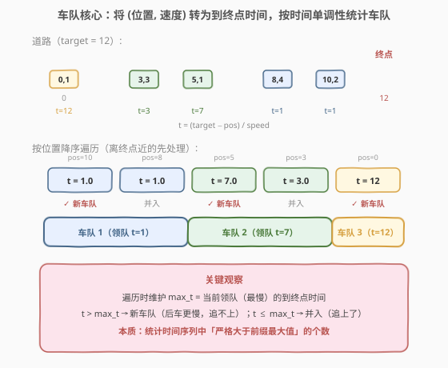
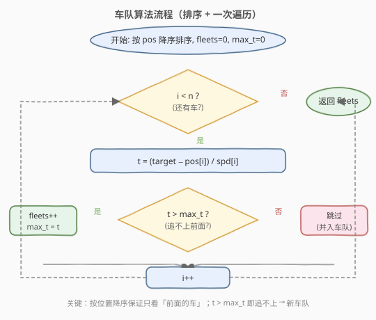
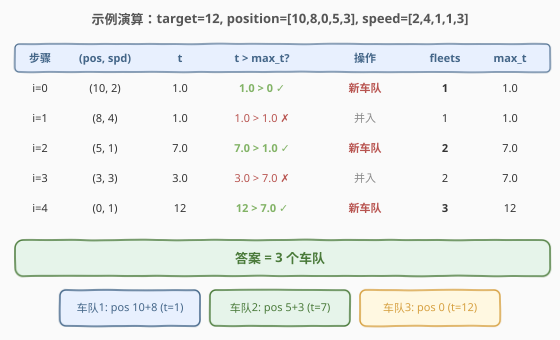

# 车队

- **题目名称**：车队
- **链接**：[853. 车队](https://leetcode.cn/problems/car-fleet/)
- **难度**：中等
- **标签**：排序、单调栈、贪心

## 1. 题目概述

在一条单行道上，有 `n` 辆车开往同一目的地，目的地在 `target` 英里以外。给定两个整数数组 `position` 和 `speed`，长度均为 `n`，其中 `position[i]` 是第 `i` 辆车的起始位置，`speed[i]` 是其速度（英里/小时）。

**规则**：一辆车永远不会超过前面的另一辆车，但可以追上去，并以较慢车的速度并排行驶。**车队**是指并排行驶的一辆或几辆汽车，车队的速度等于车队中最慢车的速度。即便一辆车在 `target` 处才赶上了一个车队，它们仍然被视作同一个车队。

返回到达目的地的车队数量。

**示例 1**：

```text
输入：target = 12, position = [10,8,0,5,3], speed = [2,4,1,1,3]
输出：3
解释：
  - 从 10（速度 2）和 8（速度 4）开始的车组成一个车队，在 12 相遇。
  - 从 5（速度 1）和 3（速度 3）开始的车组成一个车队，在 6 相遇，以速度 1 到达终点。
  - 从 0（速度 1）开始的车追不上任何车，自己是一个车队。
```

**示例 2**：

```text
输入：target = 10, position = [3], speed = [3]
输出：1
```

**示例 3**：

```text
输入：target = 100, position = [0,2,4], speed = [4,2,1]
输出：1
```

**约束条件**：

- `n == position.length == speed.length`
- $1 \leq n \leq 10^5$
- $0 < \text{target} \leq 10^6$
- $0 \leq \text{position}[i] < \text{target}$
- `position` 中每个值**不同**
- $0 < \text{speed}[i] \leq 10^6$

---

## 2. 解题思路

### 2.1 暴力思路

最直观的暴力方法是**模拟每一辆车的运动过程**：在每个时间步推进所有车的位置，检测追尾事件，合并车队，直到所有车到达终点。但这种方法涉及浮点时间步进、碰撞检测和车队合并，实现复杂且精度难以控制，时间复杂度也无法接受。

### 2.2 核心观察：排序 + 到终点时间单调性



关键转化：**不模拟运动过程，而是直接计算每辆车「如果不被阻挡」到终点所需的时间** $t = (\text{target} - \text{pos}) / \text{speed}$。

> 💡 **为什么只看时间就够了？** 因为单行道不允许超车，后车若比前车**先到或同时到**终点（$t_{\text{后}} \leq t_{\text{前}}$），说明后车更快，必然在途中追上前车并并入其车队；若后车**更慢**（$t_{\text{后}} > t_{\text{前}}$），则永远追不上，形成新车队。

**按位置降序遍历**（从离终点最近的车开始），维护 `max_t`（当前最慢领队的到终点时间）：

- $t > \text{max\_t}$：当前车比所有前面的车都慢，追不上 → **新车队**，更新 `max_t = t`。
- $t \leq \text{max\_t}$：当前车能追上前面的某个车队 → **并入**，不更新 `max_t`。

> ⚠️ **为什么按位置降序？** 只有「前面的车」（离终点更近）才能阻挡「后面的车」。按位置降序遍历，保证处理每辆车时，它前面所有可能阻挡它的车都已被处理过，`max_t` 正确反映了前方最慢车队的到达时间。

### 2.3 算法流程图



注意判定为 `t > max_t` 时**先 `fleets++` 再更新 `max_t`**，保证 `max_t` 始终是当前最慢领队的时间。

### 2.4 示例演算



以 `target=12, position=[10,8,0,5,3], speed=[2,4,1,1,3]` 为例：

1. **排序**（按 position 降序）：`[(10,2), (8,4), (5,1), (3,3), (0,1)]`
2. **逐车处理**：
   - `i=0`：`pos=10, spd=2`，$t = (12-10)/2 = 1.0$。`max_t=0`，$1.0 > 0$ ✓ → 新车队，`fleets=1, max_t=1.0`
   - `i=1`：`pos=8, spd=4`，$t = (12-8)/4 = 1.0$。`max_t=1.0`，$1.0 > 1.0$ ✗ → 并入，`fleets=1`
   - `i=2`：`pos=5, spd=1`，$t = (12-5)/1 = 7.0$。`max_t=1.0`，$7.0 > 1.0$ ✓ → 新车队，`fleets=2, max_t=7.0`
   - `i=3`：`pos=3, spd=3`，$t = (12-3)/3 = 3.0$。`max_t=7.0`，$3.0 > 7.0$ ✗ → 并入，`fleets=2`
   - `i=4`：`pos=0, spd=1`，$t = (12-0)/1 = 12$。`max_t=7.0`，$12 > 7.0$ ✓ → 新车队，`fleets=3, max_t=12`
3. **返回** `fleets = 3`。

---

## 3. 参考代码

### C++

```cpp
class Solution {
  public:
    int carFleet(int target, vector<int>& position, vector<int>& speed) {
        int n = position.size();
        vector<pair<int, int>> cars(n);
        for (int i = 0; i < n; i++) {
            cars[i] = {position[i], speed[i]};
        }
        // 按位置降序排序（离终点近的先处理）
        sort(cars.begin(), cars.end(),
             [](const auto& a, const auto& b) { return a.first > b.first; });

        int fleets = 0;
        double maxTime = 0;
        for (auto& [pos, spd] : cars) {
            double time = (double)(target - pos) / spd;
            if (time > maxTime) {
                fleets++;
                maxTime = time;
            }
        }
        return fleets;
    }
};
```

### Python

```python
class Solution:
    def carFleet(self, target: int, position: List[int], speed: List[int]) -> int:
        # 按位置降序排序（离终点近的先处理）
        cars = sorted(zip(position, speed), reverse=True)

        fleets = 0
        max_time = 0
        for pos, spd in cars:
            time = (target - pos) / spd
            if time > max_time:
                fleets += 1
                max_time = time
        return fleets
```

> ⚠️ **浮点精度**：`time` 使用 `double`（C++）或 `/`（Python 自动浮点）。题目中 `target ≤ 10^6`、`speed ≤ 10^6`，时间值范围合理，`double` 的 15 位有效数字足够精确。若需完全避免浮点，可用交叉乘法比较：判断 $t_i > t_j$ 等价于 $(\text{target} - \text{pos}_i) \times \text{spd}_j > (\text{target} - \text{pos}_j) \times \text{spd}_i$，但维护 `max_t` 时需额外保存对应的 `(target-pos, spd)` 对，代码更复杂。

---

## 4. 复杂度分析

| 维度 | 复杂度 | 说明 |
|------|--------|------|
| 时间复杂度 | $O(n \log n)$ | 排序 $O(n \log n)$ + 一次遍历 $O(n)$ |
| 空间复杂度 | $O(n)$ | 存储 `(position, speed)` 配对数组 |

---

## 5. 扩展：单调栈视角

本题可以从**单调栈**的角度理解：按位置降序遍历，将每辆车的到终点时间压入栈中，若栈顶时间 $\leq$ 当前时间则弹出（表示后车追上并并入前车），最后栈中剩余元素个数即为车队数。

```python
stack = []
for pos, spd in sorted(zip(position, speed), reverse=True):
    time = (target - pos) / spd
    if not stack or time > stack[-1]:
        stack.append(time)
return len(stack)
```

但因为我们只需要**计数**而非保留每条记录，用一个变量 `max_time` 代替栈即可，将空间从 $O(n)$ 优化到 $O(1)$（不含排序的配对数组）。这与 [739. 每日温度](https://leetcode.cn/problems/daily-temperatures/) 中「单调栈只关心最近更大值」的思想一脉相承，只是此处关心的是「前缀最大值」。

> 💡 **本质**：统计时间序列中「严格大于前缀最大值」的元素个数。这与 [315. 计数右侧小于当前元素的个数](https://leetcode.cn/problems/count-of-smaller-numbers-after-self/) 的归并思路不同——本题只需求一维序列的前缀最大跳跃次数，单次遍历即可。

---

## 6. 面试要点

1. **为什么按位置降序排序？**

   - 只有离终点更近的车（在前方）才能阻挡后方的车。按位置降序遍历，保证处理每辆车时，所有可能阻挡它的车都已被处理，`max_time` 正确反映前方最慢车队的到达时间。

2. **为什么用 `t > max_t`（严格大于）而不是 `t >= max_t`？**

   - 若 $t = \text{max\_t}$，后车与前方最慢车队同时到达终点。题目规定「在 target 处赶上仍算同一车队」，因此等号归为「并入」而非「新车队」，用严格大于判定新车队。

3. **为什么不需要真正模拟追车过程？**

   - 关键洞察：后车能否追上前车，**完全由两者的到终点时间决定**。$t_{\text{后}} \leq t_{\text{前}}$ 意味着后车更快，必然在途中某点追上。我们只关心「能否追上」这个布尔结果，不需要知道追上的具体位置或时间。

4. **如果题目改为允许超车，会怎样？**

   - 允许超车则每辆车独立到达终点，车队数恒等于车辆数 $n$。本题的核心难度正是「不允许超车」带来的车队合并效应。

5. **能否不用排序？**

   - 可以用值域数组代替排序：由于 $\text{position}[i] < \text{target} \leq 10^6$，可建立一个长度为 `target` 的数组，直接将每辆车的速度按位置写入，然后从后往前扫描。时间 $O(n + \text{target})$，空间 $O(\text{target})$。当 `target` 较小时比排序更快，但最坏情况不如 $O(n \log n)$ 通用。

---

## 7. 同类练习题

- [1776. 车队 II](https://leetcode.cn/problems/car-fleet-ii/)：直接续作，需计算每辆车与前方车队的碰撞时间，用单调栈维护「可能碰撞的目标」
- [435. 无重叠区间](https://leetcode.cn/problems/non-overlapping-intervals/)：排序 + 贪心，按右端点排序后维护当前最远结束位置，同类「排序后单次遍历」范式
- [452. 用最少数量的箭引爆气球](https://leetcode.cn/problems/minimum-number-of-arrows-to-burst-balloons/)：排序 + 贪心区间合并，与本题「按位置排序后维护前缀最值」思路一致
- [739. 每日温度](https://leetcode.cn/problems/daily-temperatures/)：单调栈经典题，与本题的单调栈视角相通，但方向相反（向后找更大值 vs 向前找更慢值）
