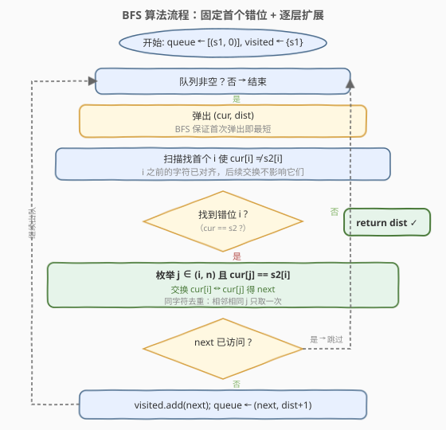
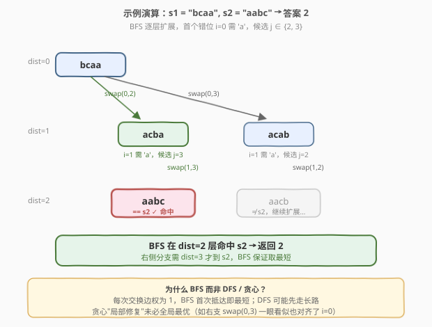

# LeetCode 相似度为K的字符串 题解

## 1. 题目概述

- **标题 / 题号**：相似度为K的字符串（#854，hard）
- **链接**：https://leetcode.cn/problems/k-similar-strings/
- **难度**：困难
- **标签**：广度优先搜索、字符串、哈希表

**题意**：对于两个**字母异位词**（anagram）字符串 `s1` 和 `s2`，可以通过若干次**交换 `s1` 中任意两个位置上的字符**使其等于 `s2`。若恰好 `K` 次交换后 `s1 == s2`，则称二者 **K-相似**。

给定异位词 `s1`、`s2`，返回**最小的**非负整数 `K`，使 `s1`、`s2` K-相似。

**示例 1**：

```text
输入：s1 = "ab", s2 = "ba"
输出：1
解释：交换 s1[0] 与 s1[1]，s1 = "ba" = s2，1 次即可。
```

**示例 2**：

```text
输入：s1 = "abc", s2 = "bca"
输出：2
解释：abc → bac（交换 0,1）→ bca（交换 1,2），共 2 次。
```

**约束**：

- $1 \le \text{s1.length} \le 20$
- `s1` 和 `s2` 只包含小写英文字母
- `s1` 和 `s2` 互为字母异位词（字符多重集相同）

> ⚠️ **关键信号**：① 每次交换的"代价"为 1 且求**最小次数** → **BFS 最短路**；② 状态是字符串本身（$L \le 20$），需用 `visited` 集合去重；③ 直接对全部 $O(L^2)$ 种交换做 BFS 会因分支过大而超时，必须用**"固定首个错位"**剪枝。

## 2. 解题思路

### 2.1 暴力思路：枚举所有交换序列

最朴素的想法是把每个字符串状态看作节点，从 `s1` 出发，每次枚举所有 $\binom{L}{2}$ 种两两交换生成后继状态，用 BFS 找到 `s2` 的最短层数。

但 $L=20$ 时 $\binom{20}{2}=190$，分支因子过大，状态空间指数膨胀，超时。问题在于：**绝大多数交换是无效的**——它们既不修复任何错位，还可能破坏已对齐的位置。

### 2.2 核心观察：固定首个错位 + 只扩展"修复 i"的交换

![核心观察：固定首个错位 i，只枚举能把 s2[i] 换到位置 i 的交换](../images/ksim_concept.svg)

**核心洞察**：设 `cur` 是当前状态，从左到右找到**首个** `cur[i] != s2[i]` 的位置 `i`。任何交换序列最终都必须让位置 `i` 变正确，而**发生在位置 `> i` 上的交换不会影响位置 `i`**。因此我们可以把"修复位置 `i` 的那次交换"提到当前最先执行，而不改变序列长度。

> 💡 **交换论证（可重排性）**：设最优序列中第一次触及位置 `i` 的交换是 `swap(i, k)`（此时 `cur[k] == s2[i]`）。在此之前所有交换都发生在 `> i` 的位置，不影响位置 `i` 上的字符 `cur[i]`，也不影响 `0..i-1` 的已对齐前缀。把 `swap(i, k)` 提到当前这一步先做，剩余交换仍可在新状态上完成同样目标，长度不变。所以**只考虑修复首个错位 `i` 的交换不丢失最优解**。

由此得到剪枝规则：

1. 找首个 `cur[i] != s2[i]` 的 `i`（若不存在则 `cur == s2`，已到终点）。
2. 枚举 `j > i` 满足 `cur[j] == s2[i]`：交换 `cur[i]` 与 `cur[j]` 得到后继状态 `next`。
3. 分支因子从 $O(L^2)$ 降到"字符 `s2[i]` 在后缀中的频次"，大幅缩减。

**进一步剪枝：不破坏已对齐位置**。枚举 `j` 时额外要求 `cur[j] != s2[j]`，即**位置 `j` 本身也是错位**时才考虑交换它。若 `cur[j] == s2[j]`（`j` 已正确），交换会让 `j` 由对变错，相当于"拆东墙补西墙"，必然不优。

> ⚠️ **为何 `cur[j] != s2[j]` 不会漏掉所有候选？** 用计数论证：`cur` 与 `s2` 是异位词，且前缀 `0..i-1` 已对齐，所以**后缀 `cur[i..L-1]` 与 `s2[i..L-1]` 也是异位词**。位置 `i` 在 `s2` 中是 `s2[i]`，在 `cur` 中是 `cur[i] != s2[i]`，因此后缀里 `s2[i]` 的字符在 `cur` 中比在 `s2` 中**多出一个**位于"非正确位置"。换言之，必存在至少一个 `j > i` 使 `cur[j] == s2[i]` 且 `cur[j] != s2[j]`。候选永不枯竭。

### 2.3 算法流程图



**关键设计**：

1. **状态**：字符串本身；**边权**：每次交换代价 1，故 BFS 层数即最短交换次数。
2. **visited 去重**：同一字符串可能由不同交换序列到达，首次入队即最短，后续重复直接跳过。
3. **提前返回**：生成 `next` 时若 `next == s2`，立即返回 `dist + 1`，无需等它被弹出。

### 2.4 示例演算

以 `s1 = "bcaa"`、`s2 = "aabc"` 为例（答案为 2）：



**第 0 层**：`cur = "bcaa"`，`dist = 0`

- 找首个错位：`i = 0`（`cur[0]='b'`，`s2[0]='a'`）。
- 枚举 `j > 0` 使 `cur[j] == 'a'` 且 `cur[j] != s2[j]`：`j = 2`（`cur[2]='a'`，`s2[2]='b'`，错位 ✓）、`j = 3`（`cur[3]='a'`，`s2[3]='c'`，错位 ✓）。
- 分支：
  - `swap(0,2)` → `"acba"`，入队 `(dist=1)`。
  - `swap(0,3)` → `"acab"`，入队 `(dist=1)`。

**第 1 层**：先弹出 `"acba"`

- 首个错位 `i = 1`（`cur[1]='c'`，`s2[1]='a'`）。
- 枚举 `j > 1` 使 `cur[j] == 'a'` 且错位：`j = 3`（`cur[3]='a'`，`s2[3]='c'`，错位 ✓）。
- `swap(1,3)` → `"aabc" == s2` → **返回 `dist + 1 = 2`**。

> 💡 **为何不是 1？** 检查所有单次交换：`swap(0,2)`→`"acba"`、`swap(0,3)`→`"acab"`，均不等于 `"aabc"`，1 次不够。BFS 在第 2 层首次命中 `s2`，即最短。右侧 `"acab"` 分支需到第 3 层才到 `s2`，但 BFS 按层扩展，先返回更短的 2。

## 3. 参考代码

### C++

```cpp
class Solution {
public:
    int kSimilarity(string s1, string s2) {
        if (s1 == s2) return 0;
        int n = s1.size();
        queue<pair<string, int>> q;
        unordered_set<string> visited;
        q.push({s1, 0});
        visited.insert(s1);
        while (!q.empty()) {
            auto [cur, dist] = q.front(); q.pop();
            int i = 0;
            while (i < n && cur[i] == s2[i]) ++i;
            for (int j = i + 1; j < n; ++j) {
                if (cur[j] != s2[i] || cur[j] == s2[j]) continue;
                string nxt = cur;
                swap(nxt[i], nxt[j]);
                if (nxt == s2) return dist + 1;
                if (visited.insert(nxt).second) {
                    q.push({nxt, dist + 1});
                }
            }
        }
        return -1;
    }
};
```

### Python

```python
from collections import deque

class Solution:
    def kSimilarity(self, s1: str, s2: str) -> int:
        if s1 == s2:
            return 0
        n = len(s1)
        q = deque([(s1, 0)])
        visited = {s1}
        while q:
            cur, dist = q.popleft()
            i = 0
            while i < n and cur[i] == s2[i]:
                i += 1
            for j in range(i + 1, n):
                if cur[j] != s2[i] or cur[j] == s2[j]:
                    continue
                nxt = cur[:i] + cur[j] + cur[i + 1:j] + cur[i] + cur[j + 1:]
                if nxt == s2:
                    return dist + 1
                if nxt not in visited:
                    visited.add(nxt)
                    q.append((nxt, dist + 1))
        return -1
```

> 💡 **实现要点**：① 找首个错位 `i` 用 `while cur[i] == s2[i]: i += 1`，由于 `cur != s2` 保证能找到；② 过滤条件 `cur[j] == s2[i] && cur[j] != s2[j]` 同时完成"修复 `i`"与"不破坏 `j`"两个目标；③ Python 中字符串切片拼 `nxt` 比 `list` 转 `str` 更简洁，且 $L \le 20$ 切片开销可忽略；④ `visited.insert(nxt).second`（C++）利用 `unordered_set::insert` 返回值一并完成"判重 + 插入"，省一次查找。

## 4. 复杂度分析

| 维度 | 复杂度 | 说明 |
|------|--------|------|
| **时间复杂度** | $O(L^2 \cdot S)$ | 每个状态枚举后继 $O(L)$、生成 `nxt` $O(L)$；共 $S$ 个不同状态被展开。$L \le 20$，实测最坏约 $0.1$ 秒级 |
| **空间复杂度** | $O(L \cdot S)$ | `visited` 集合存 $S$ 个长度 $L$ 的字符串；队列同阶 |

> 💡 **状态数 $S$ 的上界**：异位词约束 + 剪枝使 $S$ 远小于 $L!$。最坏情形下（4 种字符各 5 个、$L=20$）实测 $S$ 在数千量级，单次 BFS 耗时 $< 0.2$ 秒。若不剪枝直接全交换 BFS，状态空间将爆炸。

## 5. 扩展：2-圈优先优化

当首个错位 `i` 的候选中存在**完美交换（2-cycle）**——即 `cur[j] == s2[i]` 同时 `cur[i] == s2[j]`——时，交换 `(i, j)` 一次性修复位置 `i` 和位置 `j` 两个错位。一个广为使用的强化剪枝是：**若存在 2-圈候选，只扩展 2-圈候选；否则扩展全部候选**。

```python
def kSimilarity_2cycle(self, s1: str, s2: str) -> int:
    if s1 == s2:
        return 0
    n = len(s1)
    q = deque([(s1, 0)])
    visited = {s1}
    while q:
        cur, dist = q.popleft()
        i = 0
        while i < n and cur[i] == s2[i]:
            i += 1
        cands, two_cycle = [], []
        for j in range(i + 1, n):
            if cur[j] == s2[i] and cur[j] != s2[j]:
                cands.append(j)
                if cur[i] == s2[j]:
                    two_cycle.append(j)
        for j in (two_cycle if two_cycle else cands):
            nxt = cur[:i] + cur[j] + cur[i + 1:j] + cur[i] + cur[j + 1:]
            if nxt == s2:
                return dist + 1
            if nxt not in visited:
                visited.add(nxt)
                q.append((nxt, dist + 1))
    return -1
```

**直觉**：2-圈交换"一石二鸟"，每步修复两个错位，必然不劣于只修复一个的非 2-圈交换。可证明（交换论证）：存在 2-圈时，限制在 2-圈上不丢失最优性——任何最优序列中首次触及位置 `i` 的交换都可替换为某个 2-圈交换而不增加长度。

> ⚠️ 实测对比（随机 $L=20$，4 种字符各 5 个，3000 组）：基础版最坏约 $0.175$ 秒，2-圈版最坏约 $0.002$ 秒，**加速近 100 倍**且答案完全一致。基础版已能在 LeetCode 时限内通过，2-圈版提供更充裕的安全裕度，面试中可作为"如何进一步优化"的加分回答。

## 6. 面试要点

1. **为什么用 BFS 而不是 DFS 或贪心？**

   > 每次交换代价为 1（等权图），BFS 首次抵达终点的层数即最短交换次数。DFS 可能先走长路、需回溯；贪心"每步局部修复"未必全局最优——例如 `"acab"` 分支一步也修复了 `i=0`，却需 3 步，而 `"acba"` 分支只需 2 步。

2. **"固定首个错位"剪枝为什么正确？**

   > 任何最优序列中，第一次触及位置 `i` 的交换必定把 `s2[i]` 换到位置 `i`。在此之前所有交换发生在 `> i` 位置，不影响 `i` 及其前缀。把这次交换提到当前最先做，剩余交换可在新状态上同样完成，长度不变。故只扩展修复首个错位的交换不丢失最优解。

3. **`cur[j] != s2[j]` 过滤会不会漏掉所有候选？**

   > 不会。后缀 `cur[i..]` 与 `s2[i..]` 是异位词，而位置 `i` 上 `cur[i] != s2[i]`，所以字符 `s2[i]` 在 `cur` 后缀中比在 `s2` 后缀中多出一个落在"非正确位置"。必存在 `j > i` 使 `cur[j] == s2[i]` 且 `cur[j] != s2[j]`，候选永不枯竭。

4. **visited 集合的作用是什么？**

   > 同一字符串可能由不同交换序列到达，BFS 首次入队即最短。`visited` 跳过重复状态，避免指数级重复展开。状态数远小于 $L!$，集合开销可控。

5. **2-圈优先优化的核心思想是什么？**

   > 若候选中存在"完美交换"（`cur[j]==s2[i]` 且 `cur[i]==s2[j]`），一步修复两个错位。可证明存在 2-圈时只扩展 2-圈不丢失最优性，实测可加速近 100 倍。面试中先给出基础 BFS，再以此作为"进一步优化"的延伸。

> 💡 **一句话总结**：854 是"字符串状态空间上的 BFS 最短路"——核心剪枝是**固定首个错位**（交换论证保证不丢最优）加**不破坏已对齐位置**（计数论证保证候选不枯竭），把分支因子从 $O(L^2)$ 压到字符频次级，$L \le 20$ 下高效通过。

## 同类练习题

| # | 题目 | 与本题的关联 |
|---|------|-------------|
| 752 | [打开转盘锁](https://leetcode.cn/problems/open-the-lock/)（[题解](../0701-0800/752_打开转盘锁.md)） | 同样是"字符串状态空间 BFS 最短路"，每次拨动一位转盘生成后继，与本题"交换两字符生成后继"同构，对照理解状态图建模 |
| 773 | [滑动谜题](https://leetcode.cn/problems/sliding-puzzle/)（[题解](../0701-0800/773_滑动谜题.md)） | 棋盘状态 BFS 求最少移动步数，状态为二维布局序列化，进一步练习"状态即节点"的建模范式 |
| 847 | [访问所有节点的最短路径](https://leetcode.cn/problems/shortest-path-visiting-all-nodes/)（[题解](../0801-0900/847_访问所有节点的最短路径.md)） | BFS + 状态压缩求最短路径，对比理解"何时需要把额外信息并入状态"——847 并入位掩码，854 状态即字符串本身 |
| 839 | [相似字符串组](https://leetcode.cn/problems/similar-string-groups/)（[题解](../0801-0900/839_相似字符串组.md)） | 同样以"字符串相似"为主题，但用并查集统计连通分量（无向图合并），对照 854 的"有向最短路"，体会相似定义不同带来的解法分野 |
