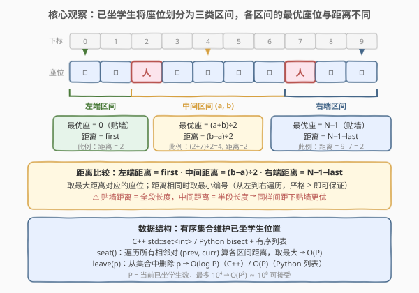
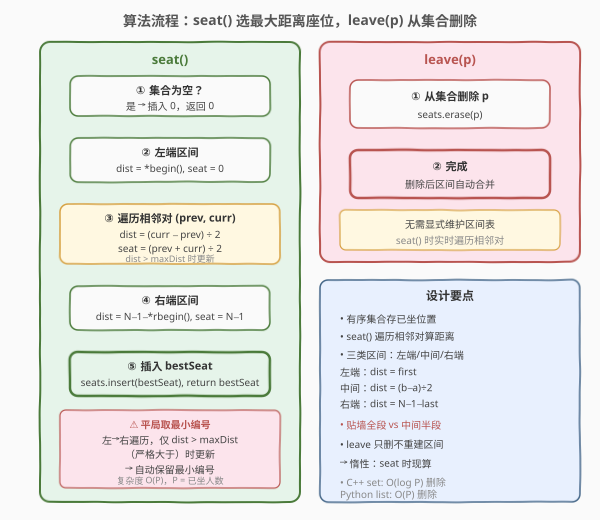
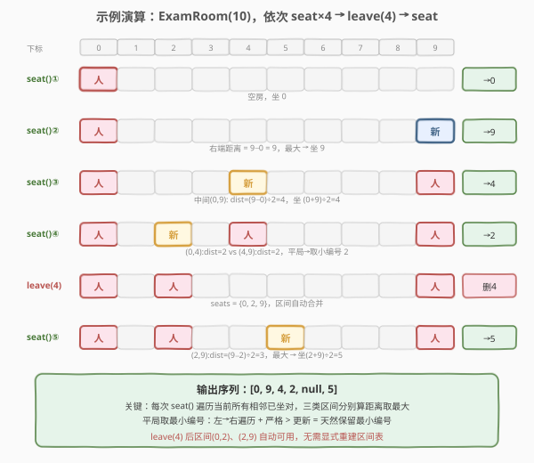

# LeetCode 考场就座 题解

## 1. 题目概述

- **标题 / 题号**：考场就座（#855，medium）
- **链接**：https://leetcode.cn/problems/exam-room/
- **难度**：中等
- **标签**：设计、有序集合、贪心

**题意**：考场里有 `N` 个座位，排成一行，编号 `0` 到 `N-1`。学生依次进入考场就座，每次必须坐在**离最近的人尽可能远**的座位上。如果有多个座位满足条件，坐**编号最小**的那个。学生也可以离开，座位重新变为空。

需要实现 `ExamRoom` 类：

- `ExamRoom(int N)`：初始化 `N` 个座位的考场。
- `int seat()`：返回下一个学生就座的座位编号。学生坐在**到最近的人距离最大化**的座位上；平局取编号最小。
- `void leave(int p)`：坐在座位 `p` 的学生离开，该座位变为空。

**示例 1**：

```text
输入：
["ExamRoom","seat","seat","seat","seat","leave","seat"]
[[10],[],[],[],[],[4],[]]

输出：[null,0,9,4,2,null,5]

解释：
seat() → 0    空房，坐 0
seat() → 9    右端距离 9 最大，坐 9
seat() → 4    中间(0,9)中点 4，距离 4
seat() → 2    (0,4)距离2 vs (4,9)距离2，平局取小编号 2
leave(4)      删除座位 4 上的学生
seat() → 5    (2,9)距离3 最大，坐中点 5
```

**约束**：

- `1 <= N <= 10^9`
- 最多调用 `10^4` 次 `seat` 和 `leave`
- 保证调用 `leave(p)` 时座位 `p` 上有人

> 💡 本题是 [849. 到最近的人的最大距离](../0801-0900/849_到最近的人的最大距离.md) 的**动态在线版**：849 是给定静态座位数组求一次最优座位，855 则需要在**不断 seat/leave 的动态变化**中反复求最优座位。核心的「三类区间距离公式」完全一致，但 855 需要用**有序集合**维护已坐学生位置以支持高效的插入与删除。

## 2. 解题思路

### 2.1 暴力思路：布尔数组逐位扫描

最直观的做法是用一个长度为 `N` 的布尔数组 `occupied[]` 标记每个座位是否有人。`seat()` 时遍历每个空座，向左右扫描找最近的人，取所有空座的「最近人距离」最大值——即 849 的暴力法。

```text
seat():
  for i in 0..N-1:
    if occupied[i]: continue
    向左/右扫描找最近的人，算距离
  取最大距离的座位

leave(p):
  occupied[p] = false
```

时间复杂度 `O(N^2)` 每次 `seat()`，空间 `O(N)`。但 `N` 可达 `10^9`，连数组都开不出来——**直接不可行**。

> ⚠️ 暴力法的根本问题在于：它试图维护「所有座位」的状态，但实际只有少量座位被占用（最多 `10^4` 次调用 → 最多 `10^4` 个学生）。我们只需要维护**已坐学生的位置**，而非整个座位数组。

### 2.2 核心观察：有序集合 + 三类区间

**关键洞察**：已坐学生的位置将 `[0, N-1]` 划分为若干**区间**，每个区间内的最优座位和距离由区间类型决定。用**有序集合**（C++ `std::set`，Python `bisect` + 有序列表）维护已坐位置，`seat()` 时遍历相邻对计算各区间距离取最大，`leave()` 时直接从集合删除。



**三类区间**（设已坐学生按位置排序为 $p_0 < p_1 < \dots < p_{k-1}$）：

| 区间类型 | 范围 | 最优座位 | 距离（到最近人） | 说明 |
|----------|------|----------|------------------|------|
| **左端区间** | $0$ 到 $p_0$ | 座位 $0$ | $p_0 - 0 = p_0$ | 只右侧有人，贴左墙坐，距离 = 全段 |
| **中间区间** $(p_i, p_{i+1})$ | $p_i$ 到 $p_{i+1}$ | $\lfloor (p_i + p_{i+1}) / 2 \rfloor$ | $\lfloor (p_{i+1} - p_i) / 2 \rfloor$ | 两侧都有人，坐正中，距离 = 半段 |
| **右端区间** | $p_{k-1}$ 到 $N-1$ | 座位 $N-1$ | $N - 1 - p_{k-1}$ | 只左侧有人，贴右墙坐，距离 = 全段 |

> 💡 **为什么贴墙距离 = 全段而中间距离 = 半段？** 贴墙时只有一侧有人，可以贴着无人的墙坐，到最近人的距离就是整个区间长度。中间区间两侧都有人，坐正中时到两侧的距离各为一半，最近人距离 = 半段。因此**同样间距下，贴墙区间比中间区间更优**——这正是为什么空房时第一个学生坐 0（左端区间距离 = 0 不优，但第二个学生会坐 N-1，右端区间距离 = N-1 最大）。

**平局处理**：距离相同时取编号最小的座位。从左到右遍历相邻对，仅在 `dist > maxDist`（**严格大于**）时更新，天然保留最先遇到的（即编号最小的）座位。

### 2.3 算法流程图



**`seat()` 完整步骤**：

1. **空房判定**：集合为空 → 插入 `0`，返回 `0`。
2. **左端区间**：`dist = *seats.begin()`，`seat = 0`。若 `dist > maxDist` 更新。
3. **中间区间**：遍历相邻对 `(prev, curr)`，`dist = (curr - prev) / 2`，`seat = (prev + curr) / 2`。若 `dist > maxDist` 更新。
4. **右端区间**：`dist = N - 1 - *seats.rbegin()`，`seat = N - 1`。若 `dist > maxDist` 更新。
5. **插入并返回**：`seats.insert(bestSeat)`，返回 `bestSeat`。

**`leave(p)`**：`seats.erase(p)`，完成。删除后相邻区间自动合并，无需显式重建。

> ⚠️ **三个易错点**：(1) 空房特判必须放在最前——集合为空时 `*begin()` 未定义；(2) 平局取小编号用**严格 `>`** 而非 `>=`，左→右遍历保证先遇到小编号；(3) 左/右端区间的距离是**全段** `first` / `N-1-last`，不是半段——与中间区间的 `(b-a)/2` 区分开。

### 2.4 示例演算

以 `ExamRoom(10)` 为例，依次执行 `seat()×4` → `leave(4)` → `seat()`：



逐步解读：

| 步骤 | 操作 | 已坐集合 | 候选区间 | 最优 | 决策依据 |
|------|------|----------|----------|------|----------|
| ① | `seat()` | `{}` | — | `0` | 空房，坐 0 |
| ② | `seat()` | `{0}` | 右端 `dist=9` | `9` | 右端距离 9 最大 |
| ③ | `seat()` | `{0,9}` | 中间(0,9) `dist=4` | `4` | 中点 4，距离 4 |
| ④ | `seat()` | `{0,4,9}` | (0,4)`dist=2` vs (4,9)`dist=2` | `2` | 平局取小编号 2 |
| ⑤ | `leave(4)` | `{0,2,9}` | — | — | 删除 4，区间自动合并 |
| ⑥ | `seat()` | `{0,2,9}` | (0,2)`dist=1` vs (2,9)`dist=3` | `5` | (2,9)距离 3 最大，坐中点 5 |

> 💡 **第④步的平局处理**：(0,4) 和 (4,9) 的中间距离都是 2。从左到右遍历先遇到 (0,4)，`seat = (0+4)/2 = 2`；再遇到 (4,9)，`seat = (4+9)/2 = 6`，但 `dist = 2` 不严格大于 `maxDist = 2`，不更新。最终选 seat 2（编号更小）。

## 3. 参考代码

### C++

```cpp
class ExamRoom {
    int N;
    set<int> seats;
public:
    ExamRoom(int n) : N(n) {}

    int seat() {
        if (seats.empty()) {
            seats.insert(0);
            return 0;
        }
        int maxDist = 0;
        int bestSeat = 0;

        // 左端区间：座位 0，距离 = first
        int leftDist = *seats.begin();
        if (leftDist > maxDist) {
            maxDist = leftDist;
            bestSeat = 0;
        }

        // 中间区间：遍历相邻对
        auto prev = seats.begin();
        auto curr = next(prev);
        while (curr != seats.end()) {
            int dist = (*curr - *prev) / 2;
            if (dist > maxDist) {
                maxDist = dist;
                bestSeat = (*prev + *curr) / 2;
            }
            prev = curr;
            ++curr;
        }

        // 右端区间：座位 N-1，距离 = N-1-last
        int rightDist = N - 1 - *seats.rbegin();
        if (rightDist > maxDist) {
            maxDist = rightDist;
            bestSeat = N - 1;
        }

        seats.insert(bestSeat);
        return bestSeat;
    }

    void leave(int p) {
        seats.erase(p);
    }
};
```

### Python

```python
import bisect

class ExamRoom:
    def __init__(self, n: int):
        self.n = n
        self.seats = []  # 有序列表，维护已坐学生位置

    def seat(self) -> int:
        if not self.seats:
            bisect.insort(self.seats, 0)
            return 0

        max_dist = 0
        best_seat = 0

        # 左端区间
        left_dist = self.seats[0]
        if left_dist > max_dist:
            max_dist = left_dist
            best_seat = 0

        # 中间区间：遍历相邻对
        for i in range(1, len(self.seats)):
            prev = self.seats[i - 1]
            curr = self.seats[i]
            dist = (curr - prev) // 2
            if dist > max_dist:
                max_dist = dist
                best_seat = (prev + curr) // 2

        # 右端区间
        right_dist = self.n - 1 - self.seats[-1]
        if right_dist > max_dist:
            best_seat = self.n - 1

        bisect.insort(self.seats, best_seat)
        return best_seat

    def leave(self, p: int) -> None:
        idx = bisect.bisect_left(self.seats, p)
        self.seats.pop(idx)
```

> 💡 两版逻辑完全一致。C++ 用 `std::set` 的迭代器遍历相邻对，`leave` 是 `O(log P)`；Python 用 `bisect` 维护有序列表，`seat` 和 `leave` 均为 `O(P)`（列表插入/删除需移位），但调用次数最多 `10^4`，`O(P^2) ≈ 10^8` 可接受。注意 Python 版右端区间判断后**无需更新 `max_dist`**（已是最后一个候选，只需设 `best_seat`）。

## 4. 复杂度分析

| 维度 | 复杂度 | 说明 |
|------|--------|------|
| **时间复杂度** | `seat()`：`O(P)`，`leave()`：`O(log P)`（C++）/ `O(P)`（Python） | `P` = 当前已坐学生数。`seat()` 遍历所有相邻对；C++ `set::erase` 为 `O(log P)`，Python 列表 `pop` 需移位为 `O(P)` |
| **空间复杂度** | `O(P)` | 有序集合存储已坐学生位置，`P` 最多 `10^4` |

> ⚠️ **与暴力法对比**：暴力法 `O(N)` 空间 + `O(N^2)` 每次 `seat`，`N` 可达 `10^9` 不可行。有序集合法只需 `O(P)` 空间（`P ≤ 10^4`），利用了「已坐学生远少于总座位数」的稀疏性。总调用次数 `10^4`，最坏 `O(P^2) ≈ 10^8`，在时限内可接受。

## 5. 扩展：优先队列 + 惰性删除——O(log P) 摊还 seat()

有序集合法每次 `seat()` 都要遍历所有相邻对，当 `P` 很大时偏慢。可以用**最大堆**维护区间，配合**惰性删除**将 `seat()` 优化到 `O(log P)` 摊还。

**核心思路**：

- 用大根堆存储所有区间，堆顶是距离最大的区间。每个区间记录 `(distance, left_pos, right_pos, seat_pos)`。
- `seat()` 时弹出堆顶，检查是否仍有效（两端仍在集合中且仍相邻）。无效则丢弃继续弹，直到找到有效区间。拆分后推入两个新区间。
- `leave(p)` 时从集合删除 `p`，推入合并后的新区间（与左右邻居形成的新区间）。旧区间留在堆中，等下次 `seat()` 时惰性发现并丢弃。

**有效区间判定**：区间 `(left, right)` 有效当且仅当 `left` 和 `right` 都在 `seated` 集合中，且 `seated` 中 `left` 的后继恰为 `right`（中间无其他学生）。

```cpp
class ExamRoom {
    int N;
    set<int> seated;
    // 堆元素：(-distance, left, right)  负号模拟大根堆
    priority_queue<tuple<int, int, int>> pq;

    // 计算区间的距离和最优座位
    pair<int, int> evalInterval(int left, int right) {
        if (left < 0) return {right, 0};           // 左端区间
        if (right == N) return {N - 1 - left, N - 1}; // 右端区间
        int d = (right - left) / 2;
        return {d, (left + right) / 2};
    }

    void pushInterval(int left, int right) {
        if (right - left <= 1) return;             // 无空座，不推
        auto [d, s] = evalInterval(left, right);
        pq.push({-d, left, right});
    }

public:
    ExamRoom(int n) : N(n) {}

    int seat() {
        if (seated.empty()) {
            seated.insert(0);
            pushInterval(0, N);                    // 右端区间 0 ~ N
            return 0;
        }
        // 惰性删除：弹出无效区间
        while (!pq.empty()) {
            auto [negD, left, right] = pq.top();
            auto it = seated.find(left);
            if (it == seated.end() || next(it) == seated.end() ||
                *next(it) != right) {
                pq.pop();                          // 无效，丢弃
                continue;
            }
            break;                                 // 找到有效区间
        }
        auto [negD, left, right] = pq.top();
        pq.pop();
        auto [d, s] = evalInterval(left, right);
        seated.insert(s);
        pushInterval(left, s);                     // 左半新区间
        pushInterval(s, right);                    // 右半新区间
        return s;
    }

    void leave(int p) {
        auto it = seated.find(p);
        int left = -1, right = N;
        if (it != seated.begin()) left = *prev(it);
        if (next(it) != seated.end()) right = *next(it);
        seated.erase(it);
        pushInterval(left, right);                 // 合并后的新区间
    }
};
```

> 💡 **惰性删除的精髓**：`leave()` 不从堆中删除旧区间（堆不支持任意位置删除），而是推入合并后的新区间。旧区间在下次 `seat()` 时被有效性检查发现并丢弃。每个区间最多被推入一次、丢弃一次，总堆操作 `O(P log P)`，摊还每次 `O(log P)`。这与 [239. 滑动窗口最大值](../0201-0300/239_滑动窗口最大值.md) 的单调队列出窗口时惰性跳过同源——都是「不主动删，遇时验」的惰性范式。

## 6. 面试要点

1. **本题和 849 的关系是什么？**

   - 849 是静态版：给定固定座位数组，求一次最优座位。855 是动态在线版：需要支持 `seat()` 和 `leave()` 反复修改。两者共享「三类区间距离公式」，但 855 需要用有序集合维护已坐位置以支持动态增删。849 可用两次遍历或零段分组 `O(n)` 解决，855 则因 `N` 可达 `10^9` 不能开数组，必须用稀疏结构。

2. **为什么左/右端区间的距离是全段，中间区间是半段？**

   - 左/右端区间只有一侧有人，可以贴着无人的墙坐，到最近人的距离就是整个区间长度（全段）。中间区间两侧都有人，坐正中时到两侧各一半，最近人距离 = 半段 `(b-a)/2`。因此同样间距下贴墙更优——这也是为什么第二个学生会坐 `N-1`（右端距离 `N-1` 远大于任何中间区间）。

3. **平局时如何保证取编号最小的座位？**

   - 从左到右遍历相邻对（有序集合天然有序），仅在 `dist > maxDist`（**严格大于**）时更新 `bestSeat`。相等时不更新，保留先遇到的（编号更小的）座位。左端区间（seat=0）最先检查，中间区间递增，右端区间（seat=N-1）最后检查，天然保证编号递增序。

4. **为什么 `leave()` 不需要显式重建区间表？**

   - 有序集合法不维护显式的区间表——`seat()` 时实时遍历相邻对计算。`leave(p)` 只需从集合删除 `p`，删除后 `p` 左右的学生自动成为新的相邻对，下次 `seat()` 自然算到合并后的新区间。这是「惰性计算」思想：不预维护，用时现算。

5. **优先队列法的惰性删除如何保证正确性？**

   - `leave(p)` 时推入合并后的新区间，但不从堆中删除旧的被拆分区间。`seat()` 弹出堆顶时检查 `(left, right)` 是否仍有效——`left` 和 `right` 都在 `seated` 中且 `left` 的后继恰为 `right`。无效区间被丢弃继续弹。每个区间最多入堆一次、被丢弃一次，总工作量 `O(P log P)`，摊还 `O(log P)` 每次。

> 💡 **一句话总结**：855 是 849 的动态在线版——用有序集合维护已坐位置，`seat()` 遍历三类区间（左端/中间/右端）取最大距离，平局用严格 `>` 保留小编号。`O(P)` / `O(P)`，优先队列 + 惰性删除可优化到 `O(log P)` 摊还。

## 同类练习题

| # | 题目 | 与本题的关联 |
|---|------|-------------|
| 849 | [到最近的人的最大距离](https://leetcode.cn/problems/maximize-distance-to-closest-person/)（[题解](../0801-0900/849_到最近人的最大距离.md)） | 本题的静态版，给定固定座位数组求一次最优座位，共享三类区间距离公式，用两次遍历 `O(n)` 解决 |
| 729 | [我的日程安排表 I](https://leetcode.cn/problems/my-calendar-i/) | 同为「设计 + 有序集合维护区间」模式，检查新区间是否与已有区间重叠，`O(N log N)` 双有序集合 / `O(N^2)` 暴力均可 |
| 981 | [基于时间的键值存储](https://leetcode.cn/problems/time-based-key-value-store/)（[题解](../0901-1000/981_基于时间的键值存储.md)） | 设计题用有序集合 + 二分查找，与 855 的有序集合维护 + 遍历同属「有序数据结构支撑在线查询」范式 |
| 239 | [滑动窗口最大值](https://leetcode.cn/problems/sliding-window-max-value/)（[题解](../0201-0300/239_滑动窗口最大值.md)） | 单调队列的惰性删除（出窗口时跳过过期元素）与本题扩展节的堆惰性删除同源——「不主动删，遇时验」 |
| 460 | [LFU 缓存](https://leetcode.cn/problems/lfu-cache/)（[题解](../0401-0500/460_LFU缓存.md)） | 复杂设计题，频率桶 + 哈希的复合数据结构，与 855 一样考察「选合适的数据结构支撑高效操作」的设计思维 |
