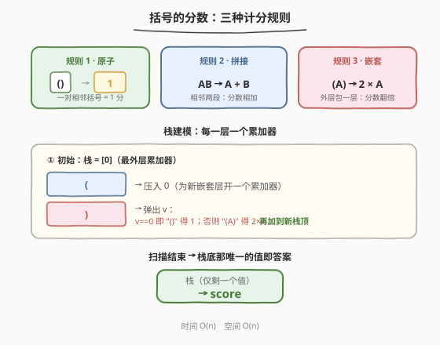
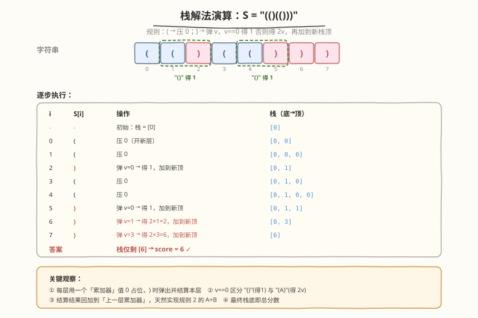
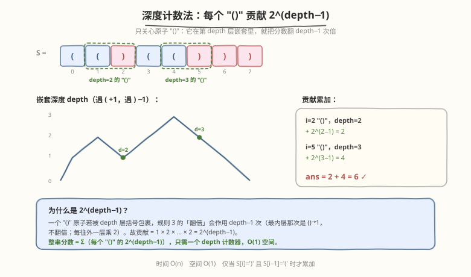

# 括号的分数

- **题目名称**：括号的分数
- **链接**：[856. 括号的分数](https://leetcode.cn/problems/score-of-parentheses/)
- **难度**：中等
- **标签**：栈、字符串、贪心

## 1. 题目概述

给定一个**平衡括号字符串** `S`，按下述规则计算该字符串的分数：

- `()` 得 1 分；
- `AB` 得 $A + B$ 分，其中 `A` 和 `B` 是平衡括号字符串；
- `(A)` 得 $2 \times A$ 分，其中 `A` 是平衡括号字符串。

**示例 1**：

```text
输入：S = "()"
输出：1
解释：单个 () 原子，分数为 1。
```

**示例 2**：

```text
输入：S = "(())"
输出：2
解释：(A) 翻倍，A = "()" = 1，故 2 × 1 = 2。
```

**示例 3**：

```text
输入：S = "()()"
输出：2
解释：AB 相加，A = "()" = 1，B = "()" = 1，故 1 + 1 = 2。
```

**示例 4**：

```text
输入：S = "(()(()))"
输出：6
解释：最外层 (A) 翻倍，A = "()(())" = 1 + 2 = 3，故 2 × 3 = 6。
```

**约束条件**：

- $2 \leq \text{S.length} \leq 50$
- `S` 只含有 `(` 和 `)`
- `S` 是一个平衡括号字符串

> 💡 **核心观察**：三条规则本质是「括号树的求值」——`()` 是叶子（值 1），`(A)` 是翻倍（一层父节点），`AB` 是同层兄弟求和。难点在于：扫描时**无法预先知道一段 `A` 何时结束**。栈天然解决这个「延迟结算」问题：进入一层压个占位，离开一层时结算并回加给上一层。

---

## 2. 解题思路

### 2.1 暴力思路

最直白的做法是**递归分治**：在串中找到与第 0 位 `(` 配对的 `)`，若它就在第 1 位，则这是 `()`，返回 1；否则以该 `)` 为界，外面套 `(A)` 形式（返回 $2 \times \text{score}(S[1:-1])$）。但题目串里若含 `AB` 拼接（同一深度有多段），需要先把同层各段切开再分别求和——分割点判断麻烦，且每个 `)` 都可能触发一次递归，常数大、易写错。

更通用且不易错的思路是**用栈模拟求值过程**：把「进入一层」和「离开一层」分别对应压栈、弹栈，边扫描边结算。

### 2.2 核心观察：栈解法（每层一个累加器）



关键洞察：**每一层嵌套对应栈中的一个「累加器」值**。约定如下：

| 字符 | 含义 | 栈操作 |
|------|------|--------|
| `(` | 进入新的一层 | 压入 `0`（为该层开一个初始为 0 的累加器） |
| `)` | 离开当前层 | 弹出栈顶 `v`，结算本层得分并**回加给上一层** |

离开一层时的**结算规则**正好对应题目三条规则：

- 弹出的 `v == 0`：说明这一层从压入到现在没有任何得分被累加进来，即本层就是 `()` → 得 `1`（规则 1）；
- 弹出的 `v > 0`：说明本层是 `(A)`，内部已经累计出 `A` 的分数 `v` → 得 $2 \times v$（规则 3）；
- 结算结果 `inner` **加到新的栈顶**：这一步天然实现了规则 2 的 `A + B`——同层多个段会依次把各自的分数累加进同一个上层累加器。

> ⚠️ **为什么初始要压一个 `0`？** 这个「最外层累加器」是虚拟的根层，对应整串的分数。它不会被弹出（题目保证 `S` 平衡，最外层的 `(` 会配对一个 `)` 结算回它）。扫描结束后，栈里只剩这一个值，就是答案。

初始化 `st = [0]`，按上表扫描整个串，最终 `st[-1]`（或 `st[0]`，因为只剩一个元素）即为分数。时间 $O(n)$，空间 $O(n)$。

### 2.3 算法流程

1. 初始化栈，压入 `0` 作为最外层累加器；
2. 从左到右扫描 `S` 的每个字符 `c`：
   - 若 `c == '('`：压入 `0`，表示进入新一层；
   - 若 `c == ')'`：弹出栈顶 `v`；
     - 计算 `inner = (v == 0) ? 1 : 2 * v`；
     - 将 `inner` 加到新的栈顶（实现同层累加）；
3. 扫描结束，栈中剩余的唯一元素即为答案。

> 💡 该流程同时处理了「嵌套翻倍」与「同层拼接」：翻倍发生在弹栈瞬间（`2 * v`），拼接发生在回加瞬间（`st.top() += inner`）。两者解耦，无需显式判断当前是 `AB` 还是 `(A)`。

### 2.4 示例演算

以 `S = "(()(()))"`（即示例 4 的 `"(()(()))"`）为例，逐步演示栈的演变：



| i | S[i] | 操作 | 栈（底→顶） |
|---|------|------|-------------|
| - | - | 初始：栈 = [0] | `[0]` |
| 0 | `(` | 压 0（开新层） | `[0, 0]` |
| 1 | `(` | 压 0 | `[0, 0, 0]` |
| 2 | `)` | 弹 v=0 → 得 1，加到新顶 | `[0, 1]` |
| 3 | `(` | 压 0 | `[0, 1, 0]` |
| 4 | `(` | 压 0 | `[0, 1, 0, 0]` |
| 5 | `)` | 弹 v=0 → 得 1，加到新顶 | `[0, 1, 1]` |
| 6 | `)` | 弹 v=1 → 得 2×1=2，加到新顶 | `[0, 3]` |
| 7 | `)` | 弹 v=3 → 得 2×3=6，加到新顶 | `[6]` |

扫描结束栈仅剩 `[6]`，故分数为 **6**。注意 i=6 和 i=7 两步：弹出的 `v` 非零，触发规则 3 的翻倍——这正是 `(A)` 嵌套求值的体现。

---

## 3. 参考代码

### C++

```cpp
class Solution {
  public:
    int scoreOfParentheses(string s) {
        stack<int> st;
        st.push(0);                 // 最外层累加器
        for (char c : s) {
            if (c == '(') {
                st.push(0);         // 进入新一层，开一个累加器
            } else {
                int v = st.top();
                st.pop();
                int inner = (v == 0) ? 1 : 2 * v;  // () 得 1，(A) 得 2A
                st.top() += inner;  // 回加给上一层（同层拼接）
            }
        }
        return st.top();
    }
};
```

### Python

```python
class Solution:
    def scoreOfParentheses(self, s: str) -> int:
        st = [0]                    # 最外层累加器
        for c in s:
            if c == "(":
                st.append(0)        # 进入新一层，开一个累加器
            else:
                v = st.pop()
                inner = 1 if v == 0 else 2 * v   # () 得 1，(A) 得 2A
                st[-1] += inner     # 回加给上一层（同层拼接）
        return st[0]
```

> ⚠️ **易错点**：① 弹栈后栈必非空——因为最外层那个初始 `0` 永不弹出，故 `st.top()`/`st[-1]` 一定安全（题目保证 `S` 平衡）；② `v == 0` 的判定是区分 `()` 与 `(A)` 的关键，切勿写成 `v == 1`；③ 翻倍用 `2 * v` 而非 `v << 1`，避免 `v` 可能为大数时位移语义混淆（本题规模小，两者等价）。

---

## 4. 复杂度分析

| 维度 | 复杂度 | 说明 |
|------|--------|------|
| 时间复杂度 | $O(n)$ | 单趟扫描，每个字符触发一次压栈或弹栈，均为 $O(1)$ |
| 空间复杂度 | $O(n)$ | 最坏情况下全为连续 `(`，栈深达 $n/2$；见第 5 节可优化至 $O(1)$ |

---

## 5. 扩展：深度计数法（$O(1)$ 空间）



栈解法虽直观，但其实可以进一步压到 $O(1)$ 空间。关键观察是：**只有原子 `()` 才真正「产生」分数**，`(A)` 的翻倍和 `AB` 的拼接都只是对这个分数做缩放与累加。

> 💡 **换个视角**：一个 `()` 原子若被 `depth` 层括号包裹（即它处于第 `depth` 层嵌套），规则 3 的「翻倍」会作用 `depth − 1` 次（最内层那次是 `() → 1` 不翻倍；每往外一层乘 2）。因此该原子对总分的贡献为：

$$
\text{contribution} = 1 \times 2^{\text{depth}-1} = 2^{\text{depth}-1}
$$

整串分数即为**所有 `()` 原子的 $2^{\text{depth}-1}$ 之和**。只需维护一个 `depth` 计数器即可：

- 遇 `(`：`depth += 1`；
- 遇 `)`：若前一个字符是 `(`（即此刻构成原子 `()`），则 `ans += 1 << (depth - 1)`；随后 `depth -= 1`。

```python
class Solution:
    def scoreOfParentheses(self, s: str) -> int:
        ans = depth = 0
        for i, c in enumerate(s):
            if c == "(":
                depth += 1
            else:
                if s[i - 1] == "(":          # 遇到原子 "()"
                    ans += 1 << (depth - 1)  # 贡献 2^(depth-1)
                depth -= 1
        return ans
```

> ⚠️ 此法把「$O(n)$ 空间的栈」压缩成「一个 depth 整数」——其本质是发现**同层累加器可以延迟到原子出现时一次性按指数贡献**，省去了显式存储各层累加值。是本题的最优解，面试时可主动提出以展示观察深度。

---

## 6. 面试要点

1. **三条规则如何统一进栈模型？**
   - `()` 对应「弹出的 `v == 0`，得 1」；`(A)` 对应「弹出的 `v > 0`，得 $2v$」；`AB` 对应「结算结果回加到新栈顶」。压栈开层、弹栈结算、回加拼接，三步恰好覆盖三条规则，无需显式判分支类型。

2. **为什么初始要压一个 `0`？弹栈后栈会空吗？**
   - 初始的 `0` 是「最外层虚拟累加器」，对应整串分数。由于 `S` 保证平衡，最外层 `(` 配对的 `)` 结算后会回加给它而**不会弹出它**，故弹栈后栈顶恒存在，`st.top()` 安全。最终栈里只剩这一个值即答案。

3. **`v == 0` 的判定为什么能区分 `()` 与 `(A)`？**
   - 压入新层时累加器初始化为 `0`。若这一层内部出现过任何 `()` 或嵌套段，它们的分数都会被回加进来，使 `v > 0`。因此 `v == 0` 当且仅当这一层从进入到离开没有产生任何分数——即它本身就是 `()`。

4. **深度计数法为什么是 $2^{\text{depth}-1}$ 而非 $2^{\text{depth}}$？**
   - 最内层那次 `() → 1` 不翻倍（规则 1 给的是 1 而非 2），只有往外每一层才乘 2。一个被 `depth` 层包裹的 `()` 共翻倍 `depth − 1` 次，故贡献 $2^{\text{depth}-1}$。`depth = 1`（最外层直接是 `()`）时 $2^0 = 1$，与规则 1 吻合。

5. **这题和 32（最长有效括号）、394（字符串解码）的栈用法有何异同？**
   - [32. 最长有效括号](https://leetcode.cn/problems/longest-valid-parentheses/)（[题解](../0001-0100/32_最长有效括号.md)）栈存**下标**，用栈底基准算长度；本题栈存**分数累加器**，用弹栈结算翻倍。两者都用「栈维护嵌套层级」，但一个算几何长度、一个算代数分数。[394. 字符串解码](https://leetcode.cn/problems/decode-string/)（[题解](../0301-0400/394_字符串解码.md)）用栈处理 `[`/`]` 的层级切换与字符串拼接，和本题「压栈开层、弹栈结算」骨架同源，只是结算动作不同（本题乘 2 / 加和，394 拼接 / 重复）。

---

## 7. 同类练习题

- [20. 有效括号](https://leetcode.cn/problems/valid-parentheses/)（[题解](../0001-0100/20_有效括号.md)）：栈匹配括号的母题，`( 压栈、) 弹栈配对`，本题在其基础上把「配对成功」升级为「结算分数」
- [32. 最长有效括号](https://leetcode.cn/problems/longest-valid-parentheses/)（[题解](../0001-0100/32_最长有效括号.md)）：栈存下标 + 栈底基准算有效长度，与本题「栈维护嵌套层级」同源，对比「存下标」与「存累加器」两种栈用法
- [394. 字符串解码](https://leetcode.cn/problems/decode-string/)（[题解](../0301-0400/394_字符串解码.md)）：用栈处理 `[`/`]` 嵌套层级与重复倍数，骨架同本题（压栈开层、弹栈结算），结算动作从「乘 2 / 加和」换成「重复 × 拼接」
- [1021. 删除最外层的括号](https://leetcode.cn/problems/remove-outermost-parentheses/)：用 depth 计数剥离原语最外层，体会「深度计数器」在括号题中的通用性（本题 $O(1)$ 解法即同款 depth 思路）
- [1111. 有效括号的嵌套深度](https://leetcode.cn/problems/maximum-nesting-depth-of-two-valid-parentheses-strings/)：按括号深度分组染色，进一步练习 depth 计数与括号嵌套结构的操作
