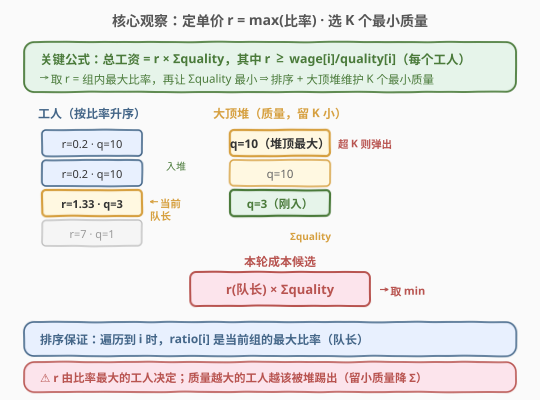
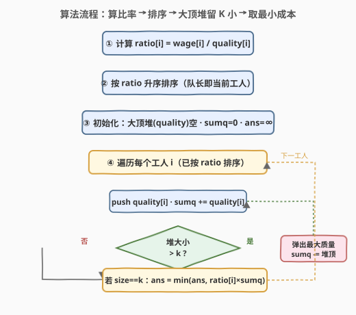
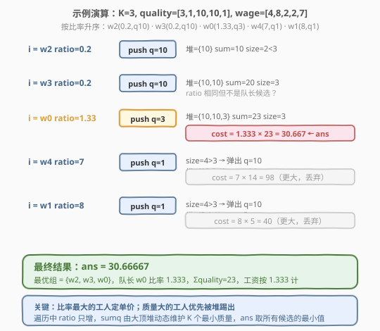

# 雇佣 K 名工人的最低成本

- **题目名称**：雇佣 K 名工人的最低成本
- **链接**：[857. 雇佣 K 名工人的最低成本](https://leetcode.cn/problems/minimum-cost-to-hire-k-workers/)
- **难度**：困难
- **标签**：贪心、堆、优先队列、排序

## 1. 题目概述

有 `n` 名工人，第 `i` 名工人有**质量** `quality[i]` 和**最低工资期望** `wage[i]`。要雇佣**恰好** `k` 名工人组成一个工资组，付工资时必须满足两条规则：

1. 工资组中**每个**工人拿到的钱 $\geq$ 其最低工资期望 `wage[i]`；
2. 工资必须按质量成比例分配，即组内任两人 $i, j$ 满足 $\dfrac{\text{wage}[i]}{\text{wage}[j]} = \dfrac{\text{quality}[i]}{\text{quality}[j]}$。

等价地，存在一个**统一的单价** $r$（单位质量工资），使组内每个工人拿到 $\text{wage}[i] = r \cdot \text{quality}[i]$。求雇佣 `k` 人后需要支付的**最少总工资**。答案误差在 $10^{-5}$ 内即视为正确。

**示例 1**：

```text
输入：quality = [10,20,5], wage = [70,50,30], k = 1
输出：30.00000
解释：只雇 1 人，直接取最低期望工资 30（工人 2：r = 30/5 = 6，付 6×5 = 30）。
```

**示例 2**：

```text
输入：quality = [3,1,10,10,1], wage = [4,8,2,2,7], k = 3
输出：30.66667
解释：雇佣工人 2、3、0，单价 r = 4/3 ≈ 1.3333（由工人 0 的期望决定），
      总工资 = r × (10 + 10 + 3) = 1.3333 × 23 ≈ 30.6667。
```

**约束条件**：

- $1 \leq k \leq n \leq 10^4$
- $1 \leq \text{quality}[i], \text{wage}[i] \leq 10^5$
- 答案与真实值误差不超过 $10^{-5}$ 即正确

> 💡 本题的核心矛盾是「单价由谁决定 + 质量总和如何最小」。一旦选定组，单价 $r$ 被**期望最苛刻（比率最大）**的工人顶高；要省钱就得在满足该单价的工人里挑**质量最小**的 `k` 个。这是经典的**排序建立单调性 + 堆动态维护前 k 小**模式。

---

## 2. 解题思路

### 2.1 暴力思路

枚举所有 $\binom{n}{k}$ 个 `k` 人子集。对每个子集，单价 $r = \max_{i \in G} \dfrac{\text{wage}[i]}{\text{quality}[i]}$，总成本 $= r \cdot \sum_{i \in G} \text{quality}[i]$，取所有子集的最小值。组合数随 $n$ 指数增长，$n = 10^4$ 时完全不可行。

> ⚠️ 暴力法的瓶颈在于「枚举子集」。但注意到：一旦**固定了组内比率最大的工人（队长）**，组内其他成员只能选比率 $\leq$ 队长比率的工人——而队长一旦确定，单价 $r$ 就被钉死，问题退化为「在比率 $\leq r$ 的工人中选 `k-1` 个质量最小的」。这给出了一个只需 $n$ 次决策、每次用堆维护的结构。

### 2.2 核心观察：排序 + 大顶堆维护 k 个最小质量



关键洞察分三步：

1. **单价由比率最大的工人决定**。记 $\text{ratio}[i] = \dfrac{\text{wage}[i]}{\text{quality}[i]}$。对一个工资组 $G$，要让所有成员都拿到不低于期望的工资，必须 $r \geq \max_{i \in G} \text{ratio}[i]$；为最小化总成本，取 $r = \max_{i \in G} \text{ratio}[i]$（恰好让比率最大的工人拿期望工资，其他人按比例拿得更多但已是该 $r$ 下的最低）。于是总成本 $= \max_{i \in G} \text{ratio}[i] \cdot \sum_{i \in G} \text{quality}[i]$。

2. **按比率升序排序工人**。排序后遍历到第 $i$ 个工人时，它前面的工人比率都 $\leq \text{ratio}[i]$——**当前工人就是「队长」**，它的比率即组内最大比率 $r$。这样把「枚举队长」从指数级降到 $n$ 次线性扫描。

3. **用大顶堆维护前 $i$ 个工人中质量最小的 $k$ 个**。队长确定 $r$ 后，组内其他 `k-1` 人应在前面已遍历（比率 $\leq r$）的工人里选质量最小的。用大顶堆存质量：堆大小 $\leq k$ 时全留，超过 $k$ 就弹出堆顶（最大的质量）——这样堆里始终是「截至当前、质量最小的 $k$ 个」。维护堆内质量之和 `sumq`，候选成本 $= \text{ratio}[i] \cdot \text{sumq}$，取所有候选的最小值即为答案。

> 💡 **为什么贪心正确？** 对任意最优组 $G^*$，设其队长（比率最大者）为 $j^*$。在排序遍历到 $j^*$ 时，$G^*$ 的所有成员都在「已遍历集」（比率 $\leq \text{ratio}[j^*]$）中。此时我们的堆维护的是该已遍历集里质量最小的 $k$ 个，故 $\text{sumq}_{\text{堆}} \leq \sum_{i \in G^*} \text{quality}[i]$，而 $r$ 相同（都是 $\text{ratio}[j^*$），因此遍历到 $j^*$ 时算出的候选 $\leq$ 最优组成本。遍历覆盖了所有可能的队长，取最小即得全局最优。

### 2.3 算法流程图



```text
1. 对每个工人计算 ratio[i] = wage[i] / quality[i]
2. 按 ratio 升序排序工人（队长 = 当前遍历到的工人）
3. 初始化：大顶堆（存 quality）为空, sumq = 0, ans = +∞
4. 遍历每个工人 i（已按 ratio 排序）：
   a. push quality[i] 入堆, sumq += quality[i]
   b. if 堆大小 > k:
        sumq -= 堆顶（最大 quality）, pop 堆顶
   c. if 堆大小 == k:
        ans = min(ans, ratio[i] × sumq)
5. 返回 ans
```

> 💡 步骤 4b 是关键：大顶堆的堆顶是当前堆内**最大**的质量，弹出它就保证留下的是质量最小的 $k$ 个。`sumq` 随 push/pop 增减，避免每次重新求和。`ratio[i]` 单调递增，但 `sumq` 会因弹出大质量而下降，二者乘积无单调性——故必须遍历所有候选取 min，不能提前终止。

### 2.4 示例演算

以 `quality = [3,1,10,10,1], wage = [4,8,2,2,7], k = 3` 为例。各工人比率：

- 工人 0：$4/3 \approx 1.333$，质量 3
- 工人 1：$8/1 = 8$，质量 1
- 工人 2：$2/10 = 0.2$，质量 10
- 工人 3：$2/10 = 0.2$，质量 10
- 工人 4：$7/1 = 7$，质量 1

按比率升序排列为 `w2(0.2,q10) · w3(0.2,q10) · w0(1.33,q3) · w4(7,q1) · w1(8,q1)`：



| 队长 i | ratio[i] | 堆（k=3 个最小质量） | sumq | 候选成本 | ans |
|--------|----------|----------------------|------|----------|-----|
| w2 | 0.2 | {10} | 10 | —（size<3） | ∞ |
| w3 | 0.2 | {10,10} | 20 | —（size<3） | ∞ |
| w0 | 1.333 | {10,10,3} | 23 | $1.333 \times 23 = 30.667$ | 30.667 |
| w4 | 7 | push 1 → 弹 10 → {10,3,1} | 14 | $7 \times 14 = 98$ | 30.667 |
| w1 | 8 | push 1 → 弹 10 → {3,1,1} | 5 | $8 \times 5 = 40$ | 30.667 |

- **队长 w2 / w3**：堆大小不足 3，无法成组，跳过。
- **队长 w0**：前三个工人恰好入堆，$\text{sumq} = 10+10+3 = 23$，$r = 1.333$，成本 $30.667$，记为最优。
- **队长 w4**：push 质量 1 后堆超 3，弹出最大质量 10，$\text{sumq} = 23 - 10 + 1 = 14$，但 $r$ 涨到 7，$7 \times 14 = 98$ 远大于 30.667，丢弃。
- **队长 w1**：同样弹出一个 10，$\text{sumq} = 14 - 10 + 1 = 5$，但 $r = 8$，$8 \times 5 = 40$ 仍大于 30.667，丢弃。

返回 `30.66667` ✓

> 💡 **观察**：虽然队长越往后 `sumq` 越小（弹掉了大质量工人），但 `ratio` 涨得更快，乘积反而变大。最优解出现在「比率温和、质量适中」的 w0 处——这正是「单价与质量总和的博弈」，无法靠贪心方向判断，必须枚举所有队长取最小。

---

## 3. 参考代码

### C++

```cpp
class Solution {
  public:
    double mincostToHireWorkers(vector<int>& quality, vector<int>& wage, int k) {
        int n = quality.size();
        vector<int> idx(n);
        iota(idx.begin(), idx.end(), 0);
        // 按 ratio = wage/quality 升序排序，用交叉乘法避免浮点误差
        sort(idx.begin(), idx.end(), [&](int a, int b) {
            return (long long)wage[a] * quality[b] <
                   (long long)wage[b] * quality[a];
        });

        priority_queue<int> heap;  // 大顶堆，存 quality
        long long sumq = 0;        // 堆内质量之和（用整数避免精度问题）
        double ans = DBL_MAX;
        for (int i : idx) {
            heap.push(quality[i]);
            sumq += quality[i];
            if ((int)heap.size() > k) {  // 超过 k，弹出最大质量
                sumq -= heap.top();
                heap.pop();
            }
            if ((int)heap.size() == k) {  // 当前工人作队长，单价 = ratio[i]
                double r = (double)wage[i] / quality[i];
                ans = min(ans, r * sumq);
            }
        }
        return ans;
    }
};
```

### Python

```python
class Solution:
    def mincostToHireWorkers(self, quality: List[int], wage: List[int],
                             k: int) -> float:
        n = len(quality)
        # 按 ratio = wage/quality 升序排序
        workers = sorted(range(n), key=lambda i: wage[i] / quality[i])

        heap = []   # 大顶堆（Python 用负数模拟），存 quality
        sumq = 0
        ans = float('inf')
        for i in workers:
            heapq.heappush(heap, -quality[i])
            sumq += quality[i]
            if len(heap) > k:  # 超过 k，弹出最大质量（堆顶 = 最负 = 最大）
                sumq += heapq.heappop(heap)  # 取出 -q_max，等价 sumq -= q_max
            if len(heap) == k:  # 当前工人作队长
                r = wage[i] / quality[i]
                ans = min(ans, r * sumq)
        return ans
```

> ⚠️ **易错点**：
> - **排序比较用交叉乘法**：直接比 `wage[a]/quality[a]` 浮点除法可能有精度误差导致排序不稳，用 `wage[a]*quality[b]` 与 `wage[b]*quality[a]` 比较更稳（C++ 用 `long long` 防溢出）。
> - **大顶堆方向**：要保留质量**最小**的 $k$ 个，所以堆顶必须是最大质量，弹出最大质量。Python 的 `heapq` 是小顶堆，存 `-quality` 模拟大顶堆；`heappop` 返回 `-q_max`，`sumq += (-q_max)` 即 `sumq -= q_max`。
> - **`sumq` 用整数累加**：C++ 中用 `long long` 存 `sumq`，只在最后乘 `r` 时转浮点，避免 $k \times 10^5$ 范围内的累计误差。

---

## 4. 复杂度分析

| 维度 | 复杂度 | 说明 |
|------|--------|------|
| 时间复杂度 | $O(n \log n)$ | 排序 $O(n \log n)$；每个工人入堆/出堆各至多一次，共 $O(n)$ 次堆操作，每次 $O(\log n)$ |
| 空间复杂度 | $O(n)$ | 排序索引数组 $O(n)$ + 大顶堆最多存 $k \leq n$ 个质量 |

> 💡 堆操作总量 $O(n)$ 次：每个工人最多入堆一次、出堆一次（出堆仅在 `size > k` 时发生，总出堆次数 $\leq n - k$）。排序是主要开销，$n = 10^4$ 时 $O(n \log n) \approx 1.3 \times 10^5$，远在时限内。

---

## 5. 扩展：正确性的形式化论证

### 5.1 交换论证

设最优组为 $G^*$，其队长（比率最大者）为 $j^*$，单价 $r^* = \text{ratio}[j^*]$，质量总和 $Q^* = \sum_{i \in G^*} \text{quality}[i]$，最优成本 $= r^* \cdot Q^*$。

考虑算法遍历到 $j^*$ 时：此时已入堆的工人集合 $S = \{i : \text{ratio}[i] \leq r^*\}$。由于 $G^* \subseteq S$（$G^*$ 的所有成员比率都 $\leq r^*$），且堆维护的是 $S$ 中质量最小的 $k$ 个，故堆内质量之和 $\text{sumq} \leq Q^*$。算法在此处计算的候选 $= r^* \cdot \text{sumq} \leq r^* \cdot Q^* =$ 最优成本。

又因 `ans` 取所有候选的最小值，$ans \leq$ 该候选 $\leq$ 最优成本。而算法算出的任一候选都对应一个合法工资组（队长 + 堆内其余 $k-1$ 人，单价取队长比率即可满足所有人期望），故 $ans \geq$ 最优成本。综上 $ans =$ 最优成本。

### 5.2 为什么比率相同也要继续遍历？

当多个工人比率相同时，排序后它们的相对顺序不影响正确性——因为对其中任一个作队长，单价 $r$ 相同，且它们都会出现在彼此的「已遍历集」中（比率 $\leq r$）。算法会逐个尝试，最终取最小，不会漏掉更优组合。

---

## 6. 面试要点

1. **为什么单价由比率最大的工人决定？**

   - 规则要求组内工资按质量成比例，即存在统一单价 $r$ 使每人拿 $r \cdot \text{quality}[i]$。同时每人须满足 $r \cdot \text{quality}[i] \geq \text{wage}[i]$，即 $r \geq \text{ratio}[i]$。要最小化总成本，$r$ 取下界 $= \max_{i \in G} \text{ratio}[i]$，此时比率最大的工人恰好拿期望工资，其他人拿得更多但已是该 $r$ 下最低。

2. **为什么要按比率排序？排序带来了什么单调性？**

   - 排序后遍历到第 $i$ 个工人时，它前面的工人比率都 $\leq \text{ratio}[i]$，因此「比率 $\leq r$ 的可用工人集」随遍历**单调扩张**。这让「枚举队长」从组合枚举降为线性扫描——每次只需把当前工人加入候选池，不必重新筛选可用工人。

3. **为什么用大顶堆而不是小顶堆？**

   - 目标是保留质量**最小**的 $k$ 个。大顶堆的堆顶是当前池中**最大**质量，超过 $k$ 个时弹出最大质量，恰好留下最小的 $k$ 个。若用小顶堆，堆顶是最小质量，弹出它反而留下大的，方向就错了。这与 502 IPO（大顶堆选最大利润）方向一致，但目的不同——502 是「取最大」，本题是「淘汰最大以留最小」。

4. **`sumq` 为什么随 push/pop 增减而不是每次重新求和？**

   - 堆内元素动态变化，但每次只 push 一个、至多 pop 一个，增量维护 `sumq`（push 加、pop 减）只需 $O(1)$，而重新遍历堆求和需 $O(k)$。$n$ 次操作累计省下 $O(nk)$，对 $n, k = 10^4$ 是 $10^8$ vs $10^4$ 的差距。

5. **这题和 502. IPO、826. 安排工作有什么异同？**

   - **同**：三者都是「排序建立单调性 + 堆动态维护候选集」的贪心范式，排序让指针/队长线性推进，堆把「选最优」从 $O(n)$ 降到 $O(\log n)$。
   - **异**：502 IPO 用大顶堆**选最大利润**（资本单调递增解锁项目，每轮拿最大）；826 的工作可重复完成，用双指针 + 前缀最大收益即可，无需堆；857 用大顶堆**淘汰最大质量以留最小**，且单价 $r$ 与质量总和 $\text{sumq}$ 的乘积无单调性，必须枚举所有队长取 min——这是三题中唯一「堆方向是淘汰」且「无法提前终止」的。

---

## 7. 同类练习题

- [502. IPO](https://leetcode.cn/problems/ipo/)：同为「排序 + 堆」贪心，但用大顶堆选最大利润（资本单调解锁），与本题用大顶堆淘汰最大质量形成「堆方向」对照
- [826. 安排工作以达到最大收益](https://leetcode.cn/problems/most-profit-assigning-work/)：同为工资/能力匹配贪心，但工作可重复 → 双指针 + 前缀最大即可，无需堆，与本题「每个工人只能选一次」形成对比
- [871. 最低加油次数](https://leetcode.cn/problems/minimum-number-of-refueling-stops/)：贪心 + 大顶堆，行驶距离单调推进解锁加油站，每轮选最大油量，与本题「队长单调推进解锁工人」结构同构
- [853. 车队](https://leetcode.cn/problems/car-fleet/)：按位置/速度排序后单调栈式合并，与本题「按比率排序后线性扫描」同为「排序建立单调性」范式
- [1383. 最大的团队表现值](https://leetcode.cn/problems/maximum-performance-of-a-team/)：按效率排序 + 大顶堆维护最小 k 个速度，与本题「按比率排序 + 大顶堆维护最小 k 个质量」几乎同构（求最大 vs 求最小）
