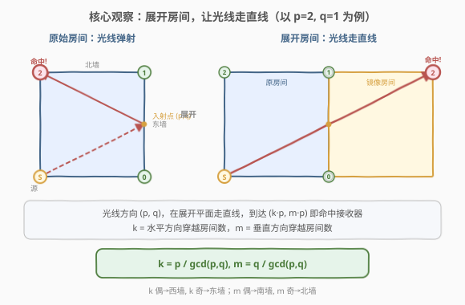
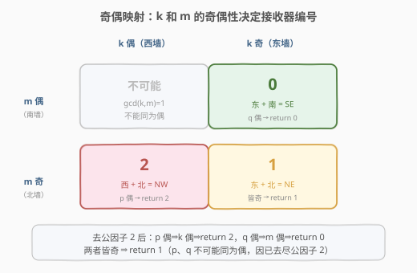
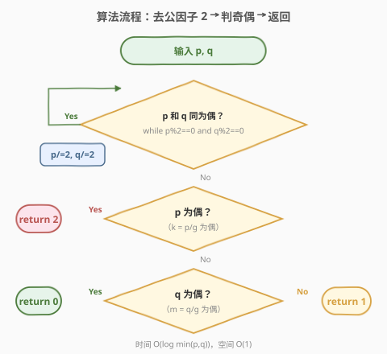
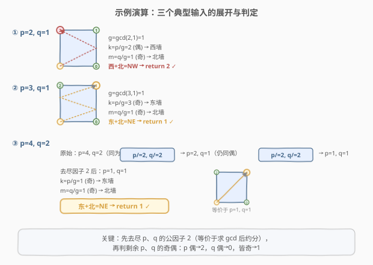

# 镜面反射

- **题目名称**：镜面反射
- **链接**：[858. 镜面反射](https://leetcode.cn/problems/mirror-reflection/)
- **难度**：中等
- **标签**：数学、几何、最大公约数

## 1. 题目概述

有一个特殊的**正方形房间**，每面墙上都有一面镜子。除**西南角**以外，每个角落都放有一个接收器，编号为 `0`、`1`、`2`，按顺时针方向从北开始编号。

正方形房间的墙壁长度为 `p`，一束激光从西南角射出，首先会与东墙相遇，入射点到接收器 `0` 的距离为 `q`。返回光线最先遇到的接收器编号（保证光线最终会遇到一个接收器）。

**房间布局**（坐标系：西南角为原点 $(0,0)$，东为 $x$ 正方向，北为 $y$ 正方向）：

| 位置 | 坐标 | 角色 |
|------|------|------|
| 西南角 (SW) | $(0, 0)$ | 激光光源 |
| 东南角 (SE) | $(p, 0)$ | 接收器 0 |
| 东北角 (NE) | $(p, p)$ | 接收器 1 |
| 西北角 (NW) | $(0, p)$ | 接收器 2 |

光线从 $(0, 0)$ 出发，方向为 $(p, q)$，首次撞击东墙（$x = p$）于点 $(p, q)$。由于四面墙都是镜子，光线会不断反射，直到命中某个角落的接收器。

**示例 1**：

```text
输入：p = 2, q = 1
输出：2
解释：这条光线在第一次被反射回左边的墙时就遇到了接收器 2。
```

**示例 2**：

```text
输入：p = 3, q = 1
输出：1
```

**约束条件**：

- $1 \le q \le p \le 1000$

> 💡 $p, q \le 1000$，即使 $O(p)$ 模拟弹射过程也能通过。但这道题的精髓在于**数学展开法**——将弹射问题转化为直线问题，用 $O(\log \min(p, q))$ 的 GCD 一行解决。

---

## 2. 解题思路

### 2.1 暴力思路：模拟弹射

最直白的做法：从 $(0, 0)$ 出发，按方向 $(p, q)$ 逐步模拟光线在房间内的弹射轨迹。每次撞墙时翻转对应方向的符号（撞东/西墙翻转 $x$ 方向，撞南/北墙翻转 $y$ 方向），直到光线到达某个角落。由于 $p, q \le 1000$，弹射次数不超过 $O(p)$，可以暴力过。

但这种做法缺乏洞察力，面试中难以出彩。真正优雅的解法是**展开房间**。

### 2.2 核心观察：展开房间，让光线走直线



关键思路是**「不折光线，折房间」**——每次光线撞墙时，不改变光线方向，而是将房间**镜像翻转**贴在墙外侧。这样光线在展开的平面中始终走直线。

光线从 $(0, 0)$ 出发，方向 $(p, q)$，在展开平面中沿直线 $y = \frac{q}{p} \cdot x$ 行进。它会在到达某个**镜像房间的角落**时命中接收器，即坐标满足 $x = k \cdot p$ 且 $y = m \cdot p$（$k, m$ 为正整数）。

代入直线方程：

$$m \cdot p = \frac{q}{p} \cdot k \cdot p = k \cdot q \quad \Longrightarrow \quad m \cdot p = k \cdot q$$

满足该等式的最小正整数解为：

$$k = \frac{p}{\gcd(p, q)}, \quad m = \frac{q}{\gcd(p, q)}$$

> 💡 **$k$ 和 $m$ 的物理含义**：$k$ 是光线在水平方向穿越的房间数，$m$ 是垂直方向穿越的房间数。因为 $\gcd(k, m) = 1$（约分后互质），$k$ 和 $m$ **不可能同为偶数**。

**奇偶决定接收器**：

- $k$ 假 → 光线最终落在**西墙**；$k$ 奇 → **东墙**
- $m$ 偶 → 光线最终落在**南墙**；$m$ 奇 → **北墙**



| $k$ 奇偶 | $m$ 奇偶 | 落点 | 接收器 |
|----------|----------|------|--------|
| 偶 | 奇 | 西 + 北 = NW | 2 |
| 奇 | 奇 | 东 + 北 = NE | 1 |
| 奇 | 偶 | 东 + 南 = SE | 0 |
| 偶 | 偶 | — | 不可能（$\gcd(k,m)=1$）|

### 2.3 算法流程图



实际编码时无需显式求 $\gcd$。因为只有**公因子 2** 影响奇偶判定，只需不断将 $p, q$ 同时除以 2 直到至少一个为奇，再判奇偶即可：

1. **去公因子 2**：`while p % 2 == 0 and q % 2 == 0: p //= 2; q //= 2`
2. **判 $p$ 奇偶**：若 $p$ 偶（$k$ 偶）→ `return 2`
3. **判 $q$ 奇偶**：若 $q$ 偶（$m$ 偶）→ `return 0`
4. **皆奇**：→ `return 1`

> 💡 **为什么只需去因子 2 而不求完整 gcd？** 因为接收器编号只取决于 $k = p/g$ 和 $m = q/g$ 的**奇偶性**。$g$ 中的奇数因子不影响奇偶（奇数除奇数仍可能为奇或偶，但 $k, m$ 的奇偶比不变）；只有 $g$ 中的因子 2 会同时消去 $k$ 和 $m$ 的偶性。因此去尽公因子 2 后，$p, q$ 的奇偶就等价于 $k, m$ 的奇偶。

### 2.4 示例演算



以三个典型输入为例：

**① p=2, q=1**：

$$g = \gcd(2, 1) = 1, \quad k = 2 \text{（偶→西）}, \quad m = 1 \text{（奇→北）} \quad \Rightarrow \text{西+北=NW} \rightarrow \textbf{return 2}$$

光线从 $(0,0)$ 射向东墙 $(2,1)$，反射后到达西墙 $(0,2)$ = NW 角 = 接收器 2。

**② p=3, q=1**：

$$g = \gcd(3, 1) = 1, \quad k = 3 \text{（奇→东）}, \quad m = 1 \text{（奇→北）} \quad \Rightarrow \text{东+北=NE} \rightarrow \textbf{return 1}$$

光线从 $(0,0)$ 经 $(3,1) \to (0,2) \to (3,3)$ = NE 角 = 接收器 1。

**③ p=4, q=2**（含去因子 2 步骤）：

$p=4, q=2$ 同为偶 → 各除 2 得 $p=2, q=1$（仍同偶）→ 再各除 2 得 $p=1, q=1$。此时 $k=1$（奇），$m=1$（奇）→ 东+北=NE → **return 1**。

> ⚠️ 注意 $p=4, q=2$ 若**不去因子 2** 直接判奇偶，会得到 $p$ 偶 → return 2（错误）。去因子 2 是关键步骤，它等价于求 $\gcd$ 后约分。

---

## 3. 参考代码

### C++

```cpp
class Solution {
  public:
    int mirrorReflection(int p, int q) {
        while (p % 2 == 0 && q % 2 == 0) {
            p /= 2;
            q /= 2;
        }
        if (p % 2 == 0) return 2;
        if (q % 2 == 0) return 0;
        return 1;
    }
};
```

### Python

```python
class Solution:
    def mirrorReflection(self, p: int, q: int) -> int:
        while p % 2 == 0 and q % 2 == 0:
            p //= 2
            q //= 2
        if p % 2 == 0:
            return 2
        if q % 2 == 0:
            return 0
        return 1
```

> 💡 **更紧凑的写法**（Python 一行）：
> ```python
> class Solution:
>     def mirrorReflection(self, p: int, q: int) -> int:
>         return (p / math.gcd(p, q)) % 2 + 2 - (q / math.gcd(p, q)) % 2
> ```
> 但面试中推荐展开写法，逻辑清晰、易于解释。

---

## 4. 复杂度分析

| 维度 | 复杂度 | 说明 |
|------|--------|------|
| 时间复杂度 | $O(\log \min(p, q))$ | `while` 循环每次将 $p, q$ 同时除以 2，最多迭代 $\log_2(\min(p, q))$ 次；之后 $O(1)$ 奇偶判定 |
| 空间复杂度 | $O(1)$ | 仅修改 $p, q$ 两个局部变量 |

---

## 5. 扩展：模拟法与展开法的等价性

**模拟法**通过逐步追踪光线弹射轨迹，也能得到正确答案。以 $p = 3, q = 2$ 为例：

| 步骤 | 当前位置 | 方向 | 撞墙 | 翻转 |
|------|----------|------|------|------|
| 0 | $(0, 0)$ | $(3, 2)$ | — | — |
| 1 | $(3, 2)$ | $(-3, 2)$ | 东墙 $x=3$ | 翻 $x$ |
| 2 | $(1.5, 3)$ | $(-3, -2)$ | 北墙 $y=3$ | 翻 $y$ |
| 3 | $(0, 2)$ | $(3, -2)$ | 西墙 $x=0$ | 翻 $x$ |
| 4 | $(3, 0)$ | — | SE 角 = 接收器 0 | 命中 |

展开法给出 $k = 3$（奇→东），$m = 2$（偶→南）→ 东+南=SE → 接收器 0，与模拟法一致。

> 💡 **弹射次数 = $k + m - 2$**（减 2 是因为最后一步到达角落不算弹射）。$p=3, q=2$ 时 $k+m-2 = 3$ 次弹射，与上表一致。这个关系源于展开图中光线穿越 $k$ 个水平房间和 $m$ 个垂直房间，每穿越一面墙对应一次弹射。

---

## 6. 面试要点

1. **为什么展开房间后光线走直线就能命中角落？**

   > 展开法将「光线在房间内弹射」转化为「光线在展开平面走直线」。每次撞墙时不改变光线方向，而是镜像翻转房间贴在墙外。展开平面上，镜像房间的角落与原房间角落一一对应，光线到达镜像角落即等价于在原房间中命中对应接收器。

2. **$k = p/\gcd(p,q)$、$m = q/\gcd(p,q)$ 是怎么推导的？**

   > 光线方向为 $(p, q)$，在展开平面沿 $y = (q/p) \cdot x$ 行进。命中角落需 $x = kp$ 且 $y = mp$，代入得 $mp = kq$。最小正整数解为 $k = p/\gcd(p,q)$、$m = q/\gcd(p,q)$，因为 $\gcd(k,m) = \gcd(p/g, q/g) = 1$ 保证了这是第一次命中角落。

3. **为什么只去因子 2 而不求完整 gcd？**

   > 接收器编号只取决于 $k$ 和 $m$ 的奇偶性。$\gcd$ 中的奇因子约去后不改变奇偶比（因为奇数除奇数，商的奇偶不变）；只有因子 2 会同时消去 $k, m$ 的偶性。去尽公因子 2 后，$p, q$ 中至少一个为奇，此时 $p$ 的奇偶等价于 $k$ 的奇偶，$q$ 的奇偶等价于 $m$ 的奇偶。

4. **为什么 $k$ 和 $m$ 不可能同为偶数？**

   > $k = p/g$，$m = q/g$，其中 $g = \gcd(p, q)$。约分后 $\gcd(k, m) = 1$（互质）。若 $k, m$ 同为偶数，则 2 整除两者，与互质矛盾。因此 (偶, 偶) 的格子不可能出现，对应原点 $(0,0)$（光源），光线不会回到出发点。

5. **如果 $p = q$ 会怎样？**

   > $g = p$，$k = 1$（奇），$m = 1$（奇）→ 东+北=NE → return 1。光线从 $(0,0)$ 直接射向 $(p, p)$ = NE 角 = 接收器 1，无任何弹射。这符合直觉：$p = q$ 时光线斜率为 1，直接对角穿过命中 NE 角。

> 💡 **一句话总结**：858 的核心是**「展开房间，化弹射为直线」**——光线在展开平面到达 $(kp, mp)$ 角落，其中 $k = p/\gcd(p,q)$、$m = q/\gcd(p,q)$。$k$ 的奇偶定东西，$m$ 的奇偶定南北，组合即得接收器编号。编码时只需去尽 $p, q$ 的公因子 2 再判奇偶，$O(\log \min(p,q))$ 一行搞定。

---

## 7. 同类练习题

- [365. 水壶问题](https://leetcode.cn/problems/water-and-jug-problem/)：同样用 $\gcd$ 判定可达性，核心是贝祖定理 $ax + by = c$ 有解当且仅当 $\gcd(a,b) \mid c$，对比本题用 $\gcd$ 约分定奇偶
- [1071. 字符串的最大公因子](https://leetcode.cn/problems/greatest-common-divisor-of-strings/)：$\gcd$ 在字符串上的应用，若 $s + t = t + s$ 则存在公因子串，对比本题 $\gcd$ 在几何上的应用
- [149. 直线上最多的点数](https://leetcode.cn/problems/max-points-on-a-line/)（[题解](../0101-0200/149_直线上最多的点数.md)）：用 $\gcd$ 化简分数表示斜率，与本题用 $\gcd$ 约分定方向同属「GCD 化简」套路
- [914. 卡牌分组](https://leetcode.cn/problems/x-of-a-kind-in-a-deck-of-cards/)：统计频率后求所有频率的 $\gcd$，若 $\gcd \ge 2$ 则可分组，对比本题用 $\gcd$ 约分后判奇偶
- [836. 矩形重叠](https://leetcode.cn/problems/rectangle-overlap/)：几何坐标系下的简单判定题，对比本题在坐标系中追踪光线轨迹
