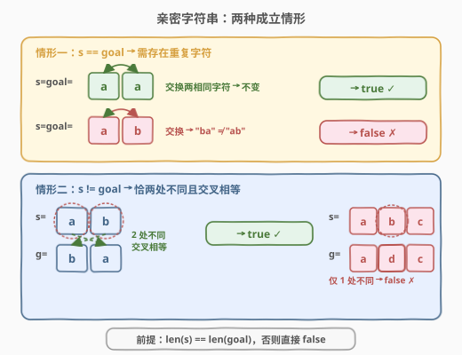
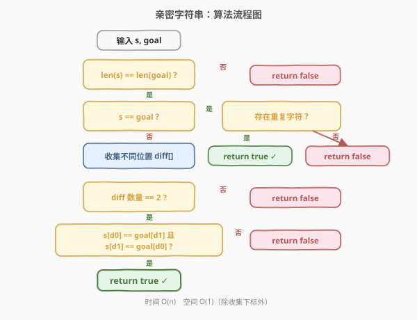
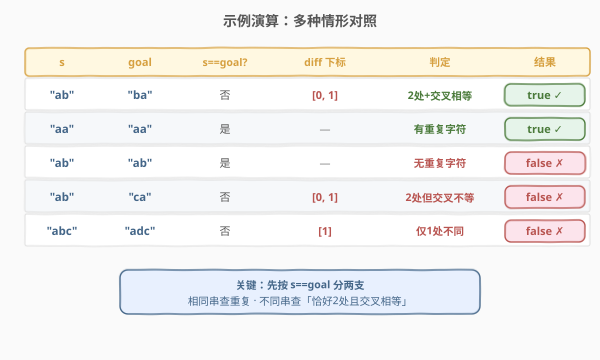

# LeetCode 亲密字符串 题解

## 1. 题目概述

- **标题 / 题号**：亲密字符串（#859，easy）
- **链接**：https://leetcode.cn/problems/buddy-strings/
- **难度**：简单
- **标签**：字符串、哈希表、枚举

**题意**：给定两个由小写字母组成的字符串 `s` 和 `goal`，判断是否可以**恰好交换 `s` 中两个位置的字符**（交换两个下标，可以是相同字母），使得交换后的 `s` 等于 `goal`。可以则返回 `true`，否则返回 `false`。

**示例 1**：

```text
输入：s = "ab", goal = "ba"
输出：true
解释：交换 s[0] = 'a' 和 s[1] = 'b'，得到 "ba" == goal。
```

**示例 2**：

```text
输入：s = "ab", goal = "ab"
输出：false
解释：唯一可交换的是 s[0]='a' 与 s[1]='b'，得到 "ba" ≠ "ab"。
```

**示例 3**：

```text
输入：s = "aa", goal = "aa"
输出：true
解释：交换 s[0]='a' 和 s[1]='a'，得到 "aa" == goal。
```

**约束**：

- $1 \leq \text{s.length}, \text{goal.length} \leq 2 \times 10^4$
- `s` 和 `goal` 仅由小写英文字母组成

> 💡 **核心转化**：一次交换最多改变两个位置。因此把问题拆成两支——若 `s` 与 `goal` 完全相同，则交换必须「不变」，即需要存在两个相同的字符可互换；若不同，则不同的位置必须恰好两处，且这两处「交叉相等」（`s[i]==goal[j]` 且 `s[j]==goal[i]`）。

## 2. 解题思路

### 2.1 暴力思路

最直白的做法：枚举 `s` 中所有下标对 $(i, j)$（$i < j$），交换 `s[i]` 与 `s[j]` 后比较是否等于 `goal`，任一组命中即返回 `true`。时间 $O(n^3)$（$O(n^2)$ 个对 × 每次比较 $O(n)$），在 $n = 2 \times 10^4$ 下必然超时。

> 💡 暴力法的价值在于揭示「一次交换只影响两个位置」这一关键约束——这正是把 $O(n^2)$ 枚举压缩到 $O(n)$ 的突破口。

### 2.2 核心观察：按 `s == goal` 分两支判定



一次交换后 `s` 只有**最多两个位置**与原串不同。据此分两种情形：

**情形一：`s == goal`**。交换后要仍等于 `goal`，意味着交换必须「不改变字符串」。唯一可能是交换两个**相同的字符**（如 `"aa"` 交换两个 `a`）。因此只需检查 `s` 中是否存在某个字符出现至少两次——用长度为 26 的频率数组一次扫描即可。有重复则 `true`，否则 `false`（如 `"ab"` 交换后必变 `"ba"`）。

**情形二：`s != goal`**。此时交换必须恰好「修正」所有不同处。设不同的下标集合为 `diff`：

| 条件 | 说明 |
|------|------|
| `diff.size() == 2` | 一次交换只能改两个位置，多了少了都不行 |
| 交叉相等 | 设 `diff = [i, j]`，需 `s[i] == goal[j]` 且 `s[j] == goal[i]` |

两个条件同时满足才返回 `true`。例如 `s="ab"`、`goal="ba"`：`diff=[0,1]`，`s[0]='a'==goal[1]` 且 `s[1]='b'==goal[0]` ✓。又如 `s="ab"`、`goal="ca"`：虽有两处不同，但 `s[1]='b' != goal[0]='c'`，交叉不成立 ✗。

> ⚠️ **长度不等直接 `false`**：交换不改变长度，若 `len(s) != len(goal)` 一开始就排除，避免后续越界访问。

### 2.3 算法流程图



**完整步骤**：

1. **长度检查**：若 `s.size() != goal.size()`，返回 `false`。
2. **相同串分支**：若 `s == goal`，统计字符频率，存在任一字符频次 $\geq 2$ 则 `true`，否则 `false`。
3. **不同串分支**：扫描收集 `s[i] != goal[i]` 的下标到 `diff`：
   - `diff.size() != 2` → `false`；
   - 设 `i = diff[0]`、`j = diff[1]`，验证 `s[i] == goal[j] && s[j] == goal[i]`，成立则 `true`，否则 `false`。

> 💡 **为什么不同位置最多两个？** 一次交换只改动两个下标的内容，所以交换前后 `s` 与 `goal` 的差异位置数不可能超过 2。若有 3 处及以上不同，一次交换绝无可能全部修正——这是「恰好 2」判定的数学依据。

### 2.4 示例演算

下表对照多种情形，覆盖两类分支的真/假情况：



| s | goal | s==goal? | diff 下标 | 判定 | 结果 |
|------|------|----------|-----------|------|------|
| `"ab"` | `"ba"` | 否 | `[0,1]` | 2 处 + 交叉相等 | `true` ✓ |
| `"aa"` | `"aa"` | 是 | — | 有重复字符 | `true` ✓ |
| `"ab"` | `"ab"` | 是 | — | 无重复字符 | `false` ✗ |
| `"ab"` | `"ca"` | 否 | `[0,1]` | 2 处但交叉不等 | `false` ✗ |
| `"abc"` | `"adc"` | 否 | `[1]` | 仅 1 处不同 | `false` ✗ |

> 💡 第 4 行尤其值得注意：`diff` 数量同为 2，但因 `s[1]='b'` 与 `goal[0]='c'` 不等，交叉条件失败——**「两处不同」是必要但不充分条件**，必须叠加交叉相等。

## 3. 参考代码

### C++

```cpp
class Solution {
  public:
    bool buddyStrings(string s, string goal) {
        if (s.size() != goal.size()) return false;
        if (s == goal) {
            int freq[26] = {0};
            for (char c : s) {
                if (++freq[c - 'a'] >= 2) return true;
            }
            return false;
        }
        vector<int> diff;
        for (int i = 0; i < (int)s.size(); ++i) {
            if (s[i] != goal[i]) {
                diff.push_back(i);
                if (diff.size() > 2) return false;
            }
        }
        int i = diff[0], j = diff[1];
        return s[i] == goal[j] && s[j] == goal[i];
    }
};
```

### Python

```python
class Solution:
    def buddyStrings(self, s: str, goal: str) -> bool:
        if len(s) != len(goal):
            return False
        if s == goal:
            return len(set(s)) < len(s)
        diff = [i for i, (a, b) in enumerate(zip(s, goal)) if a != b]
        if len(diff) != 2:
            return False
        i, j = diff
        return s[i] == goal[j] and s[j] == goal[i]
```

> ⚠️ **易错点**：① 必须先判长度，否则 `s == goal` 分支之后收集 `diff` 时可能因长度不同而越界或漏判；② `s == goal` 时不是返回 `true`，而是要确认「存在重复字符」——`"ab"` vs `"ab"` 应为 `false`；③ `diff.size() > 2` 可提前剪枝返回 `false`，避免无谓存储；④ Python 中 `len(set(s)) < len(s)` 是检测重复字符的简洁写法（集合去重后变短即有重复）。

## 4. 复杂度分析

| 维度 | 复杂度 | 说明 |
|------|--------|------|
| 时间复杂度 | $O(n)$ | 至多一次线性扫描：相同串分支统计频率 $O(n)$，不同串分支收集 `diff` $O(n)$，交叉比较 $O(1)$ |
| 空间复杂度 | $O(1)$ | 频率数组固定 26；`diff` 至多存 2 个下标，均与 $n$ 无关 |

> 💡 虽然不同串分支理论上可能收集到多个不同下标，但一旦超过 2 即提前返回，故 `diff` 容器实际只占常数空间。

## 5. 扩展：交换至多 k 次 / 交换任意多次

本题限制「恰好一次交换」。若放宽为「至多 k 次交换使 `s == goal`」，则升级为最小交换次数问题——可建模为排列的环分解：把 `s` 与 `goal` 的位置对应关系视作置换，每个长度为 $L$ 的环需要 $L-1$ 次交换归位，总次数为 $n - \text{环数}$。再叠加「相同串需要凑重复字符」的特殊情形（消耗一次「无效交换」），即可推广到 k 次的判定。

> ⚠️ 该扩展已超出本题范围，仅作思路延伸。本题的精髓在于「一次交换 $\Rightarrow$ 差异位置数 $\leq 2$」这一观察，把指数级枚举压缩为线性扫描。

## 6. 面试要点

1. **`s == goal` 时为什么不能直接返回 `true`？**

   - 交换两个**不同**字符一定会改变字符串。只有交换两个**相同**字符才保持不变，因此 `s == goal` 时必须确认存在重复字符（频次 $\geq 2$）。如 `"ab"` 交换后变 `"ba"`，并不等于 `"ab"`，应返回 `false`。

2. **不同串分支为什么 `diff` 数量必须恰好为 2？**

   - 一次交换只改动两个下标，所以交换前后与 `goal` 的差异位置数不可能超过 2。若差异为 1 或 $\geq 3$，一次交换都无法恰好修正——少了凑不齐、多了修不完，故必须恰好 2。

3. **交叉相等条件的含义是什么？**

   - 设两处不同下标为 `i`、`j`，交换 `s[i]` 与 `s[j]` 后，位置 `i` 变成原 `s[j]`、位置 `j` 变成原 `s[i]`。要让这两处等于 `goal`，即 `s[j] == goal[i]` 且 `s[i] == goal[j]`——这就是「交叉相等」。

4. **为什么要先判长度？**

   - 交换不改变字符串长度。若 `len(s) != len(goal)`，无论怎么交换都不可能相等，直接 `false`。同时这也是后续按下标逐位比较的安全前提，避免越界。

5. **`diff.size() > 2` 时提前返回有什么好处？**

   - 既省去无谓的存储，又能在长字符串早期剪枝。最坏情况（如两串几乎处处不同）无需扫完全程，发现第 3 个不同位置即返回 `false`，体现「常数空间」的严谨性。

> 💡 **一句话总结**：859 的关键在于按 `s == goal` 分两支——相同串查重复字符，不同串查「恰好两处不同且交叉相等」，配合长度前置检查，$O(n)$ 一遍过。

## 同类练习题

| # | 题目 | 与本题的关联 |
|---|------|-------------|
| 1790 | [仅执行一次字符串交换能否使两个字符串相等](https://leetcode.cn/problems/check-if-one-string-swap-can-make-strings-equal/) | 几乎同款题，但不允许「交换相同字符」，即 `s == goal` 时直接判等，是 859 的简化变体 |
| 854 | [相似度为 K 的字符串](https://leetcode.cn/problems/k-similar-strings/) | 859 的 k 次交换泛化版，求最小交换次数，可用 BFS / 启发式搜索 |
| 1247 | [交换字符使得字符串相等](https://leetcode.cn/problems/minimum-swaps-to-make-strings-equal/) | 两串仅含 `x`/`y`，求最小交换使其相等，同为「交换修正差异」家族但含跨串交换 |
| 1657 | [确定两个字符串是否接近](https://leetcode.cn/problems/determine-if-two-strings-are-close/) | 字符串等价判定（操作集不同），同为「字符级操作后的相等性判定」 |
| 242 | [有效的字母异位词](https://leetcode.cn/problems/valid-anagram/) | 用频率数组判定两串字符组成是否相同，与本题「相同串查重复」共用频率统计手法 |
