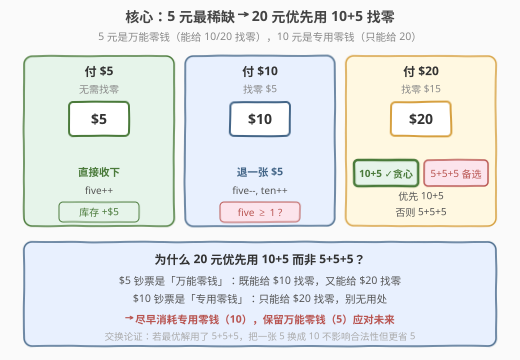
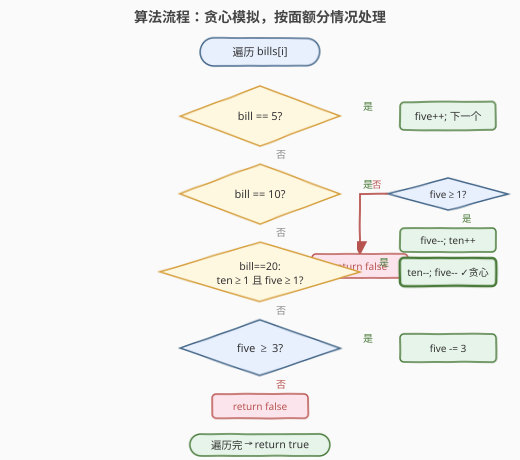
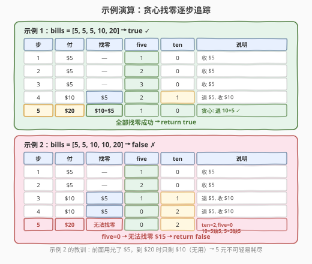

# 柠檬水找零

- **题目名称**：柠檬水找零
- **链接**：[860. 柠檬水找零](https://leetcode.cn/problems/lemonade-change/)
- **难度**：简单
- **标签**：贪心、数组、模拟

## 1. 题目概述

在柠檬水摊上，每一杯柠檬水的售价为 `5` 美元。顾客排队购买（按账单 `bills` 支付的顺序）一次购买一杯。每位顾客只买一杯，然后向你付 `5` 美元、`10` 美元或 `20` 美元。你必须给每个顾客**正确找零**，使净交易为每位顾客向你支付 `5` 美元。一开始你手头没有任何零钱。

给你一个整数数组 `bills`，其中 `bills[i]` 是第 `i` 位顾客付的账。如果能给每位顾客正确找零，返回 `true`，否则 `false`。

**示例 1**：

```text
输入：bills = [5,5,5,10,20]
输出：true
解释：
前 3 位顾客，按顺序收取 3 张 5 美元钞票。
第 4 位顾客，收取一张 10 美元，并返还 5 美元。
第 5 位顾客，收取一张 20 美元，并返还一张 10 美元和一张 5 美元。
```

**示例 2**：

```text
输入：bills = [5,5,10,10,20]
输出：false
解释：
前 2 位顾客，收取 2 张 5 美元钞票。
第 3、4 位顾客，各收取一张 10 美元，返还 5 美元。
第 5 位顾客，无法退回 15 美元（只剩两张 10 美元，没有 5 美元）。
```

**约束条件**：

- $1 \le \text{bills.length} \le 10^5$
- `bills[i]` 不是 `5` 就是 `10` 或是 `20`

---

## 2. 解题思路

### 2.1 暴力思路：回溯枚举每种找零组合

最直接的做法是：遇到 $20 美元时，枚举所有可能的找零方式（`10+5` 或 `5+5+5`），递归搜索所有分支，只要有一条路径能走完就返回 `true`。最坏情况每次 $20 有 2 种选择，总复杂度可达 $O(2^n)$，$n = 10^5$ 时完全不可行。

> ⚠️ 暴力法的瓶颈在于「不知道该选哪种找零方式」。破局思路：**贪心**——$5 美元比 $10 美元更"值钱"，遇到 $20 时**优先用 $10+$5**，把 $5 留给未来。

### 2.2 核心观察：贪心——5 元最稀缺，优先消耗 10 元



**关键直觉**：

- **$5 美元是「万能零钱」**：既能给 $10 找零（退一张 $5），又能给 $20 找零（退三张 $5 或 $10+$5）。
- **$10 美元是「专用零钱」**：只能给 $20 找零（退 $10+$5），对 $10 顾客毫无用处。
- **贪心策略**：遇到 $20 时，**优先消耗专用零钱（$10）**，保留万能零钱（$5）应对未来。即先尝试 `10+5`，不行再尝试 `5+5+5`。

> 💡 **为什么贪心是对的？** 交换论证：假设最优解在某步用了 `5+5+5` 给 $20 找零，而当时手头有 $10。把其中一张 $5 换成 $10（即改为 `10+5`），找零总额不变，且 $5 的库存多了一张——后续只可能更好，不会更差。因此「优先 $10+$5」不会丢失最优解。

**只需两个计数器**：

- `five`：手头 $5 钞票数量
- `ten`：手头 $10 钞票数量

$20 钞票**不需要计数**——它永远不能用于找零（没有 $25 面额的顾客），收下后直接「锁进抽屉」。

### 2.3 算法流程图



**完整步骤**：

1. 初始化 `five = 0`，`ten = 0`。
2. 遍历 `bills` 中每个 `bill`：
   - **`bill == 5`**：无需找零，`five++`。
   - **`bill == 10`**：需找零 $5。若 `five == 0` 返回 `false`；否则 `five--`，`ten++`。
   - **`bill == 20`**：需找零 $15。
     - **优先尝试 `10+5`**（贪心）：若 `ten >= 1 && five >= 1`，则 `ten--`，`five--`。
     - **否则尝试 `5+5+5`**：若 `five >= 3`，则 `five -= 3`。
     - **都不行**：返回 `false`。
3. 全部遍历完返回 `true`。

> ⚠️ **顺序很重要**：$20 的找零必须**先尝试 `10+5` 再尝试 `5+5+5`**。若反过来先用 `5+5+5`，可能在某步浪费了三张 $5，导致后续 $10 顾客无法找零——而手头明明有 $10 可用。

### 2.4 示例演算

以 `bills = [5,5,5,10,20]`（示例 1）和 `bills = [5,5,10,10,20]`（示例 2）为例：



**示例 1**（`[5,5,5,10,20]`）：

| 步骤 | 付 | 找零 | five | ten | 说明 |
|------|-----|------|------|-----|------|
| 1 | $5 | — | 1 | 0 | 收 $5 |
| 2 | $5 | — | 2 | 0 | 收 $5 |
| 3 | $5 | — | 3 | 0 | 收 $5 |
| 4 | $10 | $5 | 2 | 1 | 退 $5, 收 $10 |
| 5 | $20 | $10+$5 | 1 | 0 | 贪心: 退 10+5 ✓ |

全部找零成功 → `true`。

**示例 2**（`[5,5,10,10,20]`）：

| 步骤 | 付 | 找零 | five | ten | 说明 |
|------|-----|------|------|-----|------|
| 1 | $5 | — | 1 | 0 | 收 $5 |
| 2 | $5 | — | 2 | 0 | 收 $5 |
| 3 | $10 | $5 | 1 | 1 | 退 $5, 收 $10 |
| 4 | $10 | $5 | 0 | 2 | 退 $5, 收 $10 |
| 5 | $20 | 无法找零 | 0 | 2 | ten=2, five=0 → 10+5 缺 5, 5×3 缺 5 |

`five=0` → 无法找零 $15 → `false`。

> 💡 **示例 2 的教训**：前 4 步用光了所有 $5（每收一个 $10 就退一张 $5），到第 5 步 $20 时只剩两张 $10（对找零 $15 无用——`10+5` 需要 $5，`5+5+5` 需要三张 $5）。这就是贪心的核心动机：**$5 不可轻易耗尽，遇到 $20 时应优先用 $10 替代**。

---

## 3. 参考代码

### C++

```cpp
class Solution {
public:
    bool lemonadeChange(vector<int>& bills) {
        int five = 0, ten = 0;
        for (int bill : bills) {
            if (bill == 5) {
                five++;
            } else if (bill == 10) {
                if (five == 0) return false;
                five--;
                ten++;
            } else { // bill == 20
                if (ten > 0 && five > 0) {   // 贪心：优先 10+5
                    ten--;
                    five--;
                } else if (five >= 3) {      // 备选：5+5+5
                    five -= 3;
                } else {
                    return false;
                }
            }
        }
        return true;
    }
};
```

### Python

```python
class Solution:
    def lemonadeChange(self, bills: List[int]) -> bool:
        five = ten = 0
        for bill in bills:
            if bill == 5:
                five += 1
            elif bill == 10:
                if five == 0:
                    return False
                five -= 1
                ten += 1
            else:  # bill == 20
                if ten > 0 and five > 0:    # 贪心：优先 10+5
                    ten -= 1
                    five -= 1
                elif five >= 3:             # 备选：5+5+5
                    five -= 3
                else:
                    return False
        return True
```

> 💡 **实现要点**：① 只需两个变量 `five`、`ten`，无需记录 $20 数量（它不能用于找零）。② $20 的找零分支顺序固定：先 `10+5` 再 `5+5+5`——这是贪心正确性的关键。③ 即使 `five >= 3` 但 `ten > 0 && five > 0` 时也要优先用 `10+5`，因为省下的 $5 能应对更多场景。

---

## 4. 复杂度分析

| 维度 | 复杂度 | 说明 |
|------|--------|------|
| **时间复杂度** | $O(n)$ | 遍历一次 `bills`，每个元素 $O(1)$ 分支判断 |
| **空间复杂度** | $O(1)$ | 只用两个计数器 `five`、`ten`，常数额外空间 |

> 💡 本题是**模拟 + 贪心**的经典入门题。时间 $O(n)$、空间 $O(1)$ 已是最优——必须逐个处理顾客，无法跳过。

---

## 5. 扩展：贪心正确性的交换论证

**命题**：对于 $20 美元找零，「优先 `10+5`，备选 `5+5+5`」的贪心策略是正确的——若存在合法找零方案，贪心策略一定能找到。

**证明（交换论证）**：

设某合法方案 $S$ 在处理第 $i$ 位顾客（付 $20）时用了 `5+5+5`，而当时手头至少有一张 $10 和一张 $5$（即满足 `10+5` 条件）。构造方案 $S'$：将该步的 `5+5+5` 替换为 `10+5`。

- 找零总额：`5+5+5 = 15`，`10+5 = 15`，不变。
- $10 库存：$S'$ 比 $S$ 少了一张 $10，但 $10 只能用于 $20 找零，而 $S'$ 此时多省了一张 $5——**$5 能替代 $10 的一切功能**（$10 找零只需 $5，$20 找零的备选方案也只需 $5），反之不然。
- 因此 $S'$ 在后续每步都**不比 $S$ 差**：凡是 $S$ 能用 $10 的地方，$S'$ 要么也有 $10（若没被消耗），要么用多出的 $5 替代。

反复应用此交换，直到没有「该用 $10 却用了 $5」的步骤，得到与贪心策略一致的方案。故贪心不丢失最优解。$\blacksquare$

> 💡 **交换论证的核心**：$5 的功能是 $10 的**超集**（$5 能做的事 $10 做不到，$10 能做的事 $5 都能做）。因此「保留功能更全的资源（$5），消耗功能更窄的资源（$10）」总是不劣的——这是贪心题中「留多面手、用专才」的通用直觉。

---

## 6. 面试要点

1. **为什么 $20 优先用 `10+5` 而非 `5+5+5`？**

   > $5 是万能零钱（能给 $10 和 $20 找零），$10 是专用零钱（只能给 $20 找零）。优先消耗专用零钱、保留万能零钱，能最大化后续找零的灵活性。交换论证：把 `5+5+5` 中的一张 $5 换成 $10，找零总额不变但 $5 库存更多，后续只可能更好。

2. **为什么不需要记录 $20 钞票的数量？**

   > $20 钞票永远不能用于找零——没有 $25 面额的顾客付账，所以 $20 收下后直接「锁进抽屉」，不需要参与找零逻辑。

3. **贪心策略在什么情况下会失败？如果先尝试 `5+5+5` 会怎样？**

   > 若先尝试 `5+5+5`，可能在某步浪费三张 $5，导致后续 $10 顾客（只需退一张 $5）无法找零——而手头明明有 $10 可用于 $20 找零。反例：`[5,5,5,10,20,10]`——若第 4 步 $20 用了 `5+5+5`（five 变 0），第 5 步 $10 就无法找零。贪心用 `10+5` 则 five=1，仍能找零。

4. **如何向面试官解释交换论证？**

   > 核心是「$5 的功能是 $10 的超集」。任何用了 $10 的找零方案，都可以把 $10 换成等价的 $5（因为 $5 能做 $10 能做的一切），反之不行。所以保留 $5、消耗 $10 是安全的——不会丢失任何合法方案。

5. **这题和「分发糖果」「跳跃游戏」等贪心题有什么共同点？**

   > 都是「局部最优 → 全局最优」的贪心，但本题的贪心直觉更直接——资源的「通用性」决定优先级。分发糖果需要双向遍历保证约束，跳跃游戏用最远可达范围做贪心，本题则是「留多面手、用专才」的资源调度贪心。

> 💡 **一句话总结**：860 是贪心入门招牌题——只记两个计数器 `five`/`ten`，遇到 $20 优先 `10+5` 再 `5+5+5`。核心直觉：$5 是万能零钱（功能超集），尽早消耗专用零钱 $10，保留万能零钱 $5 应对未来。

---

## 7. 同类练习题

- [322. 零钱兑换](https://leetcode.cn/problems/coin-change/)（[题解](../0301-0400/322_零钱兑换.md)）：找零问题的 DP 版——给定硬币面额求凑出目标金额的最少硬币数，与本题「用现有钞票找零」互补
- [221. 最大正方形](https://leetcode.cn/problems/maximal-square/)（[题解](../0201-0300/221_最大正方形.md)）：同为简单模拟/DP 入门题，展示「局部最优」的不同形式
- [134. 加油站](https://leetcode.cn/problems/gas-station/)：贪心 + 模拟的经典题，「当前累积油量 < 0 就重置起点」与本题「零钱不够就 false」的贪心判断结构相似
- [406. 根据身高重建队列](https://leetcode.cn/problems/queue-reconstruction-by-height/)：贪心 + 模拟，按维度排序后局部最优填充，与本题「按顺序处理 + 贪心决策」思路相通
- [455. 分发饼干](https://leetcode.cn/problems/assign-cookies/)：贪心入门题，排序后用最小饼干满足最小孩子，与本题「用最少资源满足当前需求」的贪心直觉一致
