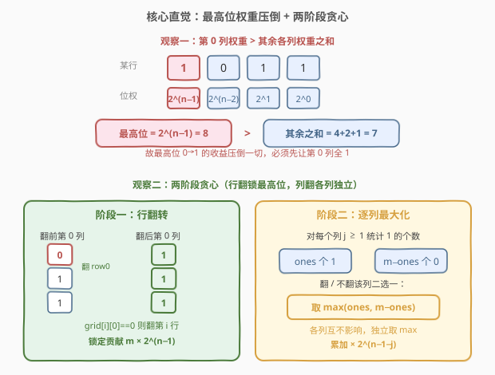
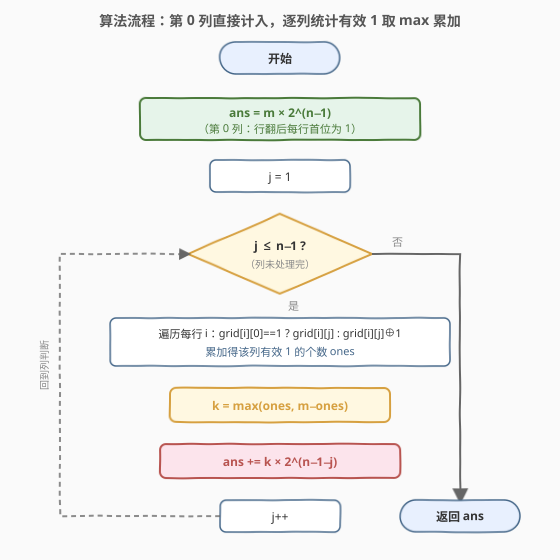
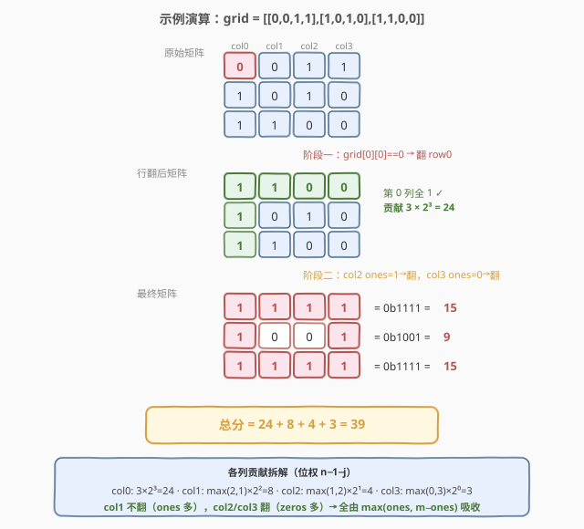

# LeetCode 翻转矩阵后的得分 题解

## 1. 题目概述

- **标题 / 题号**：翻转矩阵后的得分（#861，medium）
- **链接**：https://leetcode.cn/problems/score-after-flipping-matrix/
- **难度**：中等
- **标签**：贪心、位运算、矩阵

**题意**：给定一个 $m \times n$ 的**二进制矩阵** `grid`（每个元素为 `0` 或 `1`）。一次**移动**定义为：选择任意一行或一列，把该行/列中的每个值**翻转**（`0` 变 `1`，`1` 变 `0`）。

在执行**任意次移动**（含 0 次）之后，把矩阵的**每一行**解释为一个**二进制数**（最左列是最高位），矩阵的**得分**等于所有行二进制数之和。要求返回可能的**最高得分**。

**示例 1**：

```text
输入：grid = [[0,0,1,1],[1,0,1,0],[1,1,0,0]]
输出：39
解释：转换为
    [1,1,1,1] = 0b1111 = 15
    [1,0,0,1] = 0b1001 = 9
    [1,1,1,1] = 0b1111 = 15
    总和 = 15 + 9 + 15 = 39
```

**示例 2**：

```text
输入：grid = [[0]]
输出：1
解释：翻转第 0 行（唯一一行），得到 [1] = 1。
```

**约束**：

- $m == \text{grid.length}$
- $n == \text{grid[i].length}$
- $1 \le m, n \le 20$
- $\text{grid[i][j]}$ 为 `0` 或 `1`

> 💡 这是一道**贪心 + 位运算**题。核心洞察有二：(1) 第 0 列是每行的**最高有效位**，权重 $2^{n-1}$ 大于其余所有位权重之和，故**必须**先让第 0 列全为 1；(2) 行翻转固定第 0 列后，**其余各列彼此独立**，逐列最大化 1 的个数即可。两阶段贪心即可得到全局最优。

## 2. 解题思路

### 2.1 暴力思路：枚举所有行翻转组合

每行有「翻 / 不翻」两种选择，共 $2^m$ 种行翻转组合。对每种组合，再对每一列独立决定是否翻转（贪心取 1 多的一侧）。枚举行翻转、列翻转贪心，取最大得分。

```text
best = 0
for mask in 0 .. 2^m - 1:           // 枚举每行翻/不翻
    应用行翻转 mask 得到中间矩阵
    对每列 j：ones = 该列 1 的个数；列贡献 = max(ones, m-ones) * 2^(n-1-j)
    best = max(best, 列贡献之和)
return best
```

时间复杂度 $O(2^m \cdot m \cdot n)$，对 $m \le 20$ 高达 $10^8$ 级别，且毫无必要——行翻转的最优选择**无需枚举**，可由贪心直接确定。

> ⚠️ 暴力法错在没有意识到「第 0 列权重压倒性大」这一结构。一旦看透最高位的支配地位，行翻转的选择就唯一确定：**首位为 0 的行必翻**。枚举因此退化为确定策略。

### 2.2 核心观察：贪心——最高位优先 + 列独立最大化

**观察一：第 0 列是最高有效位，权重压倒性大。**

每一行的第 0 列权重为 $2^{n-1}$，而第 1 列到第 $n-1$ 列的权重之和为：

$$
\sum_{j=1}^{n-1} 2^{n-1-j} = 2^{n-1} - 1 < 2^{n-1}
$$

即**最高位一列的权重，严格大于其余所有列权重之和**。这意味着：哪怕把其余所有列全填成 1，也抵不过最高位从 0 变 1 带来的收益。因此**最大化第 0 列的 1 的个数**是绝对优先的——必须让每一行的首位都为 1。

**行翻转策略（确定）**：对第 $i$ 行，若 $\text{grid[i][0]} == 0$，则翻转该行（首位变 1）；否则不翻。这样**所有行首位全为 1**，第 0 列贡献锁定为 $m \cdot 2^{n-1}$。



**观察二：行翻转固定后，其余各列彼此独立。**

行翻转只影响「行内所有位」，不会改变列与列之间的相对关系；而**列翻转**只影响单列。关键在于：对第 $j$ 列（$j \ge 1$）做翻转**不会影响第 0 列**（第 0 列已被行翻转锁定为全 1，列翻转第 $j$ 列碰不到它），也不会影响其它列。所以**每个 $j \ge 1$ 的列可以独立决定翻或不翻**，互不干扰。

对第 $j$ 列，设该列（行翻转之后）中 1 的个数为 $\text{ones}_j$，则：

- 不翻该列：贡献 $\text{ones}_j \cdot 2^{n-1-j}$
- 翻该列：贡献 $(m - \text{ones}_j) \cdot 2^{n-1-j}$

取较大者，贡献为 $\max(\text{ones}_j,\ m - \text{ones}_j) \cdot 2^{n-1-j}$。这就是该列的**最优贡献**，且与其它列无关。

> 💡 **为什么不必真的执行翻转？** 行翻转的效果可以用「有效位」表达：若第 $i$ 行被翻转（即 $\text{grid[i][0]} == 0$），则该行第 $j$ 列的**有效值**为 $\text{grid[i][j]} \oplus 1$；否则为 $\text{grid[i][j]}$。统计有效值中的 1 个数即为 $\text{ones}_j$。无需修改原矩阵，一次扫描即可算出所有列贡献，$O(mn)$ 解决。
>
> ⚠️ 第 0 列本身**不需要**再用「有效位 + max」公式——行翻转策略已保证其有效值恒为 1，贡献固定为 $m \cdot 2^{n-1}$。若也对第 0 列套 max 公式，会得到同样的结果（有效 ones = m，max(m, 0) = m），但直接写死更清晰。

### 2.3 算法流程图



**完整步骤**：

1. **初始化** `ans = 0`，记 $m$、$n$ 为矩阵行数、列数。
2. **第 0 列贡献**：`ans += m * (1 << (n-1))`（每行首位必为 1）。
3. **逐列处理** `j = 1 … n-1`：
   - 统计该列**有效 1** 个数 `ones`：遍历每行 $i$，若 $\text{grid[i][0]} == 1$ 则有效位 $= \text{grid[i][j]}$，否则有效位 $= \text{grid[i][j]} \oplus 1$；累加。
   - `k = max(ones, m - ones)`。
   - `ans += k * (1 << (n-1-j))`。
4. **返回** `ans`。

> ⚠️ **位权计算**：第 $j$ 列（从 0 开始）的位权是 $2^{n-1-j}$。第 0 列 $2^{n-1}$，第 $n-1$ 列 $2^0 = 1$。写代码时用 `1 << (n-1-j)`，注意 `n-1-j` 而非 `n-j`。

### 2.4 示例演算

以示例 1 `grid = [[0,0,1,1],[1,0,1,0],[1,1,0,0]]`（$m=3,\ n=4$）为例。



**阶段一：行翻转（锁定第 0 列全 1）**

| 行 | 原始行 | grid[i][0] | 是否翻行 | 翻后行 |
|----|--------|------------|----------|--------|
| 0 | `[0,0,1,1]` | 0 | 翻 | `[1,1,0,0]` |
| 1 | `[1,0,1,0]` | 1 | 不翻 | `[1,0,1,0]` |
| 2 | `[1,1,0,0]` | 1 | 不翻 | `[1,1,0,0]` |

第 0 列翻后为 `[1,1,1]`，全 1 ✓，贡献 $= 3 \times 2^3 = 24$。

**阶段二：逐列最大化（$j = 1,2,3$）**

逐列统计翻后矩阵中 1 的个数，并决定是否再翻该列：

| 列 $j$ | 翻后该列 | ones | max(ones, 3−ones) | 是否翻列 | 最终列 | 位权 $2^{3-j}$ | 列贡献 |
|--------|----------|------|-------------------|----------|--------|----------------|--------|
| 1 | `[1,0,1]` | 2 | $\max(2,1)=2$ | 不翻 | `[1,0,1]` | $2^2=4$ | $2 \times 4 = 8$ |
| 2 | `[0,1,0]` | 1 | $\max(1,2)=2$ | **翻** | `[1,0,1]` | $2^1=2$ | $2 \times 2 = 4$ |
| 3 | `[0,0,0]` | 0 | $\max(0,3)=3$ | **翻** | `[1,1,1]` | $2^0=1$ | $3 \times 1 = 3$ |

**最终矩阵**（行翻 + col2 翻 + col3 翻）：

```text
[1,1,1,1] = 15
[1,0,0,1] = 9
[1,1,1,1] = 15
```

**总分** $= 24 + 8 + 4 + 3 = 39$，与示例一致 ✓。

> 💡 注意第 2、3 列的 ones 都小于一半，故选择**翻列**使 1 变多。代码中用 `max(ones, m-ones)` 直接吸收这两种情况，无需真正执行列翻转——这正是「有效位 + max」公式的便利之处。

## 3. 参考代码

### C++

```cpp
class Solution {
public:
    int matrixScore(vector<vector<int>>& grid) {
        int m = grid.size(), n = grid[0].size();
        int ans = 0;
        // 第 0 列：行翻转后每行首位必为 1，贡献 m * 2^(n-1)
        ans += m * (1 << (n - 1));
        // 第 j 列 (j >= 1)：统计有效 1 的个数，取 max(ones, m-ones)
        for (int j = 1; j < n; ++j) {
            int ones = 0;
            for (int i = 0; i < m; ++i) {
                // 该行首位为 0 则整行已被翻转，有效位 = grid[i][j] ^ 1
                int bit = grid[i][0] ? grid[i][j] : (grid[i][j] ^ 1);
                ones += bit;
            }
            int k = max(ones, m - ones);
            ans += k * (1 << (n - 1 - j));
        }
        return ans;
    }
};
```

### Python

```python
class Solution:
    def matrixScore(self, grid: List[List[int]]) -> int:
        m, n = len(grid), len(grid[0])
        ans = m * (1 << (n - 1))           # 第 0 列：每行首位必为 1
        for j in range(1, n):
            ones = 0
            for i in range(m):
                # 该行首位为 0 则整行已翻转，有效位 = grid[i][j] ^ 1
                bit = grid[i][j] if grid[i][0] else grid[i][j] ^ 1
                ones += bit
            k = max(ones, m - ones)
            ans += k * (1 << (n - 1 - j))
        return ans
```

> 💡 两版逻辑一致：**不修改原矩阵**，仅用 `grid[i][0]` 判断该行是否被「概念上」翻转，从而算出每个位的有效值。`max(ones, m - ones)` 把「翻 / 不翻该列」两种选择合并成一次取最大。全程一次双重循环，$O(mn)$。

## 4. 复杂度分析

| 维度 | 复杂度 | 说明 |
|------|--------|------|
| **时间复杂度** | $O(mn)$ | 第 0 列 $O(1)$ 直接计入；第 $1$ 到 $n-1$ 列每列扫 $m$ 行，共 $(n-1) \cdot m$ 次访问；总体线性于矩阵元素总数 |
| **空间复杂度** | $O(1)$ | 仅用 `ans`、`ones`、`k` 等常数变量，原地计算不修改输入 |

> ⚠️ 本题已是最优复杂度——至少需要读入每个元素才能确定其有效值，$O(mn)$ 不可再降。约束 $m,n \le 20$ 规模极小，任意解法都能过，但贪心的 $O(mn)$ 是面试中干净的写法。注意 $m,n \le 20$ 时答案上限约为 $20 \times 2^{19} \approx 10^7$，用 32 位 `int` 完全够用，无需担心溢出。

## 5. 扩展：为什么贪心是最优的（交换论证）

两阶段贪心的正确性可严格论证，分两步：

**第一步：第 0 列必须全 1。** 设某最优解中第 $i$ 行首位为 0。把该行翻转后，首位由 0 变 1（收益 $+2^{n-1}$），其余各位由 $b$ 变 $1-b$。最坏情况下其余各位**全部由 1 变 0**，损失至多 $2^{n-1}-1$。净收益 $\ge 2^{n-1} - (2^{n-1}-1) = 1 > 0$。故任何含首位 0 的解都不是最优——**最优解第 0 列必全 1**，行翻转策略因此唯一确定。

**第二步：列贡献可独立最大化。** 第 0 列锁定后，对任意 $j \ge 1$ 的列，翻转该列**不改变**第 0 列（行翻转已锁）也**不改变**其它列。因此各列贡献 $\max(\text{ones}_j, m-\text{ones}_j) \cdot 2^{n-1-j}$ 之间**互不影响**，总得分是各列贡献的简单求和。对每列取 max 即得全局最大——**局部最优即为全局最优**，这是列独立的直接推论。

> 💡 **更本质的视角**：本题的贪心之所以成立，根源是「**位权严格递减且最高位支配**」。只要目标函数是各位加权和、且权重满足 $w_0 > \sum_{j\ge1} w_j$，就能用「高位优先」的字典序贪心：先榨干最高位，再在最高位固定的前提下榨次高位，依此类推。这与 [435. 无重叠区间](../0401-0500/435_无重叠区间.md) 按**右端点**贪心异曲同工——都是「选一个支配性维度，在该维度最优的前提下递推」。

## 6. 面试要点

1. **为什么必须先让第 0 列全 1，而不能先处理其它列？**

   - 第 0 列权重 $2^{n-1}$ 严格大于其余列权重之和 $2^{n-1}-1$。即便其余列全为 1，也补不回最高位一个 0 的损失。故最高位优先级绝对最高，**必须**先最大化它。

2. **行翻转会不会破坏已经处理好的列？**

   - 会，所以**行翻转必须先做**（阶段一），列翻转后做（阶段二）。一旦行翻转固定第 0 列，后续列翻转只动单列、不碰第 0 列，阶段一成果得以保留。两阶段顺序不可颠倒。

3. **为什么列翻转可以独立决定，不需要联合枚举？**

   - 列翻转第 $j$ 列只影响第 $j$ 列的值，不改变第 0 列（已被行翻转锁定）也不改变其它列。各列贡献相互独立，总分为各列贡献之和，对每列分别取 $\max(\text{ones}, m-\text{ones})$ 即得全局最大。

4. **能不能不修改原矩阵直接算出答案？**

   - 能。用「有效位」：第 $i$ 行第 $j$ 列有效值 $= \text{grid[i][j]} \oplus (1 - \text{grid[i][0]})$，即首位为 0 时整行概念上翻转。统计每列有效 1 个数，套 max 公式累加即可，$O(mn)$ / $O(1)$。

5. **如果允许的操作不是「翻转」而是「任意置位」，策略会变吗？**

   - 若可直接把任意位设为 1，则答案退化为 $m \times (2^n - 1)$（全部填 1）。本题的难度在于**翻转是整行/整列联动**，不能单独置位，所以才需要贪心协调行列。理解「约束在哪」是抓住题眼的关键。

> 💡 **一句话总结**：861 是「最高位支配 + 列独立」的两阶段贪心——先翻行使第 0 列全 1（锁定 $m \cdot 2^{n-1}$），再逐列取 $\max(\text{ones}, m-\text{ones})$ 最大化其余列贡献，$O(mn)$ / $O(1)$。关键洞察是最高位权重压倒一切，使行翻转策略唯一确定，列翻转因此解耦。

## 同类练习题

| # | 题目 | 与本题的关联 |
|---|------|-------------|
| 832 | [翻转图像](https://leetcode.cn/problems/flipping-an-image/)（[题解](../0801-0900/832_翻转图像.md)） | 翻转二进制矩阵 + 位运算家族，双指针合并翻转与取反，对照 861 的整行/整列翻转贪心 |
| 476 | [数字的补数](https://leetcode.cn/problems/number-complement/)（[题解](../0401-0500/476_数字的补数.md)） | 二进制按位取反的本质，对照 861 中「翻转 = 异或 1」的位运算视角 |
| 435 | [无重叠区间](https://leetcode.cn/problems/non-overlapping-intervals/)（[题解](../0401-0500/435_无重叠区间.md)） | 按支配性维度（右端点）贪心，与 861 按「最高位优先」贪心异曲同工，体会「选关键维度递推」的通用范式 |
| 788 | [旋转数字](https://leetcode.cn/problems/rotated-digits/)（[题解](../0701-0800/788_旋转数字.md)） | 数字按位变换的计数题，对照 861 对二进制各位权重的运用，巩固位权与数位拆解的直觉 |
