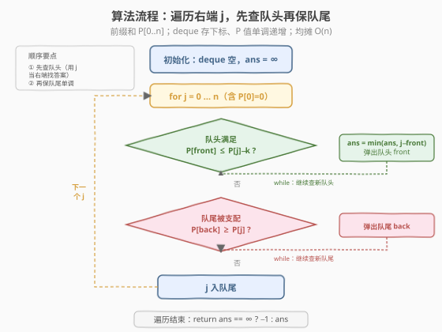
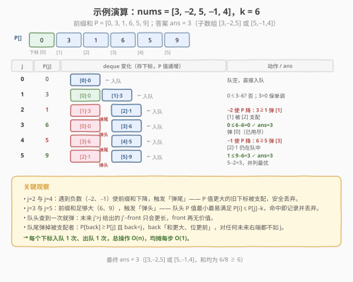

# LeetCode 和至少为 K 的最短子数组 题解

## 1. 题目概述

- **标题 / 题号**：和至少为 K 的最短子数组（#862，hard）
- **链接**：https://leetcode.cn/problems/shortest-subarray-with-sum-at-least-k/
- **难度**：困难
- **标签**：数组、前缀和、单调队列、滑动窗口

**题意**：给你一个整数数组 `nums` 和一个整数 `k`，找出 `nums` 中和**至少为** $k$ 的**最短非空子数组**，返回其长度。若不存在这样的子数组，返回 $-1$。

**示例 1**：

```text
输入：nums = [1], k = 1
输出：1
```

**示例 2**：

```text
输入：nums = [1,2], k = 4
输出：-1
```

**示例 3**：

```text
输入：nums = [2,-1,2], k = 3
输出：3
```

**约束**：

- $1 \le \text{nums.length} \le 10^5$
- $-10^5 \le \text{nums[i]} \le 10^5$
- $1 \le k \le 10^9$

> 💡 这是 **前缀和 + 单调队列** 的招牌题，也是 [Day X 滑动窗口最大值](../0201-0300/239_滑动窗口最大值.md) 单调队列的进阶应用。它与 [209. 长度最小的子数组](../0201-0300/209_长度最小的子数组.md) 形似而神不同——209 全是正数，普通滑动窗口即可；本题含负数，和的**单调性被破坏**，普通滑窗失效，必须借助**前缀和把「子数组和」化归为「两前缀和之差」**，再用单调队列高效维护候选左端点。题号 862 紧邻 861，恰好从「位运算贪心」切入「单调队列」的另一面。

## 2. 解题思路

### 2.1 暴力思路：枚举所有子数组

枚举所有左右端点 $(i, j)$，计算子数组和，满足 $\ge k$ 时记录长度最小值。

```text
ans = ∞
for i in 0..n-1:
    s = 0
    for j in i..n-1:
        s += nums[j]
        if s >= k:
            ans = min(ans, j - i + 1)
return ans == ∞ ? -1 : ans
```

时间复杂度 $O(n^2)$，$n = 10^5$ 时约 $10^{10}$ 次运算，**超时**。

> ⚠️ 暴力法的浪费在于：它对每个左端点 $i$ 重复累加，且没有利用「前缀和之差」这一结构。更关键的是——**直接枚举区间无法高效排除劣解**：某个 $i$ 可能对多个 $j$ 都满足条件，我们只要最小的 $j - i + 1$，但暴力逐一比较。

### 2.2 核心观察：前缀和 + 单调队列

#### 观察一：前缀和化归

设前缀和 $P[0] = 0$，$P[i] = \sum_{t=0}^{i-1} \text{nums}[t]$。则子数组 $\text{nums}[i..j)$ 的和为 $P[j] - P[i]$。要求 $P[j] - P[i] \ge k$，等价于：

$$
P[i] \le P[j] - k
$$

于是问题变为：**对每个右端 $j$，在所有 $i < j$ 中找满足 $P[i] \le P[j] - k$ 的最大 $i$（离 $j$ 最近 ⇒ 子数组最短）**。

#### 观察二：含负数时普通滑动窗口失效

[209. 长度最小的子数组](../0201-0300/209_长度最小的子数组.md) 之所以能用普通滑动窗口，是因为**元素全正**——窗口向右扩展时和**单调递增**，和 $\ge k$ 时收缩左端必使和减小，能安全地「找到最短」。但本题含负数：扩展窗口反而可能让和**下降**，收缩左端反而可能让和**上升**，单调性不再成立。

![前缀和化归 + 单调队列：负数破坏单调性，用 P[i]≤P[j]−k 化归](../images/shortest_subarray_k_concept.svg)

例如 `nums = [84,-37,32,40,95]`，$k = 167$。普通滑窗扩展到末尾得和 $214 \ge 167$，收缩左端去掉 $84$ 后和降到 $130 < 167$ 就停了，记录长度 $5$；但真正的最优解是 $[32,40,95]$（长度 $3$，和 $167$）——它被中间的 $-37$ 「拖累」了前缀，滑窗的「从左逐个收缩」根本跳不过这个负数。

#### 观察三：单调队列维护候选左端点

我们需要一个结构，在遍历 $j$ 时高效回答「队列中哪些 $i$ 满足 $P[i] \le P[j] - k$」。用一个**双端队列存下标**，对应 $P$ 值**单调递增**，配合两个操作：

1. **左端查条件（弹头）**：当 $P[\text{front}] \le P[j] - k$ 时，这个 $i$ 满足条件，记录 $j - i$，然后**弹出队头**。因为对未来的 $j' > j$，$j' - i > j - i$ 只会更长，这个 $i$ 再无价值。
2. **右端保单调（弹尾）**：入队 $j$ 前，弹出队尾所有 $P[\text{back}] \ge P[j]$ 的下标。因为 $\text{back} < j$ 且 $P[\text{back}] \ge P[j]$——**位置更靠前、前缀和更大**。对任何未来 $j'$，若 $P[\text{back}] \le P[j'] - k$ 成立，则 $P[j] \le P[\text{back}] \le P[j'] - k$ 也成立，且 $j' - j < j' - \text{back}$（$j$ 更近 ⇒ 更短）。所以 $\text{back}$ 被 $j$ **严格支配**，安全丢弃。

> 💡 **与 [239 单调队列](../0201-0300/239_滑动窗口最大值.md) 的对照**：239 用单调递减队列求「窗口最大」，左端过期出队、右端弹尾保递减；本题用单调**递增**队列求「满足条件的最短」，左端查条件出队、右端弹尾保递增。骨架完全一致——都是「左端淘汰、右端保单调」，只是淘汰规则与单调方向不同。这正是单调队列的通用范式。

### 2.3 算法流程图



**完整步骤**：

1. **预处理**前缀和 $P[0..n]$，$P[0] = 0$。
2. **初始化**空双端队列 `deque`，`ans = ∞`。
3. **遍历** $j = 0 \ldots n$（含 $P[0] = 0$，让空前缀也能当左端）：
   - **左端查条件**：`while deque 非空 且 P[deque.front()] ≤ P[j] − k`：`ans = min(ans, j − deque.front())`，`deque.pop_front()`。
   - **右端保单调**：`while deque 非空 且 P[deque.back()] ≥ P[j]`：`deque.pop_back()`。
   - `deque.push_back(j)`。
4. 返回 `ans == ∞ ? −1 : ans`。

> ⚠️ **顺序不能反**：必须**先查队头、再保队尾、最后入队**。若先入队再查头，会用 $j$ 自己当左端（$j - j = 0$ 是空子数组，非法）；若先保队尾再查头，队头可能刚被弹尾误伤。正确顺序保证：查头时队列里都是严格小于 $j$ 的候选左端，且 $P$ 值递增。

> ⚠️ **前缀和溢出**：$n \le 10^5$、$|\text{nums[i]}| \le 10^5$，前缀和绝对值可达 $10^{10}$，**超出 32 位 `int` 范围**（约 $2.1 \times 10^9$）。C++ 必须用 `long long` 存 $P$；Python 整数无界无需担心。

### 2.4 示例演算

以 `nums = [3, -2, 5, -1, 4]`，$k = 6$ 为例，前缀和 $P = [0, 3, 1, 6, 5, 9]$。



| 步骤 | $j$ | $P[j]$ | deque（下标·P 值） | 动作 | ans |
|------|-----|--------|---------------------|------|-----|
| 1 | 0 | 0 | `[0]·0` | 队空，直接入队 | $\infty$ |
| 2 | 1 | 3 | `[0]·0, [1]·3` | $0 \le 3-6=-3$? 否；$3 > 0$ 保单调，入队 | $\infty$ |
| 3 | 2 | 1 | `[0]·0` → `[0]·0, [2]·1` | $0 \le 1-6=-5$? 否；$P[1]=3 \ge 1$ **弹尾** $[1]$；入队 $[2]$ | $\infty$ |
| 4 | 3 | 6 | `[2]·1` → `[2]·1, [3]·6` | $P[0]=0 \le 6-6=0$ ✓ **弹头**记 $3-0=3$；$P[2]=1 \le 0$? 否；入队 $[3]$ | $3$ |
| 5 | 4 | 5 | `[2]·1, [4]·5` | $P[2]=1 \le 5-6=-1$? 否；$P[3]=6 \ge 5$ **弹尾** $[3]$；入队 $[4]$ | $3$ |
| 6 | 5 | 9 | `[4]·5, [5]·9` | $P[2]=1 \le 9-6=3$ ✓ **弹头**记 $5-2=3$；$P[4]=5 \le 3$? 否；入队 $[5]$ | $3$ |

步骤 3 与步骤 5 展示「弹尾」：遇到负数（$-2$、$-1$）使前缀和下降，$P$ 值更大的旧下标被支配而弹出。步骤 4 与步骤 6 展示「弹头」：前缀和足够大时队头命中条件，记录答案后丢弃。最终 `ans = 3`，对应子数组 $[3,-2,5]$（和 $6$）或 $[5,-1,4]$（和 $8$），均为长度 $3$ ✓。

> 💡 注意步骤 3：$-2$ 使 $P$ 从 $3$ 降到 $1$，下标 $1$（$P=3$）被下标 $2$（$P=1$）支配——前者「和更大、位更前」，对任何未来右端都不如后者。这就是负数破坏单调性后，单调队列「自动纠偏」的威力。

## 3. 参考代码

### C++

```cpp
// 和至少为K的最短子数组.cpp —— 前缀和 + 单调队列
// 编译: g++ -O2 -std=c++17 和至少为K的最短子数组.cpp -o shortsub
#include <vector>
#include <deque>
#include <climits>
using namespace std;

class Solution {
  public:
    int shortestSubarray(vector<int>& nums, int k) {
        int n = nums.size();
        // 前缀和：P[i] = nums[0..i-1] 之和，P[0] = 0
        // 用 long long 防溢出（|P| 可达 1e10，超出 int）
        vector<long long> P(n + 1, 0);
        for (int i = 0; i < n; ++i) {
            P[i + 1] = P[i] + nums[i];
        }

        deque<int> dq;          // 存下标，对应 P 值单调递增
        int ans = INT_MAX;

        for (int j = 0; j <= n; ++j) {
            // ① 左端查条件：队头 P 值足够小 ⇒ 命中，记录并丢弃
            while (!dq.empty() && P[dq.front()] <= P[j] - k) {
                ans = min(ans, j - dq.front());
                dq.pop_front();
            }
            // ② 右端保单调：弹出被 j 支配的队尾（P 更大且更靠前）
            while (!dq.empty() && P[dq.back()] >= P[j]) {
                dq.pop_back();
            }
            dq.push_back(j);
        }
        return ans == INT_MAX ? -1 : ans;
    }
};
```

### Python

```python
from collections import deque

class Solution:
    def shortestSubarray(self, nums: list[int], k: int) -> int:
        n = len(nums)
        # 前缀和：P[i] = nums[0..i-1] 之和，P[0] = 0
        P = [0] * (n + 1)
        for i in range(n):
            P[i + 1] = P[i] + nums[i]

        dq = deque()            # 存下标，对应 P 值单调递增
        ans = float('inf')

        for j in range(n + 1):
            # ① 左端查条件
            while dq and P[dq[0]] <= P[j] - k:
                ans = min(ans, j - dq[0])
                dq.popleft()
            # ② 右端保单调
            while dq and P[dq[-1]] >= P[j]:
                dq.pop()
            dq.append(j)

        return -1 if ans == float('inf') else ans
```

> 💡 两版逻辑一致。注意循环 `j` 从 $0$ 到 $n$ **含两端**：$j=0$ 时队列为空、直接入队 $0$，让「空前缀」$P[0]=0$ 成为合法左端候选；$j=n$ 时用完整前缀和当右端。Python 的 `deque` 用 `dq[0]`/`dq[-1]` 看头尾、`popleft()`/`pop()` 两端弹出，均为 $O(1)$。

## 4. 复杂度分析

| 维度 | 复杂度 | 说明 |
|------|--------|------|
| **时间复杂度** | $O(n)$ | 每个下标入队 $1$ 次、出队 $1$ 次（弹头或弹尾），`while` 的总弹出次数 $\le n$；前缀和预处理 $O(n)$ |
| **空间复杂度** | $O(n)$ | 前缀和数组 $P$ 占 $O(n)$；单调队列最多存 $n+1$ 个下标 |

> ⚠️ 虽有 `while` 嵌套在 `for` 里，但**均摊分析**：每个下标至多入队一次、出队一次，两个 `while` 的总执行次数 $\le 2n$，总时间 $O(n)$。与 [239 单调队列](../0201-0300/239_滑动窗口最大值.md)、[84 单调栈](../0001-0100/84_柱状图中最大的矩形.md) 的均摊分析完全一致——这是所有单调结构的共性。前缀和数组可用滚动变量省到 $O(n)$ 队列空间之外，但代码可读性下降，本题 $n \le 10^5$ 无需极致压缩。

## 5. 扩展：为什么不能用普通滑动窗口

这是本题最易踩的坑，值得深究。普通滑动窗口（[209](../0201-0300/209_长度最小的子数组.md) 式）的正确性依赖一个**单调不变式**：

> 元素全正时，窗口和随右端扩展**单调递增**、随左端收缩**单调递减**。

因此「和 $\ge k$ 时收缩左端」是安全的——收缩只会让和变小，一旦和 $< k$ 就停下，此时窗口恰为以当前右端结尾的最短合法子数组。

含负数时这个不变式被**双重破坏**：

1. **扩展可能降和**：加入一个负数后窗口和反而下降，无法靠「一直扩展直到 $\ge k$」找到解。
2. **收缩可能升和**：从左端删掉一个负数后窗口和反而上升——意味着「当前不满足 $k$ 的窗口，收缩后可能满足」，但普通滑窗在「不满足时只扩展不收缩」的策略会错过这些解。

更本质地，普通滑窗假设「更长的窗口和更大」，从而「最短合法窗口」出现在「和刚跨过 $k$ 的临界点」。负数让和关于窗口长度**非单调**，临界点消失，滑窗的贪心失效。

**前缀和 + 单调队列如何修复？** 它不再假设和关于长度单调，而是：

- 用前缀和把「子数组和」拆成「两前缀和之差」，问题化为「对每个 $j$ 找最大的 $i < j$ 使 $P[i] \le P[j] - k$」。
- 单调队列维护一组**$P$ 值递增**的候选 $i$——递增保证队头 $P$ 最小、最易满足条件，且队头一旦满足即可丢弃（未来更劣）。弹尾则剔除「$P$ 更大且更靠前」的劣解，保持队列精简。

> 💡 **一句话**：普通滑窗利用「和关于长度单调」做贪心收缩；单调队列利用「前缀和之间的偏序（支配关系）」做高效淘汰。后者是前者的泛化——当元素全正时，前缀和本身就单调递增，单调队列退化为普通滑窗（队头即最左端，弹头即收缩左端）。

## 6. 面试要点

1. **为什么不能用 [209](../0201-0300/209_长度最小的子数组.md) 那样的普通滑动窗口？**

   - 209 元素全正，窗口和随扩展单调增、随收缩单调减，能安全贪心收缩。本题含负数，扩展可能降和、收缩可能升和，和关于长度不再单调，滑窗的临界点贪心失效。反例 `[84,-37,32,40,95]`，$k=167$：滑窗漏掉长度 $3$ 的 `[32,40,95]`，只找到长度 $5$。

2. **为什么队列里存下标而不是前缀和的值？**

   - 算答案需要 $j - i$（子数组长度），必须知道下标 $i$。存值只能判断「能否满足条件」，算不出长度。与 [239](../0201-0300/239_滑动窗口最大值.md)、[84](../0001-0100/84_柱状图中最大的矩形.md) 一致——**单调结构存下标**是通用技巧，因为位置信息不可丢。

3. **为什么队头查到条件就弹出？它后面可能遇到更小的 $k$ 吗？**

   - $k$ 是固定的。对队头 $i$，一旦某 $j$ 满足 $P[i] \le P[j] - k$，记录 $j - i$ 后，未来任何 $j' > j$ 给出的 $j' - i > j - i$ 只会更长，$i$ 再无贡献更短答案的可能，安全丢弃。

4. **弹尾条件为什么是 $\ge$ 而不是 $>$？**

   - $P[\text{back}] = P[j]$ 时，$\text{back} < j$（位置更前）且前缀和相等。对任何未来 $j'$，back 能满足则 $j$ 也能（$P$ 相等），且 $j' - j < j' - \text{back}$（$j$ 更近更短）。故 back 被 $j$ 严格支配，用 $\ge$ 弹掉使队列**严格递增**，更紧凑。用 $>$（保留等值）也对，只是队列可能留冗余等值下标。

5. **前缀和为什么必须用 `long long`？**

   - $n \le 10^5$、$|\text{nums[i]}| \le 10^5$，前缀和绝对值上限 $10^{10}$，超出 32 位 `int`（$\approx 2.1 \times 10^9$）。用 `int` 会溢出导致误判条件。Python 整数无界不受影响。$k$ 虽是 `int`，但 $P[j] - k$ 在 `long long` 上下文中自动提升，无需特殊处理。

> 💡 **一句话总结**：862 是「前缀和化归 + 单调队列」的招牌困难题——前缀和把子数组和拆成两前缀和之差，化解负数对单调性的破坏；单调队列存下标、$P$ 值递增，左端查条件命中即弃、右端弹掉被支配的劣解，$O(n)$ 均摊解决。它是 [239 单调队列](../0201-0300/239_滑动窗口最大值.md) 的进阶——同一骨架，淘汰规则从「过期」变为「支配」，单调方向从递减变为递增。

## 同类练习题

| # | 题目 | 与本题的关联 |
|---|------|-------------|
| 239 | [滑动窗口最大值](https://leetcode.cn/problems/sliding-window-maximum/)（[题解](../0201-0300/239_滑动窗口最大值.md)） | 单调队列母题，递减队列求窗口最大；本题是其「递增队列 + 前缀和」变体，骨架同为「左端淘汰、右端保单调」 |
| 209 | [长度最小的子数组](https://leetcode.cn/problems/minimum-size-subarray-sum/)（[题解](../0201-0300/209_长度最小的子数组.md)） | 全正数版最短子数组和，普通滑窗即可；对照理解「负数破坏单调性」为何需升级到前缀和 + 单调队列 |
| 84 | [柱状图中最大的矩形](https://leetcode.cn/problems/largest-rectangle-in-histogram/)（[题解](../0001-0100/84_柱状图中最大的矩形.md)） | 单调栈招牌题，一端操作找「下一个更小」；与单调队列（两端操作）组成单调结构家族，均摊分析同构 |
| 1438 | [绝对差不超过限制的最长连续子数组](https://leetcode.cn/problems/longest-continuous-subarray-with-absolute-diff-less-than-or-equal-to-limit/) | 单调队列 + 滑窗进阶，同时维护最大+最小两个单调队列，巩固「队列存下标、两端操作」模板 |
