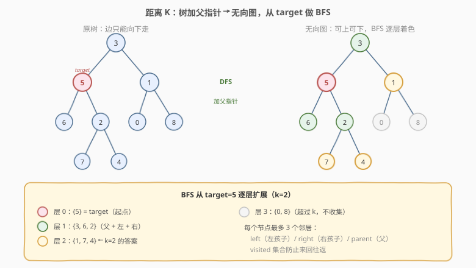
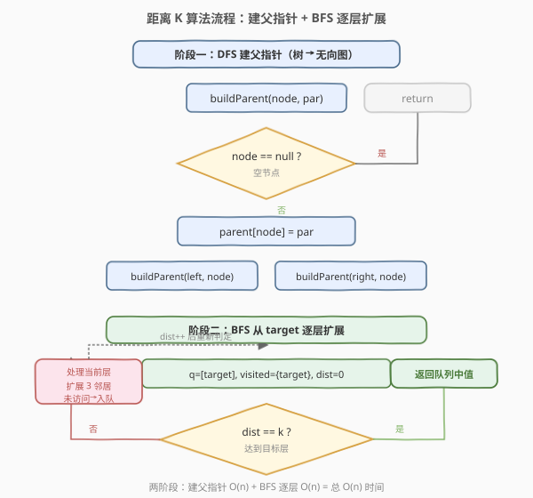
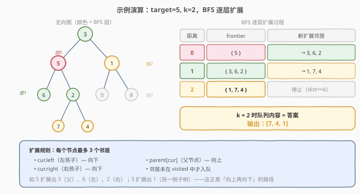

# LeetCode 二叉树中所有距离为K的结点 题解

## 1. 题目概述

- **标题 / 题号**：二叉树中所有距离为K的结点（#863，medium）
- **链接**：https://leetcode.cn/problems/all-nodes-distance-k-in-binary-tree/
- **难度**：中等
- **标签**：树、二叉树、DFS、BFS、哈希表

**题意**：给定一棵二叉树的根节点 `root`、一个目标节点 `target` 和一个整数 `k`。要求返回树中**所有距离 `target` 为 `k`** 的节点值列表。

> **距离定义**：两个节点之间的距离 = 连接它们的最短路径上的**边数**。路径可以向上（经过父节点）也可以向下（经过子节点）。

**示例 1**：

```text
输入：root = [3,5,1,6,2,0,8,null,null,7,4], target = 5, k = 2
输出：[7,4,1]
解释：树结构如下，target = 节点 5：
        3
       / \
      5   1
     / \ / \
    6  2 0  8
      / \
     7   4
距 5 距离为 2 的节点：7（5→2→7）、4（5→2→4）、1（5→3→1）。
```

**示例 2**：

```text
输入：root = [1], target = 1, k = 3
输出：[]
解释：树只有一个节点，距它距离 3 的节点不存在。
```

**约束**：

- 节点数目范围 `[1, 500]`
- `0 <= Node.val <= 500`
- 所有节点的值**各不相同**
- `target` 是树中某个节点
- `0 <= k <= 1000`

## 2. 解题思路

### 2.1 暴力思路：对每个节点求到 target 的距离

朴素做法是枚举每个节点，分别求它到 `target` 的最短距离，保留等于 `k` 的。但二叉树中两个节点的最短路径可能**先向上再向下**（经过最近公共祖先），逐对求 LCA 距离需要 $O(n^2)$，效率低。

更关键的是：`target` 到其它节点的距离本质上就是**在「树转无向图」上做 BFS 的层数**。

### 2.2 核心观察：树加父指针 → 无向图，从 target 做 BFS



关键洞察分两步：

> **① 树本身只有「父→子」的有向边。但最短路径可能要「向上」走父节点。** 所以先 DFS 一次，为每个节点记录它的父指针，等价于把树补成一张**无向图**（每个节点最多 3 个邻居：左孩子、右孩子、父节点）。

> **② 在无向图上从 `target` 出发做 BFS，第 `k` 层的节点就是答案。** BFS 天然按距离逐层扩展，层数 = 距离 = 边数，正好满足题意。

| 步骤 | 操作 | 说明 |
|------|------|------|
| ① 建父指针 | DFS 遍历，`parent[node] = par` | 把树补成无向图，每个节点可向上走 |
| ② BFS 起点 | 队列入 `target`，标记已访问 | 从 target 出发，距离 0 |
| ③ 逐层扩展 | 每轮处理当前层全部节点，扩展 3 个邻居 | 左孩子 / 右孩子 / 父节点，未访问则入队 |
| ④ 收集答案 | 第 `k` 层时队列里的节点即为答案 | 层数 = 距离 = `k` |

> 💡 **为什么要 `visited` 集合？** 无向图中节点会互相指回，不加访问标记会无限往返。BFS 中每个节点**首次被访问时距离最短**，之后不再重复入队——这正是 BFS 求最短路径的正确性保证。

> ⚠️ **target 是节点引用不是值**：题目传入的是 `TreeNode*`（Python 中是节点对象），所以无需在树中按值查找，直接作为 BFS 起点。

### 2.3 算法流程图



### 2.4 示例演算

以 `root = [3,5,1,6,2,0,8,null,null,7,4]`，`target = 5`，`k = 2` 为例：



DFS 建好父指针后，BFS 从 `5` 出发逐层扩展：

| 距离 | frontier（当前层） | 扩展的邻居（未访问） |
|------|--------------------|----------------------|
| 0 | {5} | 3（父）、6（左）、2（右） |
| 1 | {3, 6, 2} | 1（3 的右子）、7（2 的左子）、4（2 的右子） |
| 2 | {1, 7, 4} | — （已达 k=2，停止） |

第 2 层队列内容 `{1, 7, 4}` 即为答案，输出 `[7,4,1]`。

> 💡 注意节点 `0` 和 `8`：它们虽是 `1` 的孩子，但属于第 3 层（距离 3），超过 `k=2` 不在答案中。BFS 在 `dist == k` 时即停，不会继续扩展。

## 3. 参考代码

### C++

```cpp
class Solution {
    unordered_map<TreeNode*, TreeNode*> parent;
    void buildParent(TreeNode* node, TreeNode* par) {
        if (!node) return;
        parent[node] = par;
        buildParent(node->left, node);
        buildParent(node->right, node);
    }
  public:
    vector<int> distanceK(TreeNode* root, TreeNode* target, int k) {
        buildParent(root, nullptr);
        queue<TreeNode*> q;
        unordered_set<TreeNode*> visited;
        q.push(target);
        visited.insert(target);
        int dist = 0;
        while (!q.empty()) {
            if (dist == k) break;
            int size = q.size();
            for (int i = 0; i < size; i++) {
                TreeNode* cur = q.front();
                q.pop();
                for (TreeNode* nxt : {cur->left, cur->right, parent[cur]}) {
                    if (nxt && !visited.count(nxt)) {
                        visited.insert(nxt);
                        q.push(nxt);
                    }
                }
            }
            dist++;
        }
        vector<int> ans;
        while (!q.empty()) {
            ans.push_back(q.front()->val);
            q.pop();
        }
        return ans;
    }
};
```

### Python

```python
class Solution:
    def distanceK(self, root: TreeNode, target: TreeNode, k: int) -> List[int]:
        parent = {}

        def build(node: TreeNode, par):
            if not node:
                return
            parent[node] = par
            build(node.left, node)
            build(node.right, node)

        build(root, None)

        q = deque([target])
        visited = {target}
        dist = 0
        while q:
            if dist == k:
                break
            for _ in range(len(q)):
                cur = q.popleft()
                for nxt in (cur.left, cur.right, parent[cur]):
                    if nxt and nxt not in visited:
                        visited.add(nxt)
                        q.append(nxt)
            dist += 1
        return [node.val for node in q]
```

> 💡 代码两段式：`buildParent` 把树补成无向图（只存父指针，孩子用 `left/right` 直接访问）；BFS 每轮 `for _ in range(len(q))` 严格处理当前层，`dist == k` 时队列里剩的就是答案。**邻居枚举**用 `{cur->left, cur->right, parent[cur]}` 一行写完三个方向。

## 4. 复杂度分析

| 维度 | 复杂度 | 说明 |
|------|--------|------|
| 时间复杂度 | $O(n)$ | DFS 建父指针访问每个节点一次；BFS 每个节点最多入队一次 |
| 空间复杂度 | $O(n)$ | `parent` 哈希表存 $n$ 个映射；BFS 队列与 `visited` 最坏 $O(n)$；递归栈 $O(h)$ |

> ⚠️ 本题 $n \leq 500$，$O(n)$ 完全安全。`k` 可达 1000 但 BFS 最多扩展 $n$ 个节点（树直径 $\leq n-1$），不会因 `k` 大而超时——`dist == k` 提前 break 或队列提前空都会终止。

## 5. 扩展：纯 DFS 一次遍历（不建图）

如果不想显式建父指针 / 用 BFS，可以用**一次 DFS** 完成：递归返回「当前节点子树中是否含 target 以及距离」，根据返回值在向上回传时「向另一棵子树收集距离补差」。

核心思路：

- `dfs(node)` 返回 `node` 到 `target` 的距离 `d`（`target` 不在子树中则返回 `-1`）。
- 若 `target` 在左子树距离 `dl`，则当前节点距 target 为 `dl + 1`；此时需在**右子树**中收集距离 `k - (dl+1) - 1 = k - dl - 2` 的节点（多减 1 是跨过当前节点下到右子树的边）。
- 若 `dl + 1 == k`，当前节点自身就是答案之一。

```cpp
class Solution {
    vector<int> ans;
    int k;
    TreeNode* target;

    // 向下收集距 node 距离为 d 的节点
    void collect(TreeNode* node, int d) {
        if (!node || d < 0) return;
        if (d == 0) { ans.push_back(node->val); return; }
        collect(node->left, d - 1);
        collect(node->right, d - 1);
    }
    // 返回 node 到 target 的距离；target 不在子树则返回 -1
    int dfs(TreeNode* node) {
        if (!node) return -1;
        if (node == target) {
            collect(node, k);
            return 0;
        }
        int dl = dfs(node->left);
        if (dl != -1) {
            if (dl + 1 == k) ans.push_back(node->val);
            else collect(node->right, k - dl - 2);
            return dl + 1;
        }
        int dr = dfs(node->right);
        if (dr != -1) {
            if (dr + 1 == k) ans.push_back(node->val);
            else collect(node->left, k - dr - 2);
            return dr + 1;
        }
        return -1;
    }
  public:
    vector<int> distanceK(TreeNode* root, TreeNode* target, int k) {
        this->k = k;
        this->target = target;
        dfs(root);
        return ans;
    }
};
```

> 💡 纯 DFS 版**只遍历一次树**、空间 $O(h)$（无哈希表），但逻辑比 BFS 复杂——「向另一侧补差」的下标计算 `k - dl - 2` 容易写错。面试中**建父指针 + BFS 更直观可靠**，DFS 版适合作为「能否不建图」的进阶追问。

## 6. 面试要点

1. **为什么不能只在子树里向下找？**
   - 距离 `target` 为 `k` 的节点可能在 `target` 的**上方**（祖先方向）或**另一侧分支**。只向下 DFS 会漏掉这些。加父指针把树变成无向图后，BFS 能覆盖所有方向。

2. **为什么 BFS 而不是 DFS 求距离？**
   - BFS 按层扩展，第 `k` 层天然就是距离 `k` 的全体节点，**一次收集即得答案**。DFS 求距离需要回溯 / 重复访问，且不便自然分层。

3. **`visited` 集合能否省掉？**
   - 不能。无向图中孩子会指回父、父会指回孩子，无访问标记会**无限往返**。BFS 中每个节点首次入队时距离最短，标记后不再重复——这是正确性保证，也是 $O(n)$ 的关键。

4. **target 是节点引用还是值？**
   - 是 `TreeNode*` 引用（题目保证在树中）。所以无需按值查找，直接作为 BFS 起点。若面试官改成「给 target 的值」，需先 DFS 定位节点（值唯一，一次遍历即可）。

5. **k 很大（如 1000）但树只有 500 个节点怎么办？**
   - BFS 最多扩展 $n$ 个节点就会队空（树直径 $\leq n-1$）。`k` 超过最大距离时队列为空直接返回 `[]`，不会出错。代码中 `while (!q.empty())` 保证安全终止。

6. **建父指针为什么用 `unordered_map` 而非修改树结构？**
   - 修改树（如加 `parent` 指针字段）会污染输入数据，且 `TreeNode` 结构不可变。用哈希表「外挂」父指针是**非侵入式**做法，面试更干净。若允许改结构，加 `parent` 字段也行但需说明副作用。

## 同类练习题

| # | 题目 | 与本题的关联 |
|---|------|-------------|
| 743 | [网络延迟时间](https://leetcode.cn/problems/network-delay-time/)（[题解](../0701-0800/743_网络延迟时间.md)） | 单源最短路 BFS/Dijkstra，对比「树转图 BFS」与「一般图最短路」的异同 |
| 994 | [腐烂的橘子](https://leetcode.cn/problems/rotting-oranges/)（[题解](../0901-1000/994_腐烂的橘子.md)） | 多源 BFS 逐层扩展，同为「层数 = 距离」的核心模式，对比单源与多源 |
| 236 | [二叉树的最近公共祖先](https://leetcode.cn/problems/lowest-common-ancestor-of-a-binary-tree/)（[题解](../0201-0300/236_二叉树的最近公共祖先.md)） | 后序 DFS + 父子信息向上传递，理解树中「向上走」的路径含义 |
| 1740 | [找到二叉树中距离最近的两个节点](https://leetcode.cn/problems/find-distance-in-a-binary-tree/) | LCA + 距离计算，863 的距离概念延伸（求两节点间最短路径边数） |
| 1110 | [删点成林](https://leetcode.cn/problems/delete-nodes-and-return-forest/) | 后序 DFS 修改树结构 + 收集结果，对比「建父指针遍历」与「递归改树」两种树操作范式 |
