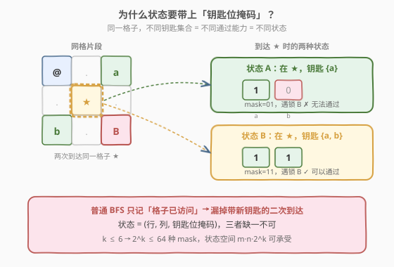
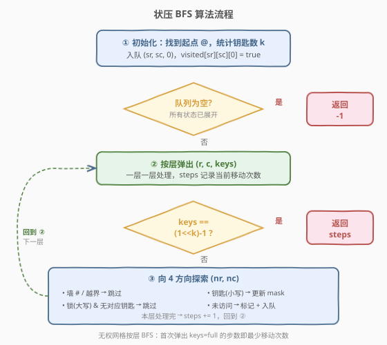
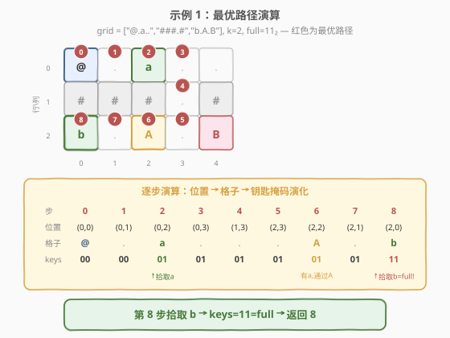

# LeetCode 获取所有钥匙的最短路径 题解

## 1. 题目概述

- **标题 / 题号**：获取所有钥匙的最短路径（#864，hard）
- **链接**：https://leetcode.cn/problems/shortest-path-to-get-all-keys/
- **难度**：困难
- **标签**：广度优先搜索、状态压缩、位运算、网格图

**题意**：给定一个 $m \times n$ 的二维网格 `grid`，其中：

- `'.'` 代表空房间
- `'#'` 代表墙
- `'@'` 是起点
- **小写字母**代表钥匙（`'a'`-`'f'`）
- **大写字母**代表锁（`'A'`-`'F'`）

从起点出发，每次向**上下左右**移动一格。不能走出网格、不能穿墙。途经钥匙时自动拾取。**没有对应钥匙时无法通过锁**。钥匙与锁互为大小写，且按字母表前 `k` 个字母一一对应。

求**获取所有钥匙的最少移动次数**，无法获取则返回 `-1`。

**示例 1**：

```text
输入：grid = ["@.a..","###.#","b.A.B"]
输出：8
```

```text
网格：
  @  .  a  .  .
  #  #  #  .  #
  b  .  A  .  B
```

最优路径：`(0,0)→(0,1)→(0,2)[拾取a]→(0,3)→(1,3)→(2,3)→(2,2)[有a通过A]→(2,1)→(2,0)[拾取b]`，共 8 步。

**示例 2**：

```text
输入：grid = ["@..aA","..B#.","....b"]
输出：6
```

最优路径：`(0,0)→(0,1)→(0,2)→(0,3)[拾取a]→(0,4)[有a通过A]→(1,4)→(2,4)[拾取b]`，共 6 步。

**示例 3**：

```text
输入：grid = ["@Aa"]
输出：-1
```

`'A'` 挡在 `'@'` 与 `'a'` 之间，没有钥匙 `'a'` 就无法通过锁 `'A'`，死锁返回 `-1`。

**约束**：

- $1 \le m, n \le 30$
- `grid[i][j]` 只含 `'.'`, `'#'`, `'@'`, `'a'-'f'`, `'A'-'F'`
- 钥匙数 $1 \le k \le 6$
- 每把钥匙对应唯一锁，反之亦然

> ⚠️ **三个关键信号**：
> 1. $k \le 6$ → $2^k \le 64$，是**状压 BFS** 的甜区；
> 2. 求最短移动次数 + 每步代价为 1 → **BFS** 天然适配；
> 3. 通过能力随钥匙变化 → 普通 BFS（只记格子是否访问过）**失效**，必须把「持有钥匙集合」并入状态。

## 2. 解题思路

### 2.1 暴力思路：枚举钥匙拾取顺序

把「获取所有钥匙」理解为一种拾取顺序，枚举 $k!$ 种排列，对每种排列计算从起点依次走到各钥匙位置的最短距离之和（段间用 BFS 求最短路），取最小值。

问题在于：**两把钥匙之间的最短路径取决于途中持有的钥匙**——先拿到 `'a'` 再走 `'A'` 旁边的路和没拿 `'a'` 时走的路完全不同。因此「段间最短路」无法独立预计算，排列枚举也失去了拆分基础。$k=6$ 时 $6!=720$，但每段 BFS 还要考虑锁的可达性，实际复杂度远超预期。

### 2.2 核心观察：状态 = (行, 列, 钥匙位掩码)

普通网格 BFS 求最短路时，状态只有「当前坐标」一个维度。但本题中，**同一个格子可以以不同的钥匙集合到达**，它们代表**不同**的搜索状态——持有不同钥匙意味着能通过的锁不同，后续可达范围也不同：



如图，到达同一个格子 `★` 时：

- 钥匙集合 `{a}`（mask=01）：遇锁 `B` 无法通过；
- 钥匙集合 `{a, b}`（mask=11）：遇锁 `B` 可以通过。

两者虽停在同一个格子，但**通过能力不同**，必须当作两个独立状态分别推进。因此状态的第三维用**位掩码**记录「已持有钥匙集合」：

- `mask` 的第 $j$ 位为 $1$，表示第 $j$ 把钥匙已被拾取；
- 状态 `(r, c, mask)` = 当前站在格子 $(r, c)$，持有钥匙集合为 `mask`。

> 💡 **为什么用 BFS 而非 Dijkstra？** 每步移动代价为 1（无权图），BFS 按层扩展的层数即最短步数，无需优先队列。状态数 $m \cdot n \cdot 2^k$，$k \le 6$ 时最多 $30 \times 30 \times 64 = 57600$，规模可控。

### 2.3 算法流程图



**关键设计**：

1. **单源 BFS**：从起点 `@` 出发，初始状态 `(sr, sc, 0)`——还没拾取任何钥匙。
2. **visited 防重复**：用三维布尔表 `visited[r][c][mask]` 记录已展开的状态。同一 `(r, c, mask)` 第一次被弹出即为最短，后续重复直接跳过。
3. **邻居判定规则**：
   - 墙 `#` / 越界 → 跳过；
   - 锁（大写字母 `ch`）→ 检查 `mask` 是否含对应钥匙位 `1 << (ch - 'A')`，没有则跳过；
   - 钥匙（小写字母 `ch`）→ 更新 `mask |= 1 << (ch - 'a')`；
   - 空房 `.` / 起点 `@` → 直接通过。
4. **终止条件**：某状态 `mask == (1 << k) - 1`（所有钥匙位为 1）时，当前层数即为答案。

> 💡 **锁的处理**：锁格本身是**可通行**的——只要持有对应钥匙，踩上去不会消耗钥匙，钥匙也不因通过锁而丢失。锁的唯一作用是**在无钥匙时阻止进入**。

### 2.4 示例演算（示例 1）

`grid = ["@.a..","###.#","b.A.B"]`，$k=2$，$\text{full} = 11_2 = 3$。



从起点 `(0,0)` 出发，`keys=00`。按层 BFS 逐层扩展（下图只展示最优路径上的状态序列）：

| 步数 | 位置 | 格子 | keys | 说明 |
|------|------|------|------|------|
| 0 | (0,0) | @ | 00 | 起点，队列入队 `(0,0,00)` |
| 1 | (0,1) | . | 00 | 向右，空房间 |
| 2 | (0,2) | a | 01 | **拾取钥匙 a**，mask 更新为 01 |
| 3 | (0,3) | . | 01 | 向右 |
| 4 | (1,3) | . | 01 | 向下（唯一可通过的非墙格） |
| 5 | (2,3) | . | 01 | 继续向下 |
| 6 | (2,2) | A | 01 | **遇锁 A，持有 a → 通过**，mask 不变 |
| 7 | (2,1) | . | 01 | 向左 |
| 8 | (2,0) | b | 11 | **拾取钥匙 b**，mask=11=full → 返回 8 |

> 💡 **第 6 步是关键**：状态 `(2,2,01)` 表示「站在锁 A 上，持有钥匙 a」。若此前没有先拾取 `a`（即以 `keys=00` 到达 `(2,2)`），BFS 会直接跳过此格——锁 A 挡住了无钥匙者。正是 `mask` 维度让 BFS 正确地区分了「有钥匙能通过」与「无钥匙被挡住」两种情况。

> ⚠️ **为什么不能直接向下走？** 第 0 行到第 2 行之间，第 0–2 列全是墙 `###`，只有第 3 列有通道 `.`。因此必须先向右走到第 3 列，再向下绕到第 2 行，最后向左经过锁 A 才能到达钥匙 b。

## 3. 参考代码

### C++

```cpp
class Solution {
  public:
    int shortestPathAllKeys(vector<string>& grid) {
        int m = grid.size(), n = grid[0].size();
        int sr = 0, sc = 0, k = 0;
        for (int i = 0; i < m; ++i)
            for (int j = 0; j < n; ++j) {
                if (grid[i][j] == '@') { sr = i; sc = j; }
                else if (islower(grid[i][j])) ++k;
            }
        int full = (1 << k) - 1;
        int dirs[4][2] = {{-1,0},{1,0},{0,-1},{0,1}};

        vector<vector<vector<bool>>> visited(
            m, vector<vector<bool>>(n, vector<bool>(1 << k, false)));

        queue<tuple<int,int,int>> q;            // (r, c, keys_mask)
        q.push({sr, sc, 0});
        visited[sr][sc][0] = true;

        int steps = 0;
        while (!q.empty()) {
            int sz = q.size();
            for (int t = 0; t < sz; ++t) {
                auto [r, c, keys] = q.front(); q.pop();
                if (keys == full) return steps;
                for (auto& d : dirs) {
                    int nr = r + d[0], nc = c + d[1];
                    if (nr < 0 || nr >= m || nc < 0 || nc >= n) continue;
                    char ch = grid[nr][nc];
                    if (ch == '#') continue;
                    int nkeys = keys;
                    if (islower(ch)) {
                        nkeys |= (1 << (ch - 'a'));      // 拾取钥匙
                    } else if (isupper(ch)) {
                        if (!(keys & (1 << (ch - 'A')))) continue; // 无钥匙，跳过锁
                    }
                    if (!visited[nr][nc][nkeys]) {
                        visited[nr][nc][nkeys] = true;
                        q.push({nr, nc, nkeys});
                    }
                }
            }
            ++steps;
        }
        return -1;
    }
};
```

### Python

```python
from collections import deque

class Solution:
    def shortestPathAllKeys(self, grid: List[str]) -> int:
        m, n = len(grid), len(grid[0])
        sr = sc = k = 0
        for i in range(m):
            for j in range(n):
                if grid[i][j] == '@':
                    sr, sc = i, j
                elif grid[i][j].islower():
                    k += 1
        full = (1 << k) - 1
        dirs = [(-1, 0), (1, 0), (0, -1), (0, 1)]

        visited = [[[False] * (1 << k) for _ in range(n)] for _ in range(m)]
        q = deque()
        q.append((sr, sc, 0))
        visited[sr][sc][0] = True

        steps = 0
        while q:
            for _ in range(len(q)):
                r, c, keys = q.popleft()
                if keys == full:
                    return steps
                for dr, dc in dirs:
                    nr, nc = r + dr, c + dc
                    if not (0 <= nr < m and 0 <= nc < n):
                        continue
                    ch = grid[nr][nc]
                    if ch == '#':
                        continue
                    nkeys = keys
                    if ch.islower():
                        nkeys |= (1 << (ord(ch) - ord('a')))
                    elif ch.isupper():
                        if not (keys & (1 << (ord(ch) - ord('A')))):
                            continue
                    if not visited[nr][nc][nkeys]:
                        visited[nr][nc][nkeys] = True
                        q.append((nr, nc, nkeys))
            steps += 1
        return -1
```

> 💡 **按层 BFS 的写法**：外层 `while` 每轮处理一整层，`steps` 在每层结束后自增。当 `keys == full` 被弹出时，`steps` 恰好等于已移动的步数。无权图 BFS 首次到达即最短，故该 `steps` 即答案。

## 4. 复杂度分析

| 维度 | 复杂度 | 说明 |
|------|--------|------|
| 时间复杂度 | $O(m \cdot n \cdot 2^k)$ | 状态数 $m \cdot n \cdot 2^k$，每个状态向 4 方向扩展。$m=n=30, k=6$ 时约 $30 \times 30 \times 64 \times 4 \approx 2.3 \times 10^5$，毫秒级 |
| 空间复杂度 | $O(m \cdot n \cdot 2^k)$ | `visited` 三维布尔表 $m \times n \times 2^k$；BFS 队列最多同阶 |

$k \le 6$ 时 $m \cdot n \cdot 2^k \le 57600$，`visited` 用三维数组直接下标寻址 $O(1)$，无哈希开销。题目将 $k$ 限制在 6 以内，正是为了让状压状态空间落在可承受范围内。

## 5. 扩展：与 847 的对比及通用范式

本题与 [847. 访问所有节点的最短路径](../0801-0900/847_访问所有节点的最短路径.md) 是**同一范式**的两个变体——都是「在 BFS 状态中增加一个位掩码维度」：

| 对比维度 | 847 访问所有节点 | 864 获取所有钥匙 |
|----------|------------------|------------------|
| 状态 | `(节点, 已访问掩码)` | `(行, 列, 钥匙掩码)` |
| 掩码含义 | 哪些节点已访问过 | 哪些钥匙已拾取 |
| 掩码位更新 | `mask \|= (1 << v)`（访问即置位） | `mask \|= (1 << (ch-'a'))`（拾取即置位） |
| 邻居限制 | 无（可任意走） | 锁需对应钥匙才能通过 |
| 起点 | 多源（任意节点出发） | 单源（固定起点 `@`） |
| 终止 | mask == full（全部访问） | mask == full（全部拾取） |

> 💡 **通用范式**：当 BFS 的「可通行性」或「剩余任务」随搜索进程变化时，把这些变化编码进状态。位掩码是编码离散集合最紧凑的方式——$k \le 20$ 以内都可承受 $2^k$ 状态空间。本题的 $k \le 6$ 更是宽松到可以用三维数组直接做 visited 表。

**当 $k$ 更大时怎么办？** 若 $k > 12$，$2^k$ 状态空间爆炸，需改用 A\* 搜索（以「到最近未拾取钥匙的曼哈顿距离」为启发式）或问题特定的剪枝策略来缩减搜索空间。但 LeetCode 保证 $k \le 6$，状压 BFS 是最优解。

## 6. 面试要点

1. **为什么普通 BFS（只记格子是否访问过）不行？**
   - 同一个格子可以以不同钥匙集合到达，通过能力不同。`(r,c,{a})` 过不了锁 B，`(r,c,{a,b})` 能过。只记坐标会把这两个状态合并，要么漏解（误判已访问而剪枝），要么无法正确处理锁的通行权。

2. **状态为什么是 `(行, 列, 钥匙掩码)` 三维？**
   - 行列记录「当前在哪」，掩码记录「持有哪些钥匙」。前者决定下一步能走到哪些格子，后者决定能否通过锁。$k \le 6$ 让掩码维只有 $2^k \le 64$ 种取值，状态空间可控。

3. **锁格怎么处理？有钥匙时踩上去会怎样？**
   - 锁格本身可通行。有对应钥匙时，踩上锁格不消耗钥匙、不改变 mask，和走空房一样。锁的唯一作用是**无钥匙时阻止进入**——在邻居判定中 `continue` 跳过即可。

4. **BFS 的 `steps` 计数为什么正确？**
   - 按层扩展：第 0 层 = 步数 0（在起点），每处理完一层 `steps+1`。当 `keys == full` 被弹出时，它所在层数 = 从起点到当前所移动的步数。无权图 BFS 首次到达即最短。

5. **`visited` 为什么用三维数组而非哈希集合？**
   - $k \le 6$ 时 $m \cdot n \cdot 2^k \le 57600$，三维布尔数组仅约 57KB，下标寻址 $O(1)$ 且无哈希常数，明显优于 `set<tuple>`。状态空间小是状压能用定长数组的根本原因。

## 同类练习题

| # | 题目 | 与本题的关联 |
|---|------|-------------|
| 847 | [访问所有节点的最短路径](https://leetcode.cn/problems/shortest-path-visiting-all-nodes/)（[站内题解](../0801-0900/847_访问所有节点的最短路径.md)） | 状压 BFS 母题，状态 `(节点, 已访问掩码)`，对比本题把掩码从「已访问集合」换成「已持有钥匙」 |
| 1293 | [网格中的最短路径](https://leetcode.cn/problems/shortest-path-in-a-grid-with-obstacles-elimination/) | BFS + 状态扩展，状态为 `(x, y, 剩余消除次数)`，与本题 `(r, c, keys)` 同为「给网格 BFS 状态加一维」的范式 |
| 691 | [贴纸拼词](https://leetcode.cn/problems/stickers-to-spell-word/) | 状压 BFS/DP，`mask` 表示已拼出的目标字符子集，求最少贴纸数——最值型状压搜索，承接本题的 BFS 写法 |
| 526 | [优美的排列](https://leetcode.cn/problems/beautiful-arrangement/)（[站内题解](../0501-0600/526_优美的排列.md)） | 状压 DP 母题，`mask` 记已放数字集合，$n \le 15$ 甜区，对比本题把 `mask` 用于「已拾取钥匙」 |
