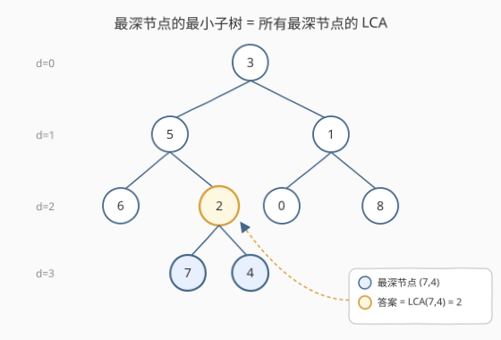
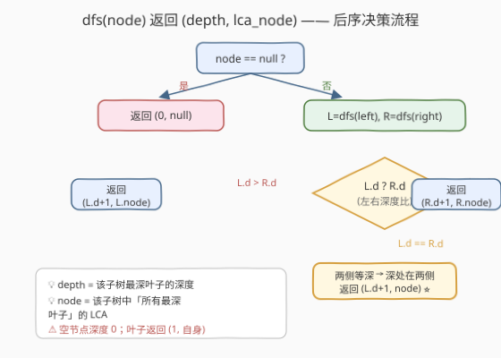
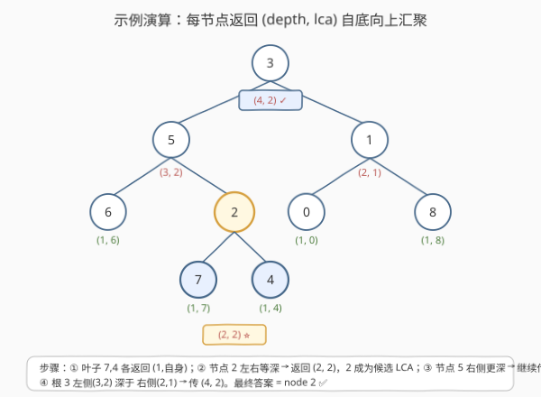

# LeetCode 具有所有最深节点的最小子树 题解

## 1. 题目概述

- **标题 / 题号**：具有所有最深节点的最小子树（#865，medium）
- **链接**：https://leetcode.cn/problems/smallest-subtree-with-all-the-deepest-nodes/
- **难度**：中等
- **标签**：树、二叉树、深度优先搜索、后序遍历、最近公共祖先

**题意**：给定一根为 `root` 的二叉树，每个节点的**深度**是该节点到根的最短距离（边数）。**最深节点**指整棵树中深度最大的节点。要求返回包含**所有最深节点**的**最小子树**的根节点。

> **子树定义**：一个节点的子树包括该节点本身及其所有后代。「最小」意味着在所有「能覆盖全部最深节点」的子树根中，选深度最大（离最深节点最近）的那个。

**示例 1**：

```text
输入：root = [3,5,1,6,2,0,8,null,null,7,4]
输出：[2,7,4]
解释：最深节点为 7 和 4（深度均为 3）。
     节点 5、3、2 的子树都包含 7 和 4，但节点 2 离它们最近，故返回 2。
```

**示例 2**：

```text
输入：root = [1]
输出：[1]
解释：根节点自身就是最深节点，返回它。
```

**示例 3**：

```text
输入：root = [0,1,3,null,2]
输出：[2]
解释：最深节点为 2，其自身即为最小子树根。
```

**约束**：

- 树中节点数量范围 `[1, 500]`
- `0 <= Node.val <= 500`
- 每个节点的值**独一无二**

> 💡 本题与 [1123. 最深叶节点的最近公共祖先](https://leetcode.cn/problems/lowest-common-ancestor-of-deepest-leaves/) 完全相同，解法通用。

## 2. 解题思路

### 2.1 暴力思路：两遍扫描

直观分两步：

1. **第一遍 DFS** 求出整棵树的最大深度 `maxD`。
2. **第二遍 DFS** 找出所有深度等于 `maxD` 的节点，再求它们的**最近公共祖先**（LCA）。

其中「求多个节点的 LCA」可反复调用两两 LCA（[236](../0201-0300/236_二叉树的最近公共祖先.md) 的做法）：$\text{LCA}(a,b,c) = \text{LCA}(\text{LCA}(a,b), c)$。

> ⚠️ 这种做法需要遍历两到三遍树，且要额外存储最深节点列表，代码偏长、空间 $O(n)$。能否**一遍 DFS** 同时拿到「深度」和「候选 LCA」？

### 2.2 核心观察：一遍后序 DFS，返回 (depth, lca)



关键直觉：**「所有最深节点的最小子树根」就是这些最深节点的 LCA**。而 LCA 的判定本质是「两侧是否各含一个最深节点」——这又取决于**子树的最深叶子深度**。

于是设计递归函数 `dfs(node)`，返回一个二元组 `(depth, lca)`：

> - `depth`：以 `node` 为根的子树中，最深叶子到 `node` 的距离（层数；空节点为 `0`）。
> - `lca`：以 `node` 为根的子树中，**所有最深叶子**的最近公共祖先。

对每个节点，只需比较左右子树返回的 `depth`：

| 情况 | 含义 | 返回值 |
|------|------|--------|
| `node == null` | 空子树 | `(0, null)` |
| `L.d > R.d` | 最深叶子只在左子树 | `(L.d + 1, L.lca)` —— 候选沿用左侧 |
| `R.d > L.d` | 最深叶子只在右子树 | `(R.d + 1, R.lca)` —— 候选沿用右侧 |
| `L.d == R.d` | 两侧各含最深叶子 → `node` 是汇聚点 | `(L.d + 1, node)` —— **`node` 成为新的 LCA** ⭐ |

> 💡 **为什么「等深」时 `node` 就是 LCA？** 后序遍历自底向上，左右子树返回的最深叶子深度相同，说明**最深叶子分居两侧**——`node` 是它们向上汇聚的最近交点，正是 LCA。这与 [236](../0201-0300/236_二叉树的最近公共祖先.md) 中「`left`、`right` 都非空即 LCA」是同一思想，只不过这里用「深度是否相等」代替了「是否命中 p/q」。

> ⚠️ 「单侧更深」时，最深叶子全在那侧，候选 LCA 直接透传上来，当前节点不可能是答案——它只能覆盖一侧的最深叶子，而另一侧没有最深叶子与之「分居」。

### 2.3 算法流程图



### 2.4 示例演算

以示例 1 `root = [3,5,1,6,2,0,8,null,null,7,4]` 为例，后序遍历自底向上汇聚（返回值标在节点旁）：



| 步骤 | 访问节点 | 左子返回 | 右子返回 | 决策 | 返回值 |
|------|----------|----------|----------|------|--------|
| ① | 叶子 7 | `(0,null)` | `(0,null)` | 等深 → 自身 | `(1, 7)` |
| ② | 叶子 4 | `(0,null)` | `(0,null)` | 等深 → 自身 | `(1, 4)` |
| ③ | 节点 2 | `(1,7)` | `(1,4)` | 等深 → **2 是 LCA** ⭐ | `(2, 2)` |
| ④ | 叶子 6 | `(0,null)` | `(0,null)` | 等深 → 自身 | `(1, 6)` |
| ⑤ | 节点 5 | `(1,6)` | `(2,2)` | 右深 → 传右 | `(3, 2)` |
| ⑥ | 叶子 0、8 | — | — | 各自等深 | `(1, 0)` / `(1, 8)` |
| ⑦ | 节点 1 | `(1,0)` | `(1,8)` | 等深 → 自身 | `(2, 1)` |
| ⑧ | 根 3 | `(3,2)` | `(2,1)` | 左深 → 传左 | `(4, 2)` |

最终根返回 `(4, 2)`，其中 `lca = 2` 即答案。整棵树最深叶子深度为 4（从根数层数），节点 7、4 位于第 4 层，它们的 LCA 是节点 2 ✅。

## 3. 参考代码

### C++

```cpp
/**
 * Definition for a binary tree node.
 * struct TreeNode {
 *     int val;
 *     TreeNode *left;
 *     TreeNode *right;
 *     TreeNode() : val(0), left(nullptr), right(nullptr) {}
 *     TreeNode(int x) : val(x), left(nullptr), right(nullptr) {}
 *     TreeNode(int x, TreeNode *left, TreeNode *right) : val(x), left(left), right(right) {}
 * };
 */
class Solution {
    // 返回 {子树最深叶子深度, 该子树中最深叶子的 LCA}
    pair<int, TreeNode*> dfs(TreeNode* node) {
        if (node == nullptr) return {0, nullptr};
        auto [ld, ln] = dfs(node->left);
        auto [rd, rn] = dfs(node->right);
        if (ld > rd) return {ld + 1, ln};
        if (rd > ld) return {rd + 1, rn};
        return {ld + 1, node}; // 两侧等深 → node 是 LCA
    }
public:
    TreeNode* subtreeWithAllDeepest(TreeNode* root) {
        return dfs(root).second;
    }
};
```

### Python

```python
class Solution:
    def subtreeWithAllDeepest(self, root: Optional[TreeNode]) -> Optional[TreeNode]:
        def dfs(node):
            if not node:
                return (0, None)
            ld, ln = dfs(node.left)
            rd, rn = dfs(node.right)
            if ld > rd:
                return (ld + 1, ln)
            if rd > ld:
                return (rd + 1, rn)
            return (ld + 1, node)  # 两侧等深 → node 是 LCA
        return dfs(root)[1]
```

> 💡 代码核心就三行比较：左深传左、右深传右、等深取自身。把「求最大深度」和「求 LCA」两件事糅进同一次后序遍历，无需显式收集最深节点列表。

## 4. 复杂度分析

| 维度 | 复杂度 | 说明 |
|------|--------|------|
| 时间复杂度 | $O(n)$ | 每个节点恰好访问一次，每次做 $O(1)$ 的深度比较 |
| 空间复杂度 | $O(h)$ | 递归栈深度 = 树高 $h$；最坏链状 $O(n)$，平衡树 $O(\log n)$。无额外数组 |

> ⚠️ 本题 $n \leq 500$，递归栈安全。对比暴力两遍扫描的 $O(n)$ 时间 + $O(n)$ 空间（存最深节点列表），本解法空间降到 $O(h)$。

## 5. 扩展：与 236 / 1123 的关系

- **本题 = 1123**：两者题意完全一致（1123 措辞为「最深叶节点的最近公共祖先」），解法通用。
- **与 236 的同构**：236 是「给定两个指定节点求 LCA」，用「左右子树是否各命中一个」决策；本题是「给定所有最深节点求 LCA」，用「左右子树最深深度是否相等」决策。两者都是**后序 DFS + 子树信息向上汇聚**的范式，只是「判定信号」不同。
- **多节点 LCA 的一般化**：若要求任意节点集合 $S$ 的 LCA，可推广本题思路——递归返回 `(子树中 S 元素个数, 候选 LCA)`，当某节点两侧计数都 $>0$ 时即为 LCA。本题的「深度相等」是「两侧各有最深节点」的等价信号。

## 6. 面试要点

1. **为什么返回 `(depth, lca)` 二元组而不是分开两次递归？**

   一次后序遍历同时携带「子树最深叶子深度」和「候选 LCA」两个信息向上传递。父节点只需比较左右 `depth` 即可决策，避免第二遍重新找最深节点再求 LCA，把两遍扫描压成一遍，空间从 $O(n)$ 降到 $O(h)$。

2. **「左右深度相等」时为什么 `node` 一定是 LCA，而不是更上层的祖先？**

   后序遍历自底向上。相等意味着**最深叶子分居左右两侧**，`node` 是它们向上汇聚的第一个交点。比 `node` 更深的节点只能在一侧看到最深叶子（另一侧深度更小，不含最深叶子），无法成为公共祖先；比 `node` 更高的节点虽也是公共祖先，但不是「最近」的。

3. **如果最深节点只有一个（例如整棵树呈左斜链），算法返回什么？**

   返回那个唯一的最深叶子自身。沿路径每个祖先的「另一侧」深度更小，候选 LCA 一路透传到最深叶子；当递归到最深叶子时，左右都为 `(0, null)` 等深，返回 `(1, 自身)`，之后该候选被层层透传到根。最终 `lca` 就是该叶子，符合「最小子树 = 叶子自身」的预期。

4. **本题和 236 在决策上的关键区别是什么？**

   236 用「子树是否命中指定节点 p/q」（布尔信号）决策两侧是否都命中；本题不知道具体最深节点是谁，改用「左右子树的最深叶子深度是否相等」这一**数值信号**来判定「两侧是否各含一个最深节点」。本质都是后序汇聚，但信号来源不同。

5. **能否改成迭代法？**

   可以。用栈模拟后序遍历，每个栈帧额外存 `(leftResult, rightResult)`，在节点第二次出栈时按相同规则合并。但代码较繁琐，$n \leq 500$ 时递归版是首选；仅当面试官追问「递归栈溢出」时再展示迭代版。

## 同类练习题

| # | 题目 | 与本题的关联 |
|---|------|-------------|
| 236 | [二叉树的最近公共祖先](https://leetcode.cn/problems/lowest-common-ancestor-of-a-binary-tree/)（[题解](../0201-0300/236_二叉树的最近公共祖先.md)） | 后序 DFS 求两节点 LCA 的母题，本题是其「节点集合为所有最深叶子」的推广 |
| 1123 | [最深叶节点的最近公共祖先](https://leetcode.cn/problems/lowest-common-ancestor-of-deepest-leaves/) | 与 865 完全相同的题目，可互为练习验证 |
| 104 | [二叉树的最大深度](https://leetcode.cn/problems/maximum-depth-of-binary-tree/)（[题解](../0101-0200/104_二叉树的最大深度.md)） | `dfs` 返回值中 `depth` 分量的基础，后序求子树高度 |
| 814 | [二叉树剪枝](https://leetcode.cn/problems/binary-tree-pruning/)（[题解](814_二叉树剪枝.md)） | 同为后序 DFS + 子树信息向上传递，对比「返回剪枝后的子树」与「返回 (depth, lca)」的不同信息编码 |
| 1740 | [找到二叉树中最远节点之间的距离](https://leetcode.cn/problems/find-distance-in-a-binary-tree/) | LCA 思想延伸，求两指定节点间路径长度 |
