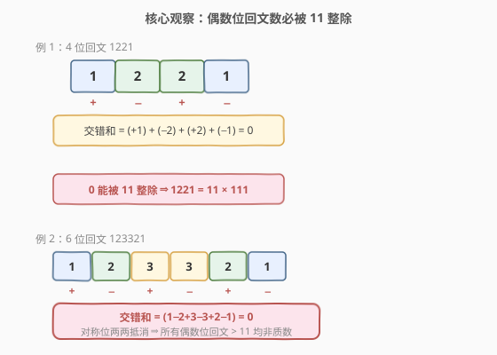
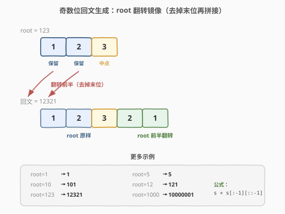
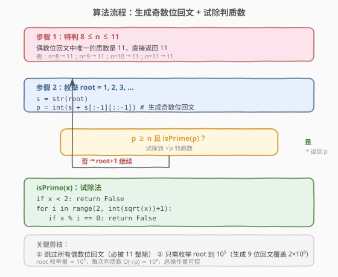
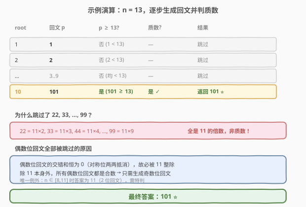

# 回文质数

- **题目名称**：回文质数
- **链接**：[866. 回文质数](https://leetcode.cn/problems/prime-palindrome/)
- **难度**：中等
- **标签**：数学、数论、回文

## 1. 题目概述

给你一个整数 `n`，返回大于或等于 `n` 的最小**回文质数**。

- **质数**：恰好有两个除数（`1` 和它本身），`1` 不是质数。例如 `2`、`3`、`5`、`7`、`11`、`13`。
- **回文数**：从左向右读和从右向左读相同。例如 `101`、`12321`。

**示例 1**：

```text
输入：n = 6
输出：7
```

**示例 2**：

```text
输入：n = 8
输出：11
```

**示例 3**：

```text
输入：n = 13
输出：101
```

**约束条件**：

- $1 \le n \le 10^8$
- 测试用例保证答案总是存在，且在 $[2, 2 \times 10^8]$ 范围内。

> ⚠️ **关键约束**：$n$ 可达 $10^8$，答案可达 $2 \times 10^8$。朴素地从 $n$ 开始逐个检查每个数是否「既是回文又是质数」，最坏需遍历近 $10^8$ 个数，必然超时。必须利用数论性质大幅剪枝。

---

## 2. 解题思路

### 2.1 暴力思路：逐个枚举

最直观的做法是从 $n$ 开始递增，对每个数 $x$：

1. 检查 $x$ 是否回文（转字符串比较 `s == s[::-1]`）；
2. 若回文，再用试除法检查 $x$ 是否质数。

```text
for x in range(n, 2*10**8):
    if isPalindrome(x) and isPrime(x):
        return x
```

问题在于：当 $n = 10^8$ 时，答案为 `100030001`，需遍历约 $30000$ 个数，每个数的回文判定 $O(\log x)$、质数判定 $O(\sqrt{x}) \approx 10^4$，总操作约 $3 \times 10^8$ 次，在时间限制内勉强但常数大、风险高。更关键的是，**绝大部分被检查的数根本不是回文**——回文数在自然数中极其稀疏（$10^8$ 以内只有约 $10^4$ 个回文），逐个枚举浪费了大量无效检查。

> 💡 **思路转换**：与其「遍历所有数，筛选回文+质数」，不如「**直接生成回文数，再判质数**」。生成回文只需枚举「前半部分」（root），数量从 $10^8$ 降到 $10^4$ 量级，再配合一个数论剪枝可进一步减半。

### 2.2 核心观察一：偶数位回文必被 11 整除



这是本题最关键的数论性质：**所有位数恰为偶数的回文数（除 `11` 外）都是合数**。

**证明**利用 `11` 的整除判定法则：一个数的**交错和**（从左到右，各位交替取 $+$、$-$ 号求和）若能被 `11` 整除，则该数能被 `11` 整除。

对于偶数位回文数 $d_1 d_2 \cdots d_k d_k \cdots d_2 d_1$（共 $2k$ 位），交错和为：

$$
(d_1 - d_2 + d_3 - \cdots + d_k) + (-d_k + d_{k-1} - \cdots - d_1) = 0
$$

因为回文的对称性，左右两半的交错和恰好**互为相反数**，加起来恒为 $0$。而 $0$ 能被 $11$ 整除，故该数必是 $11$ 的倍数。又因该数 $> 11$，所以它至少有因子 $11$，**必为合数**。

> 💡 **直觉理解**：回文是对称的，而 $11$ 的整除法则恰好也是「对称抵消」。偶数位回文的对称中心在两个中间位之间，左右两半完全镜像，交错和天然归零。

**推论**：唯一的偶数位回文质数是 `11` 本身（$2$ 位）。因此：

- 当 $n \in [8, 11]$ 时，答案直接是 $11$（需特判，因为后续只生成奇数位回文）。
- 当 $n > 11$ 时，**只需考虑奇数位回文**（$1, 3, 5, 7, 9$ 位），偶数位回文全部跳过。

### 2.3 核心观察二：直接生成奇数位回文



与其遍历所有数再筛选回文，不如**直接构造回文**。对奇数位回文，只需枚举一个 **root**（前半部分含中点），将其翻转（去掉末位后镜像拼接）：

```text
root = 123
s = "123"
回文 = s + s[:-1][::-1] = "123" + "21" = "12321"
```

- root 为 $1$ 位 → 生成 $1$ 位回文（如 `5`）
- root 为 $2$ 位 → 生成 $3$ 位回文（如 `10` → `101`）
- root 为 $3$ 位 → 生成 $5$ 位回文（如 `123` → `12321`）
- root 为 $k$ 位 → 生成 $2k - 1$ 位回文

覆盖到 $2 \times 10^8$（$9$ 位）只需 root 到 $5$ 位（$99999$），枚举量仅 $10^5$ 级别，远小于遍历 $10^8$ 个数。

### 2.4 算法流程图



完整流程分三步：

1. **特判** $n \in [8, 11]$：返回 $11$（唯一的偶数位回文质数）。
2. **枚举 root** $= 1, 2, 3, \ldots$：用 `s + s[:-1][::-1]` 生成奇数位回文 $p$。
3. **判质数**：若 $p \ge n$ 且 $p$ 是质数（试除到 $\sqrt{p}$），返回 $p$；否则继续下一个 root。

### 2.5 示例演算



以 $n = 13$ 为例：

| root | 回文 $p$ | $p \ge 13$? | 质数? | 结果 |
|------|----------|-------------|-------|------|
| 1 | 1 | 否 | — | 跳过 |
| 2 | 2 | 否 | — | 跳过 |
| 3 | 3 | 否 | — | 跳过 |
| … | … | 否 | — | 跳过 |
| 9 | 9 | 否 | — | 跳过 |
| 10 | 101 | 是 | 是 ✓ | **返回 101** ⭐ |

注意：root $= 1 \sim 9$ 生成的 $1$ 位回文均 $< 13$，直接跳过。root $= 10$ 生成 $101$（$3$ 位），$101 \ge 13$ 且 $101$ 是质数，返回 $101$。

> ⚠️ **为什么不检查 22, 33, …, 99？** 它们是 $2$ 位（偶数位）回文，必被 $11$ 整除（$22 = 11 \times 2$、$33 = 11 \times 3$、…），全是合数。奇数位生成器天然不会产生它们，这就是偶数位剪枝的威力。

---

## 3. 参考代码

### C++

```cpp
class Solution {
  public:
    bool isPrime(int x) {
        if (x < 2) return false;
        for (int i = 2; (long long)i * i <= x; ++i) {
            if (x % i == 0) return false;
        }
        return true;
    }

    int primePalindrome(int n) {
        if (8 <= n && n <= 11) return 11;
        for (int root = 1; root < 100000; ++root) {
            string s = to_string(root);
            string rs(s.begin(), s.end() - 1);
            reverse(rs.begin(), rs.end());
            int p = stoi(s + rs);
            if (p >= n && isPrime(p)) {
                return p;
            }
        }
        return -1;
    }
};
```

### Python

```python
class Solution:
    def primePalindrome(self, n: int) -> int:
        def is_prime(x: int) -> bool:
            if x < 2:
                return False
            i = 2
            while i * i <= x:
                if x % i == 0:
                    return False
                i += 1
            return True

        if 8 <= n <= 11:
            return 11

        for root in range(1, 100000):
            s = str(root)
            p = int(s + s[:-1][::-1])
            if p >= n and is_prime(p):
                return p
```

> ⚠️ **两个易错点**：
> 1. **特判 `8 <= n <= 11`**：`11` 是唯一的偶数位回文质数，而后续只生成奇数位回文，不特判会漏掉 $n \in [8, 11]$ 的答案。
> 2. **`i * i` 溢出**：C++ 中 $p$ 可达 $2 \times 10^8$，$\sqrt{p} \approx 14142$，`i * i` 最大约 $2 \times 10^8$，在 `int` 范围内。但用 `(long long)i * i` 更稳妥，是面试加分写法。

---

## 4. 复杂度分析

| 维度 | 复杂度 | 说明 |
|------|--------|------|
| 时间复杂度 | $O(\sqrt{M} \cdot \sqrt{P})$ | $M$ 为 root 上界 $\approx 10^5$，$P$ 为最大回文 $\approx 2 \times 10^8$；实际只需检查极少数回文，每次判质数 $O(\sqrt{P}) \approx 1.4 \times 10^4$ |
| 空间复杂度 | $O(\log M)$ | 字符串存储 root 及其翻转，长度 $\le 5$ |

> 💡 实际运行极快：虽然 root 枚举范围 $10^5$，但大部分回文 $< n$ 直接跳过，只有少数 $\ge n$ 的回文需要判质数。最坏情况（$n = 10^8$）也仅需检查约 $3 \times 10^4$ 个回文，远优于暴力遍历。

---

## 5. 扩展：为什么不用筛法？

对于「找区间内所有质数」的问题，[204. 计数质数](https://leetcode.cn/problems/count-primes/)（[题解](../0201-0300/204_计数质数.md)）的埃氏筛是标准做法。但本题不适合筛法，原因有二：

1. **值域过大**：答案可达 $2 \times 10^8$，埃氏筛需 $O(2 \times 10^8)$ 空间（约 $200$ MB），远超内存限制。
2. **只需少量质数**：我们不需要知道所有质数，只需判定极少数回文是否为质数。试除法每次 $O(\sqrt{P}) \approx 10^4$，配合回文生成器的极小枚举量，总操作量可控。

> 💡 **对比**：筛法适合「密集查询」（需判定大量数是否为质数）；试除法适合「稀疏查询」（只判定少数数）。本题是典型的稀疏查询场景。

---

## 6. 面试要点

1. **为什么偶数位回文一定被 11 整除？**

   - 利用 `11` 的整除判定：交错和（交替 $+/-$ 求和）能被 `11` 整除则原数能被 `11` 整除。偶数位回文 $d_1 d_2 \cdots d_k d_k \cdots d_2 d_1$ 的交错和为 $(d_1 - d_2 + \cdots + d_k) + (-d_k + \cdots - d_1) = 0$，左右两半互为相反数恰好抵消。$0$ 被 `11` 整除，故原数被 `11` 整除。除 `11` 本身外均为合数。

2. **为什么特判 `8 <= n <= 11` 返回 11？**

   - `11` 是唯一的偶数位回文质数（$2$ 位）。当 $n \in [8, 11]$ 时，$8, 9, 10$ 非质数回文，`11` 是答案。但后续算法只生成奇数位回文，不会产生 `11`，所以必须特判。$n \le 7$ 时，$2, 3, 5, 7$ 都是 $1$ 位奇数位回文，生成器能正常覆盖，无需特判。

3. **root 的上界为什么是 $10^5$？**

   - 答案保证在 $[2, 2 \times 10^8]$ 内。$2 \times 10^8$ 是 $9$ 位数，而 $5$ 位 root 生成的最大奇数位回文为 $99999 \rightarrow 999999999$（$9$ 位），$> 2 \times 10^8$，故 `root < 100000` 足以覆盖所有可能的答案。

4. **为什么「生成回文」比「遍历+筛选」更优？**

   - 回文数在自然数中极稀疏：$10^8$ 以内约 $10^4$ 个回文（占比万分之一）。遍历法对 $99.99\%$ 的非回文数做了无效的回文判定；生成法直接构造回文，枚举量从 $10^8$ 降到 $10^5$，再利用偶数位剪枝减半到 $5 \times 10^4$。

5. **如果题目改为「找 $[L, R]$ 区间内所有回文质数」怎么做？**

   - 同样用 root 生成所有奇数位回文（加特判 `11`），筛选 $[L, R]$ 范围内的回文，对每个判质数。若 $R - L$ 很大且查询密集，可预生成所有 $\le 2 \times 10^8$ 的回文质数列表（共约 $5800$ 个），然后二分查找区间。

---

## 7. 同类练习题

- [9. 回文数](https://leetcode.cn/problems/palindrome-number/)（[题解](../0001-0100/9_回文数.md)）：回文判定的基础，反转一半数字的 $O(1)$ 空间解法
- [204. 计数质数](https://leetcode.cn/problems/count-primes/)（[题解](../0201-0300/204_计数质数.md)）：埃氏筛模板，与本题试除法形成「密集 vs 稀疏查询」的对比
- [7. 整数反转](https://leetcode.cn/problems/reverse-integer/)：数字翻转的基础操作，本题回文生成的镜像思想与之同源
- [564. 寻找最近的回文数](https://leetcode.cn/problems/find-the-closest-palindrome/)：同样需要直接生成回文候选，但需处理「最近」而非「最小」的边界细节
