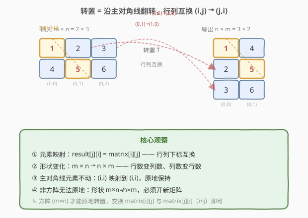
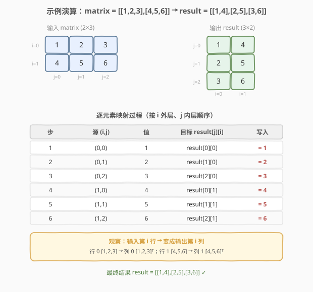

# LeetCode 转置矩阵 题解

## 1. 题目概述

- **标题 / 题号**：转置矩阵（#867，easy）
- **链接**：https://leetcode.cn/problems/transpose-matrix/
- **难度**：简单
- **标签**：数组、数学、矩阵、模拟

**题意**：给定一个 $m \times n$ 的二维整数矩阵 `matrix`，返回它的**转置矩阵**。

**转置**的定义：把矩阵沿**主对角线**（从左上到右下）翻转，使原来的**行**变成**列**、**列**变成**行**。形式化地，若 `matrix` 有 $m$ 行 $n$ 列，则转置矩阵 `result` 有 $n$ 行 $m$ 列，且满足：

$$
\text{result}[j][i] = \text{matrix}[i][j], \qquad 0 \le i < m,\ 0 \le j < n
$$

**示例 1**（方阵）：

```text
输入：matrix = [[1,2,3],[4,5,6],[7,8,9]]
输出：[[1,4,7],[2,5,8],[3,6,9]]
解释：
    1 2 3         1 4 7
    4 5 6   →     2 5 8      沿主对角线翻转，行列互换
    7 8 9         3 6 9
```

**示例 2**（非方阵）：

```text
输入：matrix = [[1,2,3],[4,5,6]]
输出：[[1,4],[2,5],[3,6]]
解释：
    1 2 3         1 4
    4 5 6   →     2 5      2×3 矩阵转置后变为 3×2
                  3 6
```

**约束**：

- `m == matrix.length`
- `n == matrix[i].length`
- $1 \le m, n \le 1000$
- $1 \le m \times n \le 10^5$
- $-10^9 \le \text{matrix}[i][j] \le 10^9$

> 💡 这是一道**矩阵索引映射**的入门题。核心只有一句话：`result[j][i] = matrix[i][j]`。难点不在算法，而在于理解「转置 = 行列下标互换 + 形状由 $m \times n$ 变 $n \times m$」。尤其当矩阵**非方阵**时，形状发生改变，无法像 [48. 旋转图像](../0001-0100/48_旋转图像.md) 那样原地操作，必须开辟新矩阵。

## 2. 解题思路

### 2.1 暴力思路：逐元素搬移

最直观的做法是严格按定义模拟：开一个 $n \times m$ 的新矩阵 `result`，两重循环遍历原矩阵的每个元素，把它放到转置后的位置。

```text
新建 result[n][m]
for i = 0 to m-1:
    for j = 0 to n-1:
        result[j][i] = matrix[i][j]
return result
```

这其实**已经是最优解**——转置必须访问每个元素至少一次，时间下界就是 $O(m \cdot n)$。所谓"暴力"只是说它没有利用任何结构性质做原地优化，但对非方阵而言，**原地本就不可能**，所以这个朴素做法无论时间还是空间都已是本题最优。

> ⚠️ Python 中可用 `zip(*matrix)` 一行搞定转置，但 `zip` 返回的是元组迭代器，本质仍是逐元素搬移到新结构，复杂度不变。面试中建议先写出显式双循环版本以展示对索引映射的理解，再提 `zip` 作为等价写法。

### 2.2 核心观察：行列互换与形状变化



理解转置的关键有四点：

1. **元素映射**：每个元素从位置 $(i, j)$ 移到 $(j, i)$——**行列下标互换**。这是一一对应的双射，不会有两个元素争抢同一目标位置。
2. **形状变化**：原矩阵 $m \times n$，转置后 $n \times m$。**行数和列数对调**。当 $m \ne n$ 时，输出与输入形状不同，所以必须新建矩阵。
3. **主对角线不动**：满足 $i = j$ 的元素（主对角线上的）映射到 $(i, i)$，位置不变。这也是"沿主对角线翻转"这一说法的由来——对角线是翻转的对称轴。
4. **方阵才能原地**：当 $m = n$（方阵）时，形状不变，可以原地交换 `matrix[i][j]` 与 `matrix[j][i]`（只对上三角 $i < j$ 做，避免交换两次又换回来）。这正是 [48. 旋转图像](../0001-0100/48_旋转图像.md) 中"转置 + 水平翻转 = 旋转 90°"那一步所用的原地技巧。但本题不限定方阵，且不要求原地，所以统一用新矩阵即可。

> 💡 **为什么非方阵不能原地？** 原地转置要求"形状不变"，即 $m = n$。当 $m \ne n$ 时，原本 $m$ 行 $n$ 列的存储结构要变成 $n$ 行 $m$ 列，行数/列数都变了，无法在不重建容器的前提下完成（例如 C++ 的 `vector<vector<int>>` 行数固定，Python 的 `list` 同理）。理论上对一维扁平存储的非方阵可用「置换环 / cycle leader」算法做 $O(1)$ 额外空间转置，但实现极复杂且超出本题范畴，面试中直接开新矩阵即可。

### 2.3 算法流程图

![算法流程：新建 n×m 矩阵，双循环 result[j][i]=matrix[i][j]](../images/transpose867_algorithm_flow.svg)

**完整步骤**：

1. **读取规模**：`m = matrix.size()`（行数），`n = matrix[0].size()`（列数）。
2. **新建结果矩阵**：`result` 大小为 $n \times m$（行数 = 原列数，列数 = 原行数）。
3. **外层循环**：`i = 0 … m-1`，遍历输入的每一行。
4. **内层循环**：`j = 0 … n-1`，遍历当前行的每一列。
5. **写入**：`result[j][i] = matrix[i][j]`——行列下标互换。
6. **返回** `result`。

> ⚠️ 注意 `result` 的维度是 $n \times m$ 而非 $m \times n$。最容易踩的坑是初始化时把行列搞反，导致下标越界。一个检验方法：`result` 的行数应等于 `matrix[0]` 的长度（原列数）。

### 2.4 示例演算

以示例 2 `matrix = [[1,2,3],[4,5,6]]`（$m = 2, n = 3$）为例，转置后 `result` 应为 $3 \times 2$。按 `i` 外层、`j` 内层的顺序逐元素映射：



| 步 | 源 $(i,j)$ | 值 | 目标 $\text{result}[j][i]$ | 写入 |
|----|-----------|----|--------------------------|------|
| 1 | $(0,0)$ | 1 | $\text{result}[0][0]$ | $= 1$ |
| 2 | $(0,1)$ | 2 | $\text{result}[1][0]$ | $= 2$ |
| 3 | $(0,2)$ | 3 | $\text{result}[2][0]$ | $= 3$ |
| 4 | $(1,0)$ | 4 | $\text{result}[0][1]$ | $= 4$ |
| 5 | $(1,1)$ | 5 | $\text{result}[1][1]$ | $= 5$ |
| 6 | $(1,2)$ | 6 | $\text{result}[2][1]$ | $= 6$ |

逐行解读：

- **行 0** `[1,2,3]` 经转置变成 `result` 的**列 0**：`result[0][0]=1`、`result[1][0]=2`、`result[2][0]=3`，即列 0 为 `[1,2,3]`。
- **行 1** `[4,5,6]` 经转置变成 `result` 的**列 1**：`result[0][1]=4`、`result[1][1]=5`、`result[2][1]=6`，即列 1 为 `[4,5,6]`。

最终结果 `result = [[1,4],[2,5],[3,6]]`（按行读），与示例一致。

> 💡 一个直觉化的记忆：**转置把每一行变成对应的列**。输入的第 $i$ 行 `matrix[i]` 转置后成为输出的第 $i$ 列。上例中行 0 `[1,2,3]` 竖起来就是列 0，行 1 `[4,5,6]` 竖起来就是列 1。

## 3. 参考代码

### C++

```cpp
class Solution {
public:
    vector<vector<int>> transpose(vector<vector<int>>& matrix) {
        int m = matrix.size();
        int n = matrix[0].size();
        vector<vector<int>> result(n, vector<int>(m));   // 注意维度是 n × m
        for (int i = 0; i < m; ++i) {
            for (int j = 0; j < n; ++j) {
                result[j][i] = matrix[i][j];             // 行列下标互换
            }
        }
        return result;
    }
};
```

### Python

```python
class Solution:
    def transpose(self, matrix: List[List[int]]) -> List[List[int]]:
        m, n = len(matrix), len(matrix[0])
        result = [[0] * m for _ in range(n)]             # 注意维度是 n × m
        for i in range(m):
            for j in range(n):
                result[j][i] = matrix[i][j]              # 行列下标互换
        return result
```

> 💡 **Python 等价一行写法**：`return [list(col) for col in zip(*matrix)]`。`zip(*matrix)` 把每一行 unpack 为参数，等价于按列取元素，恰好就是转置。`list(col)` 把元组转回列表。复杂度相同，但显式双循环更便于在面试中讲清索引映射。

## 4. 复杂度分析

| 维度 | 复杂度 | 说明 |
|------|--------|------|
| **时间复杂度** | $O(m \cdot n)$ | 双重循环遍历 $m \cdot n$ 个元素各一次，每个元素做一次赋值；已是转置问题的下界 |
| **空间复杂度** | $O(m \cdot n)$ | 新建 $n \times m$ 的结果矩阵，存放全部 $m \cdot n$ 个元素；不计返回值则为 $O(1)$ 额外空间 |

> ⚠️ 本题已是该问题的最优复杂度——转置必须读每个元素一次以确定其新位置，时间无法低于 $O(m \cdot n)$。对非方阵，输出形状与输入不同，$O(m \cdot n)$ 的输出空间不可避免。约束 $m \cdot n \le 10^5$ 规模温和，双循环毫无压力。

## 5. 扩展：方阵的原地转置与置换环

当矩阵是**方阵**（$m = n$）时，形状不变，可以做 $O(1)$ 额外空间的原地转置：只需对**上三角**的每个位置 $(i, j)$（$i < j$）交换 `matrix[i][j]` 与 `matrix[j][i]`。

```cpp
// 方阵原地转置（仅当 m == n）
for (int i = 0; i < n; ++i) {
    for (int j = i + 1; j < n; ++j) {
        swap(matrix[i][j], matrix[j][i]);
    }
}
```

> 💡 **为什么只交换上三角 $i < j$？** 因为下三角的 $(j, i)$ 会在处理上三角 $(j, i)$ 时被对称地交换到。若对全部 $(i, j)$ 都交换，等于每对交换两次，又换回原状。

对于**非方阵**的一维扁平存储（如 `matrix` 按行优先存为一维数组），理论上可用**置换环（cycle leader）**算法在 $O(1)$ 额外空间内完成转置。其原理是：转置是一个置换 $\sigma(i \cdot n + j) = j \cdot m + i$，将其分解为若干不相交的循环，沿每个循环"走一圈"即可原地搬移。但该算法实现复杂（需逐环处理并标记），且 LeetCode 的二维容器接口下形状本身就会变，所以面试中**直接开新矩阵**是最务实的选择。

[48. 旋转图像](../0001-0100/48_旋转图像.md) 正是利用了「方阵原地转置」这一步——先转置再水平翻转即得顺时针 90° 旋转，两步都原地、$O(1)$ 额外空间。这体现了转置作为"矩阵几何变换积木"的基础地位。

## 6. 面试要点

1. **转置的索引映射公式是什么？为什么是对的？**

   - `result[j][i] = matrix[i][j]`。转置沿主对角线翻转，对称轴上的点 $(i, i)$ 不动，轴两侧的 $(i, j)$ 与 $(j, i)$ 互换位置，所以行列下标对调即得目标位置。

2. **为什么非方阵不能原地转置？**

   - 原地要求形状不变，即 $m = n$。非方阵 $m \ne n$ 时输出从 $m \times n$ 变为 $n \times m$，行列数对调，容器结构本身需要重建，无法在不新开存储的前提下完成。

3. **方阵原地转置时，为什么只交换上三角（$i < j$）？**

   - 转置是 $(i, j) \leftrightarrow (j, i)$ 的对换。若对全部位置都交换，每对会被换两次而还原。只处理 $i < j$ 的上三角，每个对换恰好执行一次。

4. **`result` 的维度应该怎么初始化？**

   - `result` 是 $n \times m$：行数等于原列数 $n$，列数等于原行数 $m$。最易踩的坑是把维度写成 $m \times n$ 导致 `result[j][i]` 越界（当 $j \ge m$ 时）。

5. **这道题和 48. 旋转图像有什么联系？**

   - 48 是方阵的顺时针 90° 旋转，可分解为「转置 + 水平翻转」两步原地变换，其中转置步就是方阵原地转置。867 则是任意矩阵的转置本身，不限定方阵、不要求原地。两者同属矩阵几何变换家族，转置是其中最基础的积木。

> 💡 **一句话总结**：867 是矩阵索引映射的入门题——开 $n \times m$ 新矩阵，双循环执行 `result[j][i] = matrix[i][j]`，$O(m \cdot n)$ / $O(m \cdot n)$。核心洞察是"行列下标互换 + 形状对调"，非方阵无法原地、方阵可原地交换上三角。

## 同类练习题

| # | 题目 | 与本题的关联 |
|---|------|-------------|
| 48 | [旋转图像](https://leetcode.cn/problems/rotate-image/)（[题解](../0001-0100/48_旋转图像.md)） | 方阵原地转置 + 水平翻转合成 90° 旋转，转置是其关键一步，对比 867 的通用转置 |
| 832 | [翻转图像](https://leetcode.cn/problems/flipping-an-image/)（[题解](../0801-0900/832_翻转图像.md)） | 方阵的水平翻转 + 取反，与转置同属矩阵几何变换家族，均可用对称位置交换原地完成 |
| 304 | [二维区域和检索 - 数组不可变](https://leetcode.cn/problems/range-sum-query-2d-immutable/)（[题解](../0301-0400/304_二维区域和检索%20-%20数组不可变.md)） | 二维矩阵的索引映射与前缀和，巩固对矩阵下标 $(i,j)$ 的操作直觉 |
| 54 | [螺旋矩阵](https://leetcode.cn/problems/spiral-matrix/) | 按螺旋顺序遍历矩阵，同为矩阵索引映射题，考察对二维下标边界的精确控制 |
