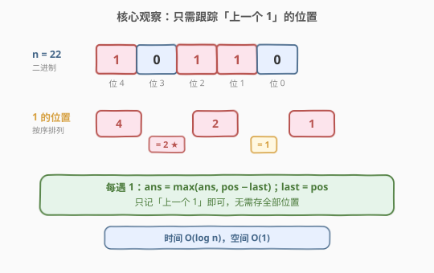
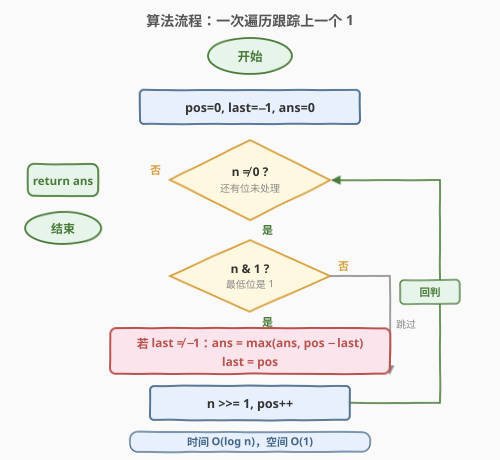
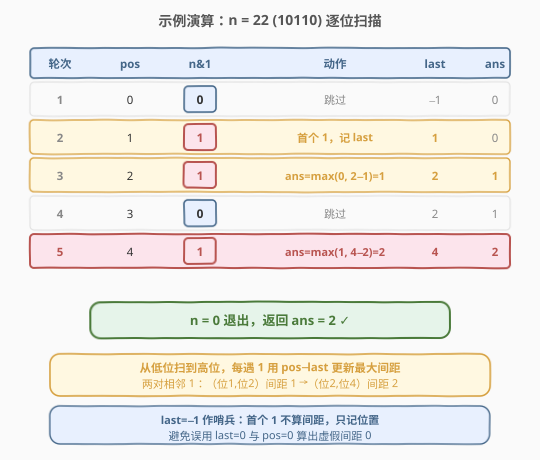

# 二进制间距

- **题目名称**：二进制间距
- **链接**：[868. 二进制间距](https://leetcode.cn/problems/binary-gap/)
- **难度**：简单
- **标签**：位运算、数学

## 1. 题目概述

给定一个正整数 `n`，找到并返回 `n` 的二进制表示中两个 **相邻** 1 之间的 **最长距离**。如果不存在两个相邻的 1，返回 `0`。

> 💡 **「相邻」的定义**：把 `n` 的二进制中所有 `1` 按位置从左到右排成一列，**相邻**指的是这一列中**前后相邻的两个 1**，而不是二进制串里物理相邻。两个 `1` 之间的距离是它们在二进制表示中位置的绝对差。例如 `"1001"` 中的两个 `1` 分别在第 3 位和第 0 位（从右起 0 编号），距离为 $3 - 0 = 3$。

**示例 1**：

```text
输入：n = 22
输出：2
解释：22 的二进制是 "10110"。
在 22 的二进制表示中，有三个 1，组成两对相邻的 1。
第一对相邻的 1 中，两个 1 之间的距离为 2。
第二对相邻的 1 中，两个 1 之间的距离为 1。
答案取两个距离之中最大的，也就是 2。
```

**示例 2**：

```text
输入：n = 8
输出：0
解释：8 的二进制是 "1000"。
在 8 的二进制表示中没有相邻的两个 1，所以返回 0。
```

**示例 3**：

```text
输入：n = 5
输出：2
解释：5 的二进制是 "101"。
```

**约束条件**：

- $1 \le n \le 10^9$

> ⚠️ $10^9 < 2^{30}$，故 `n` 的二进制最多 30 位。这意味着任何逐位扫描的算法都是常数级（$\le 30$ 步），但思路的优劣仍体现在「是否需要额外空间」「能否跳过连续 0」上。

---

## 2. 解题思路

### 2.1 暴力思路：收集所有 1 的位置再求差

最直观的做法分两步：先把 `n` 的二进制中**所有 `1` 的位置**收集进一个数组，再对相邻位置求差取最大。

```text
positions = []
for i in 0..30:
    if (n >> i) & 1:
        positions.append(i)
ans = max(positions[i] - positions[i-1] for i in 1..len-1)
return ans   // 不足两个 1 时返回 0
```

时间 $O(\log n)$（扫描全部位），空间 $O(k)$（`k` 为 `1` 的个数，存位置数组）。能 AC，但有两处浪费：

1. **存了所有位置却只用相邻两个**——实际上求最大间距只需记住「上一个 `1` 的位置」，无需保留历史；
2. **逐位扫描不跳 `0`**——遇到大段连续 `0`（如 `n = 2^{29}`，二进制 `1` 后跟 29 个 `0`）仍要一位一位走。

> 💡 转机：能否**只记一个变量**（上一个 `1` 的位置），边扫描边更新答案，把空间降到 $O(1)$？

### 2.2 核心观察：一次遍历 + 跟踪上一个 1 的位置



关键观察是：**最大间距只取决于「当前 1」与「上一个 1」之间的距离**，与更早的 `1` 无关。

设当前扫描到第 `pos` 位且该位为 `1`，记上一个 `1` 的位置为 `last`：

- 若 `last` 已存在（$\ne -1$），则这一对相邻 `1` 的间距为 $\text{pos} - \text{last}$，用它更新全局最大值 `ans`；
- 无论是否更新 `ans`，都把 `last` 刷新为 `pos`（因为对**后续**的 `1` 而言，最近的 `1` 就是当前这个）。

> 💡 **正确性**：题目所求的「相邻 1」是按位置顺序前后相邻的两个 `1`。我们从低位到高位逐位扫描，遇到 `1` 时它与「上一个遇到的 `1`」恰是一对相邻 `1`——中间不可能还有别的 `1`（否则那个 `1` 才是「上一个」）。所以每遇到一个 `1`，`pos - last` 就是它到前一个 `1` 的真实间距，遍历一遍必然枚举完所有相邻对，取最大即得答案。

### 2.3 算法流程图



算法只需三个变量 `pos`、`last`、`ans` 和一个循环：

1. 初始化 `pos = 0`（当前位号）、`last = -1`（上一个 `1` 的位置，`-1` 表示尚未见过 `1`）、`ans = 0`。
2. 只要 `n > 0`（还有未处理位）：
   - 若 `n & 1 == 1`（当前最低位是 `1`）：
     - 若 `last != -1`：`ans = max(ans, pos - last)`；
     - `last = pos`。
   - `n >>= 1`（右移一位，处理下一位），`pos += 1`。
3. 返回 `ans`。

> ⚠️ **为何用 `last = -1` 作哨兵而非 `last = 0`？** 因为第 0 位完全可能是 `1`（如 `n = 5 = 101`，最低位就是 `1`）。若用 `0` 作初值，会把「第 0 位的 `1`」误判成「已经见过 `1`」从而算出一个虚假的 `0 - 0 = 0` 间距。`-1` 是不可能出现的位置，能安全区分「没见过」与「见过」。

### 2.4 示例演算

以示例 1 的 `n = 22`（二进制 `10110`，从低位起：位 0=`0`, 位 1=`1`, 位 2=`1`, 位 3=`0`, 位 4=`1`）为例：



| 轮次 | n（二进制） | pos | n & 1 | 动作 | last | ans |
|------|------------|-----|-------|------|------|-----|
| 初始 | 10110 | 0 | — | — | -1 | 0 |
| 1 | 10110 | 0 | 0 | 跳过 | -1 | 0 |
| 2 | 1011 | 1 | 1 | 首个 1，记 last | 1 | 0 |
| 3 | 101 | 2 | 1 | ans=max(0, 2−1)=1 | 2 | 1 |
| 4 | 10 | 3 | 0 | 跳过 | 2 | 1 |
| 5 | 1 | 4 | 1 | ans=max(1, 4−2)=2 | 4 | 2 |
| 结束 | 0 | — | — | n=0 退出 | — | **2** |

5 轮后 `n = 0`，返回 `ans = 2` ✓。注意第 3 轮算出的间距 `1` 与第 5 轮算出的间距 `2` 取最大，正对应示例中「第一对距离 2、第二对距离 1」——只不过我们从低位扫到高位，先遇到的相邻对是（位 1, 位 2）间距 1，后遇到的是（位 2, 位 4）间距 2。

---

## 3. 参考代码

### C++

```cpp
class Solution {
  public:
    int binaryGap(int n) {
        int ans = 0, last = -1, pos = 0;
        while (n) {
            if (n & 1) {
                if (last != -1) ans = max(ans, pos - last);
                last = pos;
            }
            n >>= 1;
            pos++;
        }
        return ans;
    }
};
```

### Python

```python
class Solution:
    def binaryGap(self, n: int) -> int:
        ans, last, pos = 0, -1, 0
        while n:
            if n & 1:
                if last != -1:
                    ans = max(ans, pos - last)
                last = pos
            n >>= 1
            pos += 1
        return ans
```

> 💡 **为何不用 `for i in range(32)` 固定循环 32 次？** 因为 `n` 至多 30 位，用 `while n:` 可以在 `n` 变为 `0` 时提前结束，对 `1` 稀疏分布于低位的数（如 `n = 5`）只需扫 3 位而非 32 位。两种写法复杂度都是 $O(1)$（位数有上界 30），但 `while` 版更贴合「只处理有效位」的直觉。

---

## 4. 复杂度分析

| 维度 | 一次遍历法 | 暴力收集位置法 |
|------|-----------|---------------|
| **时间复杂度** | $O(\log n)$ | $O(\log n)$ |
| **空间复杂度** | $O(1)$ | $O(k)$，$k$ 为 `1` 的个数 |
| **是否跳过连续 0** | 否（逐位移位） | 否 |
| **变量个数** | 3（pos/last/ans） | 1 个数组 + 下标 |

> ⚠️ 严格说时间复杂度是 $O(\text{bitlen}(n))$，即 `n` 的二进制位数。由于 $n \le 10^9 < 2^{30}$，位数 $\le 30$，故也可视作 $O(1)$。两种写法时间同为 $O(\log n)$，但一次遍历法**省掉了位置数组**，空间从 $O(k)$ 降到 $O(1)$——这正是本题作为「简单题」想考察的优化点：**求相邻元素差的最大值，只需记住前一个元素，无需存全部。**

---

## 5. 扩展：Brian Kernighan 变体——跳过连续 0

一次遍历法仍要**逐位移位**，遇到连续 `0`（如 `n = 2^{29}`，一个 `1` 后跟 29 个 `0`）会空转 29 次。能否像 [191. 位 1 的个数](../0001-0100/191_位1的个数.md) 那样**一次性跳过所有 `0` 位**？

答案是用 `n & (n - 1)` 抹掉最低设置位 + `n & (-n)` 隔离最低设置位，两技巧配合：

- `n & (-n)` 取出 `n` 的最低设置位（一个仅该位为 `1` 的值），`.bit_length() - 1` 即得其位置；
- `n &= n - 1` 抹掉这个最低设置位，直接跳到下一个 `1`。

```python
class Solution:
    def binaryGap(self, n: int) -> int:
        ans, last = 0, -1
        while n:
            pos = (n & -n).bit_length() - 1   # 最低设置位的位置
            if last != -1:
                ans = max(ans, pos - last)
            last = pos
            n &= n - 1                        # 抹掉最低设置位，跳到下一个 1
        return ans
```

C++ 可用 `__builtin_ctz`（count trailing zeros）直接得到最低设置位位置：

```cpp
class Solution {
  public:
    int binaryGap(int n) {
        int ans = 0, last = -1;
        while (n) {
            int pos = __builtin_ctz(n);       // 末尾连续 0 的个数 = 最低设置位位置
            if (last != -1) ans = max(ans, pos - last);
            last = pos;
            n &= n - 1;                       // 抹掉最低设置位
        }
        return ans;
    }
};
```

> 💡 **正确性**：`n & (n - 1)` 每次抹掉当前最低设置位，故循环按**从低位到高位**的顺序依次访问每个 `1`。相邻两次访问的位置差 `pos - last` 恰是一对相邻 `1` 的间距，与一次遍历法枚举的相邻对完全一致。循环次数从「位数」降到「`1` 的个数」$O(\text{popcount}(n))$，在 `1` 稀疏时更快。

| 写法 | 循环次数 | 跳过连续 0 | 联系 |
|------|---------|-----------|------|
| 一次遍历 `n >>= 1` | 位数 $\le 30$ | 否 | 朴素，无语言依赖 |
| **Brian Kernighan `n &= n-1`** | popcount | ✅ | [191](../0001-0100/191_位1的个数.md) 数 1 / [231](../0201-0300/231_2的幂.md) 判 2 的幂共用此技巧 |

---

## 6. 面试要点

1. **「相邻 1」是什么意思？会不会漏掉某对？**

   - 「相邻」指把所有 `1` 按位置排序后**前后相邻的两个**，不是二进制串里物理相邻。从低位到高位逐位扫描，每遇到一个 `1`，它与「上一个遇到的 `1`」就是一对相邻 `1`（中间不可能还有别的 `1`）。遍历一遍必然枚举完所有相邻对，不会漏。

2. **为什么用 `last = -1` 而不是 `last = 0`？**

   - 第 0 位可能是 `1`（如 `n = 5 = 101`）。若 `last` 初值为 `0`，遇到第 0 位的 `1` 时会误判「已见过 `1`」并算出虚假间距 `0 - 0 = 0`。`-1` 是不可能的位置，能安全区分「没见过」与「见过」，避免误更新。

3. **只存「上一个 1」为什么就能保证得到全局最大间距？**

   - 最大间距必然出现在某一对相邻 `1` 之间。而每对相邻 `1` 在扫描时都会被「当前 `1` − 上一个 `1`」覆盖到。我们用 `max` 累积所有相邻对的间距，遍历结束即为全局最大。这是「**求相邻元素差的最大值只需滚动记住前一个**」的通用模式，与数组题里求最大相邻差同源。

4. **Brian Kernighan 变体比一次遍历快在哪？**

   - 一次遍历逐位移位，循环次数等于位数（最坏 30）；Brian Kernighan 用 `n &= n - 1` 直接跳到下一个 `1`，循环次数等于 `1` 的个数（popcount）。当 `1` 稀疏时（如 `n = 2^{29}`，1 个 `1`），前者空转 29 次扫 `0`，后者只循环 1 次。最坏（全 `1`）两者都是 30 次。`__builtin_ctz` / `bit_length` 提供了 O(1) 取最低设置位位置的能力。

5. **时间复杂度是 $O(1)$ 还是 $O(\log n)$？**

   - 严格说是 $O(\text{bitlen}(n))$，即二进制位数。但 $n \le 10^9 < 2^{30}$，位数 $\le 30$ 有常数上界，故也可表述为 $O(1)$。面试中两种说法都对，关键说清「循环次数 = 位数，位数有上界 30」。

> 💡 **一句话总结**：求二进制中相邻 `1` 的最大间距，本质是「在位序列上求相邻元素差的最大值」——只需滚动记住上一个 `1` 的位置，一次遍历 $O(\log n)$ 时间、$O(1)$ 空间即可。进阶可用 `n & (n-1)` 跳过连续 `0`，把循环次数从位数降到 popcount。

---

## 7. 同类练习题

- [191. 位 1 的个数](https://leetcode.cn/problems/number-of-1-bits/)（[题解](../0001-0100/191_位1的个数.md)）：`n & (n-1)` 抹最低设置位数 `1`，本题 Brian Kernighan 变体的技巧源头
- [693. 交替位二进制数](https://leetcode.cn/problems/binary-number-with-alternating-bits/)：检查相邻位是否交替 `01`/`10`，同样逐位扫描相邻位关系，思路直接迁移
- [338. 比特位计数](https://leetcode.cn/problems/counting-bits/)（[题解](../0301-0400/338_比特位计数.md)）：对 `0..n` 每个数求 popcount，位运算的批量应用版
- [461. 汉明距离](https://leetcode.cn/problems/hamming-distance/)：两数异或后数不同的位数，位距离的另一形式
- [190. 颠倒二进制位](https://leetcode.cn/problems/reverse-bits/)：逐位处理 32 位无符号数，位运算基础练习
