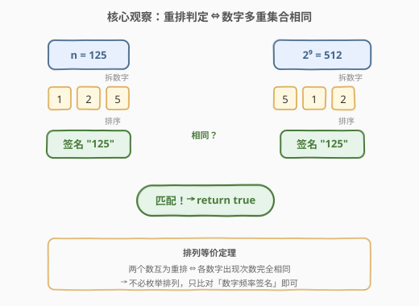
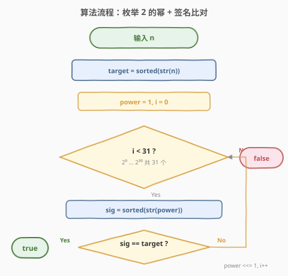
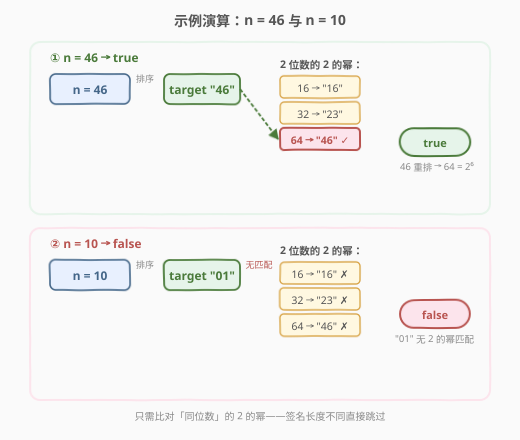

# LeetCode 重新排序得到 2 的幂 题解

## 1. 题目概述

- **标题 / 题号**：重新排序得到 2 的幂（#869，medium）
- **链接**：https://leetcode.cn/problems/reordered-power-of-2/
- **难度**：中等
- **标签**：数学、计数、哈希表

**题意**：给定正整数 $n$，将其十进制数字按**任意顺序**重新排列（包括原始顺序），但**前导数字不能为零**。判断是否存在一种重排使得结果为 $2$ 的幂。

**示例 1**：

```text
输入：n = 1
输出：true
解释：1 本身就是 2⁰ = 1。
```

**示例 2**：

```text
输入：n = 10
输出：false
解释：10 的数字为 {1, 0}，重排只能得到 10 或 01（前导零非法），都不是 2 的幂。
```

**示例 3**：

```text
输入：n = 46
输出：true
解释：46 重排得到 64 = 2⁶。
```

**约束**：

- $1 \le n \le 10^9$

> 💡 $n \le 10^9$ 意味着 $n$ 最多 $10$ 位数字。$2$ 的幂在 $10^9$ 范围内只有 $2^0$ 到 $2^{29}$（$2^{29} = 536870912$），加上 $10$ 位的 $2^{30} = 1073741824$ 共 $31$ 个候选。与其枚举排列，不如反过来枚举这 $31$ 个 $2$ 的幂逐一比对。

## 2. 解题思路

### 2.1 暴力思路：枚举全排列

最直白的做法：生成 $n$ 的所有数字排列（跳过前导零），逐一判断是否为 $2$ 的幂（用 `x & (x-1) == 0` 判定）。

对于 $d$ 位数字，排列数最坏 $d!$，当 $d = 10$ 时约 $3.6 \times 10^6$，勉强能过但缺乏洞察力，且去重逻辑（相同数字的排列会重复）容易出错。

> ⚠️ 暴力法把问题当成「从 $n$ 出发找排列」，方向搞反了——$2$ 的幂只有 $31$ 个候选，远比排列数少。**反过来枚举 $2$ 的幂去匹配 $n$** 才是正道。

### 2.2 核心观察：数字多重集合签名



关键定理：**两个数互为重排 $\iff$ 它们各数字的出现次数完全相同**。

因此不必枚举排列，只需为 $n$ 计算一个「**数字频率签名**」（如排序后的数字字符串），再与每个 $2$ 的幂的签名逐一比对即可：

- **签名表示法**：将数字转字符串后**排序**。如 $n = 125 \to$ `"125"`，$2^9 = 512 \to$ 排序后 `"125"`，签名相同 → 可重排。
- 也可用 $10$ 元频率数组 `[0,1,1,0,0,1,0,0,0,0]`（一个 `1`、一个 `2`、一个 `5`），排序字符串是它的紧凑等价表示。

> 💡 **为什么只枚举 $31$ 个 $2$ 的幂？** $n \le 10^9$ 最多 $10$ 位数字，$2^{30} = 1073741824$（$10$ 位）是可能匹配的最大候选。$2^0$ 到 $2^{30}$ 恰好 $31$ 个，每次签名比对 $O(d) \le O(10)$，总计 $O(31 \times 10) = O(1)$，常数级。

### 2.3 算法流程图



**完整步骤**：

1. **计算目标签名**：`target = sorted(str(n))`。
2. **枚举 $2$ 的幂**：`power = 1`，循环 $i$ 从 $0$ 到 $30$（共 $31$ 个）。
3. **逐个比对**：计算 `sig = sorted(str(power))`，若 `sig == target` 则 `return true`。
4. **推进**：`power <<= 1`（即 `power *= 2`）。
5. **全部不匹配**：`return false`。

> 💡 **为什么不需要显式检查前导零？** 签名比对只关心数字的多重集合，不关心排列顺序。而 $2$ 的幂本身不含前导零（如 $16$ 而非 $016$）。若 $n$ 的数字能组成某个 $2$ 的幂，那一定存在一种**无前导零**的排法（即该 $2$ 的幂本身），故前导零约束自动满足。

### 2.4 示例演算



**① n = 46 → true**：

- `target = sorted("46") = "46"`
- $2$ 位数的 $2$ 的幂：$16 \to$ `"16"`、$32 \to$ `"23"`、$64 \to$ `"46"`
- $64$ 的签名 `"46"` $==$ `target` → 匹配！$46$ 重排为 $64 = 2^6$ → **true**

**② n = 10 → false**：

- `target = sorted("10") = "01"`
- $2$ 位数的 $2$ 的幂：$16 \to$ `"16"`、$32 \to$ `"23"`、$64 \to$ `"46"`
- 三个签名均 $\ne$ `"01"` → 无匹配 → **false**

> ⚠️ $n = 10$ 的数字 $\{1, 0\}$ 若允许前导零可组成 $01 = 1 = 2^0$，但前导零非法，故排除。签名法天然规避此问题——$2^0 = 1$ 的签名是 `"1"`（$1$ 位数），与 `"01"`（$2$ 位数）长度不同，直接不匹配。

## 3. 参考代码

### C++

```cpp
class Solution {
public:
    bool reorderedPowerOf2(int n) {
        string target = to_string(n);
        sort(target.begin(), target.end());
        long long power = 1;
        for (int i = 0; i < 31; i++) {
            string sig = to_string(power);
            sort(sig.begin(), sig.end());
            if (sig == target) return true;
            power <<= 1;
        }
        return false;
    }
};
```

### Python

```python
class Solution:
    def reorderedPowerOf2(self, n: int) -> bool:
        target = sorted(str(n))
        power = 1
        for _ in range(31):
            if sorted(str(power)) == target:
                return True
            power <<= 1
        return False
```

> 💡 **频率数组写法**（等价但更显式）：
> ```python
> class Solution:
>     def reorderedPowerOf2(self, n: int) -> bool:
>         def count_digits(x):
>             cnt = [0] * 10
>             while x:
>                 cnt[x % 10] += 1
>                 x //= 10
>             return tuple(cnt)
>         target = count_digits(n)
>         power = 1
>         for _ in range(31):
>             if count_digits(power) == target:
>                 return True
>             power <<= 1
>         return False
> ```
> 排序字符串写法更简洁，频率数组写法更直观地体现「多重集合」本质，面试中按偏好选择即可。

## 4. 复杂度分析

| 维度 | 复杂度 | 说明 |
|------|--------|------|
| **时间复杂度** | $O(\log n \cdot d)$ | 枚举 $31$ 个 $2$ 的幂，每个做 $O(d)$ 的字符串排序（$d \le 10$ 位数字），总计 $O(31 \times d \log d) = O(1)$ 常数级 |
| **空间复杂度** | $O(d)$ | 仅存储目标签名与当前签名字符串，$d \le 10$ |

> 💡 严格来说 $31$ 是常数（由 $n \le 10^9$ 决定），故时间/空间均为 $O(1)$。写 $O(\log n)$ 是为了体现枚举的 $2$ 的幂个数随 $n$ 的量级增长。

## 5. 扩展：为什么 31 个候选足够？

$n \le 10^9$，$n$ 的位数 $d \le 10$。$2$ 的幂中位数 $\le 10$ 的最大值是 $2^{30} = 1073741824$（$10$ 位），$2^{31} = 2147483648$（$10$ 位）也有 $10$ 位——但 $n$ 的数字若与 $2^{31}$ 相同，则 $n$ 本身至少是 $10$ 位且 $\ge 10^9$，唯一可能是 $n = 10^9$（数字为一个 $1$ 和九个 $0$），而 $2^{31}$ 的数字不可能是全零尾，故不会匹配。

更严谨地：$n \le 10^9$ 时 $n$ 的数字和 $S \le 81$（$9 \times 9 = 81$，因为 $n \ne 10^9$ 时最多 $9$ 位且每位 $\le 9$）。$2^k$ 的数字和随 $k$ 增大而无上界，但 $10$ 位以内的 $2$ 的幂（$2^0$ 到 $2^{33}$）只需检查到 $2^{30}$ 即可覆盖所有 $n \le 10^9$ 的情况。

> 💡 实际编码中循环 $31$ 次（$2^0$ 到 $2^{30}$）是安全且充分的上界，无需精确分析边界。

## 6. 面试要点

1. **为什么不枚举排列而枚举 2 的幂？**

   - $n$ 的排列数最坏 $d! \approx 3.6 \times 10^6$（$d = 10$），而 $2$ 的幂候选只有 $31$ 个（$2^0$ 到 $2^{30}$）。枚举少的那边再去匹配，效率高几个数量级。这是「**双向枚举取较小端**」的通用思路——类似于两数之和中遍历较短数组。

2. **「数字签名」的本质是什么？**

   - 数字签名是数字 $0$–$9$ 的**频率多重集合**的编码表示。排序字符串和 $10$ 元频率数组是两种等价编码。两个数互为重排当且仅当它们的数字多重集合相同，因此签名匹配即可判定重排等价性，无需枚举具体排列。

3. **前导零约束如何处理？**

   - 不需要显式处理。签名比对只关心数字频率，不关心顺序。若 $n$ 的数字能组成某个 $2$ 的幂，该 $2$ 的幂本身就是一种合法（无前导零）的排列。而 $2$ 的幂的数字不含前导零，所以匹配成功自动满足约束。

4. **为什么循环 31 次就够了？**

   - $n \le 10^9$ 最多 $10$ 位数字。$2^{30} = 1073741824$ 是 $10$ 位数，$2^{31}$ 及以上位数虽相同但 $n$ 的数字无法匹配（$n \le 10^9$ 限制了数字组合）。$31$ 次循环覆盖 $2^0$ 到 $2^{30}$，对所有 $n \le 10^9$ 充分。

5. **如果 $n$ 的上界放大到 $10^{18}$ 怎么办？**

   - $2$ 的幂枚举到 $2^{60}$（约 $60$ 个），签名仍用排序字符串或频率数组（$d \le 19$），时间仍为常数级 $O(60 \times 19 \log 19) = O(1)$。签名法的优势在于候选数始终是 $O(\log n)$ 级别，不随位数爆炸增长。

> 💡 **一句话总结**：869 的核心是**「重排等价 = 数字多重集合相同」**——为 $n$ 算一个数字频率签名（排序字符串），与 $31$ 个 $2$ 的幂的签名逐一比对即可。$O(1)$ 时间、$O(1)$ 空间，将 $O(d!)$ 的排列枚举问题转化为 $O(\log n)$ 的签名匹配问题。

## 同类练习题

| # | 题目 | 与本题的关联 |
|---|------|-------------|
| 49 | [字母异位词分组](https://leetcode.cn/problems/group-anagrams/) | 同样的「排序字符串作为多重集合签名」思想，对字母而非数字做频率签名分组，与本题签名法同构 |
| 242 | [有效的字母异位词](https://leetcode.cn/problems/valid-anagram/) | 判定两个字符串是否互为重排（字母异位词），直接比对排序结果或频率数组，是 869 签名法的纯字符串版 |
| 231 | [2 的幂](https://leetcode.cn/problems/power-of-two/)（[题解](../0201-0300/231_2的幂.md)） | 判定单个数是否为 $2$ 的幂（`n & (n-1) == 0`），是 869 的判定原语——若改用排列枚举法需逐个调用此判定 |
| 204 | [计数质数](https://leetcode.cn/problems/counting-primes/)（[题解](../0201-0300/204_计数质数.md)） | 同样是「枚举候选 + 判定」思路的数学题，对比 869 枚举 $2$ 的幂而非枚举 $n$ 的排列 |
| 187 | [重复的 DNA 序列](https://leetcode.cn/problems/repeated-dna-sequences/)（[题解](../0101-0200/187_重复的DNA序列.md)） | 用哈希签名（滚动哈希编码）检测重复子串，与 869 用签名匹配 $2$ 的幂同属「签名/指纹代替暴力比对」套路 |
