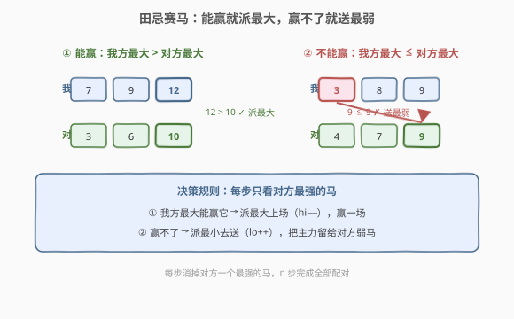
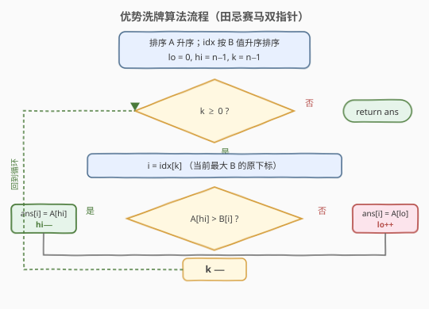

# LeetCode 优势洗牌 题解

## 1. 题目概述

- **标题 / 题号**：优势洗牌（#870，medium）
- **链接**：https://leetcode.cn/problems/advantage-shuffle/
- **难度**：中等
- **标签**：贪心、排序、双指针、数组

**题意**：给定两个**长度相等**的整数数组 `nums1` 和 `nums2`（长度均为 $n$）。`nums1` 相对 `nums2` 的**优势**定义为满足 `nums1[i] > nums2[i]` 的下标 $i$ 的个数。

你可以**任意重排** `nums1`（即返回它的一个排列）。目标是使重排后的 `nums1` 相对 `nums2` 的优势**尽可能大**。返回**任意**一个能使优势最大化的排列。

**示例 1**：

```text
输入：nums1 = [2,7,11,15], nums2 = [1,10,4,11]
输出：[2,11,7,15]
解释：2>1、11>10、7>4、15>11，4 个位置全部取胜，优势为 4（已达上界 n）。
```

**示例 2**：

```text
输入：nums1 = [12,24,8,32], nums2 = [13,25,32,11]
输出：[24,32,8,12]
解释：24>13、32>25、8≯32、12>11，优势为 3。
      其中 nums2[2]=32 无法被任何 nums1 元素严格超过（最大只有 32），故把最小的 8 拿去"送"，其余三个位置全赢。
```

**约束**：

- $1 \le \text{nums1.length} \le 10^5$
- $\text{nums2.length} == \text{nums1.length}$
- $0 \le \text{nums1[i]},\ \text{nums2[i]} \le 10^9$

> 💡 **本质**：这是一道**二分图最大匹配**的贪心特例——把 `nums1` 的元素匹配到 `nums2` 的位置上，"严格大于"算赢一局。由于结构特殊（只要计数、不要求具体配对价值），可用"田忌赛马"贪心在 $O(n \log n)$ 内求出最优排列。

## 2. 解题思路

### 2.1 暴力思路

枚举 `nums1` 的所有全排列（$n!$ 种），对每种排列统计优势，取最大。$n=10^5$ 时完全不可行。

稍优的暴力：对每个 `nums2[i]`，在 `nums1` 中找**最小的严格大于**它的元素（若存在），贪心配对。但若按 `nums2` 原顺序处理、且不排序，需要 $O(n^2)$；用平衡树可降到 $O(n \log n)$，但正确性证明并不直观（见第 5 节）。

### 2.2 核心观察：田忌赛马贪心



经典故事**田忌赛马**给出最优策略：双方各出 $n$ 匹马，每匹马只赛一次，"我方马 > 对方马"算赢一局。田忌的策略是——

> **面对对方最强的马：**
> - 若我方最强的马能赢它 → 派我方最强上场（赢一局，双方最强各消耗一匹）；
> - 若赢不了 → 派我方最弱的马去"送"（这局必输，但**把主力留给对方较弱的马**去赢）。

**为什么这是最优的？** 用交换论证：

- **能赢的情况**：对方最强的马，我方最强也能赢。若不派我方最强去打它，而派一匹较弱的去赢它，那我方最强去打对方更弱的马也能赢——总赢数不变；但若派较弱的去**赢不了**对方最强，则白白少赢一局。所以"能赢就用最强赢"不会更差。
- **赢不了的情况**：对方最强的马，我方谁上都赢不了，这一局**注定要输**。既然必输，就让我方最弱的马去输，保留更强的马去对付对方后续较弱的马——这才是"把损失降到最低"。

把 `nums1` 看作我方马、`nums2` 看作对方马，二者**都先升序排序**，然后从对方最强的马开始逐个决策，即可得到最优排列。

> ⚠️ 注意 `nums2` 的元素**不能真的被排序打乱**——结果要按原下标回填。所以我们排序的是 `nums2` 的**下标数组** `idx`（按 `nums2[i]` 升序），通过 `idx[k]` 拿到"第 $k$ 小的 `nums2` 元素"的原下标。

### 2.3 算法流程图



```
排序 nums1 升序；
构造 idx = [0..n-1]，按 nums2[i] 升序排序 idx；
lo = 0, hi = n - 1
for k = n - 1 downto 0:        # 从对方最强的马开始
    i = idx[k]                 # 当前最大 nums2 的原下标
    if nums1[hi] > nums2[i]:
        ans[i] = nums1[hi]     # 能赢：派最大上场
        hi -= 1
    else:
        ans[i] = nums1[lo]     # 赢不了：派最小去送
        lo += 1
return ans
```

**循环不变量**：

- `nums1[lo..hi]` 是当前尚未分配的连续区间（已排序）；
- 每轮 $k$ 处理"对方剩余马中最强的一匹"，必消耗掉我方一匹马（`lo` 或 `hi` 之一前进），故 $n$ 轮恰好分配完毕。

### 2.4 示例演算

以示例 2 `nums1 = [12,24,8,32]`、`nums2 = [13,25,32,11]` 为例（含"送"的步骤，最能体现策略）：

![示例演算：A=[12,24,8,32], B=[13,25,32,11]](../images/advantage_shuffle_walkthrough.svg)

预处理：`nums1` 排序得 $[8,12,24,32]$；`idx` 按 `nums2` 升序得 $[3,0,1,2]$（对应值 $11,13,25,32$）。`lo=0, hi=3`。

| 步骤 | k | B 当前最大 | A[hi] 我方最大 | 能赢? | 分配 ans[i] | lo / hi |
|------|---|------------|----------------|-------|-------------|---------|
| 1 | 3 | 32 (idx2) | 32 | 否 | `ans[2] = 8`（送） | lo 0→1 |
| 2 | 2 | 25 (idx1) | 32 | 是 | `ans[1] = 32` | hi 3→2 |
| 3 | 1 | 13 (idx0) | 24 | 是 | `ans[0] = 24` | hi 2→1 |
| 4 | 0 | 11 (idx3) | 12 | 是 | `ans[3] = 12` | hi 1→0 |

输出 `ans = [24, 32, 8, 12]`，优势 $= 3$ $\checkmark$

> 💡 **关键在第 1 步**：`nums2[2] = 32` 谁都赢不了，于是把最小的 `8` 拿去送，保住 `12, 24, 32` 三匹主力——它们分别赢了对方剩余的 `11, 13, 25`。若误把 `32` 派去打对方的 `32`（虽然不输但也不赢，且浪费了唯一能赢 `25` 的马），最终只能赢 2 局。

## 3. 参考代码

### C++

```cpp
class Solution {
  public:
    vector<int> advantageCount(vector<int>& nums1, vector<int>& nums2) {
        int n = nums1.size();
        sort(nums1.begin(), nums1.end());
        vector<int> idx(n);
        iota(idx.begin(), idx.end(), 0);
        // 按 nums2 的值升序排序下标
        sort(idx.begin(), idx.end(),
             [&](int a, int b) { return nums2[a] < nums2[b]; });

        vector<int> ans(n);
        int lo = 0, hi = n - 1;
        for (int k = n - 1; k >= 0; --k) {   // 从对方最强开始
            int i = idx[k];
            if (nums1[hi] > nums2[i]) {      // 能赢：派最大
                ans[i] = nums1[hi--];
            } else {                         // 赢不了：派最小去送
                ans[i] = nums1[lo++];
            }
        }
        return ans;
    }
};
```

### Python

```python
class Solution:
    def advantageCount(self, nums1: List[int], nums2: List[int]) -> List[int]:
        n = len(nums1)
        nums1.sort()
        idx = sorted(range(n), key=lambda i: nums2[i])
        ans = [0] * n
        lo, hi = 0, n - 1
        for k in range(n - 1, -1, -1):       # 从对方最强开始
            i = idx[k]
            if nums1[hi] > nums2[i]:         # 能赢：派最大
                ans[i] = nums1[hi]
                hi -= 1
            else:                            # 赢不了：派最小去送
                ans[i] = nums1[lo]
                lo += 1
        return ans
```

## 4. 复杂度分析

| 维度 | 复杂度 | 说明 |
|------|--------|------|
| 时间复杂度 | $O(n \log n)$ | 排序 `nums1` 与 `idx` 各 $O(n \log n)$；双指针分配 $O(n)$ |
| 空间复杂度 | $O(n)$ | `idx` 下标数组与 `ans` 结果数组（不计返回值则 $O(n)$ 辅助） |

> 💡 若允许原地修改 `nums1`（排序即覆盖），辅助空间可降至 $O(n)$（仅 `idx`）；题目要求返回新排列，故 `ans` 不可避免。

## 5. 扩展：multiset + upper_bound 写法

另一种常见实现：把排序后的 `nums1` 装进**有序集合**（C++ `multiset`，Python 可用 `SortedList` 或直接排序 + 双指针），对每个 `nums2[i]` 用 `upper_bound(b)` 找**最小的严格大于 $b$ 的元素**——找到就用它（并删除），找不到就用**最小元素**（`begin`）去送。

```cpp
// multiset 写法（常数更大，但写法直观）
class Solution {
  public:
    vector<int> advantageCount(vector<int>& nums1, vector<int>& nums2) {
        multiset<int> s(nums1.begin(), nums1.end());
        vector<int> ans;
        for (int b : nums2) {
            auto it = s.upper_bound(b);      // 最小且 > b 的元素
            if (it == s.end()) it = s.begin(); // 找不到：取最小去送
            ans.push_back(*it);
            s.erase(it);
        }
        return ans;
    }
};
```

> ⚠️ 此写法按 `nums2` **原顺序**处理，看似不依赖处理顺序。其正确性来自一个事实：**"对每个 $b$ 取最小能赢元素，否则取最小元素"这一贪心与处理顺序无关**——可由交换论证证明：若两个 $b$ 抢同一只能赢的马，把马分给较大的 $b$ 不减少总赢数（较小的 $b$ 仍可能被更小的马赢下）。但该证明较隐蔽，**面试中推荐讲田忌赛马双指针版**，逻辑更直观、常数更小。

> 💡 **复杂度对比**：`multiset` 写法 $O(n \log n)$ 但有 $n$ 次红黑树删除，常数约为双指针版的 3–5 倍；$n=10^5$ 时双指针版明显更快。

## 6. 面试要点

1. **为什么"能赢就派最大、赢不了就送最小"是最优的？**

   - 交换论证。对方最强的马：若我方最强能赢它，派最强去赢不会比派任何更弱的马更差（最强留给后续更弱的对方马也稳赢）；若我方谁也赢不了它，这一局必输，用最弱的马去输、保留主力打对方弱马，损失最小。

2. **为什么从对方最强的马开始处理（$k$ 从大到小）？**

   - 田忌赛马的决策点是"对方最强的马"——先确定它由谁应对。若从对方最弱的开始，需要"我方最弱的能否赢它"的对偶判定，逻辑等价但不如"最大对最大"直观，且容易写错判定方向。

3. **为什么要排序 `nums2` 的下标而不是 `nums2` 本身？**

   - 结果 `ans` 必须按 `nums2` 的**原位置**回填。直接排序 `nums2` 会丢失原下标，无法正确放置。排序下标数组 `idx`（按 `nums2[i]` 升序）是同时保留"值的大小关系"与"原下标"的标准手法，与 [315. 计算右侧小于当前元素的个数](../0301-0400/315_计算右侧小于当前元素的个数.md) 的索引数组同源。

4. **`nums1[hi] > nums2[i]` 中的严格大于能改成 $\ge$ 吗？**

   - 不能。题目定义优势是**严格大于** `nums1[i] > nums2[i]`。`nums1[hi] == nums2[i]` 时派最大上场不算赢，反而浪费了唯一可能赢对方较弱马的机会，应改为送最小（`lo++`）。

5. **和 [455. 分发饼干](https://leetcode.cn/problems/assign-cookies/) / [881. 救生艇](https://leetcode.cn/problems/boats-to-save-people/) 的贪心有何异同？**

   - 三者都是"排序 + 用最小满足资源"的贪心。455 是"给每个孩子最小的能满足的饼干"（单向匹配）；881 是"最轻 + 最重能同船则配对，否则最重单独走"（两端双指针）；本题是"最大对最大，赢不了就送最小"，同样是两端双指针贪心，但目标是**最大化取胜数**而非最小化资源。

## 同类练习题

| # | 题目 | 与本题的关联 |
|---|------|-------------|
| 455 | [分发饼干](https://leetcode.cn/problems/assign-cookies/) | 同为"最小够用"贪心——给每个孩子最小的能满足的饼干，与本题"最小能赢的马"思路一致 |
| 881 | [救生艇](https://leetcode.cn/problems/boats-to-save-people/) | 排序 + 两端双指针贪心，最轻与最重能同船则配对、否则最重单独走，同为"最大配最小"模式 |
| 561 | [数组拆分](https://leetcode.cn/problems/array-partition/) | 排序后相邻配对求 $\min$ 之和最大，排序贪心家族的入门题 |
| 406 | [根据身高重建队列](https://leetcode.cn/problems/queue-reconstruction-by-height/)（[题解](../0401-0500/406_根据身高重建队列.md)） | 先排序再贪心放置，另一类"排序 + 贪心插入"套路 |
| 179 | [最大数](https://leetcode.cn/problems/largest-number/)（[题解](../0101-0200/179_最大数.md)） | 自定义比较器贪心排序，排序贪心家族的变体 |
