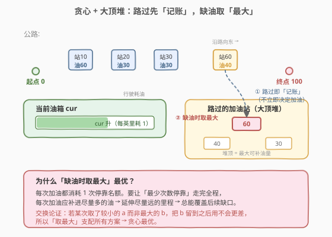
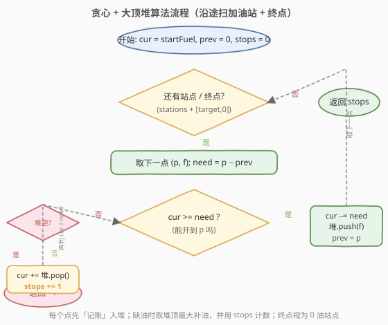
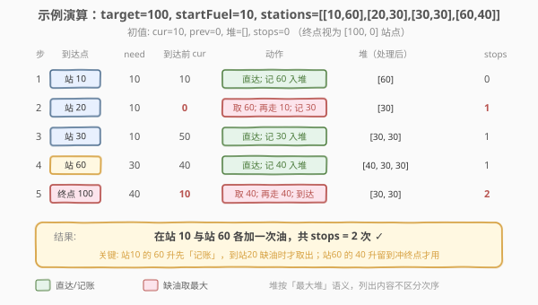

# 最低加油次数

- **题目名称**：最低加油次数
- **链接**：[871. 最低加油次数](https://leetcode.cn/problems/minimum-number-of-refueling-stops/)
- **难度**：困难
- **标签**：贪心、堆（优先队列）、动态规划

## 1. 题目概述

汽车从起点 `0` 出发驶向目的地，目的地位于出发位置东面 `target` 英里处。沿途有加油站，用数组 `stations` 表示，其中 `stations[i] = [position_i, fuel_i]` 表示第 `i` 个加油站位于出发位置东面 `position_i` 英里处，有 `fuel_i` 升汽油。

假设汽车油箱容量无限，最初有 `startFuel` 升燃料。每行驶 1 英里消耗 1 升汽油。到达加油站时可以停下来加油，将该加油站的所有汽油转移到车中。求到达目的地**必要的最低加油次数**；若无法到达则返回 `-1`。

> ⚠️ 到达加油站时剩余燃料为 `0` 仍可加油；到达目的地时剩余燃料为 `0` 仍视为到达。

**示例 1**：

```text
输入：target = 1, startFuel = 1, stations = []
输出：0
解释：不加油即可到达目的地。
```

**示例 2**：

```text
输入：target = 100, startFuel = 1, stations = [[10,100]]
输出：-1
解释：初始 1 升油，连第 1 个加油站（10 英里处）都到不了。
```

**示例 3**：

```text
输入：target = 100, startFuel = 10, stations = [[10,60],[20,30],[30,30],[60,40]]
输出：2
解释：到站 10（耗 10）取 60；到站 60（耗 50）取 40；冲到终点（耗 40）。共加油 2 次。
```

**约束条件**：

- $1 \le \text{target},\ \text{startFuel} \le 10^9$
- $0 \le \text{stations.length} \le 500$
- $1 \le \text{position}_i < \text{position}_{i+1} < \text{target}$
- $1 \le \text{fuel}_i \le 10^9$

---

## 2. 解题思路

### 2.1 暴力思路

对每个加油站枚举「加油 / 不加油」两种决策，搜索所有 $2^n$ 种方案，取能到达终点中加油次数最少的。$n=500$ 时 $2^{500}$ 完全不可行。

> 💡 难点在于：**加油决策有先后依赖**——在站 $A$ 加油会改变到站 $B$ 时的剩余油量，进而影响 $B$ 处是否还需要加油。但反过来看，决策的「代价」（加油次数）与具体在哪一站加的油无关，只与**加了多少油**有关。这一观察是贪心的入口。

### 2.2 核心观察：贪心 + 大顶堆（延迟决策）



把「是否在某一站加油」的决策**延迟**到真正缺油时再做。具体地：

- **路过加油站时先不决定**，只把它的油量 `fuel_i`「记账」放进一个**大顶堆**——表示「将来缺油时可以回溯性地在这里加油」。
- 当开不到下一个点（油箱 `cur < need`）时，从堆顶取出**最大油量**补进油箱，加油次数 `+1`；若堆已空还到不了，则无法到达，返回 `-1`。

**为什么「缺油时取最大」是最优的？** 用交换论证：

- 每次加油都消耗 `1` 次停靠名额。要让**最少次数**停靠走完全程，每次加油应补进**尽量多的油**，以延伸尽量远的里程、覆盖尽量多的后续缺口。
- 设某次缺油时本应取最大 $b$，却取了较小的 $a$（$a < b$）。那么 $b$ 必然留到更后面的某次缺油时才用。把这两次加油的顺序交换（先取 $b$ 后取 $a$），油量总和不变、停靠次数不变，但先取 $b$ 使中途油箱始终**不更少**——不会让原本可行的方案变不可行。故「取最大」支配所有方案，贪心最优。

> 💡 **本质**：这是「**反悔型贪心**」——先乐观地假设所有站都不加油地往前开，遇到过不去的坎再「反悔」补一次油，且每次反悔选收益最大的。与 [630. 课程表 III](https://leetcode.cn/problems/course-schedule-iii/) 的「先全选、超时再退换最大耗时」同源。

> ⚠️ **终点也当作一个「油量为 0 的站」**处理：把它放进待遍历序列，统一走「算距离、缺油则补、记账」的流程，无需特判到达。

### 2.3 算法流程图



```
cur = startFuel, prev = 0, stops = 0
points = stations + [[target, 0]]        # 终点视为 0 油站点
for (p, f) in points:
    need = p - prev                      # 到下一点需走的距离
    while cur < need:                    # 油不够 → 回溯补油
        if 堆空: return -1
        cur += 堆.pop_max()              # 取最大记账油量
        stops += 1
    cur -= need                          # 走完这段，扣油
    堆.push(f)                           # 路过此站：记账（不立即决定）
    prev = p
return stops
```

**循环不变量**：

- `prev` 是当前已抵达的位置；`cur` 是抵达 `prev` 后油箱剩余油量。
- 堆中保存**所有已路过但尚未取用**的加油站油量，堆顶为最大值。
- `while cur < need` 每次只补一次油（取堆顶），补完可能仍不够则继续取——这对应「在多个已路过站中回溯加油」。

### 2.4 示例演算



以示例 3 为例（初值 `cur=10, prev=0, 堆=[], stops=0`，终点视为 `[100,0]`）：

| 步 | 到达点 | need | 到达前 cur | 动作 | 堆（处理后） | stops |
|----|--------|------|-----------|------|-------------|-------|
| 1 | 站 10 | 10 | 10 | 直达；记 60 入堆 | `[60]` | 0 |
| 2 | 站 20 | 10 | 0 | 缺油→取 60；再走 10；记 30 入堆 | `[30]` | 1 |
| 3 | 站 30 | 10 | 50 | 直达；记 30 入堆 | `[30,30]` | 1 |
| 4 | 站 60 | 30 | 40 | 直达；记 40 入堆 | `[40,30,30]` | 1 |
| 5 | 终点 100 | 40 | 10 | 缺油→取 40；再走 40；到达 | `[30,30]` | 2 |

输出 `stops = 2` $\checkmark$。关键在第 2、5 步：**站 10 的 60 升先记账，到站 20 缺油才取**；**站 60 的 40 升留到冲终点才用**——这正是「延迟决策」省下的停靠次数（站 20、30 的 30 升从头到尾没被取）。

---

## 3. 参考代码

### C++

```cpp
class Solution {
  public:
    int minRefuelStops(int target, int startFuel,
                       vector<vector<int>>& stations) {
        priority_queue<int> pq;          // 大顶堆：已路过但未取用的加油站
        long cur = startFuel;            // 当前油量（用 long 防溢出）
        int prev = 0, stops = 0;

        // 终点视为油量 0 的站，统一处理
        for (auto& s : stations) {
            int p = s[0], f = s[1];
            long need = p - prev;
            while (cur < need) {         // 油不够：回溯补油
                if (pq.empty()) return -1;
                cur += pq.top(); pq.pop();
                ++stops;
            }
            cur -= need;                 // 走完这段
            pq.push(f);                  // 路过此站：记账
            prev = p;
        }
        // 处理终点
        long need = target - prev;
        while (cur < need) {
            if (pq.empty()) return -1;
            cur += pq.top(); pq.pop();
            ++stops;
        }
        return stops;
    }
};
```

### Python

```python
class Solution:
    def minRefuelStops(self, target: int, startFuel: int,
                       stations: List[List[int]]) -> int:
        import heapq
        pq = []                         # 大顶堆（Python 用负数模拟）
        cur = startFuel
        prev = 0
        stops = 0

        for p, f in stations + [[target, 0]]:   # 终点视为 0 油站点
            need = p - prev
            while cur < need:            # 油不够：回溯补油
                if not pq:
                    return -1
                cur += -heapq.heappop(pq)
                stops += 1
            cur -= need                  # 走完这段
            heapq.heappush(pq, -f)       # 路过此站：记账
            prev = p
        return stops
```

> ⚠️ **两个易错点**：
> 1. **溢出**：`startFuel`、`fuel_i`、`target` 均可达 $10^9$，累加后超过 32 位 `int` 上界。C++ 中 `cur` 必须用 `long`（或 `long long`）；Python 整数无上限无此问题。
> 2. **终点单独处理 vs 统一处理**：C++ 版在循环外再处理终点是为了不把终点的「0 油」push 进堆（虽不影响正确性，但语义更清晰）；Python 版用 `stations + [[target, 0]]` 把终点并入循环，写法更简洁。两者等价。

---

## 4. 复杂度分析

| 维度 | 复杂度 | 说明 |
|------|--------|------|
| 时间复杂度 | $O(n \log n)$ | 每个加油站至多入堆 1 次、出堆 1 次，各 $O(\log n)$；$n$ 为加油站数 |
| 空间复杂度 | $O(n)$ | 堆最多存放 $n$ 个加油站油量 |

> 💡 出堆总次数 $\le n$（每个站只被取一次），故 `while` 内的累加代价均摊后整体仍是 $O(n \log n)$，而非 $O(n^2)$。

---

## 5. 扩展：动态规划解法

本题也可用 DP 求解，思路是把「加油次数」作为状态维度。

**状态定义**：`dp[i]` 表示**恰好加油 `i` 次时，能到达的最远位置**。

**转移**：对每个加油站 `(p, f)`，倒序扫描 `i`：

$$
\text{if } \text{dp}[i] \ge p \quad\Rightarrow\quad \text{dp}[i+1] = \max(\text{dp}[i+1],\ \text{dp}[i] + f)
$$

含义：若用 `i` 次加油已能到站 `p`，则在此站再加一次（共 `i+1` 次）能到 `dp[i] + f`。倒序更新避免本站被重复取用（0-1 背包式滚动）。

**答案**：最小的 `i` 使 `dp[i] >= target`。

```cpp
class Solution {
  public:
    int minRefuelStops(int target, int startFuel,
                       vector<vector<int>>& stations) {
        int n = stations.size();
        vector<long> dp(n + 1, 0);
        dp[0] = startFuel;                  // 0 次加油：最远到 startFuel
        for (auto& s : stations) {
            int p = s[0], f = s[1];
            for (int i = n; i >= 1; --i) {  // 倒序：0-1 背包
                if (dp[i - 1] >= p)
                    dp[i] = max(dp[i], dp[i - 1] + f);
            }
        }
        for (int i = 0; i <= n; ++i)
            if (dp[i] >= target) return i;
        return -1;
    }
};
```

| 维度 | 复杂度 | 说明 |
|------|--------|------|
| 时间复杂度 | $O(n^2)$ | 双层循环：$n$ 个站 $\times$ $n+1$ 个状态 |
| 空间复杂度 | $O(n)$ | 一维滚动 `dp` 数组 |

> 💡 **两种解法对比**：DP 把「次数」当维度做背包，思路直白但 $O(n^2)$；贪心 + 堆用「反悔」思想把决策延迟，做到 $O(n \log n)$。$n \le 500$ 时两者都能过，但贪心法可扩展到 $n \sim 10^5$。面试中**推荐讲贪心 + 堆**，并顺带提 DP 作为对照，体现对同一问题的多角度理解。

---

## 6. 面试要点

1. **为什么「缺油时取堆顶最大」是最优的？**

   - 交换论证。每次加油消耗 1 次停靠名额，要让次数最少，每次应补尽量多的油以延伸尽量远的里程。若某次取了较小的 $a$ 而非最大的 $b$，把 $b$ 留到后续用，交换两次顺序后总油量与次数不变、但中途油箱始终不更少——不会让可行解变不可行。故「取最大」支配所有方案。

2. **为什么可以「延迟决策」（路过先记账）？**

   - 加油的**代价**（次数）与具体在哪一站加无关，只与加了多少油有关。路过的站，其油量「迟早可取」，先记账不丢信息；等真正缺油时再决定取哪个，恰好把名额分配给收益最大的站。这与「先全选再反悔」的反悔贪心同构。

3. **终点为什么要当成 `[target, 0]` 的站？**

   - 统一走「算距离 need、缺油则补、记账」流程，避免对「到达终点」单独写一段判定。终点油量为 0，push 进堆也无害（永远不是最大、不会被取），但让代码结构更对称。

4. **`cur` 为什么必须用 `long`？**

   - `startFuel`、各 `fuel_i`、`target` 均可达 $10^9$，全加油后 `cur` 可达 $n \times 10^9 \approx 5 \times 10^{11}$，远超 32 位 `int`（约 $2.1 \times 10^9$）。用 `long`（64 位）累加即可。

5. **DP 解法为什么要倒序更新 `dp`？**

   - 0-1 背包惯例：每个站只能被取一次。正序更新会导致 `dp[i+1]` 刚被本站更新，又被用作 `dp[i+1+1]` 的来源，相当于本站被重复取用。倒序保证更新 `dp[i]` 时读到的 `dp[i-1]` 仍是上一站的状态。

---

## 7. 同类练习题

- [630. 课程表 III](https://leetcode.cn/problems/course-schedule-iii/)：反悔型贪心典范——先按截止时间排序全选，超时则退换最大耗时课程，与本题「先记账、缺油取最大」同构
- [502. IPO](https://leetcode.cn/problems/ipo/)（[题解](../0501-0600/502_IPO.md)）：排序解锁 + 大顶堆取最大利润，同为「贪心 + 堆」调度模式
- [1642. 可以到达的最远建筑](https://leetcode.cn/problems/furthest-building-you-can-reach/)：反悔贪心——先爬梯，不够时退换最高墙用砖块，与本题延迟决策完全同构
- [LCP 30. 魔塔游戏](https://leetcode.cn/problems/p0NxJO/)：沿途调整负数时机使血量不破 0，反悔贪心 + 大顶堆，结构同本题
- [322. 零钱兑换](https://leetcode.cn/problems/coin-change/)（[题解](../0301-0400/322_零钱兑换.md)）：DP 对照——本题第 5 节的背包思路与其同源，可对比「贪心 vs DP」的适用边界
