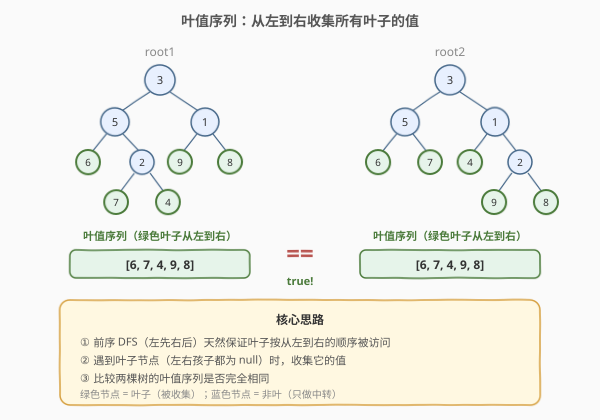
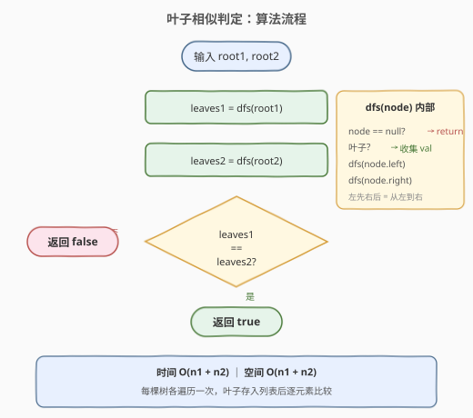
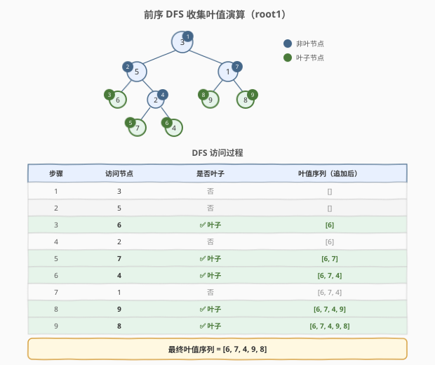

# LeetCode 叶子相似的树 题解

## 1. 题目概述

- **标题 / 题号**：叶子相似的树（#872，easy）
- **链接**：https://leetcode.cn/problems/leaf-similar-trees/
- **难度**：简单
- **标签**：树、二叉树、DFS、深度优先搜索

**题意**：给定两棵二叉树的根节点 `root1` 和 `root2`。把一棵二叉树上所有的**叶子节点**，按**从左到右**的顺序排列，它们的值就构成一个**叶值序列**。如果两棵树的叶值序列相同，则称这两棵树「叶子相似」，返回 `true`；否则返回 `false`。

> **叶子节点**：既没有左孩子也没有右孩子的节点。

**示例 1**：

```text
输入：root1 = [3,5,1,6,2,9,8,null,null,7,4], root2 = [3,5,1,6,7,4,2,null,null,null,null,null,null,9,8]
输出：true
解释：两棵树的叶值序列都是 [6, 7, 4, 9, 8]。
```

**示例 2**：

```text
输入：root1 = [1,2,3], root2 = [1,3,2]
输出：false
解释：root1 的叶值序列为 [2, 3]，root2 的叶值序列为 [3, 2]，顺序不同。
```

**约束**：

- 每棵树的节点数目范围 `[1, 200]`
- 节点值范围 `[0, 200]`

## 2. 解题思路

### 2.1 暴力思路：逐叶比较

最直觉的做法是：对两棵树分别做一次 DFS，**从左到右**收集所有叶子节点的值到两个列表，最后逐元素比较两个列表是否完全一致。

这个思路本身已经是 $O(n)$，没有更好的渐近复杂度了。真正的优化空间在于**空间**：能否不存储完整列表，而是边遍历边比较？这在第 5 节扩展中讨论。

### 2.2 核心观察：DFS 左先右后 → 天然从左到右



关键观察是：**先序遍历（根 → 左 → 右）天然地按从左到右的顺序访问叶子节点**。只要在遍历过程中判断「当前节点是否为叶子」——即左右孩子都为 `null`——就能按序收集叶值。

> 💡 **为什么先序能保证从左到右？** 先序遍历总是先深入左子树再转向右子树。对于任意两个叶子 $a$、$b$，若 $a$ 在 $b$ 的左侧（即 $a$ 和 $b$ 的最近公共祖先处，$a$ 在左子树、$b$ 在右子树），则先序一定先访问 $a$。因此先序输出的叶子序列就是**从左到右**的。

> ⚠️ 其实任意遍历序（前序/中序/后序）只要**左子树先于右子树**递归，都能保证叶子从左到右出现。这里用前序最直观。

### 2.3 算法流程图



### 2.4 示例演算

以示例 1 为例，`root1 = [3,5,1,6,2,9,8,null,null,7,4]`，树结构如下：

```text
          3
        /   \
       5     1
      / \   / \
     6   2 9   8
        / \
       7   4
```



前序 DFS 收集叶值的过程：

| 步骤 | 访问节点 | 是否叶子 | 叶值序列（追加后） |
|------|----------|----------|---------------------|
| 1 | 3 | 否（有左右孩子） | `[]` |
| 2 | 5 | 否 | `[]` |
| 3 | 6 | ✅ 叶子 | `[6]` |
| 4 | 2 | 否 | `[6]` |
| 5 | 7 | ✅ 叶子 | `[6, 7]` |
| 6 | 4 | ✅ 叶子 | `[6, 7, 4]` |
| 7 | 1 | 否 | `[6, 7, 4]` |
| 8 | 9 | ✅ 叶子 | `[6, 7, 4, 9]` |
| 9 | 8 | ✅ 叶子 | `[6, 7, 4, 9, 8]` |

对 `root2` 同理收集，得到叶值序列 `[6, 7, 4, 9, 8]`。两序列相同，返回 `true`。

## 3. 参考代码

### C++

```cpp
class Solution {
  public:
    bool leafSimilar(TreeNode* root1, TreeNode* root2) {
        vector<int> leaves1, leaves2;
        dfs(root1, leaves1);
        dfs(root2, leaves2);
        return leaves1 == leaves2;
    }

  private:
    void dfs(TreeNode* node, vector<int>& leaves) {
        if (node == nullptr) return;
        if (node->left == nullptr && node->right == nullptr) {
            leaves.push_back(node->val);
            return;
        }
        dfs(node->left, leaves);
        dfs(node->right, leaves);
    }
};
```

### Python

```python
class Solution:
    def leafSimilar(self, root1: Optional[TreeNode], root2: Optional[TreeNode]) -> bool:
        def dfs(node: Optional[TreeNode]) -> list[int]:
            if node is None:
                return []
            if node.left is None and node.right is None:
                return [node.val]
            return dfs(node.left) + dfs(node.right)

        return dfs(root1) == dfs(root2)
```

> 💡 Python 版利用列表拼接 `+` 写得非常简洁，但每次 `+` 都创建新列表，总开销 $O(n^2)$。节点数 $\leq 200$ 时无妨；若追求最优，改用 `yield` 生成器（见第 5 节）或传入可变列表 `append`。

## 4. 复杂度分析

| 维度 | 复杂度 | 说明 |
|------|--------|------|
| 时间复杂度 | $O(n_1 + n_2)$ | 分别遍历两棵树，每节点访问一次 |
| 空间复杂度 | $O(n_1 + n_2)$ | 存储两棵树的叶值序列；最坏退化成链时叶子数 $O(n)$ |

> 其中 $n_1$、$n_2$ 分别为两棵树的节点数。递归栈深度为树高 $h$，最坏 $O(n)$，已含在空间复杂度中。

## 5. 扩展：生成器逐叶比较（O(h) 空间）

存储完整叶值序列需要 $O(n)$ 额外空间。利用 Python **生成器**（或 C++ 迭代器），可以**逐个产出叶子**并即时比较，提前终止——空间仅需 $O(h_1 + h_2)$ 的递归栈：

```python
class Solution:
    def leafSimilar(self, root1: Optional[TreeNode], root2: Optional[TreeNode]) -> bool:
        def leaf_gen(node):
            if node:
                if not node.left and not node.right:
                    yield node.val
                yield from leaf_gen(node.left)
                yield from leaf_gen(node.right)

        return all(a == b for a, b in zip_longest(leaf_gen(root1), leaf_gen(root2), fillvalue=object()))
```

> 💡 `zip_longest` + 哨兵 `object()` 处理两棵树叶数不等的情况：若一棵树先耗尽，另一棵仍有叶子，哨兵对象比较不相等，`all` 返回 `False`。这一写法既省空间又能在首个不匹配处短路。

## 6. 面试要点

1. **为什么前序遍历能保证叶子从左到右？**
   - 前序遍历先递归左子树再递归右子树。对于任意两个叶子，若一个在另一个的左侧（公共祖先处分属左/右子树），左侧的叶子一定先被访问。因此前序输出的叶子序列天然有序。

2. **叶子节点如何判定？**
   - `node.left == nullptr && node.right == nullptr`。注意：值是否为 0 不影响叶子判定，只看结构。

3. **两棵树叶数不同时如何处理？**
   - 若 `leaves1.size() != leaves2.size()`，直接 `vector` 比较会返回 `false`。生成器方案中用 `zip_longest` + 哨兵对象处理：先耗尽的一方用哨兵填充，哨兵与任何整数都不相等，自然返回 `false`。

4. **能否用迭代代替递归？**
   - 可以，用栈模拟前序遍历：弹出节点，若是叶子则收集；否则先压右孩子再压左孩子（保证左先出栈）。逻辑等价，避免递归栈溢出。

5. **这题和「相同树」（100）的区别？**
   - 100 比较的是**整棵树结构 + 所有节点值**，必须完全一致；872 只比较**叶子序列**，内部结构和非叶节点值都可以不同。872 是一种「弱相等」——只关心叶子的值序列。

## 同类练习题

| # | 题目 | 与本题的关联 |
|---|------|-------------|
| 100 | [相同的树](https://leetcode.cn/problems/same-tree/) | 比较两棵树是否结构和值完全一致，872 的「强相等」版本，同样 DFS 递归骨架 |
| 144 | [二叉树的前序遍历](https://leetcode.cn/problems/binary-tree-preorder-traversal/) | 前序遍历模板题，872 收集叶值的前序 DFS 即基于此 |
| 257 | [二叉树的所有路径](https://leetcode.cn/problems/binary-tree-paths/) | DFS 到叶子节点时记录路径，与 872 的「到叶子时收集」思路一脉相承 |
| 404 | [左叶子之和](https://leetcode.cn/problems/sum-of-left-leaves/) | 同样遍历树找叶子，但加了「左孩子」的判定条件，是 872 的条件变体 |
| 1302 | [层数最深叶子节点之和](https://leetcode.cn/problems/deepest-leaves-sum/) | BFS/DFS 找特定层叶子，从「所有叶子」收敛到「最深层叶子」 |
