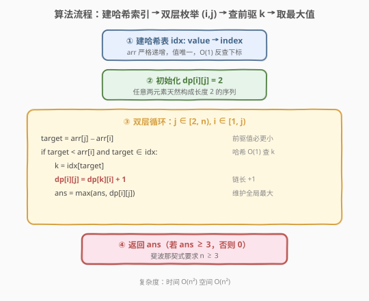

# 最长的斐波那契子序列的长度

- **题目名称**：最长的斐波那契子序列的长度
- **链接**：[873. 最长的斐波那契子序列的长度](https://leetcode.cn/problems/length-of-longest-fibonacci-subsequence/)
- **难度**：中等
- **标签**：数组、动态规划、哈希表

## 1. 题目概述

给定一个**严格递增**的正整数数组 `arr`，找到其中**最长的斐波那契式子序列**的长度。若不存在，返回 `0`。

**斐波那契式**序列的规则：

1. $n \ge 3$（至少三个数）；
2. 对所有 $i + 2 \le n$，都有 $x_i + x_{i+1} = x_{i+2}$（每个数等于前两数之和）。

**子序列**是通过从 `arr` 中删除任意数量元素（包括 0 个）得到，不改变剩余元素顺序。

**示例 1**：

```text
输入：arr = [1,2,3,4,5,6,7,8]
输出：5
解释：最长的斐波那契式子序列为 [1,2,3,5,8]。
```

**示例 2**：

```text
输入：arr = [1,3,7,11,12,14,18]
输出：3
解释：最长的斐波那契式子序列有 [1,11,12]、[3,11,14] 以及 [7,11,18]。
```

**约束条件**：

- $3 \le \text{arr.length} \le 1000$
- $1 \le \text{arr}[i] < \text{arr}[i + 1] \le 10^9$

> 💡 关键约束：**严格递增** → 元素值唯一、下标与值单调对应，可用哈希表 $O(1)$ 反查「前驱值」的下标。这是把 $O(n^3)$ 暴力压缩到 $O(n^2)$ DP 的核心杠杆。

---

## 2. 解题思路

### 2.1 暴力思路：枚举前两个数 + 模拟延伸

最朴素的想法是枚举所有数对 $(i, j)$ 作为斐波那契式序列的前两个数，然后模拟递推 $z = x + y$，借助哈希集合检查 $z$ 是否在 `arr` 中，不断延伸直到断裂。

由于斐波那契数列**指数增长**（$\approx \varphi^n$，$\varphi \approx 1.618$），值域上界 $10^9$ 决定了每条链最多延伸约 $\log_\varphi(10^9) \approx 44$ 步。因此单组验证 $O(\log M)$，总复杂度 $O(n^2 \log M)$。$n = 1000$ 时约 $4.4 \times 10^7$，勉强通过但偏紧。

> 💡 这种「枚举前两数 + 贪心延伸」的骨架与 [842. 将数组拆分成斐波那契序列](../0801-0900/842_将数组拆分成斐波那契序列.md) 完全一致——842 在字符串上操作、需返回具体序列，本题在数组上操作、只需返回长度。

### 2.2 核心观察：二维 DP + 哈希反查前驱

![核心观察：arr[k] + arr[i] = arr[j] 时 dp[i][j] = dp[k][i] + 1](../images/lofs_dp_concept.svg)

暴力思路的问题在于：对每对 $(i, j)$ 都从头模拟整条链，存在大量**重复计算**——同一对 $(i, j)$ 作为某条链的中间段会被反复验证。这正是 DP 的重叠子问题信号。

**状态定义**：

> $\text{dp}[i][j]$ = 以 $\text{arr}[i], \text{arr}[j]$（$i < j$）为**最后两个元素**的最长斐波那契式子序列的长度。

**转移**：要 extend 到 $\text{arr}[j]$，需找到前驱 $k < i$ 使得 $\text{arr}[k] + \text{arr}[i] = \text{arr}[j]$，即 $\text{arr}[k] = \text{arr}[j] - \text{arr}[i]$。

- **存在合法 $k$**：$\text{dp}[i][j] = \text{dp}[k][i] + 1$（在 $(k, i)$ 链尾接上 $\text{arr}[j]$）；
- **不存在**：$\text{dp}[i][j] = 2$（仅两元素，未成斐波那契式）。

$$
\text{dp}[i][j] = \begin{cases} \text{dp}[k][i] + 1 & \text{若 } k = \text{idx}[\text{arr}[j] - \text{arr}[i]] \text{ 存在且 } k < i \\ 2 & \text{否则} \end{cases}
$$

> 💡 **为何 $O(1)$ 找 $k$？** `arr` 严格递增、值唯一，建哈希表 `idx[value] → index` 后，$\text{target} = \text{arr}[j] - \text{arr}[i]$ 直接查表。又因 $\text{arr}[k] < \text{arr}[i] < \text{arr}[j]$（严格递增），只要 $\text{target} < \text{arr}[i]$ 且在表中，其下标必然 $< i$，无需额外校验。

**为何顺序天然正确**：转移依赖 $\text{dp}[k][i]$（$k < i < j$），按 $j$ 从小到大、$i$ 从小到大遍历时，$(k, i)$ 总比 $(i, j)$ 先算完，无后效性。

### 2.3 算法流程图



**完整步骤**：

1. **建哈希索引**：`idx = {arr[v]: v}`，$O(n)$ 一次遍历，支持 $O(1)$ 值→下标反查。
2. **初始化**：`dp` 为 $n \times n$ 矩阵，全部填 $2$（任意两元素天然构成长度 2 的序列）。`ans = 0`。
3. **双层循环**（$j \in [2, n)$，$i \in [1, j)$）：
   - 计算 $\text{target} = \text{arr}[j] - \text{arr}[i]$；
   - 若 $\text{target} < \text{arr}[i]$ 且 $\text{target} \in \text{idx}$：$k = \text{idx}[\text{target}]$，$\text{dp}[i][j] = \text{dp}[k][i] + 1$，更新 $\text{ans} = \max(\text{ans}, \text{dp}[i][j])$。
4. **返回**：`ans`（若 `ans >= 3` 即为答案；若全程未命中任何三元组，`ans` 仍为 $0$，自然满足「不存在返回 0」）。

> ⚠️ **为何 $j$ 从 2 开始、$i$ 从 1 开始？** 斐波那契式要求 $n \ge 3$，至少需要前驱 $k$、当前 $i$、结尾 $j$ 三个下标。$j \ge 2$ 保证 $j$ 前至少有两个元素；$i \ge 1$ 保证 $i$ 前至少有一个元素 $k$。$j < 2$ 或 $i < 1$ 时 $\text{dp}$ 恒为 $2$，不可能贡献 $\ge 3$ 的答案，跳过以省迭代。

### 2.4 示例演算

以 `arr = [1,2,3,4,5,6,7,8]` 为例，最长斐波那契式子序列为 $[1,2,3,5,8]$（长度 5）。

![示例演算：arr = [1,2,3,4,5,6,7,8]，链 [1,2,3,5,8]，答案 = 5](../images/lofs_example_walkthrough.svg)

**沿链逐步追踪**：

| 状态 $(i,j)$ | target = arr[j]−arr[i] | $k$ = idx[target] | dp[i][j] | 转移来源 |
|--------|------|------|---------|---------|
| (0, 1) | —（$i=0$ 无前驱） | — | 2 | 基值 |
| (1, 2) | 3 − 2 = 1 | 0 | 3 | dp[0][1] + 1 |
| (2, 4) | 5 − 3 = 2 | 1 | 4 | dp[1][2] + 1 |
| (4, 7) | 8 − 5 = 3 | 2 | 5 | dp[2][4] + 1 |

- $\text{dp}[0][1] = 2$：$\text{arr}[0]=1, \text{arr}[1]=2$，$i=0$ 无前驱，基值 $2$。
- $\text{dp}[1][2] = \text{dp}[0][1] + 1 = 3$：$\text{target} = 3 - 2 = 1 = \text{arr}[0]$，$k=0$，链 $[1,2,3]$。
- $\text{dp}[2][4] = \text{dp}[1][2] + 1 = 4$：$\text{target} = 5 - 3 = 2 = \text{arr}[1]$，$k=1$，链 $[1,2,3,5]$。
- $\text{dp}[4][7] = \text{dp}[2][4] + 1 = 5$：$\text{target} = 8 - 5 = 3 = \text{arr}[2]$，$k=2$，链 $[1,2,3,5,8]$。

**反例**（`arr = [1,3,7,11,12,14,18]`）：$1+11=12$、$3+11=14$、$7+11=18$ 三条链均只有 3 项，无法继续延伸（$11+12=23 \notin \text{arr}$、$11+14=25 \notin \text{arr}$ 等），故答案为 $3$。

---

## 3. 参考代码

### C++

```cpp
class Solution {
public:
    int lenLongestFibSubseq(vector<int>& arr) {
        int n = arr.size();
        unordered_map<int, int> idx;
        for (int i = 0; i < n; ++i) idx[arr[i]] = i;

        vector<vector<int>> dp(n, vector<int>(n, 2));
        int ans = 0;
        for (int j = 2; j < n; ++j) {
            for (int i = 1; i < j; ++i) {
                int target = arr[j] - arr[i];
                if (target < arr[i] && idx.count(target)) {
                    int k = idx[target];
                    dp[i][j] = dp[k][i] + 1;
                    ans = max(ans, dp[i][j]);
                }
            }
        }
        return ans;
    }
};
```

### Python

```python
class Solution:
    def lenLongestFibSubseq(self, arr: List[int]) -> int:
        n = len(arr)
        idx = {v: i for i, v in enumerate(arr)}

        dp = [[2] * n for _ in range(n)]
        ans = 0
        for j in range(2, n):
            for i in range(1, j):
                target = arr[j] - arr[i]
                if target < arr[i] and target in idx:
                    k = idx[target]
                    dp[i][j] = dp[k][i] + 1
                    ans = max(ans, dp[i][j])
        return ans
```

> 💡 **`target < arr[i]` 剪枝**：`arr` 严格递增，若 $\text{target} \ge \text{arr}[i]$ 则其下标 $\ge i$，不可能是合法前驱 $k < i$，直接跳过哈希查询。这不仅省一次查表，更避免了 `idx[target]` 命中但下标 $\ge i$ 的误判。

---

## 4. 复杂度分析

| 维度 | 复杂度 | 说明 |
|------|--------|------|
| **时间复杂度** | $O(n^2)$ | 双层循环 $O(n^2)$ 对 $(i, j)$，每次 $O(1)$ 哈希查表与转移；建索引 $O(n)$ |
| **空间复杂度** | $O(n^2)$ | $n \times n$ 的 `dp` 矩阵；哈希表 `idx` 占 $O(n)$ |

$n \le 1000$，最坏约 $5 \times 10^5$ 次内层迭代，轻松通过。

> 💡 对比暴力的 $O(n^2 \log M)$：DP 把「每对从头模拟整条链」改为「每对只查一步前驱」，利用重叠子问题把 $\log M$ 因子消掉，稳定在 $O(n^2)$。

---

## 5. 扩展：用哈希表存状态对优化空间

`dp` 矩阵占 $O(n^2)$ 空间，$n = 1000$ 时约 $4\text{MB}$（`int`），可接受。若 $n$ 更大或需省空间，可用 `unordered_map<long, int>` 以**编码键** $k \cdot n + j$ 存非零状态，只记录 $\text{dp} > 2$ 的对：

```cpp
unordered_map<long, int> dp;
int ans = 0;
for (int j = 2; j < n; ++j) {
    for (int i = 1; i < j; ++i) {
        int target = arr[j] - arr[i];
        if (target < arr[i] && idx.count(target)) {
            int k = idx[target];
            long key = (long)k * n + i;
            int len = dp.count(key) ? dp[key] : 2;
            dp[(long)i * n + j] = len + 1;
            ans = max(ans, len + 1);
        }
    }
}
```

实际命中 $\text{dp} > 2$ 的对远少于 $n^2$（斐波那契链稀疏），哈希表空间接近 $O(\text{有效转移数})$。但哈希常数大，$n \le 1000$ 时矩阵版更快，仅在大 $n$ 或内存受限时占优。

---

## 6. 面试要点

1. **为什么用「最后两个下标」$(i, j)$ 作为状态而非单个下标？**

   > 斐波那契递推 $x_k = x_{k-1} + x_{k-2}$ 是**二阶**的——下一个数依赖前两个数。只记一个下标无法确定递推方向（前驱是谁）。用 $(i, j)$ 编码「最后两个元素」完整携带了递推所需的上下文，$\text{arr}[j] - \text{arr}[i]$ 唯一确定前驱值 $\text{arr}[k]$。这与 [300. 最长递增子序列](../0201-0300/300_最长递增子序列.md) 的一阶 DP（`dp[i]` 只记末尾）形成对比。

2. **`target < arr[i]` 这个剪枝为什么必要？**

   > 哈希表 `idx` 存的是 `arr` 中所有值。若 $\text{target} \ge \text{arr}[i]$，即便在表中其下标也 $\ge i$（严格递增保证），不满足 $k < i$。不加此判断会误把下标 $\ge i$ 的值当前驱，导致 $\text{dp}[k][i]$ 读到未初始化或错误的值。剪枝同时省去一次无效查表。

3. **DP 和暴力枚举前两数的关系？**

   > 暴力对每对 $(i, j)$ 从头模拟整条链 $O(\log M)$；DP 把每对只查一步前驱 $O(1)$，利用 $\text{dp}[k][i]$ 已算好避免重复。二者枚举的都是 $O(n^2)$ 对，差异在每对的处理成本：$\log M$ vs $1$。DP 本质是把「沿链累积」改成「状态复用」。

4. **为什么不需要去重？**

   > 斐波那契式序列由最后两个数唯一确定。对固定的 $(i, j)$，前驱 $k = \text{idx}[\text{arr}[j] - \text{arr}[i]]$ 是唯一的（值唯一→下标唯一），不存在多条链合并到同一 $(i, j)$ 的情况。对比 [413. 等差数列划分](../0401-0500/413_等差数列划分.md) 公差可正可负需考虑方向，本题加法递推方向固定，天然无歧义。

5. **返回值何时为 0？**

   > 若 `arr` 中没有任何三元组满足 $\text{arr}[k] + \text{arr}[i] = \text{arr}[j]$，则所有 $\text{dp}[i][j]$ 保持初始值 $2$，`ans` 始终为 $0$，直接返回。无需特判——$2 < 3$ 不更新 `ans`，自然过滤掉不足三项的情况。

> 💡 **一句话总结**：本题是「二阶递推序列的最长子序列」模板——用 $(i, j)$ 编码最后两个下标，哈希表 $O(1)$ 反查前驱 $k$，$\text{dp}[i][j] = \text{dp}[k][i] + 1$。严格递增是关键前提，它保证值唯一、下标有序，使哈希反查既正确又高效。

---

## 7. 同类练习题

- [842. 将数组拆分成斐波那契序列](https://leetcode.cn/problems/split-array-into-fibonacci-sequence/)（[题解](../0801-0900/842_将数组拆分成斐波那契序列.md)）：斐波那契构造版，字符串切分 + 贪心验证，对比「返回具体序列」与「只求长度」的目标差异
- [300. 最长递增子序列](https://leetcode.cn/problems/longest-increasing-subsequence/)（[题解](../0201-0300/300_最长递增子序列.md)）：一阶 DP 母题，对比「单下标状态」与「双下标状态」的维度设计差异
- [413. 等差数列划分](https://leetcode.cn/problems/arithmetic-slices/)（[题解](../0401-0500/413_等差数列划分.md)）：等差数列计数 DP，同为二阶递推（公差固定），对比「求计数」与「求最长」的目标差异
- [1027. 最长等差数列](https://leetcode.cn/problems/longest-arithmetic-subsequence/)：等差数列最长子序列，与本题结构高度对应——公差替代加法递推，`dp[i][j]` 同样以双下标编码
