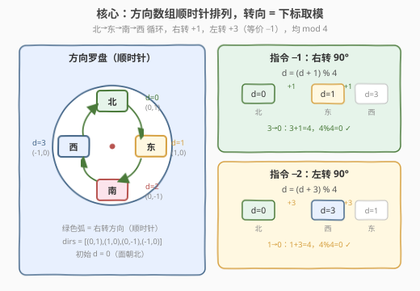
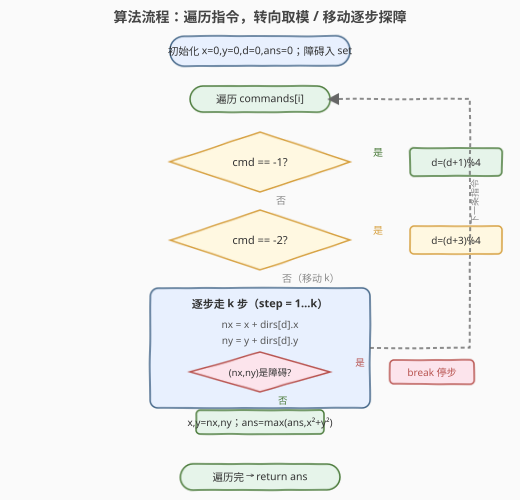
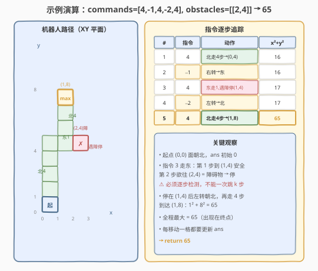

# 模拟行走机器人

- **题目名称**：模拟行走机器人
- **链接**：[874. 模拟行走机器人](https://leetcode.cn/problems/walking-robot-simulation/)
- **难度**：中等
- **标签**：模拟、数组、哈希表

## 1. 题目概述

机器人在无限大的 XY 平面上，从原点 `(0, 0)` 出发并**面朝北方**。它接收一个指令序列 `commands`，每条指令是以下之一：

- `-2`：向**左转** 90 度（原地转向，不移动）；
- `-1`：向**右转** 90 度（原地转向，不移动）；
- `1 <= k <= 9`：朝当前方向**向前走 k 步**，每步走 1 个单位长度。

平面上还散布着若干**障碍物** `obstacles`，每个障碍物是一个坐标 `[xi, yi]`。机器人在移动时**逐格前进**：若下一步要踩到的格子恰好是障碍物，则**停在该格之前**，本条移动指令剩余的步数全部作废（转向指令不受障碍影响）。

要求返回机器人行走过程中，距离原点的**最大欧几里得距离平方** $x^2 + y^2$。

**示例 1**：

```text
输入：commands = [4,-1,3], obstacles = []
输出：25
解释：
  (0,0) 面朝北 → 走 4 步到 (0,4)
  -1 右转 90° → 面朝东
  走 3 步到 (3,4)
  最大距离平方 = 3² + 4² = 25
```

**示例 2**：

```text
输入：commands = [4,-1,4,-2,4], obstacles = [[2,4]]
输出：65
解释：
  (0,0) 面朝北 → 走 4 步到 (0,4)
  -1 右转 → 面朝东
  走 4 步：第 1 步到 (1,4)，第 2 步欲往 (2,4) 是障碍物 → 停在 (1,4)
  -2 左转 → 面朝北
  走 4 步到 (1,8)
  最大距离平方 = 1² + 8² = 65
```

**约束条件**：

- $1 \le \text{commands.length} \le 10^4$
- `commands[i]` 取值为 `-2`、`-1` 或 `1 <= commands[i] <= 9`
- $0 \le \text{obstacles.length} \le 10^4$
- `obstacles[i].length == 2`
- $-3 \times 10^4 \le x_i, y_i \le 3 \times 10^4$
- 答案保证 $< 2^{31}$

> 💡 本题是纯粹的**状态模拟**题：维护「位置 + 朝向」两个状态，按指令逐步推进。难点不在算法设计，而在于**两个工程细节**——① 如何用 O(1) 的取模运算统一处理左/右转向；② 如何在逐格移动中高效检测障碍物（哈希集合）。把这两个细节处理干净，代码就自然清爽。

---

## 2. 解题思路

### 2.1 暴力思路：方向用 if-else 硬编码

最朴素的写法是把「朝向」直接当枚举，转向时用一串 `if` 判断：

```text
if 朝北 and 右转: 朝东
else if 朝东 and 右转: 朝南
else if 朝南 and 右转: 朝西
else if 朝西 and 右转: 朝北
... 左转同理再写 4 个分支
```

移动时再按当前朝向写 4 套 `x++ / y++ / x-- / y--`。这样能 AC，但**分支爆炸**——8 个转向分支 + 4 套移动逻辑，既冗长又易写错（左转东→北 vs 右转东→南极易混淆）。

> ⚠️ 暴力法的痛点是「方向之间的循环关系被埋在一堆 if 里」。破局思路：**把四个方向排成一个顺时针环**，转向就是环上的下标移动，用取模统一表达——任何转向都变成一行 `d = (d + delta) % 4`。

### 2.2 核心观察：方向数组 + 取模转向 + 障碍哈希集



**关键设计 1：方向数组（顺时针排列）**

把四个基本方向按**顺时针**顺序排成一个数组，每个方向存一个位移向量 $(dx, dy)$：

| 下标 `d` | 方向 | 位移 `(dx, dy)` |
|----------|------|-----------------|
| 0 | 北 | `(0, 1)` |
| 1 | 东 | `(1, 0)` |
| 2 | 南 | `(0, -1)` |
| 3 | 西 | `(-1, 0)` |

初始 `d = 0`（面朝北）。于是：

- **右转 90°**（指令 `-1`）：顺时针走一格 → `d = (d + 1) % 4`
- **左转 90°**（指令 `-2`）：逆时针走一格，等价于顺时针走三格 → `d = (d + 3) % 4`

> 💡 **为什么左转写 `+3` 而不是 `-1`？** 因为 `-1 % 4` 在某些语言（如 C++/Java）中会得到 `-1` 而非 `3`，需要额外 `+4` 修正。直接写 `(d + 3) % 4` 永远落在 `[0,4)`，**跨语言无歧义**，是竞赛/面试最稳的写法。

移动时，下一步坐标就是 `(x + dirs[d].x, y + dirs[d].y)`——**一套代码适用于四个方向**，不再有 4 套分支。

**关键设计 2：障碍物存入哈希集合**

障碍物查询是高频操作：移动 `k` 步要查 `k` 次（最坏每步都查）。若用数组线性查找，单次 $O(O)$（$O$ = 障碍数），总开销可达 $O(K \cdot O)$，不可接受。

把每个障碍物坐标编码成**一个可哈希的键**（C++ 用 `pair<int,int>` 或 `long long`，Python 用 `tuple`），存入集合，查询降为 $O(1)$：

- C++：`unordered_set<long long>`，键 = `((long long)x << 16) | (y & 0xFFFF)`，或直接 `set<pair<int,int>>`；
- Python：`set()`，元素为 `(x, y)` 元组。

> ⚠️ **障碍物编码易错点**：用 `x * 60001 + y` 这类线性编码时，要保证编码**唯一**——`y` 的范围 $[-3\times10^4, 3\times10^4]$ 跨度 $60001$，所以乘子必须 $\ge 60001$（取 $60001$ 刚好覆盖一个完整 $y$ 周期，互不重叠）。更直观的做法是直接用 `pair`/`tuple`，让语言自己处理哈希。

**关键设计 3：逐格移动 + 实时更新答案**

移动指令 `k` 不能一次性 `x += k * dx`——因为**中途可能撞障碍**，必须停在前一格。所以走一个 `for step in 1..k` 的循环，每步：

1. 试探下一步 `(nx, ny) = (x + dx, y + dy)`；
2. 若 `(nx, ny)` 在障碍集合中 → `break`（停下，剩余步数作废）；
3. 否则更新 `(x, y) = (nx, ny)`，并 `ans = max(ans, x*x + y*y)`。

> 💡 **为什么每步都要更新 `ans` 而非只在每条指令结束更新？** 题目问的是「过程中的最大值」。理论上同一条移动指令内，机器人单调远离（或靠近）原点，所以指令结束位置通常是该段极值——但每步更新更稳妥、无脑正确，且 $k \le 9$ 步数极小，开销可忽略。

### 2.3 算法流程图



**完整步骤**：

1. **初始化**：`x = 0, y = 0, d = 0, ans = 0`；把 `obstacles` 全部存入哈希集合 `obs`。
2. **遍历** `commands` 中每条 `cmd`：
   - **`cmd == -1`**：`d = (d + 1) % 4`（右转）。
   - **`cmd == -2`**：`d = (d + 3) % 4`（左转）。
   - **`cmd >= 1`（移动）**：循环 `step = 1..cmd`：
     - `nx = x + dirs[d].x`，`ny = y + dirs[d].y`；
     - 若 `(nx, ny) ∈ obs`：`break`（撞障碍，停下）；
     - 否则 `x = nx`，`y = ny`，`ans = max(ans, x*x + y*y)`。
3. **返回** `ans`。

> ⚠️ **三个易错点**：(1) 移动必须**逐格**走，不能 `x += k*dx` 一步到位——中途障碍会让「实际终点」与「理论终点」不同；(2) 撞障碍后是 `break` 停在本条指令，**不是 `continue` 跳过整条指令的剩余步数后还走**——`break` 已经正确丢弃了剩余步数；(3) 转向指令（`-1`/`-2`）**不移动**，也不更新 `ans`，只改 `d`。

### 2.4 示例演算

以示例 2 `commands = [4,-1,4,-2,4]`、`obstacles = [[2,4]]` 为例，机器人在 XY 平面上的轨迹与每条指令的追踪如下：



| # | 指令 | 动作 | 到达位置 | $x^2+y^2$ |
|---|------|------|----------|-----------|
| 1 | `4` | 北走 4 步 | `(0,4)` | 16 |
| 2 | `-1` | 右转 → 东 | `(0,4)` | 16 |
| 3 | `4` | 东走 1 步，遇 `(2,4)` 障碍停 | `(1,4)` | 17 |
| 4 | `-2` | 左转 → 北 | `(1,4)` | 17 |
| 5 | `4` | 北走 4 步 | `(1,8)` | **65** ← 最大 |

逐段解读：

- **指令 1**（北走 4）：从 `(0,0)` 沿 y 轴走到 `(0,4)`，无障碍，全程畅通，$ans$ 升到 $0+16=16$。
- **指令 2**（右转）：`d = (0+1)%4 = 1`，朝向由北变东，位置不变。
- **指令 3**（东走 4）：第 1 步 `(0,4)→(1,4)` 安全；第 2 步欲往 `(2,4)`，**命中障碍** → `break`，停在 `(1,4)`。原本想走 4 步，实际只走了 1 步。
- **指令 4**（左转）：`d = (1+3)%4 = 0`，朝向由东变北。
- **指令 5**（北走 4）：从 `(1,4)` 沿 y 轴走到 `(1,8)`，$1^2+8^2=65$，刷新最大值。

> 💡 **示例 2 的精髓在第 3 条指令**：它展示了「障碍拦截」的核心机制——不是让指令失效，而是**截断**指令。机器人仍朝东移动了一格（到 `(1,4)`），只是被障碍挡住无法继续。若错误地「遇到障碍就整条指令作废」（位置停在 `(0,4)` 不动），后续左转朝北走 4 步会到 `(0,8)`，$ans=64$，与正确答案 65 不符。

---

## 3. 参考代码

### C++

```cpp
class Solution {
public:
    int robotSim(vector<int>& commands, vector<vector<int>>& obstacles) {
        // 方向数组：北、东、南、西（顺时针）
        int dirs[4][2] = {{0, 1}, {1, 0}, {0, -1}, {-1, 0}};
        // 障碍物存入哈希集合，键 = x * 60001 + y（60001 覆盖 y 的 [-30000, 30000] 区间）
        unordered_set<long long> obs;
        for (auto& o : obstacles) {
            obs.insert((long long)o[0] * 60001 + o[1]);
        }
        int x = 0, y = 0, d = 0, ans = 0;
        for (int cmd : commands) {
            if (cmd == -1) {            // 右转
                d = (d + 1) % 4;
            } else if (cmd == -2) {     // 左转
                d = (d + 3) % 4;
            } else {                    // 逐步移动
                for (int s = 0; s < cmd; ++s) {
                    int nx = x + dirs[d][0];
                    int ny = y + dirs[d][1];
                    if (obs.count((long long)nx * 60001 + ny)) break;  // 撞障碍，停
                    x = nx;
                    y = ny;
                    ans = max(ans, x * x + y * y);
                }
            }
        }
        return ans;
    }
};
```

### Python

```python
class Solution:
    def robotSim(self, commands: List[int], obstacles: List[List[int]]) -> int:
        # 方向数组：北、东、南、西（顺时针）
        dirs = [(0, 1), (1, 0), (0, -1), (-1, 0)]
        # 障碍物存入集合，元素为 (x, y) 元组
        obs = set(map(tuple, obstacles))
        x = y = d = ans = 0
        for cmd in commands:
            if cmd == -1:               # 右转
                d = (d + 1) % 4
            elif cmd == -2:             # 左转
                d = (d + 3) % 4
            else:                       # 逐步移动
                dx, dy = dirs[d]
                for _ in range(cmd):
                    nx, ny = x + dx, y + dy
                    if (nx, ny) in obs:  # 撞障碍，停
                        break
                    x, y = nx, ny
                    ans = max(ans, x * x + y * y)
        return ans
```

> 💡 **实现要点**：① 方向数组 `dirs` 严格按「北→东→南→西」顺时针排列，保证 `+1` 恰好是右转；② 左转用 `(d+3)%4` 而非 `(d-1+4)%4`，写法最简且跨语言安全；③ C++ 中障碍编码 `(long long)x * 60001 + y` 必须用 `long long` 防 `x*60001` 溢出 `int`（$30000 \times 60001 \approx 1.8\times10^9 > 2.1\times10^9$ int 上限）；④ Python 直接用 `tuple` 入 `set`，无需手动编码，`map(tuple, obstacles)` 一行完成转换。

---

## 4. 复杂度分析

| 维度 | 复杂度 | 说明 |
|------|--------|------|
| **时间复杂度** | $O(C + K + O)$ | $C$ = 指令数，遍历一次；$K$ = 所有移动指令的步数总和（每步 $O(1)$ 探障），$K \le 9C$；$O$ = 障碍数，建集合一次 |
| **空间复杂度** | $O(O)$ | 哈希集合存全部障碍物坐标 |

> 💡 本题已是该模型的最优复杂度——指令必须逐条处理，移动必须逐格探障（因障碍可出现在任意一格），无法跳过。障碍哈希集把单次探障从 $O(O)$ 压到 $O(1)$，是关键优化。由于 $K \le 9C \le 9\times10^4$，总操作量约 $10^5$ 级，远在时限内。

---

## 5. 扩展：障碍编码的三种写法对比

C++ 中 `unordered_set` 不能直接存 `pair<int,int>`（标准未提供 `pair` 的哈希），需要自行编码或自定义哈希。三种常见写法：

| 写法 | 键类型 | 编码方式 | 优缺点 |
|------|--------|----------|--------|
| **线性编码** | `long long` | `x * 60001 + y` | 最快；需选对乘子（≥ 区间跨度 60001），注意 `long long` 防溢出 |
| **位拼编码** | `long long` | `((long long)(x+30000) << 16) \| (y+30000)` | 偏移到非负再拼位，$16$ bit 够装 $[0, 60000]$；速度同上 |
| **自定义哈希** | `pair<int,int>` | 自写 `struct hash_pair` | 可读性最好、无溢出心智负担；需手写 `operator()`，略繁琐 |

```cpp
// 写法三：自定义哈希，直接存 pair
struct PairHash {
    size_t operator()(const pair<int,int>& p) const noexcept {
        return (size_t)p.first * 60001 + p.second;
    }
};
unordered_set<pair<int,int>, PairHash> obs;
```

> 💡 面试中推荐**线性编码**（最简洁）或**自定义哈希**（最清晰）。若面试官追问「乘子为什么是 60001」，答：$y \in [-3\times10^4, 3\times10^4]$，跨度 $60001$，乘子取 $60001$ 保证不同 $(x,y)$ 映射到不同键（双射），无哈希冲突。

---

## 6. 面试要点

1. **为什么用方向数组而不是 if-else 处理转向？**

   > 四个方向天然构成一个**顺时针环**（北→东→南→西→北）。用数组下标 `d` 表示当前朝向，右转 = `+1`、左转 = `+3`，均 `mod 4`——把 8 个转向分支压缩成一行取模，移动也只需一套 `x+dx, y+dy` 代码。既简洁又避免左/右转方向写反。

2. **左转为什么写 `(d+3)%4` 而不是 `(d-1)%4`？**

   > C++/Java 中负数取模结果仍为负（如 `-1 % 4 == -1`），需额外 `+4` 修正。`(d+3)%4` 永远落在 `[0,4)`，跨语言无歧义，是最稳写法。本质：左转一格 = 顺时针走三格 = `+3`。

3. **移动指令为什么不能一步走完 `x += k*dx`？**

   > 障碍物可能出现在中间任意一格。题目要求撞到障碍时**停在障碍前一格**并丢弃剩余步数。若一步跳 `k` 格，会越过中间障碍到达错误终点。必须逐格走、每步探障、命中即 `break`。

4. **障碍物为什么要用哈希集合，不能直接用数组/排序？**

   > 移动时每格都要查一次障碍，单条指令最多查 9 次，总查询数 $\le 9C \approx 10^5$。数组线性查找单次 $O(O)$，总 $O(K\cdot O) \approx 10^9$ 会超时。哈希集合把单次查询压到 $O(1)$，总 $O(K)$。排序 + 二分虽 $O(\log O)$ 也行，但常数更大且需处理去重，不如哈希直观。

5. **障碍编码 `x * 60001 + y` 中乘子 60001 是怎么来的？**

   > $y$ 的取值范围是 $[-3\times10^4, 3\times10^4]$，跨度 $30000 - (-30000) + 1 = 60001$。乘子取 60001 保证 $(x_1, y_1) \ne (x_2, y_2)$ 时编码不同（双射），无冲突。乘子小于此值会导致不同坐标编码撞键。注意 `x * 60001` 可能超 `int` 上限，需用 `long long`。

> 💡 **一句话总结**：874 是模拟题的工程样板——方向数组 + 取模转向消灭分支，障碍哈希集把探障压到 $O(1)$，逐格移动保证撞障即停。$O(C+K+O)$ / $O(O)$，干净利落。

---

## 7. 同类练习题

- [657. 机器人能否返回原点](https://leetcode.cn/problems/robot-return-to-origin/)：更简单的机器人移动模拟，只有上下左右无转向，可作为本题的热身入门
- [面试题 08.10. 颜色填充](https://leetcode.cn/problems/color-fill-lcr/)：同为「二维网格 + 位移」模拟，但用 DFS/BFS 扩散填充，与本题的线性移动形成对照
- [5928. 蜡烛之间的盘子](https://leetcode.cn/problems/candles-between-plates/)：障碍/阻挡类查询，用前缀和预处理「下一个障碍位置」，与本题「逐格探障」互补——批量查询时前缀和更优
- [688. 骑士在棋盘上的概率](https://leetcode.cn/problems/knight-probability-in-chessboard/)：同样是「方向数组 + 逐步移动」的模拟骨架，但叠加了概率 DP，方向数组从 4 个扩展到 8 个（马走日）
- [499. 迷宫 III](https://leetcode.cn/problems/the-maze-iii/)：机器人滚球模拟的进阶版——移动时一直滚到撞墙才停（而非固定步数），并求最短路径，是本题「逐格探障 + 停止条件」的硬核升级
