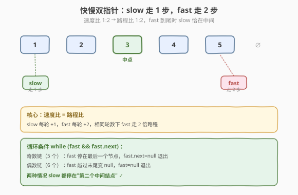
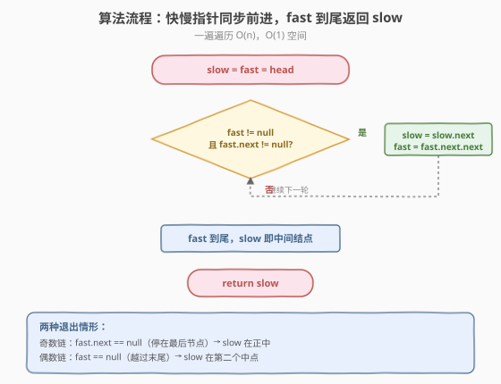
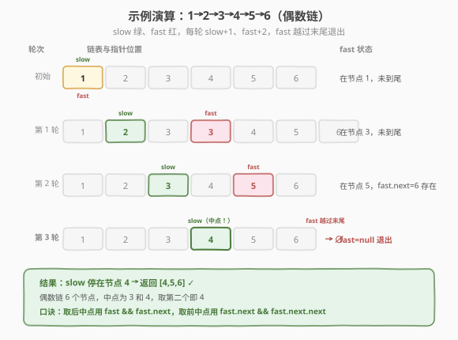

# 链表的中间结点

- **题目名称**：链表的中间结点
- **链接**：[876. 链表的中间结点](https://leetcode.cn/problems/middle-of-the-linked-list/)
- **难度**：简单
- **标签**：链表、双指针

## 1. 题目概述

给定单链表的**头节点** `head`，返回链表的**中间结点**。如果有**两个中间结点**（即链表长度为偶数），返回**第二个**中间结点。

**示例 1**：

```text
输入：head = [1,2,3,4,5]
输出：[3,4,5]
解释：链表有 5 个节点，中间节点是第 3 个节点（值为 3），返回从它开始的子链表。
```

**示例 2**：

```text
输入：head = [1,2,3,4,5,6]
输出：[4,5,6]
解释：链表有 6 个节点，中间节点是第 3（值 3）和第 4（值 4），返回第二个，即从 4 开始。
```

**约束条件**：

- 链表节点数目范围 `[1, 100]`
- `1 <= Node.val <= 100`

> 💡 这是一道**快慢双指针**的入门题，与 [环形链表（141）](../0101-0200/141_环形链表.md) 同源。核心套路：让两个指针从起点出发，慢指针走 1 步、快指针走 2 步，当快指针到达链尾时，慢指针恰好在中间。一次遍历 `O(n)`、`O(1)` 空间，是面试中"链表中点"的标配写法。

---

## 2. 解题思路

### 2.1 暴力思路：先数长度再走一半

最直观的做法分两步：

1. **第一次遍历**：从头走到尾数链表长度 `n`。
2. **第二次遍历**：再从头走 `n / 2` 步（向下取整），停下的节点就是中间结点。

```text
n = 0
for p in head..end: n += 1
p = head
for i in 0..n/2: p = p.next
return p
```

时间 `O(n)`、空间 `O(1)`，复杂度看起来和双指针一样，但**遍历两遍**。更关键的是：面试官看到这种写法通常会追问"能不能一遍遍历搞定？"——这正是快慢指针的用武之地。

> ⚠️ 暴力法的问题不在复杂度而在**不够优雅**：链表天生适合"边走边算"，两遍遍历没有利用链表的顺序性。快慢指针把"数长度"和"找中点"合并成一遍，是链表题的常见优化套路。

### 2.2 核心观察：快慢双指针

**关键定义**：设两个指针 `slow` 和 `fast`，都从头节点 `head` 出发。每轮循环：

- `slow` 走 **1 步**：`slow = slow.next`
- `fast` 走 **2 步**：`fast = fast.next.next`

**核心观察**：`fast` 的速度是 `slow` 的 2 倍，因此当 `fast` 走到链表末尾时，`slow` 恰好走了**一半的路程**——也就是中间位置。



**两种结束情形**（对应奇偶长度）：

| 链表长度 | `fast` 停在哪 | `slow` 停在哪 | 例子 |
|---------|--------------|--------------|------|
| **奇数**（如 5） | `fast.next == null`（停在最后一个节点） | 正中间节点（第 3 个） | `1→2→3→4→5`，`slow` 停在 3 |
| **偶数**（如 6） | `fast == null`（越过末尾） | 第二个中间节点（第 4 个） | `1→2→3→4→5→6`，`slow` 停在 4 |

> 💡 **循环条件 `fast && fast.next`** 同时覆盖两种情形：奇数链 `fast.next` 先变空退出，偶数链 `fast` 先变空退出。两种情况下 `slow` 都恰好停在题目要求的"第二个中间结点"——奇数只有一个中点，偶数取后半段的第一个。一个条件搞定两件事，这正是快慢指针找中点的精妙之处。

### 2.3 算法流程图



**完整步骤**：

1. **初始化**：`slow = fast = head`（都从头出发）
2. **循环**：当 `fast != null` 且 `fast.next != null`：
   - `slow = slow.next`（慢指针走 1 步）
   - `fast = fast.next.next`（快指针走 2 步）
3. **返回** `slow`（此时 `slow` 即中间结点）

> ⚠️ 循环条件必须**同时**判断 `fast` 和 `fast.next`：先看 `fast != null` 防止偶数链 `fast` 越过末尾后 `fast.next` 空指针；再看 `fast.next != null` 判断奇数链是否还剩最后一步。顺序不能反——若先写 `fast.next != null`，当 `fast` 已为 `null` 时会直接解引用空指针崩溃。

### 2.4 示例演算

以 `head = [1,2,3,4,5,6]`（偶数链）为例，逐步追踪 `slow` 和 `fast` 的位置：



| 轮次 | 操作 | slow 位置 | fast 位置 | fast 是否到尾？ |
|------|------|-----------|-----------|----------------|
| 初始 | slow=fast=1 | 节点 1 | 节点 1 | 否 |
| 第 1 轮 | slow+1, fast+2 | 节点 2 | 节点 3 | 否 |
| 第 2 轮 | slow+1, fast+2 | 节点 3 | 节点 5 | 否（`fast.next`=6 存在） |
| 第 3 轮 | slow+1, fast+2 | 节点 4 | 越过 6（`fast=null`） | 是，退出 |

循环结束时 `slow` 停在节点 4，返回从 4 开始的子链表 `[4,5,6]`，与示例 2 一致。

> 💡 注意第 3 轮：`fast` 从节点 5 走两步，第一步到 6、第二步越过末尾变 `null`，循环条件 `fast != null` 失败退出。此时 `slow` 刚好走到 4——偶数链的"第二个中间结点"。如果是奇数链 `[1,2,3,4,5]`，第 2 轮后 `fast` 停在 5、`fast.next=null`，循环因 `fast.next` 条件退出，`slow` 停在 3。

---

## 3. 参考代码

### C++

```cpp
/**
 * Definition for singly-linked list.
 * struct ListNode {
 *     int val;
 *     ListNode *next;
 *     ListNode() : val(0), next(nullptr) {}
 *     ListNode(int x) : val(x), next(nullptr) {}
 *     ListNode(int x, ListNode *next) : val(x), next(next) {}
 * };
 */
class Solution {
  public:
    ListNode* middleNode(ListNode* head) {
        ListNode* slow = head;
        ListNode* fast = head;
        while (fast != nullptr && fast->next != nullptr) {
            slow = slow->next;              // 慢指针走 1 步
            fast = fast->next->next;        // 快指针走 2 步
        }
        return slow;                        // fast 到尾时 slow 在中间
    }
};
```

### Python

```python
# Definition for singly-linked list.
# class ListNode:
#     def __init__(self, val=0, next=None):
#         self.val = val
#         self.next = next
class Solution:
    def middleNode(self, head: Optional[ListNode]) -> Optional[ListNode]:
        slow = fast = head
        while fast and fast.next:           # fast 和 fast.next 都非空才继续
            slow = slow.next                # 慢指针走 1 步
            fast = fast.next.next           # 快指针走 2 步
        return slow
```

> 💡 Python 的 `while fast and fast.next` 利用了短路求值：`fast` 为 `None` 时不会再求 `fast.next`，天然避免空指针。C++ 用 `fast != nullptr && fast->next != nullptr` 同理。两版代码逻辑完全一致，是快慢指针的标准写法。

---

## 4. 复杂度分析

| 维度 | 复杂度 | 说明 |
|------|--------|------|
| **时间复杂度** | `O(n)` | `fast` 每轮走 2 步，至多走 `n/2` 轮就到链尾；总步数 `O(n)`，一遍遍历 |
| **空间复杂度** | `O(1)` | 只用 `slow`、`fast` 两个指针，常数额外空间 |

> ⚠️ 虽然时间复杂度 `O(n)` 和"先数长度再走一半"的暴力法相同，但快慢指针**只遍历一遍**，常数因子更小，且代码更简洁。更重要的是它是**通用模板**——环形链表、链表归并排序找中点、删除倒数第 N 个节点都靠它，掌握一个会一片。

---

## 5. 扩展：奇数链取前一个中点？

题目要求偶数链取**第二个**中点。如果面试官追问"偶数链取**第一个**中点呢？"（如 [148. 排序链表](https://leetcode.cn/problems/sort-list/) 归并时需要左半段更短），只需把循环条件从 `fast && fast.next` 改成 `fast.next && fast.next.next`：

```python
# 取第一个中点（偶数链停在左中点）
slow = fast = head
while fast.next and fast.next.next:
    slow = slow.next
    fast = fast.next.next
return slow
```

**区别**：原版让 `fast` 多走一轮，`slow` 多前进一步，从而偶数链停在右中点；改版让 `fast` 早一轮停止，`slow` 少走一步，偶数链停在左中点。

> 💡 这点在链表归并排序里很关键——`sortList` 切分两半时左半段必须更短或等长，否则切分不均会死循环。记这个口诀：**取后中点用 `fast && fast.next`，取前中点用 `fast.next && fast.next.next`**。

---

## 6. 面试要点

1. **为什么快慢指针能找到中点？**

   - `fast` 速度是 `slow` 的 2 倍，相同时间内 `fast` 走的路程是 `slow` 的 2 倍。当 `fast` 走完全程 `n` 时，`slow` 恰好走了 `n/2`，即中间位置。这是**速度比 = 路程比**的直接应用。

2. **循环条件为什么是 `fast && fast.next`？**

   - `fast` 防止偶数链越过末尾后解引用空指针；`fast.next` 判断奇数链是否还剩最后一步（剩一步时 `fast` 还能再走 2 步但会到末尾，应停止）。
   - 两个条件缺一不可，且**顺序不能反**：必须先判 `fast` 非空，再判 `fast.next`，否则 `fast` 为空时 `fast.next` 直接崩溃。

3. **偶数链为什么返回第二个中点？**

   - 偶数链有 `n/2` 和 `n/2+1` 两个中点。题目要求返回第二个，循环条件 `fast && fast.next` 让 `fast` 在偶数链上多走一轮（走到越过末尾），`slow` 因此多前进一步，停在 `n/2+1` 即第二个中点。
   - 若要返回第一个，把条件改成 `fast.next && fast.next.next`，让 `fast` 早一轮停止。

4. **能不能不遍历直接算下标？**

   - 链表**不支持随机访问**，无法像数组那样 `arr[n/2]` 直接取中点。必须遍历，快慢指针是"一遍遍历"的最优解。
   - 若是数组，直接 `arr[n//2]` 即可——这是链表和数组的核心差异之一。

5. **快慢指针还能解决哪些问题？**

   - [环形链表（141）](../0101-0200/141_环形链表.md)：快慢相遇判环；[环形链表 II（142）](https://leetcode.cn/problems/linked-list-cycle-ii/)：相遇后找入口。
   - [19. 删除倒数第 N 个节点](https://leetcode.cn/problems/remove-nth-node-from-end-of-list/)：`fast` 先走 N 步，再同步走，`fast` 到尾时 `slow` 在倒数第 N+1 个。
   - 链表归并排序找中点切分。都是"**速度差定位位置**"的同一套路。

> 💡 **一句话总结**：876 是快慢双指针的入门题——`slow` 走 1 步、`fast` 走 2 步，`fast` 到尾时 `slow` 在中间。一遍遍历 `O(n)`、`O(1)` 空间，循环条件 `fast && fast.next` 同时处理奇偶两种情形。这个模板是链表题的基石，环形链表、归并切分、删除倒数第 N 个都靠它，务必默写到肌肉记忆。

---

## 7. 同类练习题

- [141. 环形链表](https://leetcode.cn/problems/linked-list-cycle/)（[题解](../0101-0200/141_环形链表.md)）：同款快慢双指针，判环改看是否相遇
- [142. 环形链表 II](https://leetcode.cn/problems/linked-list-cycle-ii/)（[题解](../0101-0200/142_环形链表 II.md)）：快慢相遇后找环入口，进阶版
- [19. 删除链表的倒数第 N 个结点](https://leetcode.cn/problems/remove-nth-node-from-end-of-list/)（[题解](../0001-0100/19_删除链表的倒数第N个节点.md)）：快慢双指针定位倒数位置
- [234. 回文链表](https://leetcode.cn/problems/palindrome-linked-list/)：快慢找中点 + 反转后半段 + 比较
- [148. 排序链表](https://leetcode.cn/problems/sort-list/)（[题解](../0101-0200/148_排序链表.md)）：快慢找中点切分 + 归并合并
