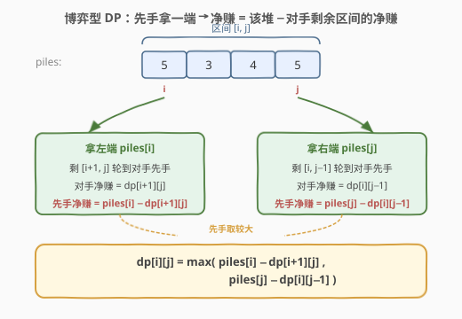
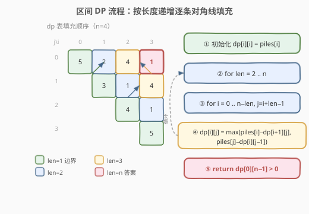
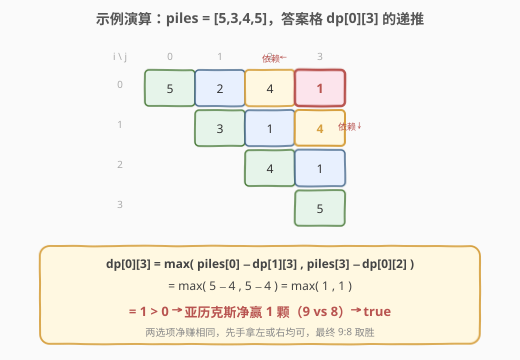

# LeetCode 石子游戏 题解

## 1. 题目概述

- **标题 / 题号**：石子游戏（#877，medium）
- **链接**：https://leetcode.cn/problems/stone-game/
- **难度**：中等
- **标签**：数组、数学、动态规划、博弈型区间 DP

**题意**：`piles` 是一排**偶数堆**石子，每堆有正整数颗。亚历克斯和李轮流从中拿一堆，**亚历克斯先手**，每次只能拿**最左或最右**那一堆。两人都极其聪明（采取最优策略），石子总数为奇数（无平局）。返回亚历克斯是否能赢（拿到更多石子）。

**示例 1**：

```text
输入：piles = [5,3,4,5]
输出：true
解释：亚历克斯先拿左端的 5，剩下 [3,4,5]。
  - 若李拿 3，剩 [4,5]，亚历克斯拿 5，李拿 4 → 亚历克斯 5+5=10，李 3+4=7。
  - 若李拿 5，剩 [3,4]，亚历克斯拿 4，李拿 3 → 亚历克斯 5+4=9，李 5+3=8。
两种情况亚历克斯都赢，故返回 true。
```

**示例 2**：

```text
输入：piles = [3,7,2,3]
输出：true
```

**约束**：

- `2 <= piles.length <= 500`
- `piles.length` 为偶数
- `1 <= piles[i] <= 500`
- `sum(piles)` 为奇数

> ⚠️ 本题虽可被一行数学结论秒杀（见第 5 节），但面试官真正想考察的是**博弈型区间 DP**——它是 [486. 预测赢家](https://leetcode.cn/problems/predict-the-winner/)、[1690. 石子游戏 VII](https://leetcode.cn/problems/stone-game-vii/) 等一系列题的母模板。

## 2. 解题思路

### 2.1 暴力思路

每一步先手有「拿左」或「拿右」两种选择，选定后剩余区间交给对手继续先手。两人都最优，需用递归枚举所有分支，复杂度 $O(2^n)$，`n = 500` 必爆。重叠子问题极多（同一区间会被反复求解），天然适合 DP。

### 2.2 核心观察：博弈型区间 DP（记录「净赚」）



关键在于**状态定义的巧妙转换**——不要分别记两人的得分，而是记：

> `dp[i][j]` = 当前玩家在区间 `piles[i..j]` 上**先手**时，能比对手**多拿**的石子数（净赚）。

为什么这样定义有效？因为博弈是**零和**的：区间内的总石子数固定，先手多拿多少，后手就少拿多少。只需关心「差值」即可判断输赢。

对区间 `[i, j]`，先手只有两种拿法：

- **拿左端 `piles[i]`**：剩下 `[i+1, j]` 轮到对手先手。对手在 `[i+1, j]` 上的净赚是 `dp[i+1][j]`，于是先手的净赚为 `piles[i] − dp[i+1][j]`。
- **拿右端 `piles[j]`**：剩下 `[i, j-1]` 对手先手，净赚 `dp[i][j-1]`，先手净赚 `piles[j] − dp[i][j-1]`。

先手会选择两者中较大的：

$$
\text{dp}[i][j] = \max\bigl(\text{piles}[i] - \text{dp}[i+1][j],\ \ \text{piles}[j] - \text{dp}[i][j-1]\bigr)
$$

> 💡 **减号的含义**：先手这一手拿了 `piles[i]`，但随后对手在剩余区间里会成为「先手」并拿到净赚 `dp[i+1][j]`；从先手视角看，这部分净赚是**对手的**，要减去。这正是 Minimax「我选最大、对手选最小对我」的紧凑表达。

**边界**：`dp[i][i] = piles[i]`（只剩一堆，先手直接拿走，对手 0，净赚即该堆）。

**答案**：`dp[0][n-1] > 0` 表示亚历克斯（先手）净赚为正，返回 `true`。

### 2.3 算法流程图



按**区间长度**从短到长递推：长度 1 填主对角线，长度 2 填紧邻对角线，……，长度 `n` 填右上角 `dp[0][n-1]`。每个 `dp[i][j]` 只依赖其**下方** `dp[i+1][j]` 和**左方** `dp[i][j-1]`，因此按长度递增即可保证依赖已就绪。

### 2.4 示例演算

以 `piles = [5,3,4,5]` 为例，填 `4×4` 的 dp 表（行列均为下标 `i,j`，只填上三角）：



| 长度 | 区间 `[i,j]` | 计算 | dp 值 |
|------|--------------|------|-------|
| 1 | `[0,0]` `[1,1]` `[2,2]` `[3,3]` | 边界 = piles[i] | 5, 3, 4, 5 |
| 2 | `[0,1]` | max(5−3, 3−5) = max(2, −2) | 2 |
| 2 | `[1,2]` | max(3−4, 4−3) = max(−1, 1) | 1 |
| 2 | `[2,3]` | max(4−5, 5−4) = max(−1, 1) | 1 |
| 3 | `[0,2]` | max(5−dp[1][2], 4−dp[0][1]) = max(5−1, 4−2) = max(4, 2) | 4 |
| 3 | `[1,3]` | max(3−dp[2][3], 5−dp[1][2]) = max(3−1, 5−1) = max(2, 4) | 4 |
| 4 | `[0,3]` | max(5−dp[1][3], 5−dp[0][2]) = max(5−4, 5−4) = max(1, 1) | 1 |

`dp[0][3] = 1 > 0`，亚历克斯净赢 1 颗（亚历克斯 9 颗、李 8 颗），返回 `true`。

## 3. 参考代码

### C++

```cpp
class Solution {
  public:
    bool stoneGame(vector<int>& piles) {
        int n = piles.size();
        // dp[i][j] = 先手在 piles[i..j] 上比对手多拿的石子数
        vector<vector<int>> dp(n, vector<int>(n, 0));
        for (int i = 0; i < n; i++) dp[i][i] = piles[i];
        for (int len = 2; len <= n; len++) {        // 按区间长度递增
            for (int i = 0; i + len - 1 < n; i++) { // 枚举左端点
                int j = i + len - 1;                // 右端点
                dp[i][j] = max(piles[i] - dp[i + 1][j],
                               piles[j] - dp[i][j - 1]);
            }
        }
        return dp[0][n - 1] > 0;
    }
};
```

### Python

```python
class Solution:
    def stoneGame(self, piles: List[int]) -> bool:
        n = len(piles)
        dp = [[0] * n for _ in range(n)]
        for i in range(n):
            dp[i][i] = piles[i]
        for length in range(2, n + 1):          # 按区间长度递增
            for i in range(n - length + 1):     # 枚举左端点
                j = i + length - 1              # 右端点
                dp[i][j] = max(piles[i] - dp[i + 1][j],
                               piles[j] - dp[i][j - 1])
        return dp[0][n - 1] > 0
```

> 💡 **空间优化**：`dp[i][j]` 只依赖「下一行」`dp[i+1][j]` 和「同行左侧」`dp[i][j-1]`。若固定 `i` 从右向左扫 `j`，可用**一维数组** `dp[j]` 滚动，空间降到 $O(n)$。面试时可主动提出以加分。

## 4. 复杂度分析

| 维度 | 复杂度 | 说明 |
|------|--------|------|
| 时间复杂度 | $O(n^2)$ | 两重循环按区间长度与左端点枚举，共约 $n^2/2$ 个状态，每个 $O(1)$ 转移 |
| 空间复杂度 | $O(n^2)$ | 二维 dp 表；一维滚动可优化至 $O(n)$ |

## 5. 扩展：数学结论——先手必胜

题目给定 `piles.length` 为偶数且 `sum(piles)` 为奇数，这其实**保证**了先手必胜，一行即可过：

```python
class Solution:
    def stoneGame(self, piles: List[int]) -> bool:
        return True
```

**直觉证明**：偶数堆按下标奇偶分两组（下标为偶数的堆 vs 奇数的堆），两组总和必不相等（总和为奇数）。先手可以**全程只拿某一组**——通过每次在左/右端中选择属于该组的那堆，迫使对手只能拿到另一组的堆。先手挑总和更大的那组即可获胜。

> ⚠️ 这个 trick 只在「偶数长度 + 奇数总和」的**特殊约束**下成立。一旦约束放宽（如 [486. 预测赢家](https://leetcode.cn/problems/predict-the-winner/) 允许奇数长度、可能平局），数学结论失效，必须老老实实写区间 DP。所以**面试时以 DP 为主解，数学作为扩展讨论**。

## 6. 面试要点

1. **为什么用「净赚」而不是分别记两人得分？**
   - 博弈是零和的：区间总石子固定，先手多拿的即后手少拿的。用「差值」一维量即可刻画状态，转移只需一个 `max`，比维护 `(我的分, 对手分)` 二元组更简洁，也天然消除「当前轮到谁」的额外维度。

2. **状态转移里为什么是减号 `piles[i] − dp[i+1][j]`？**
   - 先手拿 `piles[i]` 后，**身份互换**：对手成为剩余区间 `[i+1,j]` 的先手，会拿到净赚 `dp[i+1][j]`。从原先手视角，这部分是对手的收益，要从自己的净赚里扣除。

3. **区间 DP 为什么要按长度递增枚举？**
   - `dp[i][j]` 依赖更短的区间 `[i+1,j]`（长 `len−1`）和 `[i,j-1]`（长 `len−1`）。按长度从小到大填充，可保证计算当前状态时其依赖已全部就绪，避免递归栈开销。

4. **如何还原亚历克斯实际拿的石子数？**
   - 区间 `[i,j]` 总和为 `S = sum(piles[i..j])`。由 `dp[i][j] = 先手 − 后手` 且 `先手 + 后手 = S`，可解得先手得分 $= \frac{S + \text{dp}[i][j]}{2}$，后手 $= \frac{S - \text{dp}[i][j]}{2}$。

5. **如果允许平局（返回净赚非负即可）怎么改？**
   - 把 `return dp[0][n-1] > 0` 改为 `return dp[0][n-1] >= 0`；这正是 [486. 预测赢家](https://leetcode.cn/problems/predict-the-winner/) 的判定方式，DP 框架完全一致。

## 同类练习题

| # | 题目 | 与本题的关联 |
|---|------|-------------|
| 486 | [预测赢家](https://leetcode.cn/problems/predict-the-winner/) | 877 的无特殊约束版（奇数长度、允许平局），区间 DP 模板原样套用，判定改为 `>= 0` |
| 1690 | [石子游戏 VII](https://leetcode.cn/problems/stone-game-vii/) | 拿走一堆后得分由「区间剩余和」决定，转移改为 `min` 而非 `max`（对手会让你拿得少），仍是博弈型区间 DP |
| 312 | [戳气球](https://leetcode.cn/problems/burst-balloons/)（[题解](../0301-0400/312_戳气球.md)） | 区间 DP 经典，按「最后戳的位置」而非「两端」划分区间，对比两种切分方式 |
| 1140 | [石子游戏 II](https://leetcode.cn/problems/stone-game-ii/) | 从「两端取」改为「左端取 M 堆」，博弈 DP + 前缀和，体会状态定义随取法变化 |
| 1039 | [多边形三角剖分的最低得分](https://leetcode.cn/problems/minimum-score-triangulation-of-polygon/) | 区间 DP 在环形结构上的变体，转移枚举中间分割点 |
