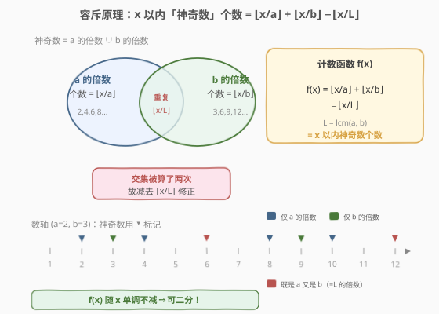
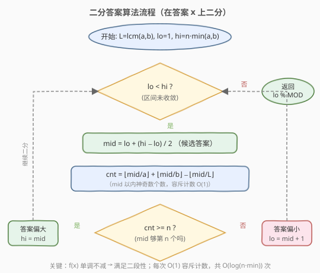
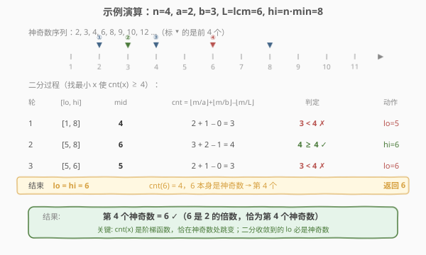

# 第N个神奇数字

- **题目名称**：第N个神奇数字
- **链接**：[878. 第N个神奇数字](https://leetcode.cn/problems/nth-magical-number/)
- **难度**：困难
- **标签**：数学、二分查找、容斥原理

## 1. 题目概述

一个正整数如果能被 `a` **或** `b` 整除，则它是「神奇数」。给定三个整数 `n`、`a`、`b`，返回第 `n` 个神奇数。由于答案可能非常大，返回它对 $10^9 + 7$ 取模的结果。

**示例 1**：

```text
输入：n = 1, a = 2, b = 3
输出：2
解释：神奇数序列 2, 3, 4, 6, 8, 9, 10, 12 …，第 1 个是 2。
```

**示例 2**：

```text
输入：n = 4, a = 2, b = 3
输出：6
解释：序列前 4 个为 2, 3, 4, 6，第 4 个是 6。
```

**示例 3**：

```text
输入：n = 5, a = 2, b = 4
输出：10
解释：b=4 的倍数是 a=2 倍数的子集，神奇数即 2 的倍数：2,4,6,8,10，第 5 个是 10。
```

**示例 4**：

```text
输入：n = 3, a = 6, b = 4
输出：8
解释：能被 6 或 4 整除：4, 6, 8, 12 …，第 3 个是 8。
```

**约束条件**：

- `1 <= n <= 10^9`
- `2 <= a, b <= 40000`

> ⚠️ `n` 可达 $10^9$，直接逐个枚举神奇数必然超时；但「神奇数个数」却能在 $O(1)$ 内统计——这正是二分答案的入口。

---

## 2. 解题思路

### 2.1 暴力思路

从 $x = \min(a,b)$ 起逐个递增，判断 `x % a == 0 || x % b == 0`，数到第 `n` 个即返回。复杂度 $O(\text{答案})$，而答案最大可达 $n \cdot \min(a,b) \approx 4 \times 10^{13}$，远超时间限制。

瓶颈在于「找第 n 个」要**逐个**确认，但题目真正需要的是**计数**——「$x$ 以内有多少个神奇数」。若能把计数降到 $O(1)$，就能用二分跳过枚举。

### 2.2 核心观察：容斥计数 + 二分答案



**第一步：$O(1)$ 计数。** 「神奇数」= `a` 的倍数 ∪ `b` 的倍数。由**容斥原理**，$x$ 以内神奇数的个数为：

$$
f(x) = \left\lfloor \frac{x}{a} \right\rfloor + \left\lfloor \frac{x}{b} \right\rfloor - \left\lfloor \frac{x}{L} \right\rfloor, \quad L = \text{lcm}(a, b)
$$

其中 $L = \text{lcm}(a,b)$ 是 $a$、$b$ 的最小公倍数；既是 $a$ 又是 $b$ 的倍数（即 $L$ 的倍数）在前两项里被算了**两次**，第三项减去一次修正。

**第二步：单调性 → 二分。** $f(x)$ 随 $x$ **单调不减**（$x$ 越大，范围内的神奇数只增不减）。于是存在分界点 $x^*$：

```text
x < x*  → f(x) < n   (不够第 n 个)
x >= x* → f(x) >= n  (够第 n 个)
```

这个 $x^*$ 正是第 `n` 个神奇数。在区间 $[1,\ n \cdot \min(a,b)]$ 上二分，每次 $O(1)$ 验证 `f(mid) >= n` 即可。

> 💡 **为什么上界取 $n \cdot \min(a,b)$？** 仅 $\min(a,b)$ 的倍数就能提供 $n$ 个神奇数（$\min(a,b),\,2\min(a,b),\,\dots,\,n\min(a,b)$）；另一因子的倍数只会**增加**神奇数、让第 $n$ 个来得更早。故第 $n$ 个神奇数 $\le n \cdot \min(a,b)$，这是紧的上界。

> ⚠️ **溢出**：$n \le 10^9$、$\min(a,b) \le 40000$，故 $n \cdot \min(a,b) \le 4 \times 10^{13}$，远超 32 位 `int`（约 $2.1 \times 10^9$）。C++ 必须用 `long long`；Python 整数无上限无此问题。计算 $\text{lcm}$ 时用 `a / gcd(a,b) * b`（**先除后乘**）可避免中间 `a*b` 溢出（虽然本题 $a,b \le 40000$ 时 `a*b` 仍在 `long long` 内，但这是通用好习惯）。

### 2.3 算法流程图



采用 `lo < hi` 的 **lower_bound** 写法：当 `cnt(mid) >= n` 时令 `hi = mid`（而非 `mid - 1`），因为 `mid` 本身可能就是答案。循环结束时 `lo == hi` 收敛到最小满足 `f(x) >= n` 的 $x$。

> 💡 **为什么收敛点必是神奇数？** $f(x)$ 是阶梯函数，只在神奇数处跳变。`f(x) >= n` 的最小 $x$ 恰是使计数首次达到 $n$ 的那个神奇数——它本身必然是 $a$ 或 $b$ 的倍数（否则 $f(x) = f(x-1)$，$x-1$ 就已满足，$x$ 就不是最小）。

### 2.4 示例演算



以 `n=4, a=2, b=3` 为例，$L = \text{lcm}(2,3) = 6$，上界 $4 \cdot 2 = 8$：

| 轮 | `[lo, hi]` | mid | `cnt = ⌊m/2⌋+⌊m/3⌋−⌊m/6⌋` | 判定 | 动作 |
|----|-----------|-----|--------------------------|------|------|
| 1 | `[1, 8]` | 4 | $2 + 1 - 0 = 3$ | $3 < 4$ ✗ | `lo=5` |
| 2 | `[5, 8]` | 6 | $3 + 2 - 1 = 4$ | $4 \ge 4$ ✓ | `hi=6` |
| 3 | `[5, 6]` | 5 | $2 + 1 - 0 = 3$ | $3 < 4$ ✗ | `lo=6` |
| 结束 | `lo=hi=6` | — | `cnt(6)=4`，6 是神奇数 | — | 返回 6 |

注意第 2 轮 `mid=6` 时 `⌊6/6⌋=1`：6 既是 2 又是 3 的倍数，被容斥项修正，计数恰为 4。

---

## 3. 参考代码

### C++

```cpp
class Solution {
    using ll = long long;
    static constexpr ll MOD = 1e9 + 7;
    ll gcd(ll a, ll b) {
        while (b) { ll t = a % b; a = b; b = t; }
        return a;
    }
  public:
    int nthMagicalNumber(int n, int a, int b) {
        ll L = (ll)a / gcd(a, b) * b;            // lcm(a,b)，先除后乘防溢出
        ll lo = 1, hi = (ll)n * min(a, b);       // 上界：n·min(a,b)
        while (lo < hi) {
            ll mid = lo + (hi - lo) / 2;
            ll cnt = mid / a + mid / b - mid / L; // 容斥计数 f(mid)
            if (cnt >= n) hi = mid;              // 够第 n 个，答案偏大，收缩右界
            else          lo = mid + 1;          // 不够，答案偏小，抬升左界
        }
        return lo % MOD;
    }
};
```

### Python

```python
class Solution:
    def nthMagicalNumber(self, n: int, a: int, b: int) -> int:
        from math import gcd
        MOD = 10**9 + 7
        L = a // gcd(a, b) * b                   # lcm(a,b)
        lo, hi = 1, n * min(a, b)                # 上界：n·min(a,b)
        while lo < hi:
            mid = (lo + hi) // 2
            cnt = mid // a + mid // b - mid // L # 容斥计数 f(mid)
            if cnt >= n:
                hi = mid                         # 够第 n 个，尝试更小
            else:
                lo = mid + 1                     # 不够，加大
        return lo % MOD
```

> ⚠️ **两个易错点**：
> 1. **取模时机**：`lo` 收敛后已是不超过 $4 \times 10^{13}$ 的真实答案，只需在**返回前**对 `MOD` 取一次模即可，二分过程中**不要**取模（否则会破坏 `f(x)` 的单调性与计数的正确性）。
> 2. **`lcm` 先除后乘**：写 `a / gcd(a,b) * b` 而非 `a * b / gcd(a,b)`。前者先除保证整除、中间值更小；后者 `a*b` 可能溢出（本题数据下尚可，但通用场景如 `a,b` 更大会出错）。

---

## 4. 复杂度分析

| 维度 | 复杂度 | 说明 |
|------|--------|------|
| 时间复杂度 | $O(\log(n \cdot \min(a,b)))$ | 二分区间长 $n \cdot \min(a,b) \le 4 \times 10^{13}$，约 $45$ 次迭代，每次 $O(1)$ 容斥计数 |
| 空间复杂度 | $O(1)$ | 仅用常数额外变量 |

> 💡 即便 $n = 10^9$，也只需约 $45$ 次 $O(1)$ 计数，远优于暴力的 $O(n \cdot \min(a,b))$。

---

## 5. 扩展：周期结构——为什么神奇数「可预测」

神奇数序列其实具有**周期性**，这解释了上界为何有效，也提供了一个等价的分阶段思路。

设 $L = \text{lcm}(a, b)$。考察任意一段 $[kL+1,\ (k+1)L]$：由于 $a \mid L$ 且 $b \mid L$，一个数 $x$ 是神奇数当且仅当 $x \bmod L$ 在 $[1, L]$ 内是神奇数（$L$ 本身也算）。也就是说，**每个长度为 $L$ 的周期内，神奇数的位置完全相同，只是整体平移了 $kL$**。

一个周期 $[1, L]$ 内的神奇数个数为：

$$
k_0 = \frac{L}{a} + \frac{L}{b} - 1
$$

（减 1 是因为 $L$ 既是 $a$ 又是 $b$ 的倍数，在 $\frac{L}{a}$ 和 $\frac{L}{b}$ 里都被算了一次，容斥扣掉一次后只剩 1 个。）

于是第 `n` 个神奇数可分两段定位（令下标从 0 起）：

```text
q, r = divmod(n - 1, k0)        # q 个完整周期 + 周期内的第 r 个（0 基）
答案 = q * L + (周期 [1,L] 内第 r+1 个神奇数)
```

其中「周期内第 $r+1$ 个」可用**第二次二分**在更小的区间 $[1, L]$ 上求（$L \le a \cdot b \le 1.6 \times 10^9$，二分约 $31$ 次）。两次二分总迭代数与单次大二分相当，复杂度同为 $O(\log(n \cdot \min(a,b)))$。

> 💡 **为何不必这么做？** 单次大二分已经足够快（~45 次 $O(1)$），周期分解更多是**理解题意**的数学视角：它揭示了「神奇数在数轴上等间距重复」的本质。真正受益于周期分解的是数据更大、需 $O(1)$ 出答的场景（如 $n$ 极大且需多次查询）。

> ⚠️ 该周期思想可直接推广到 [1201. 丑数 III](https://leetcode.cn/problems/ugly-number-iii/)——那里「丑数」= 能被 `a`、`b`、`c` 任一整除，容斥变成**三元**形式（加减加减），但二分 + 计数的骨架完全一致。

---

## 6. 面试要点

1. **为什么能二分？二段性体现在哪？**

   - 计数函数 $f(x) = \lfloor x/a \rfloor + \lfloor x/b \rfloor - \lfloor x/L \rfloor$ 随 $x$ 单调不减。存在分界点 $x^*$，使 $x < x^*$ 时 $f(x) < n$、$x \ge x^*$ 时 $f(x) \ge n$。这种「左不足 / 右充足」的结构即二段性，可二分定位 $x^*$。

2. **容斥项 $\lfloor x/L \rfloor$ 为什么是减而不是加？**

   - 既是 $a$ 又是 $b$ 的倍数（即 $L = \text{lcm}(a,b)$ 的倍数）在 $\lfloor x/a \rfloor$ 和 $\lfloor x/b \rfloor$ 里各被算了一次，重复算了两遍，需减去一遍才是正确的并集大小。这正是容斥原理 $|A \cup B| = |A| + |B| - |A \cap B|$。

3. **二分收敛到的 `lo` 一定是神奇数吗？为什么？**

   - 是。$f(x)$ 是阶梯函数，只在神奇数处跳变。若 $x$ 不是神奇数，则 $f(x) = f(x-1)$，那么 $x-1$ 也满足 $f \ge n$，$x$ 就不是「最小满足者」。故最小满足者必落在跳变点上，即某个神奇数。

4. **上界为什么取 $n \cdot \min(a,b)$ 而不是 $n \cdot \max(a,b)$ 或 $10^{18}$？**

   - 仅 $\min(a,b)$ 的倍数就贡献 $n$ 个神奇数（第 $i$ 个为 $i \cdot \min(a,b)$），第 $n$ 个神奇数不可能晚于 $n \cdot \min(a,b)$。取更紧的上界能减少二分次数；取 $\max$ 或任意大数虽也正确，但浪费迭代且更易在中间计算溢出。

5. **二分过程中能不能提前取模？**

   - **不能**。取模会改变 `mid / a` 等计数的值，破坏单调性。只能在最终答案确定后对结果取一次模。C++ 中用 `long long` 承载中间值（最大约 $4 \times 10^{13}$，远在 `long long` 的 $9 \times 10^{18}$ 范围内）即可。

---

## 7. 同类练习题

- [1201. 丑数 III](https://leetcode.cn/problems/ugly-number-iii/)：本题的三因子升级版——「丑数」= 能被 `a`、`b`、`c` 任一整除，容斥变三元（加 a、b、c，减两两 lcm，加三元 lcm），二分 + 计数骨架完全一致，强烈推荐对照练习
- [875. 爱吃香蕉的珂珂](https://leetcode.cn/problems/koko-eating-bananas/)（[题解](../0801-0900/875_爱吃香蕉的珂珂.md)）：二分答案经典模板，`check()` 为 $O(n)$ 贪心验证；对比本题 `check()` 退化到 $O(1)$ 容斥计数
- [719. 找出第 K 小的数对距离](https://leetcode.cn/problems/find-k-th-smallest-pair-distance/)：二分答案 + 双指针统计「$\le$ 候选值」的数对数，同为「第 k 小 + 单调计数」范式
- [378. 有序矩阵中第 K 小的元素](https://leetcode.cn/problems/kth-smallest-element-in-a-sorted-matrix/)：二分值域 + 左下角走法计数，体会「二分答案」与「二分下标」的区别
