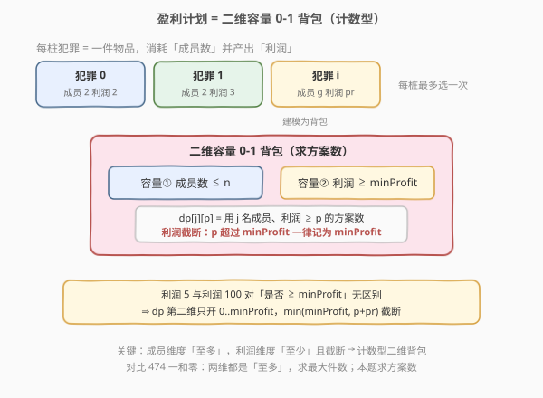
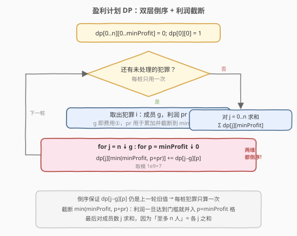
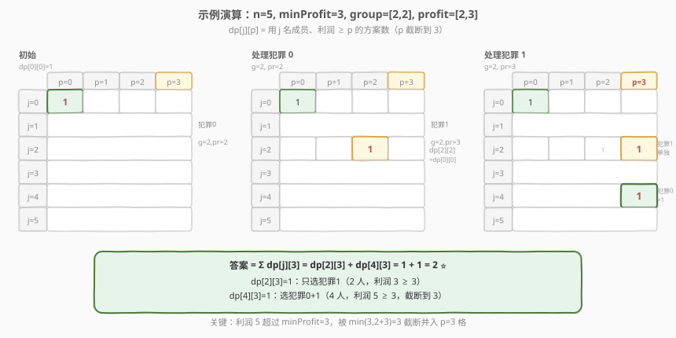

# 盈利计划

- **题目名称**：盈利计划
- **链接**：[879. 盈利计划](https://leetcode.cn/problems/profitable-schemes/)
- **难度**：困难
- **标签**：动态规划、背包、数组

## 1. 题目概述

帮派里有 `n` 名成员，给定若干可实施的犯罪。第 `i` 桩犯罪需要 `group[i]` 人参与，产生 `profit[i]` 的利润。每名成员**最多参与一桩**犯罪（即每桩犯罪要么整体选、要么不选，人员不重叠）。求在**成员总数不超过 `n`** 且**总利润至少为 `minProfit`** 的前提下，共有多少种**犯罪选择方案**。答案对 $10^9 + 7$ 取模。

> 💡 「方案」指从犯罪列表中选出一个子集（每桩选/不选），只要该子集占用人数之和 $\le n$ 且利润之和 $\ge \text{minProfit}$ 即算一种。子集可以为空：当 `minProfit = 0` 时空集也是一种合法方案（利润 $0 \ge 0$）。

**示例 1**：

```text
输入：n = 5, minProfit = 3, group = [2,2], profit = [2,3]
输出：2
解释：两种方案——
  ① 选犯罪 0 + 犯罪 1：人数 2+2=4 ≤ 5，利润 2+3=5 ≥ 3；
  ② 只选犯罪 1：人数 2 ≤ 5，利润 3 ≥ 3。
```

各犯罪信息：

| 犯罪 | 需要人数 | 产生利润 |
|------|----------|----------|
| 0    | 2        | 2        |
| 1    | 2        | 3        |

注意「只选犯罪 0」利润仅 $2 < 3$，不算合法方案；「两桩都选」利润 $5$ 与 $3$ 对门槛而言无差别（都 $\ge 3$）。

**示例 2**：

```text
输入：n = 10, minProfit = 5, group = [2,3,5], profit = [6,7,8]
输出：7
解释：除空集外，所有人数之和 ≤ 10 的非空子集利润都 ≥ 5，共 7 种。
```

**约束条件**：

- `1 <= n <= 100`
- `0 <= minProfit <= 100`
- `1 <= group.length == profit.length <= 100`
- `1 <= group[i] <= 100`
- `0 <= profit[i] <= 100`

---

## 2. 解题思路

### 2.1 暴力思路：枚举每个子集

对每桩犯罪决定「选 / 不选」，共 $2^{L}$ 种子集（$L$ 为犯罪数）。对每个子集累计人数与利润，满足人数 $\le n$ 且利润 $\ge \text{minProfit}$ 则计数。$L \le 100$ 时 $2^{100}$ 完全不可行。

### 2.2 核心观察：二维容量 0-1 背包（计数型 + 利润截断）



关键建模：把每桩犯罪看作**一件物品**，它同时受**两个容量约束**——

- **费用①（成员数）**：选这桩犯罪消耗 `group[i]` 人，总人数**至多** `n`；
- **费用②（利润）**：选这桩犯罪累加 `profit[i]` 利润，总利润**至少** `minProfit`。

每件物品最多用一次 → **0-1 背包**；求的是合法方案**数**（而非最大价值）→ **计数型**背包。这恰是 [474. 一和零](https://leetcode.cn/problems/ones-and-zeroes/)「二维费用 0-1 背包」的进阶：本题两维语义不对称（成员「至多」、利润「至少」），且求方案数。

**利润截断技巧**：题目只关心「利润 $\ge \text{minProfit}$」，对超出部分无差别。因此利润第二维**只需开到 `minProfit`**：凡累加后 $\ge \text{minProfit}$ 的，一律记入 $p = \text{minProfit}$ 这一格。即用 $\min(\text{minProfit},\ p + \text{pr})$ 做转移下标，把无限大的利润取值压缩到 $[0, \text{minProfit}]$。

**状态定义**：

$$
dp[j][p] = \text{恰用 } j \text{ 名成员、总利润 } \ge p \text{ 的方案数（} p \text{ 已截断到 } \text{minProfit}\text{）}
$$

> 💡 成员维用「**恰好** $j$ 人」而非「至多 $j$ 人」，因为「至多 $n$ 人」可在最后对 $j = 0..n$ 求和得到；这样状态转移更干净（每件物品固定扣 `group[i]`）。利润维用「**至少** $p$」配合截断，初始化只需 $dp[0][0] = 1$（空集：0 人、0 利润）。

### 2.3 算法流程图



**状态转移**（每桩犯罪只用一次，故 `j`、`p` 两维都**倒序**更新）：

$$
dp[j]\bigl[\min(\text{minProfit},\ p + \text{pr})\bigr] \mathrel{+}= dp[j - g][p]
$$

其中 $g$、$\text{pr}$ 是当前犯罪的人数与利润。

- `dp[j][...]`：不选当前犯罪，沿用旧值（倒序保证读到的是上一轮旧值）。
- `dp[j−g][p]`：选当前犯罪，腾出 $g$ 个人，利润从 $p$ 累加 $\text{pr}$ 并截断。

> ⚠️ **两维都要倒序**：与 [474](https://leetcode.cn/problems/ones-and-zeroes/) 同理，有两个容量维度时 `j` 从 $n$ 到 $g$、`p` 从 $\text{minProfit}$ 到 $0$ **两层循环都要倒序**。只要其中一维写成升序，`dp[j−g][p]` 就可能引用到本轮已被当前犯罪「污染」过的值，导致同一犯罪被重复选取。

**最终答案**：

$$
\text{ans} = \sum_{j=0}^{n} dp[j][\text{minProfit}]
$$

对成员数 $j$ 求和，因为「至多 $n$ 人」等于「恰好 $0$ 人 + 恰好 $1$ 人 + … + 恰好 $n$ 人」的所有合法方案之和。

### 2.4 示例演算

以示例 1 `n=5, minProfit=3, group=[2,2], profit=[2,3]` 为例，`dp` 是 $6 \times 4$（$j \in 0..5$，$p \in 0..3$），初始仅 $dp[0][0] = 1$。



| 阶段 | 犯罪 | g,pr | 新增变化 | 非零格 |
|------|------|------|----------|--------|
| 初始 | — | — | $dp[0][0]=1$（空集） | `dp[0][0]=1` |
| 处理犯罪 0 | 0 | 2,2 | $dp[2][\min(3,0+2)]=dp[2][2] \mathrel{+}= dp[0][0]=1$ | `dp[0][0]=1, dp[2][2]=1` |
| 处理犯罪 1 | 1 | 2,3 | $dp[2][\min(3,0+3)]=dp[2][3] \mathrel{+}= dp[0][0]=1$；$dp[4][\min(3,2+3)]=dp[4][3] \mathrel{+}= dp[2][2]=1$ | `dp[0][0]=1, dp[2][2]=1, dp[2][3]=1, dp[4][3]=1` |

最后一步最关键：处理犯罪 1 时，$dp[4][3]$ 由 $dp[2][2] = 1$ 转移而来——这正是**上一轮**（处理完犯罪 0）留下的「选了犯罪 0、2 人、利润 2」的旧值。再叠上犯罪 1（人数 $2+2=4$、利润 $2+3=5 \ge 3$ 截断到 3），得到「两桩都选」方案。而 $dp[2][3]$ 则是「只选犯罪 1」（利润 $3 \ge 3$）。

> 💡 观察：犯罪 0 单独利润仅 $2 < 3$ 不达标，但它为「犯罪 0 + 犯罪 1」贡献了利润 $2$，使合计跨过门槛。这体现了背包「**逐步累加、跨过阈值即截断**」的计数思想——中间状态不必达门槛，只要最终合计 $\ge \text{minProfit}$ 即可。

---

## 3. 参考代码

### C++

```cpp
class Solution {
  public:
    int profitableSchemes(int n, int minProfit, vector<int>& group, vector<int>& profit) {
        const int MOD = 1e9 + 7;
        vector<vector<long long>> dp(n + 1, vector<long long>(minProfit + 1, 0));
        dp[0][0] = 1;
        for (int i = 0; i < (int)group.size(); ++i) {
            int g = group[i], pr = profit[i];
            for (int j = n; j >= g; --j)                     // 成员维倒序
                for (int p = minProfit; p >= 0; --p) {       // 利润维倒序
                    int np = min(minProfit, p + pr);          // 利润截断
                    dp[j][np] = (dp[j][np] + dp[j - g][p]) % MOD;
                }
        }
        long long ans = 0;
        for (int j = 0; j <= n; ++j)                         // 至多 n 人 = 各 j 求和
            ans = (ans + dp[j][minProfit]) % MOD;
        return ans;
    }
};
```

### Python

```python
class Solution:
    def profitableSchemes(self, n: int, minProfit: int,
                          group: List[int], profit: List[int]) -> int:
        MOD = 10**9 + 7
        dp = [[0] * (minProfit + 1) for _ in range(n + 1)]
        dp[0][0] = 1
        for g, pr in zip(group, profit):
            for j in range(n, g - 1, -1):                    # 成员维倒序
                for p in range(minProfit, -1, -1):           # 利润维倒序
                    np_ = min(minProfit, p + pr)             # 利润截断
                    dp[j][np_] = (dp[j][np_] + dp[j - g][p]) % MOD
        return sum(dp[j][minProfit] for j in range(n + 1)) % MOD
```

> ⚠️ **易错点**：
> - 内层两重循环边界是 `j >= g`、`p >= 0`（等价于 Python 的 `range(n, g - 1, -1)`、`range(minProfit, -1, -1)`），切勿写成 `j >= 0` 后再访问 `dp[j - g]`——当 `j < g` 时 `j - g` 为负越界。
> - **答案要对 `j` 求和**：若直接返回 `dp[n][minProfit]` 会漏掉「人数不足 `n` 但利润达标」的方案（如示例中只选犯罪 1 仅用 2 人）。
> - `minProfit = 0` 时空集也算合法（$dp[0][0]=1$ 最后会被计入），无需特判。

---

## 4. 复杂度分析

| 维度 | 复杂度 | 说明 |
|------|--------|------|
| 时间复杂度 | $O(L \cdot n \cdot \text{minProfit})$ | $L$ 桩犯罪，每桩做 $n \times (\text{minProfit}+1)$ 的二维转移 |
| 空间复杂度 | $O(n \cdot \text{minProfit})$ | 二维 `dp` 表，大小 $(n+1)\times(\text{minProfit}+1)$ |

> 💡 本题 $L \le 100$、$n \le 100$、$\text{minProfit} \le 100$，最坏 $100 \times 100 \times 100 = 10^6$ 次转移，轻松通过。利润截断把原本可达 $100 \times 100 = 10^4$ 的利润取值压缩到 $\le 101$，是本题能在时限内求解的关键。

---

## 5. 扩展：背包「至多 / 至少 / 恰好」语义与初始化

0-1 背包的容量语义决定**初始化方式**与**最终取值**，本题综合了三种语义，是个极佳的对照样本：

| 语义 | 初始化 | 典型题 |
|------|--------|--------|
| **至多**（求最大件数 / 最大价值） | `dp` 全 `0`，答案 `dp[满容量]` | [474. 一和零](https://leetcode.cn/problems/ones-and-zeroes/)（两维都「至多」） |
| **恰好**（求能否装满 / 最值） | `dp[0]=1` 或 `true`、其余 `-∞` | [416. 分割等和子集](https://leetcode.cn/problems/partition-equal-subset-sum/) |
| **至少**（求方案数 / 最值） | `dp[0]=1`，超额部分合法并入 | **本题**：成员「至多」（求和实现）+ 利润「至少」（截断实现） |

本题的利润维是「**至少**」语义：利润超过 `minProfit` 不违法、且无需区分，故用 $\min(\text{minProfit},\ p + \text{pr})$ 把超额「折叠」进门槛格。这等价于「至少」型背包中「容量超额视为满」的处理——对比「恰好」型必须精确命中、「至多」型只取上限内最优，三者初始化与转移下标各有讲究。

> 💡 若把利润维改成「恰好 $\text{minProfit}$」（不截断、必须精确等于），则需把第二维开到所有利润之和（最坏 $10^4$），且答案只取 $dp[j][\text{minProfit}]$ 精确格——会漏掉利润 $> \text{minProfit}$ 的方案，逻辑错误。截断正是「至少」语义的正确实现。

---

## 6. 面试要点

1. **为什么成员维用「恰好 $j$ 人」而非「至多 $j$ 人」？**
   - 「至多 $n$ 人」可由「恰好 $0$ + 恰好 $1$ + … + 恰好 $n$」求和得到，用「恰好」语义转移更干净（每件物品固定扣 `group[i]`，不涉及「不选也累计」的歧义）。若改用「至多 $j$ 人」的 `dp`，则不选当前犯罪时需保证 `dp[j]` 已含「人数 $< j$」的方案，转移需额外累加，易写错。

2. **为什么利润维要截断到 `minProfit`？**
   - 题目只判「$\ge \text{minProfit}$」，超额利润无差别。不截断则第二维需开到利润总和（最坏 $10^4$），空间和时间都劣；且「至少」语义下精确追踪超额值本身无意义。$\min(\text{minProfit},\ p + \text{pr})$ 把超额折叠进门槛格，既压缩状态又正确计数。

3. **为什么两维循环都要倒序？**
   - 二维容量 0-1 背包有**两个容量维度**，`dp[j][np]` 依赖 `dp[j−g][p]`。只要任意一维升序，该维度较小下标处会先被当前犯罪更新，进而把「已选当前犯罪」的状态传给更大下标，造成同一犯罪被选两次。两维都倒序才能保证每轮内读到的都是上一轮旧值。

4. **`dp[0][0] = 1` 的含义？为什么要对 `j` 求和？**
   - `dp[0][0] = 1` 表示「空集：0 人、0 利润」是 1 种方案，作为所有转移的起点（不选任何犯罪时利润 $0$，当 `minProfit = 0` 时空集合法）。对 `j = 0..n` 求和是因为成员维是「恰好」语义，「至多 $n$ 人」需把各人数的方案数累加。

5. **能否用滚动数组或降维优化？**
   - 本题已用二维 `dp[j][p]`（滚动掉了「犯罪」这一维），空间 $O(n \cdot \text{minProfit})$，最坏 $10^4$，无需再降。若 $n$ 极大而 $\text{minProfit}$ 极小，可考虑按利润维为主轴重组；但本题数据范围下二维已最优。

---

## 7. 同类练习题

- [474. 一和零](https://leetcode.cn/problems/ones-and-zeroes/)（[题解](../0401-0500/474_一和零.md)）：二维费用 0-1 背包（两维都「至多」求最大件数），本题的母模板
- [416. 分割等和子集](https://leetcode.cn/problems/partition-equal-subset-sum/)：一维费用 0-1 背包（「恰好」语义），对比初始化差异
- [494. 目标和](https://leetcode.cn/problems/target-sum/)：一维费用 0-1 背包求方案数（「恰好」计数），对比「至少」截断
- [1049. 最后一块石头的重量 II](https://leetcode.cn/problems/last-stone-weight-ii/)：一维费用 0-1 背包求最值
- [322. 零钱兑换](https://leetcode.cn/problems/coin-change/)（[题解](../0301-0400/322_零钱兑换.md)）：完全背包版（物品可重复用），对比循环顺序
