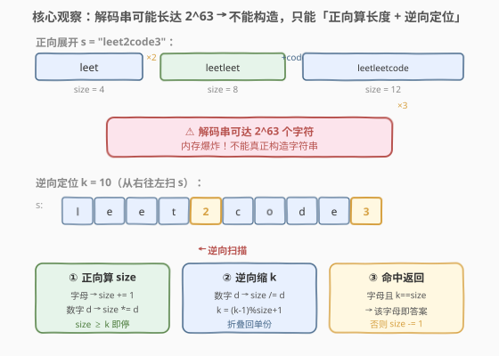
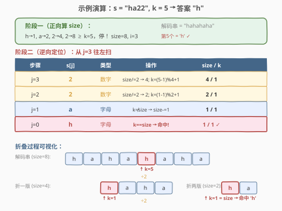

# LeetCode 索引处的解码字符串 题解

## 1. 题目概述

- **标题 / 题号**：索引处的解码字符串（#880，medium）
- **链接**：https://leetcode.cn/problems/decoded-string-at-index/
- **难度**：中等
- **标签**：字符串、数学、模拟、逆向思维

**题意**：给定一个编码字符串 `s`。解码规则：从左到右逐个读取字符——

- 读到**字母**：直接追加到磁带末尾；
- 读到**数字 `d`**：将当前磁带内容整体**再重复 `d−1` 次**（即总共 `d` 份）。

现在给定 `s` 和索引 `k`，返回解码后字符串的**第 `k` 个字母**（1 下标）。

**示例 1**：

```text
输入：s = "leet2code3", k = 10
输出："o"
解释：解码串为 "leetleetcodeleetleetcodeleetleetcode"。
     第 10 个字母是 "o"。
```

**示例 2**：

```text
输入：s = "ha22", k = 5
输出："h"
解释：解码串为 "hahahaha"。第 5 个字母是 "h"。
```

**示例 3**：

```text
输入：s = "a2345678999999999999999", k = 1
输出："a"
解释：解码串为 "a" 重复约 8.3×10^18 次。第 1 个字母是 "a"。
```

**约束**：

- `2 <= s.length <= 100`
- `s` 只含小写字母与数字 `2`–`9`
- `s` 以字母开头
- `1 <= k <= 10^9`
- 题目保证 `k` 不超过解码串长度
- 解码串长度少于 $2^{63}$

> ⚠️ **关键约束**：解码串可能长达 $2^{63}$，内存根本放不下。这道题的考点正是**如何在不构造字符串的情况下定位第 `k` 个字符**。

## 2. 解题思路

### 2.1 暴力思路

老老实实地模拟解码过程：用 `string` 或 `StringBuilder` 不断追加和重复，直到长度达到 `k`，返回第 `k` 个字符。

问题在于：示例 3 中解码串长度约 $8.3 \times 10^{18}$，即使每个字符只占 1 字节，也需要 8 EB 内存——不可能构造。

> 💡 **识别信号**：当题目要求的输出只是序列中**某一个位置的元素**，而序列本身可以被重复/展开到天文数字级别时，要想「**能不能不构造整个序列，直接定位到目标位置**」。这与 [400. 第 N 位数字](https://leetcode.cn/problems/nth-digit/) 的思路一脉相承。

### 2.2 核心观察：正向算长度 + 逆向折叠定位



核心思路分两步：

**第一步（正向）**：扫描 `s`，模拟解码过程但**只跟踪长度 `size`**，不存内容。

- 遇到字母：`size += 1`
- 遇到数字 `d`：`size *= d`

一旦 `size >= k`，就可以停止——因为第 `k` 个字符一定在当前已扫描的前缀解码结果中。

**第二步（逆向）**：从停止位置**从右往左**扫描 `s`，利用重复结构的周期性把 `k` 「折叠」回单份。

关键观察：当遇到数字 `d` 时，当前解码串是**前一段内容重复 `d` 次**。因此第 `k` 个字符等价于前一段中第 `(k-1) % prev_size + 1` 个字符（`prev_size = size / d`）：

- 字母：若 `k == size`，这个字母就是答案；否则 `size -= 1`，继续。
- 数字 `d`：`size /= d`，然后 $k = (k - 1) \bmod \text{size} + 1$（把 `k` 折叠回单份）。

> 💡 **为什么逆向有效？** 正向展开是「先写一段字母，再乘 `d` 份，再追加字母，再乘……」。逆向走时，每碰到一个数字 `d`，就相当于问：「第 `k` 个字符在 `d` 份重复的哪一份里？」答案是对单份长度取余——无论落在哪一份，对应字符都一样。折叠后 `k` 就缩小到了单份内部的位置，逐步逼近最终的字母。

> ⚠️ **1 下标的取余技巧**：`k` 是 1-indexed。直接 `k % size` 在 `k` 恰好是 `size` 的整数倍时会得到 0，需要特判为 `size`。用公式 $k = (k - 1) \bmod \text{size} + 1$ 可以统一处理：先把 `k` 转成 0-indexed 取余，再加回 1，结果范围恒为 $[1, \text{size}]$。

### 2.3 算法流程图


正向阶段：逐字符扫描，字母加 1、数字乘 `d`，`size >= k` 即停。逆向阶段：从停住的位置往左走，数字做除法折叠 `k`，字母做匹配判定。

### 2.4 示例演算



以 `s = "ha22"`、`k = 5` 为例，解码串为 `"hahahaha"`（长度 8）。

**正向**：`h→1, a→2, 2→4, 2→8 ≥ 5`，停！`size = 8, i = 3`。

**逆向**（从 `j = 3` 往左）：

| 步骤 | s[j] | 类型 | 操作 | size | k |
|------|------|------|------|------|---|
| j=3 | `2` | 数字 | `size/=2 → 4`; `k=(5−1)%4+1` | 4 | 1 |
| j=2 | `2` | 数字 | `size/=2 → 2`; `k=(1−1)%2+1` | 2 | 1 |
| j=1 | `a` | 字母 | `k≠size` → `size−=1` | 1 | 1 |
| j=0 | `h` | 字母 | `k==size` → **命中!** | 1 | 1 |

返回 `'h'`。✓

两次数字折叠将 `k=5` 逐步缩到单份 `"ha"` 中的第 1 个字符 `'h'`。

## 3. 参考代码

### C++

```cpp
class Solution {
  public:
    string decodeAtIndex(string s, int k) {
        long long size = 0;
        int n = s.size();
        int i = 0;
        for (; i < n; i++) {
            if (isdigit(s[i])) {
                size *= (s[i] - '0');
            } else {
                size++;
            }
            if (size >= k) break;
        }
        for (int j = i; j >= 0; j--) {
            if (isdigit(s[j])) {
                size /= (s[j] - '0');
                k = (k - 1) % size + 1;
            } else {
                if (k == size) return string(1, s[j]);
                size--;
            }
        }
        return "";
    }
};
```

### Python

```python
class Solution:
    def decodeAtIndex(self, s: str, k: int) -> str:
        size = 0
        i = 0
        n = len(s)
        while i < n:
            if s[i].isdigit():
                size *= int(s[i])
            else:
                size += 1
            if size >= k:
                break
            i += 1
        for j in range(i, -1, -1):
            if s[j].isdigit():
                size //= int(s[j])
                k = (k - 1) % size + 1
            else:
                if k == size:
                    return s[j]
                size -= 1
        return ""
```

> ⚠️ **两个易错点**：
> 1. **溢出**：C++ 中 `size` 必须用 `long long`。虽然正向循环在 `size >= k` 时就停了（`k ≤ 10^9`），但单次乘法可能让 `size` 从 `k−1` 跳到 `9(k−1) ≈ 9 \times 10^9`，超过 32 位 `int` 上界（约 $2.1 \times 10^9$）。Python 整数无上限无此问题。
> 2. **取余公式**：务必用 `(k − 1) % size + 1` 而非 `k % size`。后者在 `k` 是 `size` 整数倍时返回 0，会导致越界或错误返回空串。

## 4. 复杂度分析

| 维度 | 复杂度 | 说明 |
|------|--------|------|
| 时间复杂度 | $O(n)$ | 正向、逆向各扫描 `s` 一次，`n = s.length ≤ 100` |
| 空间复杂度 | $O(1)$ | 仅用 `size`、`k`、下标等常数变量 |

## 5. 扩展：逆向定位的通用思路

本题属于一类「**序列可展开但只取第 `k` 个元素**」的问题。核心范式是：

1. **正向模拟但不存储**：只跟踪长度/计数，遇到展开操作就乘倍数，直到覆盖目标位置。
2. **逆向折叠**：从展开点往回走，用**取余**把目标位置缩回到单份内，逐步定位到具体元素。

这种「不构造、只定位」的思想在以下场景中反复出现：

- **分段计数定位**：如 [400. 第 N 位数字](https://leetcode.cn/problems/nth-digit/)，按位数分层（1 位数 9 个、2 位数 90 个……），逐层减去锁定层数，再在层内定位。
- **阶乘进制定位**：如 [60. 第 k 个排列](https://leetcode.cn/problems/permutation-sequence/)，用康托尔展开逐位确定排列元素，不枚举所有排列。
- **重复串定位**：即本题，用取余折叠重复段。

> 💡 **共性**：当展开后的序列具有**周期性**或**可分段**结构时，取余和整除就是「坐标系变换」——把展开空间的位置映射回生成空间的位置。

## 6. 面试要点

1. **为什么不能直接模拟解码？**

   - 解码串长度可达 $2^{63}$，内存无法容纳。即使 `s` 很短（如 `"a2345678999999999999999"`），连续乘法也会让长度指数爆炸。必须放弃构造，改为只跟踪长度。

2. **逆向时遇到数字为什么用 `size /= d` 再对 `k` 取余？**

   - 数字 `d` 的含义是「把之前 `size/d` 长度的内容重复 `d` 次」。展开后第 `k` 个字符落在某一重复份中，但每份内容相同，所以等价于单份中第 $(k-1) \bmod (\text{size}/d) + 1$ 个字符。`size /= d` 把长度缩回单份，取余把 `k` 折回单份内位置。

3. **为什么用 `(k−1) % size + 1` 而不是 `k % size`？**

   - `k` 是 1-indexed。当 `k` 恰好是 `size` 的整数倍时，`k % size == 0`，但实际应指向第 `size` 个字符。公式 `(k−1) % size + 1` 先转 0-indexed 取余再加回 1，结果恒在 $[1, \text{size}]$，无需特判。

4. **正向循环为什么可以在 `size >= k` 时提前停止？**

   - 后续字符只会让 `size` 更大（追加字母 +1 或乘数字 ×d），不会改变已展开部分的内容。第 `k` 个字符一定在当前前缀的解码结果中，后续展开不影响它的位置（逆向折叠时会跳过它们）。

5. **如果 `k` 很小（如 `k=1`），算法表现如何？**

   - 正向循环在第一个字母处 `size=1 >= k=1` 即停，逆向立即命中该字母返回。最优情况 $O(1)$。

## 同类练习题

| # | 题目 | 与本题的关联 |
|---|------|-------------|
| 394 | [字符串解码](https://leetcode.cn/problems/decode-string/) | 正向解码的母题（用栈展开 `k[子串]` 格式），对比本题「不构造、只定位」的逆向思路 |
| 400 | [第 N 位数字](https://leetcode.cn/problems/nth-digit/) | 同为「不构造序列，按位定位第 k 个」，按位数分层逐层减去锁定层数 |
| 60 | [第 k 个排列](https://leetcode.cn/problems/permutation-sequence/) | 同为「不枚举，定位第 k 个」，用康托尔展开（阶乘进制）逐位确定 |
| 726 | [原子的数量](https://leetcode.cn/problems/number-of-atoms/) | 字符串展开与计数，用栈处理嵌套括号乘数，对比本题的逆向取余 |
