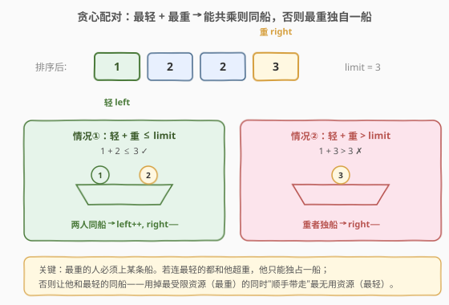
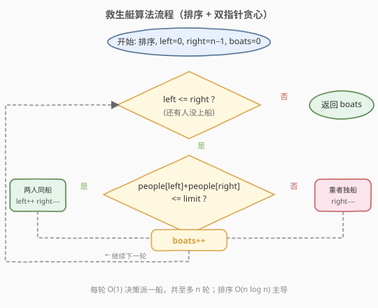

# 救生艇

- **题目名称**：救生艇
- **链接**：[881. 救生艇](https://leetcode.cn/problems/boats-to-save-people/)
- **难度**：中等
- **标签**：贪心、排序、双指针

## 1. 题目概述

给定数组 `people`，其中 `people[i]` 是第 `i` 个人的体重；再给定一个整数 `limit`，表示每艘船的**最大载重**。

每艘船**最多同时承载两人**，且这两人体重之和不得超过 `limit`。返回把所有人运走所需的**最少船数**。

**示例 1**：

```text
输入：people = [1,2], limit = 3
输出：1
解释：1 + 2 = 3 ≤ 3，两人同乘一艘船。
```

**示例 2**：

```text
输入：people = [3,2,2,1], limit = 3
输出：3
解释：排序后 [1,2,2,3]。
  - 1+3=4 > 3 → 3 独乘一船；
  - 1+2=3 ≤ 3 → 1、2 同乘一船；
  - 剩下 2 独乘一船。共 3 艘。
```

**示例 3**：

```text
输入：people = [3,5,3,4], limit = 5
输出：4
解释：排序后 [3,3,4,5]。任意两人体重和都 > 5，每人各乘一船。
```

**约束条件**：

- `1 <= people.length <= 5 * 10^4`
- `1 <= people[i] <= limit <= 3 * 10^4`

---

## 2. 解题思路

### 2.1 暴力思路

枚举所有「两人同乘」的配对组合，贪心地让尽量多的人两两同乘，剩余的人各独乘一船。但「选哪些对」本质上是一个**最大匹配**问题，暴力枚举配对是 $O(2^n)$ 级别，`n = 5×10^4` 必爆。

> ⚠️ 关键在于：并非任意两人都能同乘（受 `limit` 约束），但**每艘船最多两人**这一约束让问题结构大大简化——只需决定「谁能和谁同乘」，而不必考虑更复杂的装箱。

### 2.2 核心观察：排序 + 双指针贪心



**关键直觉**：最重的人无论如何都得上船。他要么独自一船，要么和某人拼船——而能和他拼船的，体重越小越容易满足 `和 ≤ limit`。所以**让最重的人和最轻的人尝试配对**是最优策略。

排序后用双指针 `left`（最轻未上船者）和 `right`（最重未上船者）从两端向中间夹逼，每轮做一次决策：

- **若 `people[left] + people[right] ≤ limit`**：最重者连最轻者都能拼，两人同乘一船 → `left++`，`right--`。
- **若 `people[left] + people[right] > limit`**：最重者即使和最轻者拼都超重，说明他**不可能和任何人拼船**（最轻已经是体重最小的了），只能独自一船 → `right--`。

每轮恰好派出一艘船，`boats++`。

> 💡 **为什么「最重 + 最轻」配对是最优的？** 直觉上，最重者是「最受限资源」——他最难找到拼船伙伴；最轻者是「最不受限资源」——他和谁都可能拼。把最受限的资源和最容易配合的资源放一起，能最大化拼船机会。严格的正确性证明见第 5 节（交换论证）。

> ⚠️ **本题与 [11. 盛最多水的容器](../0001-0100/11_盛最多水的容器.md) 的双指针方向相反**：11 题移动**短板**（较矮一侧）来寻找更大面积；本题固定考察**最重 + 最轻**两端，不满足则丢弃最重端。两者都是「排序/夹逼 + 贪心移动」，但贪心依据不同。

### 2.3 算法流程图



注意循环条件是 `left <= right`（而非 `left < right`）：当 `left == right` 时还剩一个人没上船，需要单独派一艘船。每轮无论配对与否都 `boats++`，因为每轮恰好解决最重端的那个人。

### 2.4 示例演算

![示例演算：people = [3,2,2,1], limit = 3](../images/boats_example_walkthrough.svg)

以 `people = [3,2,2,1]`、`limit = 3` 为例（排序后 `[1,2,2,3]`）：

- **第 1 轮** `left=0, right=3`：`1 + 3 = 4 > 3` → 3 独船，`boats=1`，`right=2`。
- **第 2 轮** `left=0, right=2`：`1 + 2 = 3 ≤ 3` → 1、2 同船，`boats=2`，`left=1, right=1`。
- **第 3 轮** `left=1, right=1`：`left == right`，剩 1 人 → 2 独船，`boats=3`，`left=2, right=0`。
- `left > right`，结束，返回 `boats = 3`。

---

## 3. 参考代码

### C++

```cpp
class Solution {
  public:
    int numRescueBoats(vector<int>& people, int limit) {
        sort(people.begin(), people.end());
        int left = 0, right = (int)people.size() - 1;
        int boats = 0;
        while (left <= right) {
            if (people[left] + people[right] <= limit) {
                left++;  // 最轻者上船
            }
            // 无论是否配对，最重者都要上船
            right--;
            boats++;
        }
        return boats;
    }
};
```

### Python

```python
class Solution:
    def numRescueBoats(self, people: List[int], limit: int) -> int:
        people.sort()
        left, right = 0, len(people) - 1
        boats = 0
        while left <= right:
            if people[left] + people[right] <= limit:
                left += 1   # 最轻者上船
            right -= 1      # 最重者上船
            boats += 1
        return boats
```

> 💡 **代码写法技巧**：两种分支都执行 `right--` 和 `boats++`，只在「能配对」时额外 `left++`。这样用一个 `if` 而非 `if-else` 消除重复代码，逻辑等价且更简洁。面试时这样写既清晰又显功底。

> ⚠️ **边界 `left == right`**：此时 `people[left] + people[right]` 是同一个人和自己相加，必然 `> limit`（因为 `people[i] ≤ limit` 但 `2 × people[i] > limit` 不一定成立——实际上单人乘船不受 `limit` 的两人约束影响，题目保证 `people[i] ≤ limit`）。但代码中 `left == right` 时 `left++` 后 `left > right` 循环自然终止，`boats` 已正确加 1，无需特判。

---

## 4. 复杂度分析

| 维度 | 复杂度 | 说明 |
|------|--------|------|
| 时间复杂度 | $O(n \log n)$ | 排序 $O(n \log n)$ + 双指针单趟扫描 $O(n)$，排序主导 |
| 空间复杂度 | $O(\log n)$ | 排序所需栈空间（C++ `std::sort` 内省排序）；不计排序则为 $O(1)$ |

---

## 5. 扩展：贪心正确性证明（交换论证）

**命题**：上述「最重 + 最轻」贪心策略使用的船数最少。

**证明（交换论证）**：设最优解为 $OPT$，贪心解为 $ALG$。我们证明可以把 $OPT$ 逐步改造成 $ALG$ 的形式而不增加船数。

考察贪心第一轮处理的最重者 $h = \text{people}[right]$（排序后最右端）：

- **情形一：贪心让 $h$ 独乘**（即 $h + \text{people}[left] > \text{limit}$）。此时 $h$ 与**任何**未上船者的体重和都 $> \text{limit}$（因为最轻者已是体重最小者）。故 $OPT$ 中 $h$ 也只能独乘。去掉 $h$ 后，剩余子问题相同，归纳成立。

- **情形二：贪心让 $h$ 与最轻者 $l = \text{people}[left]$ 同乘**（即 $h + l \leq \text{limit}$）。设 $OPT$ 让 $h$ 与某人 $x$ 同乘（$x \neq l$，可能 $x$ 不存在即 $h$ 独乘），而 $l$ 与某人 $y$ 同乘或独乘（$y$ 可能不存在）。

  - 由于 $l \leq x$（$l$ 是最轻者），有 $h + l \leq h + x \leq \text{limit}$，所以 $h$ 与 $l$ 同乘**合法**。
  - 把 $x$ 换去和 $y$ 同乘（或独乘）：因为 $x \leq h$，若 $y$ 原能和 $h$ 或别人满足约束，$x$ 替换后更容易满足（体重更轻）。即使 $x$ 独乘，也只是把 $h$ 的伙伴从 $x$ 换成 $l$，船数不增。

  这样交换后 $OPT$ 中 $h$ 与 $l$ 同乘，船数不增。去掉 $h, l$ 后对剩余子问题归纳。

由数学归纳法，$ALG \leq OPT$，又 $OPT \leq ALG$（贪心是一种可行解），故 $ALG = OPT$。$\blacksquare$

> 💡 **交换论证的核心**：贪心做出的「最重 + 最轻」配对总是可以被「安插」进任意最优解而不破坏合法性、不增加船数。这种「我的选择不比最优差」的论证是贪心正确性证明的通用范式。

---

## 6. 面试要点

1. **为什么让最重者和最轻者配对，而不是最重和次重？**

   - 最重者最难找到伙伴（最容易超重）。让他先和最轻者试，若连最轻者都拼不了，则他和任何人都拼不了，只能独乘。若能拼，则顺手把最不容易找到伙伴的人（最重）和最容易被剩下的人（最轻）一起解决，给中间的人留出更多配对空间。

2. **为什么排序后双指针不会遗漏更优配对？**

   - 交换论证保证：任意最优解都能被改写成「最重 + 最轻」的形式而不增加船数。所以贪心每步的选择都被某个最优解包含，不会错过更优解。

3. **循环条件为什么是 `left <= right` 而不是 `left < right`？**

   - `left < right` 会在剩最后一个未被处理的人（`left == right`）时提前退出，漏算一艘船。`left <= right` 保证最后一个孤立的人也被派船。

4. **如果每艘船能承载的人数不是 2 而是 3，怎么做？**

   - 变成**装箱问题**变体，贪心不再保证最优（3 人装箱是 NP-hard 的近似场景）。常见做法仍是用贪心近似（最重 + 尽量多的轻者）或退化为多重背包，但最优解需 DP/搜索，超出本题范围。

5. **时间瓶颈在哪？能否不用排序？**

   - 瓶颈是排序 $O(n \log n)$。由于 `people[i] ≤ limit ≤ 3×10^4`，值域不大，可用**计数排序**把排序降到 $O(n + \text{limit})$，再用双指针在值域上扫描，整体 $O(n + \text{limit})$。面试中可作为「值域小时优化」的加分点提出。

---

## 7. 同类练习题

- [455. 分发饼干](https://leetcode.cn/problems/assign-cookies/)：同款「排序 + 双指针贪心」模板，最小火饼干配最小胃口孩子，体会贪心配对方向
- [11. 盛最多水的容器](https://leetcode.cn/problems/container-with-most-water/)：双指针夹逼 + 贪心移动短板，对比本题「移动最重端」的贪心依据差异
- [976. 三角形的最大周长](https://leetcode.cn/problems/largest-perimeter-triangle/)：排序后贪心取最大边 + 双指针判定，同为「排序暴露贪心结构 + 双指针」范式
- [435. 无重叠区间](https://leetcode.cn/problems/non-overlapping-intervals/)：贪心区间调度（按右端点排序），另一类「排序 + 贪心」范式
- [252. 会议室](https://leetcode.cn/problems/meeting-rooms/)：区间排序 + 贪心判定重叠，与本题同为「排序暴露贪心结构」的思路
