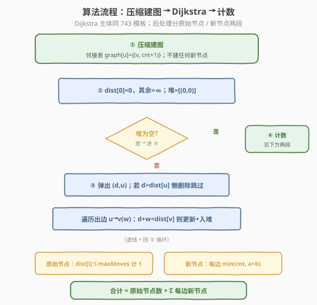

# LeetCode 细分图中的可到达节点 题解

## 1. 题目概述

- **标题 / 题号**：细分图中的可到达节点（#882，hard）
- **链接**：https://leetcode.cn/problems/reachable-nodes-in-subdivided-graph/
- **难度**：困难
- **标签**：图、最短路径、Dijkstra、堆/优先队列

**题意**：给定一个由 `n` 个节点（编号 `0` 到 `n-1`）组成的**无向**原始图。边列表 `edges[i] = [u_i, v_i, cnt_i]` 表示原图中 `u_i` 与 `v_i` 之间有一条边，并且要把这条边**细分**——即在 `u_i`、`v_i` 之间插入 `cnt_i` 个**新节点**，从而把一条边变成 `cnt_i + 1` 条小段（segment）。

从节点 `0` 出发，最多走 `maxMoves` 步，每一步跨越一条小段。问**最多能到达多少个节点**（原始节点 + 新节点都算；只要能“路过/停在某点”即视为可到达）。

**示例 1**：

```text
输入：edges = [[0,1,10],[0,2,1],[1,2,2]], maxMoves = 6, n = 3
输出：13
解释：原始节点 0、1、2 全部可达（3 个）；
      边 0-1 上插入 10 个新节点，可达 7 个；
      边 0-2 上插入 1 个新节点，可达 1 个；
      边 1-2 上插入 2 个新节点，可达 2 个；
      合计 3 + 7 + 1 + 2 = 13。
```

**示例 2**：

```text
输入：edges = [[0,1,4],[1,2,6],[0,2,8],[1,3,1]], maxMoves = 10, n = 4
输出：23
```

**约束**：

- `0 <= edges.length <= min(n * (n - 1) / 2, 10^4)`
- `edges[i].length == 3`
- `0 <= u_i < v_i < n`
- `0 <= cnt_i <= 10^4`
- `0 <= maxMoves <= 10^9`
- `1 <= n <= 3000`
- 图中无重复边、无自环

> ⚠️ **两个关键信号**：
> 1. `cnt_i` 可达 `10^4`、`maxMoves` 可达 `10^9`——**绝对不能真的把新节点建出来**（节点总数最坏 `10^8` 级），必须“整体计数”；
> 2. 边权（小段数）各不相同 → 求最短步数天然对应 **Dijkstra**（承接 [743. 网络延迟时间](../0701-0800/743_网络延迟时间.md) 的堆优化模板）。

## 2. 解题思路

### 2.1 暴力思路：建出所有新节点做 BFS

最直觉的做法：按题意把每条边“展开”成 `cnt_i` 个新节点，得到一张巨大的图，然后从 `0` 做 BFS / Dijkstra 数能到达的节点。

问题在于规模：`cnt_i` 最大 `10^4`，`edges` 最多 `10^4` 条，展开后新节点可达 `10^8` 个，BFS/Dijkstra 在时间和空间上都直接爆炸。

> ⚠️ 真正的新节点我们**不需要逐个追踪**——因为同一条边上的新节点是“排成一队”的，从某一端进入能走多远，只取决于“该端原始节点到 `0` 的最短距离”。于是把每条边**压缩成一条带权边**（权重 = `cnt_i + 1`），先只在原始节点上跑 Dijkstra，再按边“批量化”统计新节点即可。

### 2.2 核心观察：边权压缩 + 按边整体计数


关键有三点：

1. **边权压缩**：把边 `(u, v, cnt)` 看作权重为 `cnt + 1` 的边（跨越 `cnt` 个新节点需要 `cnt + 1` 步）。这样原图只剩 `n ≤ 3000` 个节点，可直接跑堆优化 Dijkstra，求出 `dist[i]` = 从 `0` 到原始节点 `i` 的最少步数。

2. **原始节点计数**：`dist[i] <= maxMoves` 的原始节点 `i` 可到达，每个计 `1`。

3. **新节点按边整体计数**：对每条边 `(u, v, cnt)`，新节点排成一条链。从 `u` 端最多能向 `v` 方向深入 `maxMoves - dist[u]` 个新节点；从 `v` 端最多能向 `u` 方向深入 `maxMoves - dist[v]` 个新节点。两端能覆盖的新节点数为

$$\text{reachable} = \min\bigl(\text{cnt},\; \max(0, \text{maxMoves} - \text{dist}[u]) + \max(0, \text{maxMoves} - \text{dist}[v])\bigr)$$

- 两端从相反方向“夹击”同一条链，覆盖数相加再与 `cnt` 取 `min`（不能超过这条边上实际的新节点数）；
- 若 `dist[u] > maxMoves`，则 `u` 端贡献 `0`（`max` 钳制负数），`v` 端同理。

> 💡 **正确性直觉**：Dijkstra 给出的 `dist[u]`、`dist[v]` 是到两端的最短步数；从 `0` 出发走到 `u` 后“剩余步数”恰好是 `maxMoves - dist[u]`，沿这条边能再吃掉多少个新节点就由它决定。两端可能各自从一侧进入并在中间相遇，相加后超过 `cnt` 的部分必然重复，故取 `min`。

> ⚠️ **数据范围陷阱**：`maxMoves` 高达 `10^9`，`maxMoves - dist[u]` 可达 `10^9`，两端相加可达 `2×10^9`，**超出 32 位 int 上界**（`2.1×10^9`）。C++ 中需用 `long long` 存中间和，或先各自与 `cnt` 比较钳制；Python 无此问题。

### 2.3 算法流程图



### 2.4 示例演算

以示例 1 `edges = [[0,1,10],[0,2,1],[1,2,2]], maxMoves = 6, n = 3` 为例。压缩后边权：`0-1: 11`、`0-2: 2`、`1-2: 3`。


**Dijkstra 过程**（从 `0` 出发）：

| 步骤 | 弹出 (d,u) | 松弛出边 | dist 变化 | 堆（处理后） |
|------|-----------|---------|----------|--------------|
| 初始 | — | dist[0]=0 | [0,∞,∞] | [(0,0)] |
| 1 | (0,0) | 0→1: 0+11=11<∞；0→2: 0+2=2<∞ | [0,11,2] | [(2,2),(11,1)] |
| 2 | (2,2) | 2→1: 2+3=5<11 ✓ | [0,5,2] | [(5,1),(11,1)] |
| 3 | (5,1) | 1→2: 5+3=8>2 ✗ | 不变 | [(11,1)] |
| 4 | (11,1) | 11>5 过期，跳过 | 不变 | [] |

得 `dist = [0, 5, 2]`。

**按边统计新节点**（`maxMoves = 6`）：

| 边 (u,v,cnt) | a=6−dist[u] | b=6−dist[v] | min(cnt, a+b) | 贡献 |
|--------------|-------------|-------------|---------------|------|
| (0,1,10) | 6−0=6 | 6−5=1 | min(10, 7)=7 | 7 |
| (0,2,1)  | 6−0=6 | 6−2=4 | min(1, 10)=1 | 1 |
| (1,2,2)  | 6−5=1 | 6−2=4 | min(2, 5)=2 | 2 |

原始节点：`dist[0]=0、dist[1]=5、dist[2]=2` 均 `≤ 6`，计 `3`。合计 `3 + 7 + 1 + 2 = 13`。

> 💡 注意第 2 步 `2→1` 把 `dist[1]` 从 `11` 优化到 `5`——这正是“绕路反而更近”的体现（经 `0→2→1` 共 5 步，比直走 `0→1` 的 11 步短得多），也是必须用 Dijkstra 而非 BFS 的原因。

## 3. 参考代码

### C++

```cpp
class Solution {
  public:
    int reachableNodes(vector<vector<int>>& edges, int maxMoves, int n) {
        // 邻接表：graph[u] = {(v, cnt+1), ...}，权重 = 小段数 = cnt+1
        vector<vector<pair<int,int>>> graph(n);
        for (auto& e : edges) {
            graph[e[0]].push_back({e[1], e[2] + 1});
            graph[e[1]].push_back({e[0], e[2] + 1});
        }

        const int INF = INT_MAX / 2;
        vector<int> dist(n, INF);
        dist[0] = 0;

        // 最小堆：(距离, 节点)
        priority_queue<pair<int,int>, vector<pair<int,int>>, greater<>> pq;
        pq.push({0, 0});

        while (!pq.empty()) {
            auto [d, u] = pq.top(); pq.pop();
            if (d > dist[u]) continue;          // 懒删除
            for (auto& [v, w] : graph[u]) {
                int nd = d + w;
                if (nd < dist[v]) {
                    dist[v] = nd;
                    pq.push({nd, v});
                }
            }
        }

        // 1) 原始节点：dist[i] <= maxMoves 即可达
        int ans = 0;
        for (int i = 0; i < n; ++i)
            if (dist[i] <= maxMoves) ++ans;

        // 2) 新节点：按边整体计数
        //    maxMoves 可达 1e9，两端剩余步数相加可能溢出 int，用 long long
        for (auto& e : edges) {
            int u = e[0], v = e[1], cnt = e[2];
            long long a = max(0, maxMoves - dist[u]);
            long long b = max(0, maxMoves - dist[v]);
            ans += (int)min((long long)cnt, a + b);
        }
        return ans;
    }
};
```

### Python

```python
class Solution:
    def reachableNodes(self, edges: List[List[int]], maxMoves: int, n: int) -> int:
        graph = [[] for _ in range(n)]
        for u, v, cnt in edges:
            graph[u].append((v, cnt + 1))
            graph[v].append((u, cnt + 1))

        INF = float('inf')
        dist = [INF] * n
        dist[0] = 0

        pq = [(0, 0)]  # 最小堆：(距离, 节点)
        while pq:
            d, u = heapq.heappop(pq)
            if d > dist[u]:          # 懒删除
                continue
            for v, w in graph[u]:
                nd = d + w
                if nd < dist[v]:
                    dist[v] = nd
                    heapq.heappush(pq, (nd, v))

        # 1) 原始节点
        ans = sum(1 for i in range(n) if dist[i] <= maxMoves)

        # 2) 新节点：按边整体计数
        for u, v, cnt in edges:
            a = max(0, maxMoves - dist[u])
            b = max(0, maxMoves - dist[v])
            ans += min(cnt, a + b)
        return ans
```

> 💡 **写法对照**：Dijkstra 主体与 [743. 网络延迟时间](../0701-0800/743_网络延迟时间.md) 几乎逐行相同——同样的「邻接表 + 最小堆 + 懒删除」模板。本题只是把“求最大 dist”换成了“原始节点计数 + 按边统计新节点”两段后处理，是 Dijkstra 模板的**二次应用**典型。

## 4. 复杂度分析

| 维度 | 复杂度 | 说明 |
|------|--------|------|
| 时间复杂度 | `O(E log V)` | Dijkstra 主导：`E` 条边各松弛一次入堆，堆操作 `O(log V)`；按边统计 `O(E)` |
| 空间复杂度 | `O(V + E)` | 邻接表 `O(E)`、`dist` 数组 `O(V)`、堆最坏 `O(E)` |

其中 `V = n ≤ 3000`，`E ≤ 10^4`。注意**新节点从未真正建出**——`cnt` 只作为标量参与 `min` 运算，故复杂度与 `cnt`、`maxMoves` 的取值无关，只与原始图规模挂钩。

> ⚠️ 若误用“展开建图 + BFS”，节点数 `O(Σcnt_i)` 最坏 `10^8`，时间空间双双超限。本题考点正在于此：**用最短路 + 数学计数代替显式建图**。

## 5. 扩展：为什么不能两端独立取 min 再相加？

一种常见错误写法是：`ans += min(cnt, a) + min(cnt, b)`，理由是“各自从一端吃，互不干扰”。但这会**重复计数**中间被两端共同覆盖的新节点。

考虑 `cnt = 2`、`a = 2`、`b = 2`（两端剩余步数都够走完整条链）：

- 错误：`min(2,2) + min(2,2) = 4`，但这条边上总共只有 2 个新节点；
- 正确：`min(cnt, a+b) = min(2, 4) = 2`。

两端从相反方向“夹击”同一条链，覆盖区间会在中间**重叠**，重叠部分只能算一次，故必须先把两端的“能走距离”相加再与 `cnt` 取 `min`，而不是各自取 `min` 后相加。

> 💡 这与 [42. 接雨水](../0001-0100/42_接雨水.md) 的“左右两端水位取 min 决定单点高度”形似但方向相反：接雨水是 `min(左,右)` 决定上限，这里是 `min(容量, 左+右)` 处理覆盖重叠。

## 6. 面试要点

1. **为什么不能真的把新节点建出来？**

   - `cnt_i ≤ 10^4`、`edges ≤ 10^4`，新节点总数最坏 `10^8`，BFS/Dijkstra 的 `O(V+E)` 会爆。题目的核心考点就是**避免显式建图**：把边压缩成权重 `cnt+1`，只在 `n` 个原始节点上跑最短路，新节点用公式按边批量计数。

2. **为什么边权是 `cnt + 1` 而不是 `cnt`？**

   - `cnt` 个新节点把一条边切成 `cnt + 1` 段。从 `u` 走到 `v` 要跨过全部 `cnt` 个新节点，共 `cnt + 1` 步。所以 Dijkstra 中的边权（步数）是 `cnt + 1`。

3. **新节点计数公式为什么是 `min(cnt, a + b)`？**

   - `a = maxMoves - dist[u]` 是到达 `u` 后还剩的步数，能向 `v` 方向深入 `a` 个新节点；`b` 同理从 `v` 端。两端从相反方向覆盖同一条链，覆盖数相加，但整条链只有 `cnt` 个新节点，超过部分是重叠，取 `min` 去重。

4. **`max(0, maxMoves - dist[u])` 里的 `max(0, …)` 是必须的吗？**

   - 是。若 `dist[u] > maxMoves`（`u` 本身不可达），`maxMoves - dist[u]` 为负，表示从该端无法进入这条边，贡献应为 `0`。`max` 把负数钳为 `0`。注意：即便两端都不可达，`min(cnt, 0) = 0`，该边不计任何新节点，逻辑自洽。

5. **为什么用 Dijkstra 而不是 BFS？**

   - 各边“小段数”不同，边权不统一。BFS 的“层数 = 距离”只对等权图成立；边权不等时必须让“当前 dist 最小的节点”优先处理，即 Dijkstra。示例 1 中 `0→2→1`（5 步）比直走 `0→1`（11 步）更短，正是绕路更优的体现。

6. **`maxMoves` 高达 `10^9`，C++ 有什么坑？**

   - `maxMoves - dist[u]` 可达 `10^9`，两端相加可达 `2×10^9`，超出 `int` 上界（约 `2.1×10^9`，临界）。用 `long long` 存 `a`、`b` 及其和，再做 `min`，是最稳妥写法；也可先 `min(a, cnt)` 再相加避免大数，但可读性略差。

## 同类练习题

| # | 题目 | 与本题的关联 |
|---|------|-------------|
| 743 | [网络延迟时间](https://leetcode.cn/problems/network-delay-time/) | 堆优化 Dijkstra 单源最短路模板（本题 Dijkstra 主体的母题） |
| 787 | [K 站中转内最便宜的航班](https://leetcode.cn/problems/cheapest-flights-within-k-stops/) | 限制步数的 Bellman-Ford，对照本题“限制 maxMoves 步”但用最短路 + 计数的不同处理 |
| 1514 | [概率最大的路径](https://leetcode.cn/problems/path-with-maximum-probability/) | Dijkstra 变体（最长路），巩固堆优化模板 |
| 1631 | [最小体力消耗路径](https://leetcode.cn/problems/path-with-minimum-effort/) | Dijkstra 变体，路径代价定义为边上最大权差 |
| 1976 | [到达目的地的方案数](https://leetcode.cn/problems/number-of-ways-to-arrive-at-destination/) | Dijkstra 求最短路 + 统计方案数，Dijkstra 后处理的另一范例 |
