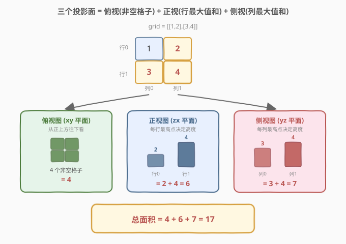
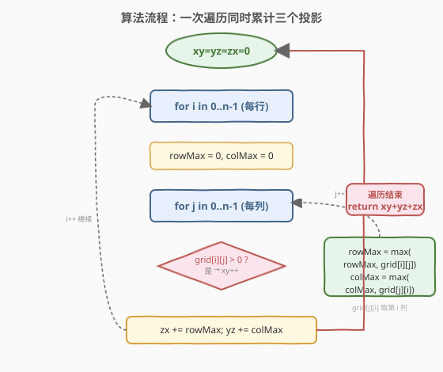
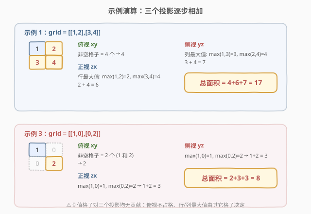

# 三维形体投影面积

- **题目名称**：三维形体投影面积
- **链接**：[883. 三维形体投影面积](https://leetcode.cn/problems/projection-area-of-3d-shapes/)
- **难度**：简单
- **标签**：几何、数组、数学

## 1. 题目概述

在 $n \times n$ 的网格 `grid` 中，我们放置了一些与 $x, y, z$ 三轴对齐的 $1 \times 1 \times 1$ 立方体。每个值 `v = grid[i][j]` 表示在格子 $(i, j)$ 上叠放了 $v$ 个正方体（即一列高度为 $v$ 的"塔"）。

现在查看这些立方体在 `xy`、`yz`、`zx` 三个平面上的**投影**（就像影子，把三维形体映射到二维平面）。返回**所有三个投影的总面积**。

> 💡 **直观理解三个投影**：分别对应从**正上方**、**正前方**、**正侧方**三个方向看过去看到的"影子"面积。每个方向上，后排被前排遮挡的部分不计入。

**示例 1**：

```text
输入：grid = [[1,2],[3,4]]
输出：17
解释：2×2 网格，四个格子分别有 1、2、3、4 个立方体。
三个投影面积分别为 4、6、7，总和 17。
```

**示例 2**：

```text
输入：grid = [[2]]
输出：5
解释：单个格子放了 2 个立方体。
俯视=1，正视=2，侧视=2，总和 5。
```

**示例 3**：

```text
输入：grid = [[1,0],[0,2]]
输出：8
解释：俯视=2（两个非空格子），正视=1+2=3（行最大值），侧视=1+2=3（列最大值），总和 8。
```

**约束条件**：

- $n = \text{grid.length} = \text{grid[i].length}$
- $1 \le n \le 50$
- $0 \le \text{grid[i][j]} \le 50$

> ⚠️ 网格是**方阵**（行数 = 列数 = $n$），这点很关键——它允许我们在一次双重循环中用 `grid[j][i]` 直接取出第 $i$ 列的元素，无需转置矩阵。若网格非方阵，俯视图与侧视图的"格子口径"会不同，需分别处理行列数。

---

## 2. 解题思路

### 2.1 暴力思路：三次独立遍历分别求三个投影

最直观的做法是**把三个投影拆成三个独立的子问题**，各遍历一次网格：

```text
// 俯视 xy：统计非空格子
xy = 0
for i in 0..n-1:
    for j in 0..n-1:
        if grid[i][j] > 0: xy += 1

// 正视 zx：每行取最大值求和
zx = 0
for i in 0..n-1:
    zx += max(grid[i])              // 第 i 行的最大高度

// 侧视 yz：每列取最大值求和
yz = 0
for j in 0..n-1:
    yz += max(grid[i][j] for i in 0..n-1)   // 第 j 列的最大高度

return xy + zx + yz
```

时间 $O(n^2)$（三个投影各扫一遍，共 $3n^2$ 次访问），空间 $O(1)$。能 AC，但有冗余：**同一个 `grid[i][j]` 被读了三遍**。

> 💡 转机：俯视的"判非零"、正视的"行最大值"都发生在**遍历同一行**时，可合并；而方阵性质让"列最大值"也能在遍历该行时用 `grid[j][i]` 顺手取出。于是三遍合一遍。

### 2.2 核心观察：三个投影的本质 + 一次遍历合并



理解本题的关键是**把"投影"翻译成网格上的统计量**。设坐标轴为：行 $i$ 对应 $x$ 轴、列 $j$ 对应 $y$ 轴、立方体高度对应 $z$ 轴，则三个平面投影分别对应：

| 投影 | 平面 | 视角 | 统计量 | 公式 |
|------|------|------|--------|------|
| **俯视** | $xy$ 平面 | 从 $+z$ 方向往下看 | 每个非空格子贡献 1（被遮挡的格子仍占一格底面） | $\sum_{i,j} [\text{grid[i][j]} > 0]$ |
| **正视** | $zx$ 平面 | 从 $+y$ 方向往后看 | 每行最高塔决定该行的可见高度，行内更高者遮挡更低者 | $\sum_i \max_j \text{grid[i][j]}$ |
| **侧视** | $yz$ 平面 | 从 $+x$ 方向往侧看 | 每列最高塔决定该列的可见高度 | $\sum_j \max_i \text{grid[i][j]}$ |

> 💡 **为什么俯视是"数非空格子"而不是"数立方体"？** 从正上方往下看，一列 $v$ 个立方体叠在一起，俯视只能看到**最顶上一个的面**，即 1 个单位面积，而非 $v$ 个。所以只要 `grid[i][j] > 0`，该格子对俯视图贡献就是 1（与具体高度无关）；`grid[i][j] == 0` 则完全没立方体，贡献 0。

> 💡 **为什么正视/侧视是"取每行/列最大值"？** 从正前方看，一整行（沿 $y$ 方向）的多个塔中，只有**最高的那座**决定这条视线上的可见高度——矮塔被高塔挡住。所以每行只需记最大高度，行内更矮的塔被完全遮挡。这正是"投影 = 沿某方向取上界"的几何含义。

**三个统计量都能在一次双重循环中累计**：

- 外层遍历行 $i$ 时，内层遍历 $j$ 顺手判 `grid[i][j] > 0` 计入俯视、并用 `grid[i][j]` 维护本行最大值；
- 关键技巧：方阵下 `grid[j][i]` 正是第 $i$ 列的第 $j$ 个元素，内层循环走完一遍 $j$，恰好遍历完第 $i$ 列的所有行，于是**同一个内层循环**还能维护第 $i$ 列的最大值。

### 2.3 算法流程图



**完整步骤**：

1. 初始化三个累加器 `xy = yz = zx = 0`。
2. 外层循环 `i = 0 … n-1`（遍历每一行）：
   - 初始化 `rowMax = 0`（第 $i$ 行的最大值）、`colMax = 0`（第 $i$ 列的最大值）。
   - 内层循环 `j = 0 … n-1`（遍历每一列）：
     - 若 `grid[i][j] > 0`：`xy++`（俯视计一个非空格子）。
     - `rowMax = max(rowMax, grid[i][j])`（维护第 $i$ 行最大值）。
     - `colMax = max(colMax, grid[j][i])`（维护第 $i$ 列最大值，注意是 `grid[j][i]`）。
   - 内层结束后：`zx += rowMax`（第 $i$ 行对正视的贡献）、`yz += colMax`（第 $i$ 列对侧视的贡献）。
3. 返回 `xy + yz + zx`。

> ⚠️ **`grid[j][i]` 的下标顺序**：内层循环固定行 $i$、变化 $j$，`grid[i][j]` 横扫第 $i$ **行**，`grid[j][i]` 则纵扫第 $i$ **列**。两者用同一个循环变量 $j$ 但下标互换，正是方阵带来的对称便利。若网格非方阵（行数 $\ne$ 列数），`grid[j][i]` 当 $j$ 超过行数时会越界，此技巧失效，需对列单独遍历。

### 2.4 示例演算

以示例 1 `grid = [[1,2],[3,4]]` 与示例 3 `grid = [[1,0],[0,2]]` 为例，分别拆解三个投影：



**示例 1**（`[[1,2],[3,4]]`）：

| 步骤 | 维度 | 计算 | 结果 |
|------|------|------|------|
| 俯视 xy | 非空格子 | 4 个格子全 $>0$ | $4$ |
| 正视 zx | 行最大值 | $\max(1,2)=2,\ \max(3,4)=4$ | $2+4=6$ |
| 侧视 yz | 列最大值 | $\max(1,3)=3,\ \max(2,4)=4$ | $3+4=7$ |
| **总和** | — | $4+6+7$ | **$17$** ✓ |

**示例 3**（`[[1,0],[0,2]]`）：

| 步骤 | 维度 | 计算 | 结果 |
|------|------|------|------|
| 俯视 xy | 非空格子 | 仅 $(0,0)$ 与 $(1,1)$ 两个 $>0$ | $2$ |
| 正视 zx | 行最大值 | $\max(1,0)=1,\ \max(0,2)=2$ | $1+2=3$ |
| 侧视 yz | 列最大值 | $\max(1,0)=1,\ \max(0,2)=2$ | $1+2=3$ |
| **总和** | — | $2+3+3$ | **$8$** ✓ |

> 💡 **示例 3 的要点**：`0` 值格子对三个投影**都没有贡献**——俯视时不占格子（没有立方体），行/列最大值由该行/列的其它非零格子决定。所以即便网格稀疏，公式仍然成立，无需对 0 做特判（`max` 自然忽略 0，`>0` 判断自然排除 0）。

---

## 3. 参考代码

### C++

```cpp
class Solution {
public:
    int projectionArea(vector<vector<int>>& grid) {
        int n = grid.size();
        int xy = 0, yz = 0, zx = 0;
        for (int i = 0; i < n; ++i) {
            int rowMax = 0, colMax = 0;
            for (int j = 0; j < n; ++j) {
                if (grid[i][j] > 0) xy++;                // 俯视：非空格子
                rowMax = max(rowMax, grid[i][j]);        // 正视：第 i 行最大值
                colMax = max(colMax, grid[j][i]);        // 侧视：第 i 列最大值
            }
            zx += rowMax;
            yz += colMax;
        }
        return xy + yz + zx;
    }
};
```

### Python

```python
class Solution:
    def projectionArea(self, grid: List[List[int]]) -> int:
        n = len(grid)
        xy = yz = zx = 0
        for i in range(n):
            row_max = col_max = 0
            for j in range(n):
                if grid[i][j] > 0:
                    xy += 1                          # 俯视：非空格子
                row_max = max(row_max, grid[i][j])   # 正视：第 i 行最大值
                col_max = max(col_max, grid[j][i])   # 侧视：第 i 列最大值
            zx += row_max
            yz += col_max
        return xy + yz + zx
```

> 💡 **实现要点**：① 只用三个累加器 `xy`/`yz`/`zx` 和两个行内变量 `rowMax`/`colMax`，无额外数组。② `colMax` 用 `grid[j][i]` 取第 $i$ 列——依赖方阵前提。③ `grid[i][j] > 0` 的判断不可写成 `grid[i][j]`（虽然数值上等价，但显式 `> 0` 更能表达"非空"的几何含义，也避免负数干扰）。

---

## 4. 复杂度分析

| 维度 | 复杂度 | 说明 |
|------|--------|------|
| **时间复杂度** | $O(n^2)$ | 双重循环遍历 $n \times n$ 个格子各一次，每个格子 $O(1)$ 工作（判空 + 两次取 max）；已是该问题下界 |
| **空间复杂度** | $O(1)$ | 仅 5 个整型变量，常数额外空间 |

> ⚠️ 相比暴力法的三遍独立遍历（$3n^2$ 次访问），一次遍历法把访问次数降到 $n^2$，常数因子优化 3 倍。但两者渐近复杂度同为 $O(n^2)$。由于 $n \le 50$，$n^2 \le 2500$，性能差异可忽略——本题的考察重点在**几何理解**而非性能压榨。

| 写法 | 访问次数 | 代码量 | 适用前提 |
|------|---------|--------|----------|
| 三次独立遍历 | $3n^2$ | 直观、可读 | 任意矩阵（含非方阵） |
| **一次遍历合并** | $n^2$ | 紧凑、需方阵 | 方阵（$n \times n$） |

---

## 5. 扩展：Python 一行解法与非方阵情形

**Python 一行写法**：把三个投影分别用生成器表达式表达，语义清晰、与公式一一对应：

```python
class Solution:
    def projectionArea(self, grid: List[List[int]]) -> int:
        return (sum(v > 0 for row in grid for v in row)        # 俯视：非空格子数
              + sum(max(row) for row in grid)                  # 正视：行最大值之和
              + sum(max(col) for col in zip(*grid)))           # 侧视：列最大值之和
```

`zip(*grid)` 把每一行 unpack 为参数，按列打包，恰好得到所有列——这是 Python 求列最大值的惯用法，等价于转置后逐行取 max。复杂度仍为 $O(n^2)$，但底层会遍历三次，常数略高于显式一次遍历版。

**非方阵情形**：若题面放宽为 $m \times n$（$m \ne n$）网格，三个投影的口径需重新对齐：

- 俯视 xy：仍是 $\sum_{i,j} [\text{grid[i][j]} > 0]$，底面是 $m \times n$。
- 正视 zx（沿 $y$ 看）：$\sum_{i=0}^{m-1} \max_j \text{grid[i][j]}$，共 $m$ 行。
- 侧视 yz（沿 $x$ 看）：$\sum_{j=0}^{n-1} \max_i \text{grid[i][j]}$，共 $n$ 列。

此时 `grid[j][i]` 的技巧失效（$j$ 可能超过行数 $m$ 导致越界），需对列单独遍历或先转置。但 LeetCode 883 限定方阵，故一次遍历版完全适用。

> 💡 **几何本质**：无论方阵与否，三个投影面积的通式都是「俯视 = 非空格子数」「正视 = 行最大值之和」「侧视 = 列最大值之和」。方阵只是让"行"和"列"的口径相同（都是 $n$），从而能在同一双重循环里用下标互换同时取行/列最大值。

---

## 6. 面试要点

1. **三个投影分别对应什么统计量？**

   > 俯视（$xy$ 平面）= 非空格子数（每个 `grid[i][j] > 0` 贡献 1）；正视（$zx$ 平面）= 每行最大值之和（行内最高塔遮挡其余）；侧视（$yz$ 平面）= 每列最大值之和（列内最高塔遮挡其余）。三者相加即为答案。

2. **为什么俯视图里一座高度为 $v$ 的塔只贡献 1 而非 $v$？**

   > 俯视是从正上方往下看，一列叠放的 $v$ 个立方体只有**最顶上的一个**露出来，投影面积为 1。下面的 $v-1$ 个被完全遮挡。所以俯视只看"有没有"（`> 0`），不看"多高"。

3. **为什么正视/侧视取每行/列的"最大值"而不是"求和"？**

   > 从前方看一整行，该行多个塔沿视线方向重叠，只有最高的那座决定可见高度，矮塔被遮挡。所以每行只取最大值（上界），而非把所有塔的高度相加。这体现了"投影 = 沿某方向取上界"的几何本质。

4. **一次遍历里 `grid[j][i]` 在做什么？为什么能这样写？**

   > `grid[j][i]` 取的是第 $i$ 列的第 $j$ 个元素。内层循环固定行 $i$、变化 $j$ 时，`grid[i][j]` 横扫第 $i$ 行，`grid[j][i]` 纵扫第 $i$ 列。这依赖**方阵**前提（行数 = 列数 = $n$），否则 $j$ 超过行数会越界。这是方阵题里"用下标互换同时遍历行和列"的常用技巧。

5. **如果网格是非方阵（$m \ne n$），公式还成立吗？**

   > 公式形式不变（俯视=非空格子数、正视=行最大值和、侧视=列最大值和），但"行最大值和"按 $m$ 行累加、"列最大值和"按 $n$ 列累加，两者口径不同。一次遍历的 `grid[j][i]` 技巧失效，需对列单独遍历或用 `zip(*grid)` 转置。

> 💡 **一句话总结**：883 是几何投影入门题——把"投影"翻译成网格统计量：俯视数非空格子、正视取行最大值之和、侧视取列最大值之和。方阵前提下用 `grid[j][i]` 下标互换，一次 $O(n^2)$ 遍历即可同时累计三者。

---

## 7. 同类练习题

- [807. 保持城市天际线](https://leetcode.cn/problems/max-increase-to-keep-city-skyline/)（[题解](../0801-0900/807_保持城市天际线.md)）：同样是"行最大值 + 列最大值"的几何直觉——增加建筑高度但不能超过所在行/列的天际线（最大值），与 883 的正视/侧视投影同源
- [2025. 分割数组的最多方案数](https://leetcode.cn/problems/maximum-number-of-ways-to-partition-an-array/)：前缀和 + 哈希统计，虽不同领域，但与 883 同为"把几何/数值问题翻译成数组统计量"的思路训练
- [867. 转置矩阵](https://leetcode.cn/problems/transpose-matrix/)（[题解](../0801-0900/867_转置矩阵.md)）：矩阵行列下标互换 `result[j][i] = matrix[i][j]`，与 883 用 `grid[j][i]` 取列的技巧同源，巩固方阵下标对称性的直觉
- [832. 翻转图像](https://leetcode.cn/problems/flipping-an-image/)（[题解](../0801-0900/832_翻转图像.md)）：方阵的几何变换，同样依赖"行 = 列"的方阵性质做原地操作，对照 883 对方阵前提的依赖
- [LCP 39. 无人机方阵](https://leetcode.cn/problems/0jQkn0/)：二维网格的几何统计，与 883 同属"在 $n \times n$ 网格上做方向性统计"的简单几何题
