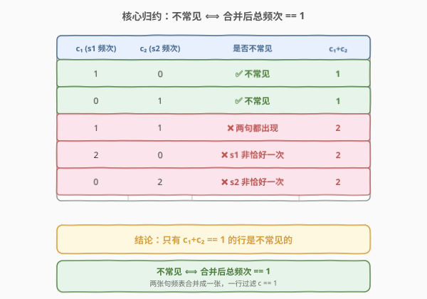
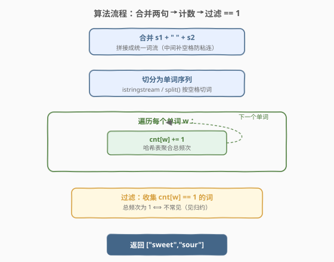
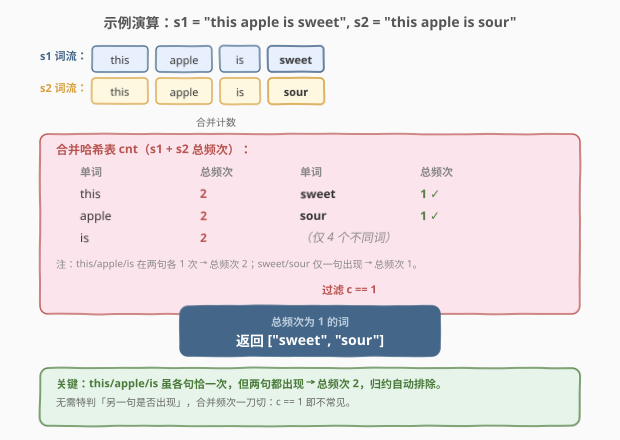

# 两句话中的不常见单词

- **题目名称**：两句话中的不常见单词
- **链接**：[884. 两句话中的不常见单词](https://leetcode.cn/problems/uncommon-words-from-two-sentences/)
- **难度**：简单
- **标签**：哈希表、字符串

## 1. 题目概述

**句子**是一串由空格分隔的单词，每个**单词**仅由小写字母组成。如果某个单词在其中一个句子中**恰好出现一次**，在另一个句子中却**没有出现**，那么这个单词就是**不常见**的。

给定两个句子 `s1` 和 `s2`，返回所有**不常见单词**的列表，返回顺序任意。

**示例 1**：

```text
输入：s1 = "this apple is sweet", s2 = "this apple is sour"
输出：["sweet","sour"]
解释：
      this / apple / is 在两句中各出现 1 次 → 两句都出现 → 不算不常见；
      sweet 仅在 s1 出现 1 次、s2 中 0 次 → 不常见；
      sour  仅在 s2 出现 1 次、s1 中 0 次 → 不常见。
```

**示例 2**：

```text
输入：s1 = "apple apple", s2 = "banana"
输出：["banana"]
解释：
      apple 在 s1 出现 2 次（非「恰好一次」）→ 不算不常见；
      banana 仅在 s2 出现 1 次、s1 中 0 次 → 不常见。
```

**约束条件**：

- `1 <= s1.length, s2.length <= 200`
- `s1` 和 `s2` 由小写英文字母和空格组成
- `s1` 和 `s2` 都不含前导或尾随空格
- `s1` 和 `s2` 中的所有单词间均由单个空格分隔

> 💡 这是一道**字符串切分 + 哈希表计数**的入门题，与 [819. 最常见的单词](819_最常见的单词.md) 同属「拆分 + 聚合计数」家族。本题的精髓不在计数本身，而在**把题目定义化简为一个极简的等价条件**——见 2.2 节的归约。

---

## 2. 解题思路

### 2.1 暴力思路：按定义逐词判定

最朴素的写法完全照搬定义：对 `s1` 的每个单词 `w`，统计它在 `s1` 中出现次数 `c1`、在 `s2` 中出现次数 `c2`，若 `c1 == 1 && c2 == 0` 则收入答案；再对称地对 `s2` 的每个单词判一遍 `c2 == 1 && c1 == 0`，同时去重。

这种做法的问题在于**重复统计**与**去重麻烦**：对 $n$ 个单词各做两次全句扫描，整体退化为 $O(n^2)$，还要维护「已判过」的集合避免重复输出。问题本质仍是「按词聚合频次」，这正是**哈希表**的看家本领——一次遍历聚合即可。

### 2.2 核心观察：归约到「合并总频次 == 1」

仔细读定义：「在一个句子恰好出现一次，在另一个句子没出现」。设某词在 `s1` 出现 $c_1$ 次、在 `s2` 出现 $c_2$ 次，则「不常见」等价于 $(c_1, c_2) \in \{(1,0),\ (0,1)\}$。

关键洞察是：这两种情况**合并后的总频次 $c_1 + c_2$ 都恰好等于 1**，而其他任何组合的总频次都 $\ge 2$：



| $c_1$（s1 频次） | $c_2$（s2 频次） | 是否不常见 | 合并总频次 $c_1+c_2$ |
|------|------|------------|----------------------|
| 1 | 0 | ✅ 不常见 | 1 |
| 0 | 1 | ✅ 不常见 | 1 |
| 1 | 1 | ❌ 两句都出现 | 2 |
| 2 | 0 | ❌ s1 中非恰好一次 | 2 |
| 0 | 2 | ❌ s2 中非恰好一次 | 2 |

于是定义被化简为一个极简条件：

$$\text{不常见} \iff c_1 + c_2 = 1$$

> 💡 **为什么这个归约成立？** 因为「恰好一次」要求某个 $c$ 为 1、「没出现」要求另一个 $c$ 为 0，二者相加必为 1；反过来，若总频次为 1，则只能是 $(1,0)$ 或 $(0,1)$ 两种分配，恰好满足定义。这个**双向蕴含**让「分别统计两句频次再组合判断」坍缩为「合并统计一次频次再判等于 1」——把两段计数合并成一段，代码大幅简化。

**实现**：把 `s1` 与 `s2` 的单词流拼到一起，用一张哈希表 `cnt` 统计总频次，最后收集所有 `cnt[w] == 1` 的词即可。无需分别建两张表，也无需去重——频次为 1 的词天然只可能被收集一次。

### 2.3 算法流程图



**完整步骤**：

1. **合并词流**：把 `s1` 与 `s2` 拼成一个统一的单词序列（C++ 可用 `s1 + " " + s2` 再 `istringstream` 切分；Python 直接 `s1.split() + s2.split()` 拼列表）。
2. **计数**：遍历合并后的单词流，`cnt[w] += 1`。
3. **过滤**：遍历 `cnt`，收集所有 `cnt[w] == 1` 的词。
4. **返回**：收集到的列表即为答案，顺序任意。

> ⚠️ **易错点**：① 不要分别给 `s1`、`s2` 各建一张表再去组合判断——那样既繁琐又容易漏掉「同句内重复」的情况（如示例 2 的 `apple apple`，$c_1=2$ 总频次为 2，归约后自动排除）；② 合并时记得在 `s1`、`s2` 之间补一个空格，避免首尾单词粘连（如 `s1="a"`、`s2="b"` 拼成 `"ab"` 就错了）。

### 2.4 示例演算

以示例 1 `s1 = "this apple is sweet"`、`s2 = "this apple is sour"` 为例，逐词追踪合并计数：



| 单词 | 来源 | 合并计数 | `== 1`？ | 入答案 |
|------|------|----------|----------|--------|
| `this` | s1, s2 | 2 | ❌ | — |
| `apple` | s1, s2 | 2 | ❌ | — |
| `is` | s1, s2 | 2 | ❌ | — |
| `sweet` | s1 | 1 | ✅ | `sweet` |
| `sour` | s2 | 1 | ✅ | `sour` |

最终返回 `["sweet","sour"]`。

> 💡 注意 `this`/`apple`/`is` 虽然各自在 `s1`、`s2` 中都「恰好出现一次」，但**两句都出现了**，总频次为 2，被归约条件自动排除——这正是归约的威力：无需特判「另一句是否出现」，合并频次一刀切。

---

## 3. 参考代码

### C++

```cpp
class Solution {
  public:
    vector<string> uncommonFromSentences(string s1, string s2) {
        unordered_map<string, int> cnt;
        istringstream iss(s1 + " " + s2);          // 合并两句，空格分隔
        string word;
        while (iss >> word) cnt[word]++;           // 一次计数
        vector<string> ans;
        for (auto& [w, c] : cnt)
            if (c == 1) ans.push_back(w);          // 过滤总频次 == 1
        return ans;
    }
};
```

### Python

```python
class Solution:
    def uncommonFromSentences(self, s1: str, s2: str) -> List[str]:
        cnt = collections.Counter(s1.split() + s2.split())   # 合并两句计数
        return [w for w, c in cnt.items() if c == 1]         # 过滤总频次 == 1
```

> 💡 两版思路一致。C++ 用 `s1 + " " + s2` 拼接后交给 `istringstream` 自动按空格切分，省去手动处理；Python 直接把两个 `split()` 列表相加，再喂给 `Counter`，最后列表推导过滤——三行写完全部逻辑。归约后无需分别建表、无需去重，代码极简。

---

## 4. 复杂度分析

| 维度 | 复杂度 | 说明 |
|------|--------|------|
| **时间复杂度** | $O(n + m)$ | $n$、$m$ 分别为 `s1`、`s2` 长度；合并切分 + 计数为单次线性扫描，过滤再遍历哈希表一次，键数 $\le (n+m)$ |
| **空间复杂度** | $O(n + m)$ | 哈希表最多存储 $(n+m)$ 量级的不同单词及其字符串键；结果列表同阶 |

> ⚠️ 严格说哈希表单次操作是 $O(\text{键长})$ 而非 $O(1)$（需哈希并比较整个字符串），但单词平均长度有界，整体仍线性于输入规模。本题 $n, m \le 200$，实际开销可忽略。

---

## 5. 扩展：Counter 相加的等价写法

Python 的 `Counter` 重载了 `+` 运算符，把两张计数表按键相加，正好对应「合并频次」的语义：

```python
class Solution:
    def uncommonFromSentences(self, s1: str, s2: str) -> List[str]:
        cnt = collections.Counter(s1.split()) + collections.Counter(s2.split())
        return [w for w, c in cnt.items() if c == 1]
```

**思路**：`Counter(s1.split())` 得到 $c_1$ 表、`Counter(s2.split())` 得到 $c_2$ 表，二者相加即得 $c_1 + c_2$ 的合并表，与「合并词流再计数」完全等价。

> 💡 这两种写法**等价但不等价于分别建表再组合判断**：Counter 相加直接得到合并频次，仍是「一刀切判 == 1」；若写成「先查 $c_1$ 表再查 $c_2$ 表组合判断」则回到 2.1 的繁琐路径。关键区别在于**合并后再判断**还是**分开后组合判断**——前者一行过滤，后者要处理 $(1,0)$、$(0,1)$ 两分支加去重。

---

## 6. 面试要点

1. **为什么「合并总频次 == 1」与原定义等价？**

   - 原定义要求 $(c_1, c_2) \in \{(1,0),(0,1)\}$，这两种组合的总频次 $c_1+c_2$ 都为 1；反过来总频次为 1 时，非负整数分配只能是 $(1,0)$ 或 $(0,1)$。双向蕴含，故等价。这个归约把「分别统计 + 组合判断」简化为「合并统计 + 单条件过滤」。

2. **能不能分别给 s1、s2 各建一张哈希表？**

   - 可以但不推荐。分别建表后，需对每个词查两张表判定 $(c_1,c_2)$ 是否落在 $\{(1,0),(0,1)\}$，还要跨表去重避免同一词被收集两次（如某词 $c_1=1,c_2=0$，从 $c_1$ 表和 $c_2$ 表都可能触达）。合并成一张表后，频次为 1 的词天然唯一，无去重负担。

3. **合并 s1、s2 时为什么要在中间补空格？**

   - 若直接字符串拼接 `s1 + s2`，`s1` 末尾单词与 `s2` 开头单词会粘连成一个新词（如 `"a"` + `"b"` → `"ab"`）。补一个空格 `s1 + " " + s2` 保证切分正确。Python 用列表相加 `s1.split() + s2.split()` 则无此问题，因为各自先切分再拼列表。

4. **如果题目改成「在两句中总共恰好出现一次」（去掉「另一句没出现」约束），答案会变吗？**

   - 不会。因为「总共恰好一次」即 $c_1+c_2=1$，而非负整数分配下只能是 $(1,0)$ 或 $(0,1)$——恰好就是原定义。所以两个表述完全等价，这正是归约成立的原因。面试官若做此追问，正好用来解释归约的必然性。

5. **返回顺序任意，是否影响判定？**

   - 不影响。题目明确「返回列表中单词可以按任意顺序组织」，判题器会对答案做集合/排序比对。因此收集时无需排序，直接遍历哈希表收集即可；若面试官要求字典序输出，最后 `sort(ans)` 一次即可，$O(k \log k)$（$k$ 为答案数）。

> 💡 **一句话总结**：884 是「拆分 + 哈希计数」家族的归约题——把「一句恰一次 + 另一句没出现」化简为「合并总频次 == 1」，一次计数 + 一行过滤即可。精髓在化简定义，而非计数本身。

---

## 7. 同类练习题

- [819. 最常见的单词](https://leetcode.cn/problems/most-common-word/)（[题解](819_最常见的单词.md)）：同款切分 + 哈希聚合计数，多了停用词过滤与取最大，本题的进阶版
- [811. 子域名访问计数](https://leetcode.cn/problems/subdomain-visit-count/)（[题解](811_子域名访问计数.md)）：字符串拆分 + 哈希聚合计数，同为「切词 + 计数」家族
- [804. 唯一摩尔斯密码词](https://leetcode.cn/problems/unique-morse-code-words/)（[题解](804_唯一摩尔斯密码词.md)）：逐词变换 + 集合去重，对照本题的「计数后过滤」与「集合判重」两种思路
- [349. 两个数组的交集](https://leetcode.cn/problems/intersection-of-two-arrays/)：两个集合求交集，同为「合并两个数据源再做集合运算」的模式
- [290. 单词规律](https://leetcode.cn/problems/word-pattern/)（[题解](../0201-0300/290_单词规律.md)）：`split` 切词 + 哈希判定，同为「先切词再哈希」模式
