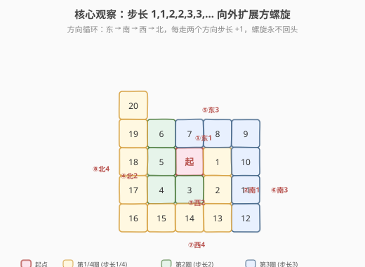
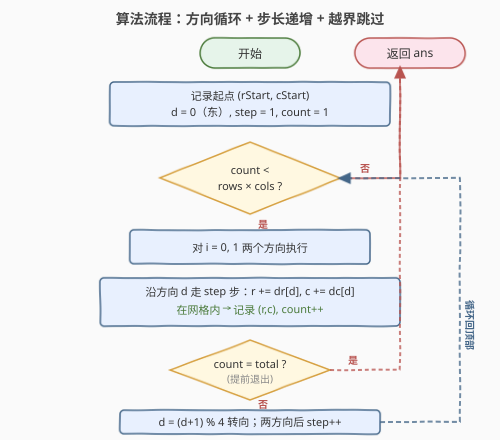
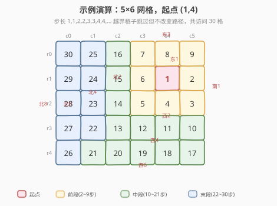

# LeetCode 螺旋矩阵 III 题解

## 1. 题目概述

- **标题 / 题号**：螺旋矩阵 III（#885，medium）
- **链接**：https://leetcode.cn/problems/spiral-matrix-iii/
- **难度**：中等
- **标签**：数组、矩阵、模拟

**题意**：在 `rows × cols` 的网格上，你从单元格 `(rStart, cStart)` 面朝东开始。你需要以**顺时针螺旋状向外行走**，访问网格中的每个位置。每当移动到网格边界之外时，需要继续在网格之外行走（但稍后可能会返回到网格边界）。最终访问到网格的所有 `rows × cols` 个格子，按访问顺序返回坐标列表。

**示例 1**：

```text
输入：rows = 1, cols = 4, rStart = 0, cStart = 0
输出：[[0,0],[0,1],[0,2],[0,3]]
```

**示例 2**：

```text
输入：rows = 5, cols = 6, rStart = 1, cStart = 4
输出：[[1,4],[1,5],[2,5],[2,4],[2,3],[1,3],[0,3],[0,4],[0,5],[3,5],[3,4],[3,3],[3,2],
      [2,2],[1,2],[0,2],[4,5],[4,4],[4,3],[4,2],[4,1],[3,1],[2,1],[1,1],[0,1],
      [4,0],[3,0],[2,0],[1,0],[0,0]]
```

**约束**：

- `1 <= rows, cols <= 100`
- `0 <= rStart < rows`
- `0 <= cStart < cols`

> 💡 与 [54. 螺旋矩阵](https://leetcode.cn/problems/spiral-matrix/)（从边缘**向内**读取）和 [59. 螺旋矩阵 II](https://leetcode.cn/problems/spiral-matrix-ii/)（从边缘**向内**填数）不同，885 的核心区别是**从任意内部起点向外螺旋扩展**。这决定了不能用「四边界收缩」模板，而要用**方向向量 + 步长递增**的通用模板。

## 2. 解题思路

### 2.1 暴力思路：方向转向 + 已访问标记

维护当前位置 `(r, c)` 和方向 `d`，每走一步尝试沿当前方向前进；若下一步越界或已访问则转向。用 `visited` 矩阵标记已走过的格子。

问题是：885 从内部起点**向外**扩展，螺旋路径会经过大量网格外的坐标。若用 `visited` 矩阵，空间无法预估（网格外的坐标没有上界）。而且「撞墙转向」的逻辑在向外扩展时无法正确描述步长递增的螺旋形状——需要额外的步长控制。

### 2.2 核心观察：步长 1,1,2,2,3,3,… 向外扩展方螺旋



从起点出发，顺时针螺旋的**步长模式**是固定的：

$$\underbrace{1, 1}_{\text{第 1 圈}}, \underbrace{2, 2}_{\text{第 2 圈}}, \underbrace{3, 3}_{\text{第 3 圈}}, \underbrace{4, 4}_{\text{第 4 圈}}, \ldots$$

即**每走两个方向，步长 +1**。方向循环为 **东 → 南 → 西 → 北**，周而复始。这个模式天然形成一个不断扩大的方螺旋：

- 第 1 圈：东 1 步、南 1 步 → 螺旋向东、南各延伸 1 格
- 第 2 圈：西 2 步、北 2 步 → 螺旋向西、北各延伸 2 格，扩大到 $3 \times 3$ 区域
- 第 3 圈：东 3 步、南 3 步 → 扩大到 $5 \times 5$ 区域
- 第 $k$ 圈：步长 $k$，螺旋扩大到 $(2k+1) \times (2k+1)$ 区域

> 💡 **关键性质**：这个螺旋**永远不会回头**——每一步都走向新坐标，不会重复访问任何位置。因此**不需要 `visited` 矩阵**，只需检查当前坐标是否在网格内即可。越界的格子「走过但不记录」，路径继续向外扩展，直到收集满 `rows × cols` 个网格内格子。

### 2.3 算法流程图



算法步骤：

1. **初始化**：记录起点 `(rStart, cStart)`，方向 `d = 0`（东），步长 `step = 1`，计数 `count = 1`。
2. **外层循环**：当 `count < rows × cols` 时重复。
3. **每轮两组方向**：对 `i = 0, 1`（两个方向共用当前 `step`）：
   - 沿方向 `d` 走 `step` 步，每步更新 `(r, c)`，若在网格内则记录、`count++`。
   - 方向顺时针转向：`d = (d + 1) % 4`。
4. **步长递增**：`step++`，回到步骤 2。

> ⚠️ 越界格子**不记录但必须继续走**——它们是螺旋路径的一部分，跳过会破坏螺旋形状。这正是「步长递增」模板的核心：步长决定路径形状，越界只影响是否记录，不影响路径走向。

### 2.4 示例演算



以 `rows=5, cols=6, rStart=1, cStart=4` 为例，起点在网格内部偏右上。追踪关键转折：

| 步长 | 方向 | 路径 | 网格内记录 |
|------|------|------|-----------|
| 1 | 东 | (1,4)→(1,5) | ①(1,4)起点, ②(1,5) |
| 1 | 南 | (1,5)→(2,5) | ③(2,5) |
| 2 | 西 | (2,5)→(2,4)→(2,3) | ④(2,4), ⑤(2,3) |
| 2 | 北 | (2,3)→(1,3)→(0,3) | ⑥(1,3), ⑦(0,3) |
| 3 | 东 | (0,3)→(0,4)→(0,5)→**(0,6)越界** | ⑧(0,4), ⑨(0,5) |
| 3 | 南 | (0,6)→(1,6)→(2,6)→**(3,6)越界** | 无（全越界） |
| 4 | 西 | (3,6)→(3,5)→(3,4)→(3,3)→(3,2) | ⑩~⑬ |
| 4 | 北 | (3,2)→(2,2)→(1,2)→(0,2)→**(-1,2)越界** | ⑭~⑯ |
| 5 | 东/南 | 全程在 r=-1~-2 行，**全越界** | 无 |
| 6 | 西 | (4,7)→(4,6)越界→(4,5)→…→(4,1) | ⑰~㉑ |
| 6 | 北 | (4,1)→(3,1)→(2,1)→(1,1)→(0,1)→越界 | ㉒~㉕ |
| 7 | 东/南 | 全程在 c=7~8 列，**全越界** | 无 |
| 8 | 西 | 全程在 r=5 行，**全越界** | 无 |
| 8 | 北 | (5,0)→(4,0)→(3,0)→(2,0)→(1,0)→(0,0)→越界 | ㉖~㉚ |

共 30 格，与 `5 × 6 = 30` 吻合。注意步长 5 和 7 的整段路径完全在网格外——这是起点偏右导致东侧/南侧需要更远才能绕回来的正常现象。

## 3. 参考代码

### C++

```cpp
// 螺旋矩阵III.cpp —— 方向向量 + 步长递增
// 编译: g++ -O2 -std=c++17 螺旋矩阵III.cpp -o spiral3
#include <vector>
using namespace std;

class Solution {
  public:
    vector<vector<int>> spiralMatrixIII(int rows, int cols, int rStart, int cStart) {
        vector<vector<int>> ans;
        ans.push_back({rStart, cStart});
        int dirs[4][2] = {{0, 1}, {1, 0}, {0, -1}, {-1, 0}}; // 东、南、西、北
        int d = 0, step = 1, r = rStart, c = cStart;
        int total = rows * cols;
        while ((int)ans.size() < total) {
            for (int i = 0; i < 2 && (int)ans.size() < total; ++i) {
                for (int j = 0; j < step && (int)ans.size() < total; ++j) {
                    r += dirs[d][0];
                    c += dirs[d][1];
                    if (r >= 0 && r < rows && c >= 0 && c < cols)
                        ans.push_back({r, c});
                }
                d = (d + 1) % 4; // 顺时针转向
            }
            ++step; // 每两个方向步长 +1
        }
        return ans;
    }
};
```

### Python

```python
class Solution:
    def spiralMatrixIII(self, rows: int, cols: int,
                        rStart: int, cStart: int) -> list[list[int]]:
        ans = [[rStart, cStart]]
        dirs = [(0, 1), (1, 0), (0, -1), (-1, 0)]  # 东、南、西、北
        d = 0
        step = 1
        r, c = rStart, cStart
        total = rows * cols
        while len(ans) < total:
            for _ in range(2):
                dr, dc = dirs[d]
                for _ in range(step):
                    r, c = r + dr, c + dc
                    if 0 <= r < rows and 0 <= c < cols:
                        ans.append([r, c])
                d = (d + 1) % 4  # 顺时针转向
            step += 1  # 每两个方向步长 +1
        return ans
```

> ⚠️ **易错点**：
> - **步长递增节奏**：`step` 在**每两个方向后**才 `+1`，不是每个方向都加。外层 `for _ in range(2)` 复用同一个 `step`，循环结束后才 `step += 1`。
> - **越界不跳步**：越界时**不记录但仍要移动** `(r, c)`，否则螺旋形状会被破坏。`if` 只管是否 `append`，`r += dr` / `c += dc` 在 `if` 之外无条件执行。
> - **提前退出**：内层循环条件加 `len(ans) < total` 守卫，避免收集满后多余遍历（不影响正确性但提升效率）。

## 4. 复杂度分析

| 维度 | 复杂度 | 说明 |
|------|--------|------|
| **时间复杂度** | $O(\max(R, C)^2)$ | 螺旋需扩展到覆盖整个网格，最大步长约 $\max(R, C)$，总步数为 $\sum_{k=1}^{K} 4k \approx 2K^2$，其中 $K \leq \max(R, C)$ |
| **空间复杂度** | $O(1)$ | 仅用 `d / step / r / c` 四个变量；返回数组不计入 |

> 💡 当起点位于角落且网格细长时（如 `1 × 100`），螺旋需绕很多圈才覆盖远端，越界步数较多。但 $R, C \leq 100$，$\max(R,C)^2 \leq 10^4$，远在时限内。$O(\max(R,C)^2)$ 是比 $O(R \times C)$ 更紧的分析——当网格为 $1 \times 100$ 时 $R \times C = 100$ 但实际需走约 $2 \times 100^2 = 20000$ 步。

## 5. 扩展：螺旋矩阵四兄弟对比

885 是 LeetCode 螺旋矩阵系列的第三题，四题的核心差异在于**螺旋方向**（向内 vs 向外）和**操作类型**（读取 vs 填数）：

| 题号 | 题目 | 螺旋方向 | 操作 | 推荐模板 | 额外空间 |
|------|------|---------|------|---------|---------|
| [54](https://leetcode.cn/problems/spiral-matrix/) | 螺旋矩阵 | 边缘→内 | 读取 | 四边界收缩 | $O(1)$ |
| [59](https://leetcode.cn/problems/spiral-matrix-ii/) | 螺旋矩阵 II | 边缘→内 | 填数 | 四边界收缩 / 方向向量 | $O(1)$ |
| **885** | 螺旋矩阵 III | **中心→外** | **生成坐标** | **方向向量 + 步长递增** | $O(1)$ |
| [2326](https://leetcode.cn/problems/spiral-matrix-iv/) | 螺旋矩阵 IV | 边缘→内 | 填数（链表） | 方向向量 + 转向 | $O(R \times C)$ 标记 |

> 💡 **何时用四边界，何时用方向向量？** 四边界法（`top/bottom/left/right` 收缩）专为「从边缘向内」设计，简洁且 $O(1)$ 空间；方向向量法（`dirs[]` + 转向）更通用，能处理「从内部向外」（885）或「不规则形状」（2326）。885 是方向向量法的最佳练习题——步长递增模式是它的灵魂。

## 6. 面试要点

1. **为什么不需要 `visited` 矩阵？螺旋不会重复访问吗？**

   - 不会。步长 $1,1,2,2,3,3,\ldots$ 的螺旋严格向外扩展，每一步都走向**从未到过的新坐标**。可以归纳证明：第 $k$ 圈结束时，螺旋覆盖了以起点为中心的 $(2k{-}1) \times (2k{-}1)$ 方形区域，下一圈向外扩一圈，不会与已走区域重叠。因此只需检查坐标是否在网格内，无需标记。

2. **步长为什么是 1,1,2,2,3,3 而不是 1,2,3,4？**

   - 1,1,2,2 保证每圈在两个正交方向上延伸相同距离，形成**正方形扩展**。若用 1,2,3,4（每个方向步长不同），螺旋会变成不断变大的矩形而非方形，且无法保证不回头。1,1,2,2 的本质是「每圈东-南一对、西-北一对，各走相同步长」。

3. **越界的格子为什么要继续走？直接跳到网格边界不行吗？**

   - 不行。越界格子是螺旋路径的组成部分——它们决定了下一个方向的起始位置。若跳过越界步，后续方向的起点会偏移，螺旋形状被破坏。例如示例 2 中步长 3 的东向走到 `(0,6)` 越界，接着南向从 `(0,6)` 走 3 步到 `(3,6)`——如果跳过越界步，南向起点就不是 `(0,6)`，后续西向就无法正确到达 `(3,5)`。

4. **起点在角落 vs 中心，复杂度有区别吗？**

   - 渐近相同，都是 $O(\max(R,C)^2)$。但常数因子不同：起点在正中心时，螺旋对称扩展，越界步最少；起点在角落时，螺旋大量步数在网格外，越界步占比高。最坏情况是 `1 × C` 网格起点在 `(0,0)`，需走约 $2C^2$ 步但只记录 $C$ 个格子。

5. **能不能提前算出需要走多少圈就停？**

   - 可以估算：最大步长 $K \approx \max(r_{\text{start}}, R{-}1{-}r_{\text{start}}, c_{\text{start}}, C{-}1{-}c_{\text{start}}) + 1$，即起点到网格四边最大距离。但实现中用 `while count < total` 更稳妥，无需精确计算——循环自然在收集满时退出。

> 💡 **一句话总结**：螺旋矩阵 III 是向外扩展型螺旋——步长 $1,1,2,2,3,3,\ldots$ 配合东-南-西-北方向循环，越界格子走过不记录，无需 `visited` 矩阵。掌握「方向向量 + 步长递增」模板，885 / 2326 一类不规则螺旋题都能套用。

## 同类练习题

| # | 题目 | 与本题的关联 |
|---|------|-------------|
| 54 | [螺旋矩阵](https://leetcode.cn/problems/spiral-matrix/) | 从边缘**向内**读取矩阵，四边界收缩模板的招牌题 |
| 59 | [螺旋矩阵 II](https://leetcode.cn/problems/spiral-matrix-ii/) | 从边缘**向内**填数，四边界 vs 方向向量的对照练习 |
| 2326 | [螺旋矩阵 IV](https://leetcode.cn/problems/spiral-matrix-iv/) | 按链表顺序螺旋填入矩阵，方向向量法的变体（撞墙转向 + visited 标记） |
| 48 | [旋转图像](https://leetcode.cn/problems/rotate-image/) | 同属矩阵边界操作，练「转置 + 翻转」拆解 |
| 73 | [矩阵置零](https://leetcode.cn/problems/set-matrix-zeroes/) | 矩阵原地标记题，用首行首列做哨兵 |
