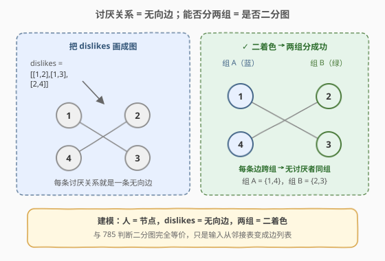
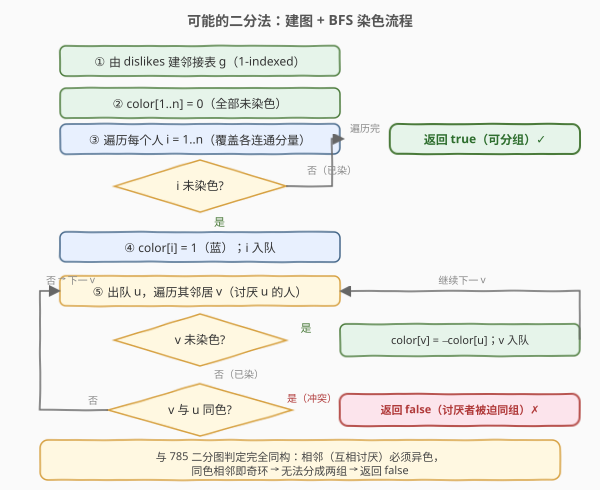
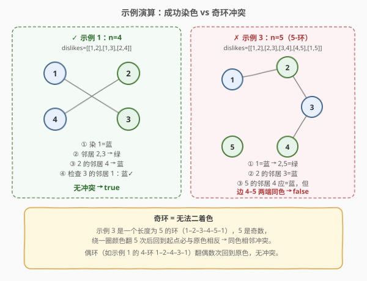

# 可能的二分法

- **题目名称**：可能的二分法
- **链接**：[886. 可能的二分法](https://leetcode.cn/problems/possible-bipartition/)
- **难度**：中等
- **标签**：深度优先搜索、广度优先搜索、并查集、图、二分图

## 1. 题目概述

给定 `n` 个人（编号 `1` 到 `n`），想把每个人分进**任意**大小的两组。某些人互相讨厌，不能分在同一组。给定整数 `n` 和数组 `dislikes`，其中 `dislikes[i] = [ai, bi]` 表示 `ai` 和 `bi` 不能同组。判断是否能把所有人分成满足条件的两组。

**示例 1**：

```text
输入：n = 4, dislikes = [[1,2],[1,3],[2,4]]
输出：true
解释：group1 = [1,4]，group2 = [2,3]，每对讨厌者都跨组。
```

**示例 2**：

```text
输入：n = 3, dislikes = [[1,2],[1,3],[2,3]]
输出：false
解释：1、2、3 两两互恨（三角形 / 3-环），无法二着色。
```

**示例 3**：

```text
输入：n = 5, dislikes = [[1,2],[2,3],[3,4],[4,5],[1,5]]
输出：false
解释：1–2–3–4–5–1 构成 5-环（奇环），无法二着色。
```

**约束条件**：

- $1 \le n \le 2000$
- $0 \le \text{dislikes.length} \le 10^4$
- $\text{dislikes[i].length} = 2$
- $1 \le \text{dislikes[i][j]} \le n$
- $a_i < b_i$
- `dislikes` 中每一组都不同

---

## 2. 解题思路

> 💡 **核心建模**：把每个人看作图的**节点**，每对 `dislikes` 看作一条**无向边**。能否分成两组使讨厌者不同组 ⟺ 该图是否**二分图** ⟺ 是否可**二着色**。这与 [785. 判断二分图](../0701-0800/785_判断二分图.md) 完全同构，只是输入从邻接表变成边列表、编号从 0-indexed 变成 1-indexed。

### 2.1 暴力思路

枚举所有把 `n` 个人拆成两组的方式，共 $2^n$ 种；对每种划分检查是否所有讨厌对都跨组。复杂度 $O(2^n \cdot E)$，$n=2000$ 时完全不可行。

**优化方向**：在每个连通分量里，一旦确定某人的颜色，他所有讨厌者的颜色就被**强制**成相反色，讨厌者的讨厌者又被强制回原色……整棵连通分量的染色是**唯一确定**的。因此只需从一个未染色节点出发，按"相邻（互相讨厌）异色"贪心染色，能染完即合法，中途冲突即无解。

### 2.2 核心观察：讨厌关系建图 + 二着色



关键直觉：

- 先把 `dislikes` 转成**邻接表** `g`：对每对 `[a, b]`，双向加边 `g[a].push_back(b)`、`g[b].push_back(a)`（无向）。
- 用两种颜色 `1` / `-1`（未染为 `0`）。从某人出发染 `1`，则其所有讨厌者**必须**染 `-1`，讨厌者的讨厌者染 `1`，交替进行。
- 若 BFS 过程中遇到一个邻居 `v` **已染色且与 `u` 同色**，说明这对讨厌者被迫落在同一组 → **染色冲突** → 存在奇环 → 无法分组，立即返回 `false`。
- 若所有连通分量都顺利染完无冲突，则存在合法分组 → 返回 `true`。

> 💡 一句话：**染色是"被强制"的，不是"被搜索"的**。一次 BFS/DFS 即可验证，不必回溯、不必枚举。

### 2.3 算法流程图



外层 `for` 遍历每个人 `1..n`，保证**每个连通分量都被处理**（图可能不连通，任一分量非二分图则整体无解）。每个人至多入队一次、每条讨厌关系至多被检查一次，总时间 $O(n + E)$。

### 2.4 示例演算



**示例 1（true，4-环）**：`n=4, dislikes=[[1,2],[1,3],[2,4]]`

| 步骤 | 取出 u | 邻居处理 | 颜色变化 | 队列 |
|------|--------|----------|----------|------|
| 初始 | — | 染 1=蓝(1) | 1:1 | `[1]` |
| 1 | 1 | 2,3 未染→绿(−1) | 2:−1, 3:−1 | `[2,3]` |
| 2 | 2 | 1 蓝✓，4 未染→蓝(1) | 4:1 | `[3,4]` |
| 3 | 3 | 1 蓝✓ | — | `[4]` |
| 4 | 4 | 2 绿✓ | — | `[]` |

所有讨厌对两端异色，无冲突 → `true`。最终分组 `{1,4}`=蓝、`{2,3}`=绿。

**示例 3（false，5-环）**：`n=5, dislikes=[[1,2],[2,3],[3,4],[4,5],[1,5]]`

| 步骤 | 取出 u | 邻居处理 | 颜色变化 | 队列 |
|------|--------|----------|----------|------|
| 初始 | — | 染 1=蓝(1) | 1:1 | `[1]` |
| 1 | 1 | 2,5 未染→绿(−1) | 2:−1, 5:−1 | `[2,5]` |
| 2 | 2 | 1 蓝✓，3 未染→蓝(1) | 3:1 | `[5,3]` |
| 3 | 5 | 4 未染→蓝(1)，1 蓝✓ | 4:1 | `[3,4]` |
| 4 | 3 | 2 绿✓，**4 蓝✗ 冲突** | — | — |

检查 `3` 的邻居 `4` 时发现 `color[4] == color[3] == 1`（同色相邻）→ 立即返回 `false`。5-环绕一圈颜色翻 5 次（奇数）后回到起点必与原色相反 → 必然冲突。

---

## 3. 参考代码

### 方法一：BFS 染色（推荐）

### C++

```cpp
class Solution {
  public:
    bool possibleBipartition(int n, vector<vector<int>>& dislikes) {
        vector<vector<int>> g(n + 1);          // 1-indexed 邻接表
        for (auto& d : dislikes) {
            g[d[0]].push_back(d[1]);
            g[d[1]].push_back(d[0]);
        }
        vector<int> color(n + 1, 0);           // 0 未染, 1 / -1 两种颜色
        for (int i = 1; i <= n; ++i) {
            if (color[i] != 0) continue;       // 该连通分量已染过
            queue<int> q;
            q.push(i);
            color[i] = 1;                      // 起点染颜色 1
            while (!q.empty()) {
                int u = q.front(); q.pop();
                for (int v : g[u]) {
                    if (color[v] == 0) {              // 未染 → 染相反色
                        color[v] = -color[u];
                        q.push(v);
                    } else if (color[v] == color[u]) {
                        return false;                 // 讨厌者被迫同组 → 奇环
                    }
                }
            }
        }
        return true;
    }
};
```

### Python

```python
from collections import deque

class Solution:
    def possibleBipartition(self, n: int, dislikes: List[List[int]]) -> bool:
        g = [[] for _ in range(n + 1)]        # 1-indexed 邻接表
        for a, b in dislikes:
            g[a].append(b)
            g[b].append(a)
        color = [0] * (n + 1)                 # 0 未染, 1 / -1 两种颜色
        for start in range(1, n + 1):
            if color[start] != 0:
                continue                      # 该连通分量已染过
            q = deque([start])
            color[start] = 1                 # 起点染颜色 1
            while q:
                u = q.popleft()
                for v in g[u]:
                    if color[v] == 0:        # 未染 → 染相反色
                        color[v] = -color[u]
                        q.append(v)
                    elif color[v] == color[u]:
                        return False          # 讨厌者被迫同组 → 奇环
        return True
```

### 方法二：DFS 染色

把 BFS 换成递归：进入节点 `u` 时染色 `c`，对其每个邻居递归染 `-c`；遇到已染且同色即冲突。写法更短，但 $n \le 2000$ 时要注意递归栈深度（最坏链状连通分量深度可达 $n$，Python 默认递归上限 1000 需调高）。

### C++

```cpp
class Solution {
    vector<vector<int>> g;
    vector<int> color;
    bool dfs(int u, int c) {
        color[u] = c;
        for (int v : g[u]) {
            if (color[v] == 0) { if (!dfs(v, -c)) return false; }
            else if (color[v] == c) return false;   // 同色相邻 → 奇环
        }
        return true;
    }
  public:
    bool possibleBipartition(int n, vector<vector<int>>& dislikes) {
        g.assign(n + 1, {});
        for (auto& d : dislikes) {
            g[d[0]].push_back(d[1]);
            g[d[1]].push_back(d[0]);
        }
        color.assign(n + 1, 0);
        for (int i = 1; i <= n; ++i)
            if (color[i] == 0 && !dfs(i, 1)) return false;
        return true;
    }
};
```

### Python

```python
class Solution:
    def possibleBipartition(self, n: int, dislikes: List[List[int]]) -> bool:
        g = [[] for _ in range(n + 1)]
        for a, b in dislikes:
            g[a].append(b)
            g[b].append(a)
        color = [0] * (n + 1)

        def dfs(u: int, c: int) -> bool:
            color[u] = c
            for v in g[u]:
                if color[v] == 0:
                    if not dfs(v, -c):
                        return False
                elif color[v] == c:
                    return False
            return True

        return all(dfs(i, 1) for i in range(1, n + 1) if color[i] == 0)
```

> 💡 **两种方法的选择**：$n \le 2000$ 时 BFS 无递归栈溢出风险，面试首选；DFS 写法更短但 Python 需 `sys.setrecursionlimit` 调高上限。若题目把 $n$ 放到 $10^5$，必须用 BFS 或手写栈迭代。

---

## 4. 复杂度分析

| 维度 | 方法 | 复杂度 | 说明 |
|------|------|--------|------|
| 时间复杂度 | BFS / DFS 染色 | $O(n + E)$ | 建邻接表 $O(E)$；每个人至多染色一次 $O(n)$；每条讨厌关系至多检查两次（无向边两端各一次）$O(E)$ |
| 空间复杂度 | BFS 染色 | $O(n + E)$ | 邻接表 $O(E)$，`color` 数组 $O(n)$，队列最坏存所有人 $O(n)$ |
| 空间复杂度 | DFS 染色 | $O(n + E)$ | 邻接表 $O(E)$，`color` 数组 $O(n)$，递归栈最深 $O(n)$（链状连通分量） |

> ⚠️ 本题 $n \le 2000$、$E \le 10^4$，DFS 递归栈在 C++ 中安全；Python 默认递归上限 1000，链状分量深度可达 2000，需 `sys.setrecursionlimit(3000)` 或改用 BFS。

---

## 5. 扩展：种类并查集（扩展域）

本题也可用**种类并查集**（又称扩展域 / 敌对域并查集）求解。核心思想：为每个人 `i` 维护一个"敌对域" `i + n`，表示"必须与 `i` 异组的人"。

对每对讨厌关系 `[a, b]`（`a`、`b` 必须异组）：

- `union(a, b + n)`：`a` 与"`b` 的敌人"同组（即 `a` 和 `b` 的对立面绑定）
- `union(b, a + n)`：`b` 与"`a` 的敌人"同组
- 若处理某条边前 `find(a) == find(b)`（`a`、`b` 已被迫同组），说明无法异组 → 返回 `false`

### C++

```cpp
class Solution {
    vector<int> parent;
    int find(int x) {
        return parent[x] == x ? x : parent[x] = find(parent[x]);
    }
    void unite(int x, int y) {
        parent[find(x)] = find(y);
    }
  public:
    bool possibleBipartition(int n, vector<vector<int>>& dislikes) {
        parent.resize(2 * n + 1);
        iota(parent.begin(), parent.end(), 0);
        for (auto& d : dislikes) {
            int a = d[0], b = d[1];
            if (find(a) == find(b)) return false;   // 已被迫同组
            unite(a, b + n);                        // a 与 b 的敌对域同组
            unite(b, a + n);                        // b 与 a 的敌对域同组
        }
        return true;
    }
};
```

> 💡 种类并查集适合"边逐条加入、随时查询是否仍合法"的**在线场景**；染色法适合"一次性判定整图"。两者本质等价，都等价于判定有无奇环。承接 [785. 判断二分图](../0701-0800/785_判断二分图.md) 第 5 节的扩展并查集思路。

---

## 6. 面试要点

1. **本题与 785 判断二分图的关系？**

   - 完全同构。785 给邻接表、0-indexed；886 给边列表、1-indexed。只需先把 `dislikes` 转成邻接表，后续染色逻辑与 785 逐行一致。面试中若已写过 785，本题只需加一步建图。

2. **为什么要先建邻接表？**

   - 输入是边列表（稀疏），染色时需要快速枚举某人的所有讨厌者，邻接表 `g[u]` 提供 $O(1)$ 访问邻居列表。若不建图而每次扫描 `dislikes` 找邻居，单次操作 $O(E)$，整体退化为 $O(n \cdot E)$。

3. **为什么外层要遍历所有人 `1..n`？**

   - 讨厌关系图可能不连通（有人没讨厌任何人，或多个独立团伙）。每个连通分量独立判定；只要有一个分量非二分图，整体就无解。`if (color[i] != 0) continue` 跳过已染分量，避免重复。

4. **冲突为什么一定意味着奇环？**

   - 冲突发生在讨厌边 `(u, v)` 同色。沿 BFS 树从 `u`、`v` 回溯到最近公共祖先，树路径两端同色说明路径长度为偶数，再加这条冲突边得到**奇数长度的环**。奇环绕一圈颜色翻转奇数次后回到起点必与原色相反 → 必然冲突。因此"同色相邻 ⟺ 存在奇环 ⟺ 非二分图"。

5. **BFS 还是 DFS？**

   - 都可以，复杂度相同 $O(n+E)$。BFS 无递归栈溢出风险，适合大规模图；DFS 代码更短。本题 $n \le 2000$，C++ 两者都安全；Python 用 DFS 需调高递归上限，否则建议 BFS。

6. **种类并查集和染色法各自的适用场景？**

   - 染色法直观，适合一次性判定；种类并查集适合边动态加入、随时查询是否仍合法的在线场景。两者本质等价（都判定有无奇环）。

---

## 7. 同类练习题

- [785. 判断二分图](https://leetcode.cn/problems/is-graph-bipartite/)：本题的母题，邻接表 + 0-indexed，染色法模板的直接来源
- [1042. 不邻接植花](https://leetcode.cn/problems/flower-planting-with-no-adjacent/)：着色扩展到 4 种颜色（保证有解），贪心给每个节点选邻居没用的花即可
- [1971. 寻找图中是否存在路径](https://leetcode.cn/problems/find-if-path-exists-in-graph/)：并查集/DFS 判连通，理解"按连通分量分别处理"的前置概念
- [684. 冗余连接](https://leetcode.cn/problems/redundant-connection/)：并查集找无向图中的环，可对比"奇环判定"与"任意环判定"的区别
- [2316. 统计无向图中无法互相到达的点对数](https://leetcode.cn/problems/count-unreachable-pairs-of-nodes-in-an-undirected-graph/)：并查集统计连通分量大小，图建模与连通性练习
